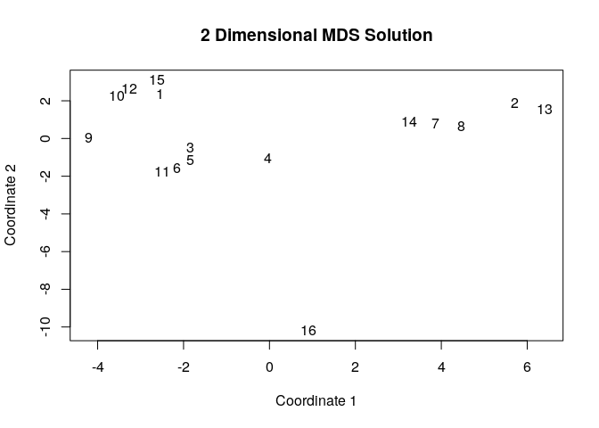
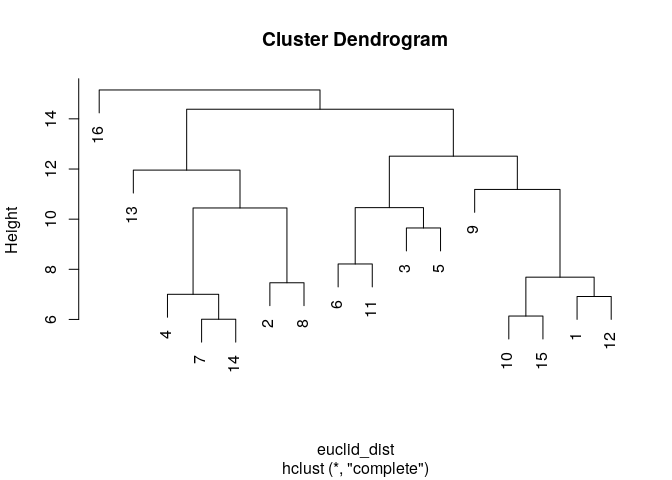
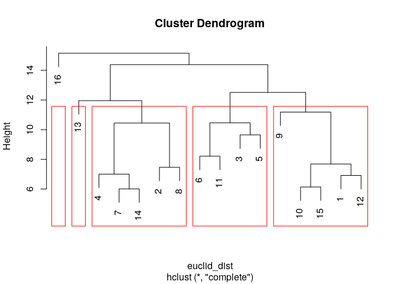

Positions and Roles
================
Saurabh Khanna
2020-05-14

# Chapter 10: R Tutorial on Positions and Roles

Built with R version 3.6.3

This tutorial offers an analysis in R focused on defining positions and
roles in a network. The goal of a role analysis is to: a) place nodes
into positions based on their pattern of ties to others; and b) describe
the pattern of ties that exist between positions, or the roles, that
emerge in the network of interest. We will walk through a simple
analysis step-by-step, to see the logic of how to do a role analysis.
See also the blockmodeling package for an extended set of functions to
perform different types of blockmodels. We will utilize the same network
used in Chapter 8 (on groups) for this tutorial. The data are based on
different interactions occurring between students (and teachers) in a
classroom. The data were collected by Daniel McFarland and contain
information on three different kinds of relations: friendship (measured
as 2 = best friend, 1 = friend, 0 = not friend); social (measured as
social interactions per hour); and task (measured as task interactions
per hour).

Our main substantive goal is to describe the role structure that exists
in this classroom. How do different sets of nodes relate to one another
within the larger functioning of the classroom? What are the rights and
responsibilities of one set relative to another? As this is a classroom,
the rights and responsibilities pertain to expectations of social
interaction (do nodes in one set have positive social interactions with
nodes in another?) as well as task interactions. For example, is this is
a system where students tend to break off into separate friendship
groups that also map onto task interactions? Or perhaps there are
certain alliances, where certain friendship groups come together to
complete work in the classroom. Or maybe there is a single, important
node (like the teacher) that is crucial in holding the classroom
together.

## Reading in Example Network Data

For this session we will start with the igraph package.

``` r
library(igraph)
```

Let’s first read in the classroom network
data.

``` r
class182_networkdata=read.csv(file="https://sites.google.com/site/jeffreysmithdatafiles/class182_networkdata.csv")
```

And let’s take a look at the first six rows:

``` r
head(class182_networkdata)
```

    ##   ego alter friend_tie social_tie task_tie
    ## 1   1     1          0        0.0      0.0
    ## 2   1     2          0        0.0      0.0
    ## 3   1     3          0        0.0      0.0
    ## 4   1     4          0        0.0      0.0
    ## 5   1     5          0        1.2      0.3
    ## 6   1     6          0        0.0      0.0

The data frame holds information for each dyad in the classroom showing
information for three relations: friendship, social interactions and
task interactions. Let’s also read in an attribute file to attach to our
network.

``` r
class182_attributes=read.csv(file="https://sites.google.com/site/jeffreysmithdatafiles/class182_attributedata.csv")
head(class182_attributes)
```

    ##   ids  race grade gender
    ## 1   1 white    10   male
    ## 2   2 black    10 female
    ## 3   3 white    10 female
    ## 4   4 white    11 female
    ## 5   5 white    10   male
    ## 6   6 white    10 female

We have information on race, grade and gender. Note that grade ‘13’ is
coded to denote the teacher in this classroom. Note also that ids is our
first column.

Let’s go ahead and create separate networks based on each relation. We
start with friendship, defining a (weighted) edge where the friendship
value is greater than
0.

``` r
edgelist_friendship=class182_networkdata[class182_networkdata$friend_tie>0, c("ego", "alter", "friend_tie")]
head(edgelist_friendship)
```

    ##    ego alter friend_tie
    ## 17   2     1          1
    ## 23   2     7          1
    ## 24   2     8          1
    ## 29   2    13          2
    ## 30   2    14          1
    ## 37   3     5          1

And here we create the friendship
network.

``` r
net182_friend=graph_from_data_frame(d=edgelist_friendship, directed=T, vertices=class182_attributes) 
net182_friend
```

    ## IGRAPH 3ce47d4 DN-- 16 62 -- 
    ## + attr: name (v/c), race (v/c), grade (v/n), gender (v/c), friend_tie (e/n)
    ## + edges from 3ce47d4 (vertex names):
    ##  [1] 2 ->1  2 ->7  2 ->8  2 ->13 2 ->14 3 ->5  3 ->6  3 ->11 3 ->14 3 ->15 5 ->1  5 ->3  5 ->6  5 ->8  5 ->10 5 ->11 6 ->1  6 ->3  6 ->5  6 ->7  6 ->10 6 ->11 6 ->12 7 ->2  7 ->8  7 ->13 7 ->14 8 ->2  8 ->5  8 ->7  8 ->13 8 ->14 8 ->15 9 ->1  9 ->3  9 ->10 9 ->12 9 ->15 10->1  10->9  10->12 10->15 11->1  11->3  11->5  11->6  11->10 12->1  12->9  12->15 13->2  13->7  13->8  13->14 14->2  14->3  14->8  14->12 15->1  15->7  15->9  15->12

We can see that the friendship network has been created, with
friend\_tie defining the edge weights. And now we create the social
interaction network. We create the edgelist from dyads where the social
interaction value is
\>0.

``` r
edgelist_social=class182_networkdata[class182_networkdata$social_tie>0, c("ego", "alter", "social_tie")]
```

We will treat the social and task networks as undirected. We treat the
task and social networks as undirected as conceptually if i does a task
with j, j must be doing the task with i (generally also true of social
interaction).

``` r
net182_social=graph_from_data_frame(d=edgelist_social, directed=F, vertices=class182_attributes) 
net182_social
```

    ## IGRAPH 0bbddc7 UN-- 16 134 -- 
    ## + attr: name (v/c), race (v/c), grade (v/n), gender (v/c), social_tie (e/n)
    ## + edges from 0bbddc7 (vertex names):
    ##   [1] 1 --5  1 --8  1 --9  1 --10 1 --11 1 --12 1 --13 1 --15 1 --16 2 --3  2 --7  2 --8  2 --12 2 --13 2 --14 2 --16 2 --3  3 --5  3 --6  3 --7  3 --8  3 --10 3 --11 3 --16 4 --10 4 --16 1 --5  3 --5  5 --6  5 --10 5 --11 5 --13 5 --15 5 --16 3 --6  5 --6  6 --8  6 --10 6 --11 6 --12 6 --14 6 --16 2 --7  3 --7  7 --8  7 --13 7 --14 7 --15 7 --16 1 --8  2 --8  3 --8  6 --8  7 --8  8 --11 8 --13 8 --14 8 --15 8 --16 1 --9  9 --10 9 --12 9 --15 9 --16 1 --10 3 --10 4 --10 5 --10 6 --10 9 --10 10--11 10--12 10--14 10--15 10--16 1 --11 3 --11 5 --11 6 --11 8 --11 10--11 11--14 11--15 11--16 1 --12 2 --12 6 --12 9 --12 10--12 12--13 12--14 12--15 12--16 1 --13 2 --13 5 --13 7 --13 8 --13 12--13 13--14 13--16 2 --14 6 --14 7 --14 8 --14 10--14 11--14 12--14 13--14 14--16 1 --15 5 --15 7 --15 8 --15 9 --15 10--15 11--15 12--15 15--16 1 --16 2 --16 3 --16 4 --16 5 --16 6 --16 7 --16 8 --16 9 --16 10--16 11--16 12--16 13--16 14--16 15--16

As we can see, igraph has interpreted our network as undirected but
duplicated the edges (i.e., all of the edges are listed twice). That
happened as we included an edge attribute and it was possible that the
value for ij was different than for ji. igraph thus automatically kept
both, but we don’t really want that, so let’s fix it. We will ‘simplify’
the network so ij is only in there once.

``` r
net182_social=simplify(net182_social, edge.attr.comb="mean") 
```

The edge.attr.comb option tells igraph how to combine attributes in
cases where edges are removed (so ij exists and ji exists but we only
need ij as it undirected). Here we take the mean reported social
interactions between ij and ji, in case any small discrepancies did
exist.

``` r
net182_social
```

    ## IGRAPH 5b23a17 UN-- 16 67 -- 
    ## + attr: name (v/c), race (v/c), grade (v/n), gender (v/c), social_tie (e/n)
    ## + edges from 5b23a17 (vertex names):
    ##  [1] 1 --5  1 --8  1 --9  1 --10 1 --11 1 --12 1 --13 1 --15 1 --16 2 --3  2 --7  2 --8  2 --12 2 --13 2 --14 2 --16 3 --5  3 --6  3 --7  3 --8  3 --10 3 --11 3 --16 4 --10 4 --16 5 --6  5 --10 5 --11 5 --13 5 --15 5 --16 6 --8  6 --10 6 --11 6 --12 6 --14 6 --16 7 --8  7 --13 7 --14 7 --15 7 --16 8 --11 8 --13 8 --14 8 --15 8 --16 9 --10 9 --12 9 --15 9 --16 10--11 10--12 10--14 10--15 10--16 11--14 11--15 11--16 12--13 12--14 12--15 12--16 13--14 13--16 14--16 15--16

We can see that there are now only 67 edges present. And now we do the
same thing for the task
network.

``` r
edgelist_task=class182_networkdata[class182_networkdata$task_tie>0, c("ego", "alter", "task_tie")]
net182_task=graph_from_data_frame(d=edgelist_task, directed=F, vertices=class182_attributes) 
net182_task=simplify(net182_task, edge.attr.comb="mean")
net182_task
```

    ## IGRAPH c0bfc31 UN-- 16 47 -- 
    ## + attr: name (v/c), race (v/c), grade (v/n), gender (v/c), task_tie (e/n)
    ## + edges from c0bfc31 (vertex names):
    ##  [1] 1 --5  1 --9  1 --10 1 --12 1 --15 1 --16 2 --7  2 --8  2 --13 2 --14 2 --15 2 --16 3 --5  3 --6  3 --11 3 --16 4 --10 4 --16 5 --6  5 --11 5 --13 5 --14 5 --16 6 --10 6 --11 6 --14 6 --16 7 --8  7 --13 7 --14 7 --16 8 --13 8 --14 8 --16 9 --10 9 --12 9 --15 9 --16 10--12 10--15 10--16 11--16 12--15 12--16 13--16 14--16 15--16

## Getting the Data Ready

Here we will use the classroom data read in above. We incorporate all
three relations into the analysis. Role analysis is built to incorporate
multiple relations and we make use of the friendship, task and social
interaction data. The first step in doing a role/position analysis is to
place nodes into equivalent positions. Here, we define equivalence based
on the idea of structural equivalence. With structural equivalence,
nodes who are tied to similar nodes are placed in the same position. In
order to do that we must know how similar/dissimilar each node is
compared to the other nodes. Formally, this means calculating the
distance between rows (where the rows show who i is friends with, does
tasks with etc.) Nodes who are friends with the same people (even if
they are not themselves friends), do tasks with the same people, etc.
should be in the same position.

One complication in doing this kind of analysis is that we want to make
use of multiple relations (here friendship, social and task). We need to
put together nodes with the same interaction patterns across all
relations at once. The relations of interest must then be taken together
as a single input. Given this requirement, let’s first get the matrices
for each relation and put them together in one matrix. Here we get the
matrices for each relation: friendship, social and
task.

``` r
friend_mat=as_adjacency_matrix(net182_friend, attr="friend_tie", sparse=F) 
social_mat=as_adjacency_matrix(net182_social, attr="social_tie", sparse=F)
task_mat=as_adjacency_matrix(net182_task, attr="task_tie", sparse=F)
```

Note that for each one the input network changes. Note also that we
include an attr option to get the values on each edge. Let’s look at the
friendship matrix.

``` r
friend_mat
```

    ##    1 2 3 4 5 6 7 8 9 10 11 12 13 14 15 16
    ## 1  0 0 0 0 0 0 0 0 0  0  0  0  0  0  0  0
    ## 2  1 0 0 0 0 0 1 1 0  0  0  0  2  1  0  0
    ## 3  0 0 0 0 1 1 0 0 0  0  1  0  0  1  1  0
    ## 4  0 0 0 0 0 0 0 0 0  0  0  0  0  0  0  0
    ## 5  1 0 1 0 0 1 0 1 0  1  2  0  0  0  0  0
    ## 6  1 0 2 0 1 0 1 0 0  1  1  1  0  0  0  0
    ## 7  0 1 0 0 0 0 0 1 0  0  0  0  1  1  0  0
    ## 8  0 1 0 0 1 0 1 0 0  0  0  0  1  1  1  0
    ## 9  2 0 1 0 0 0 0 0 0  2  0  2  0  0  2  0
    ## 10 1 0 0 0 0 0 0 0 1  0  0  1  0  0  1  0
    ## 11 1 0 1 0 1 1 0 0 0  1  0  0  0  0  0  0
    ## 12 1 0 0 0 0 0 0 0 1  0  0  0  0  0  1  0
    ## 13 0 2 0 0 0 0 1 1 0  0  0  0  0  1  0  0
    ## 14 0 1 1 0 0 0 0 1 0  0  0  1  0  0  0  0
    ## 15 1 0 0 0 0 0 1 0 1  0  0  1  0  0  0  0
    ## 16 0 0 0 0 0 0 0 0 0  0  0  0  0  0  0  0

Note that there are values corresponding to the strength of
relationship, friend or best friend, from i to j. We also need to create
a matrix showing the ties coming in to each node, from j to i. This is
simply the transpose of friend\_mat.

``` r
friend_mat_in=t(friend_mat)
```

The task and social matrices are also valued, showing the task/social
interactions per hour. We do not need to transpose them as the relations
are undirected. Now, let’s stack our matrices together. Here we will
combine them column-wise, using a cbind command. Before we stack our
matrices, let’s standardize our columns so they are comparable. This
entails dividing each column by the standard deviation associated with
that type of relation. We will also mean-center the columns. Thus, for
all friendship columns we will subtract the mean of the friend\_mat
matrix and divide by the standard deviation of
friend\_mat.

``` r
friend_mat_std=(friend_mat-mean(friend_mat))/sd(friend_mat) #for friendship
friend_mat_in_std=t(friend_mat_std) #for the incoming friendship ties
task_mat_std=(task_mat-mean(task_mat))/sd(task_mat) #for task
social_mat_std=(social_mat-mean(social_mat))/sd(social_mat) #for social
```

And now we can combine all of the standardized matrices into one
matrix.

``` r
friends_task_social_std=cbind(friend_mat_std, friend_mat_in_std, task_mat_std, social_mat_std) 
dim(friends_task_social_std) 
```

    ## [1] 16 64

This matrix contains the friend ties going out from i, the friend ties
going in to i, the task ties and the social ties. Note that we included
the transpose of the friendship matrix only because the friendship
relation was asymmetric. We could also do the same thing using the the
non-standardized
matrices:

``` r
friends_task_social=cbind(friend_mat, friend_mat_in, task_mat, social_mat) 
```

## Calculating Distance Between Nodes in the Network based on Pattern of Ties

Now we have a single n x 4n matrix that represents friendship, social
and task interactions. From this, we can generate an n x n distance
matrix that shows the degree of structural equivalence of each node in
the network. The calculation shows how different/similar each row, or
node, is to every other row. Nodes with similar patterns of network ties
(along the 4 types of ties) will have low distance between them. The
function is dist. The inputs are: x=data to calculate distance on;
method=method to calculate distance between rows. There are a number of
options to calculate the distance between rows, including euclidean
distance, defined as: (sqrt(sum((x\_i - y\_i)^2))). We use the euclidean
option here.

``` r
euclid_dist=dist(x=friends_task_social_std, method="euclidean") 
euclid_dist
```

    ##            1         2         3         4         5         6         7         8         9        10        11        12        13        14        15
    ## 2  12.277092                                                                                                                                            
    ## 3   9.337925 12.666789                                                                                                                                  
    ## 4   8.125464 10.447252  8.035579                                                                                                                        
    ## 5  11.104733 12.728916  9.647258  9.121137                                                                                                              
    ## 6  10.678168 12.565643  9.919998  8.088631  8.720639                                                                                                    
    ## 7   8.890135  7.850717  9.402618  6.784490 10.162484 10.479959                                                                                          
    ## 8  10.349860  7.464200  9.522193  8.039333 12.013896 10.297088  6.933562                                                                                
    ## 9  11.124331 13.784948 12.511439 10.298732 12.110515 10.470634 11.854747 12.346245                                                                      
    ## 10  7.052583 11.970673  8.885192  8.234908 10.597375 10.001802  9.733430 10.388199  9.711395                                                            
    ## 11 10.406593 13.215125  9.147026  8.618923 10.459737  8.211965 10.579496 10.744884 11.878246 10.115245                                                  
    ## 12  6.916288 12.388970 10.242419  9.154222 11.949265 11.860957 10.175290 11.115321 11.186167  7.327656 11.847435                                        
    ## 13 11.915949 11.955712 12.930734 10.482529 13.132799 12.897925  8.143778  9.159214 14.384530 12.409627 13.472127 13.132353                              
    ## 14  9.548177  8.919780 10.645521  7.001845  9.814018  9.120023  6.009304  7.686441 11.092270  9.562528 10.321041 10.841942  7.631703                    
    ## 15  7.685769 11.528159 11.324092  8.700158 11.173555 10.468069 10.074406 11.100016  9.998283  6.135059 11.502730  7.631501 12.001112  9.012054          
    ## 16 14.160821 15.140840 14.241848 11.869697 14.696566 14.161035 13.150494 13.698101 14.748241 14.138346 14.396936 14.307963 15.152258 13.497085 14.495992

This suggests, for example, that node 1 has similar ties as node 12 and
really different ties as node 13. Note that it is also possible to use
correlation as a means of defining the similarity/dissimilarity between
rows. Now, let’s visualize the distances using MDS, based on the
euclidean distance calculation. The cmdscale function performs classical
multidimensional scaling, putting each case into a position in a space,
such that the distance between positions is (approximately) equal to the
distance between those rows in the data. The basic inputs are the
distance matrix and k, the number of dimensions. Here we want a
two-dimensional solution to make it easier to visualize.

``` r
fit = cmdscale(euclid_dist, k=2) 
```

Let’s grab the x, y coordinates and then plot the solution.

``` r
x=fit[,1]
y=fit[,2]
```

First, we will set up the plot with title, axes, etc. but no points. And
then we will put in the labels using the text function. The first two
inputs to text are the x, y coordinates. The labels option tells R what
to print and cex controls the size of the
labels.

``` r
plot(x, y, xlab="Coordinate 1", ylab="Coordinate 2", main="2 Dimensional MDS Solution", type="n") 
text(x, y, labels=1:length(x), cex=1)
```

<!-- -->

Looking at the figure, our first impression is that there are clearly
defined positions in the network. We can see, for example, that node 16
is quite distinct from everyone else, while nodes 1, 10, 12 and 15
cluster together, meaning they have similar patterns of friendship,
social and task interactions. We will, however, want to use a more
formal analysis to make an informed decision on how many positions gives
us a reasonable approximation of the underlying structure of the
network.

## Defining Positions

Here, we cluster our nodes into structurally equivalent positions. We
will take our distance matrix and try to cluster our nodes so that nodes
who are close, or have the same pattern of ties, are placed into the
same position. Note that this is conceptually different than finding
groups (or communities, see Chapter 8). Nodes are placed into positions
based on having the same pattern of ties to other nodes. It is thus
possible for nodes to be placed together in a position even if they have
few ties to each other, as long as they have the same set of ties to all
other nodes. Thus, it is possible to have a position with low internal
density.

There are many different approaches to clustering data. We will focus on
a simple approach, hierarchical clustering, but discuss other options
below. Note that these approaches are general solutions to the problem
of clustering data and are not particular to network data.

#### 4.1. Hierarchical Clustering

hclust() performs a hierarchical agglomerative operation based on the
values in the input distance matrix. Each node starts in their own
cluster; at each stage the two closest clusters are joined until all
nodes are in a single cluster. The standard visualization is a
dendrogram. By default, hclust() agglomerates clusters via a “complete
linkage” algorithm, determining cluster proximity by looking at the
distance of the two points across clusters that are farthest away from
one another. The input to hclust is the distance matrix, calculated
above.

``` r
hc=hclust(euclid_dist)
```

Let’s plot the resulting dendrogram.

``` r
plot(hc)
```

<!-- -->

Let’s visualize different clusters on the tree. First, let’s look at the
5 cluster solution. We will use a rect.hclust command to tell R what
point to cut the tree, or to stop aggregating. The inputs are the hclust
output from above and the number of clusters you want to examine.

``` r
plot(hc)
plot.clusters=rect.hclust(hc, k=5)
```

<!-- -->

Let’s also extract the position memberships for k=5 clusters. The
function is cuttree and the inputs are the hclust object and the number
of clusters we want to examine.

``` r
hc_ids=cutree(hc, k=5)  
hc_ids
```

    ##  1  2  3  4  5  6  7  8  9 10 11 12 13 14 15 16 
    ##  1  2  3  2  3  3  2  2  1  1  3  1  4  2  1  5

This vector holds the position of each node in the network based on a 5
cluster solution. For example, we can see that nodes 1, 9, 10, 12 and 15
are grouped together. A hierarchical clustering approach makes it easy
to look at the positions that emerge at different levels of aggregation,
from very broadly defined positions (with more heterogeneity within) to
more narrowly defined sets where the cases are very similar. It is also
possible to use various criteria to determine the ‘optimal’ number of
clusters of a hierarchical algorithm. This will be particularly crucial
when the researcher only wants to examine a single solution. Here we can
make use of the NbClust package.

``` r
library(NbClust)
```

The key function is NbClust. The inputs are the data of interest, the
distance metric, the method to use in the hierarchical algorithm, and
the index to use to choose the optimal number of clusters. Here we use
the “ch” criteria of Calinski and Harabasz (1974) but there are many
options.

``` r
clusters=NbClust(data=friends_task_social_std, distance="euclidean", method="complete", index=c("ch"))  
clusters 
```

    ## $All.index
    ##      2      3      4      5      6      7      8      9     10     11     12     13     14     15 
    ## 2.6184 3.3756 3.7565 3.3300 3.4032 3.3052 3.3233 3.4194 3.3500 3.4037 3.3901 3.4203 3.5698 3.4593 
    ## 
    ## $Best.nc
    ## Number_clusters     Value_Index 
    ##          4.0000          3.7565 
    ## 
    ## $Best.partition
    ##  1  2  3  4  5  6  7  8  9 10 11 12 13 14 15 16 
    ##  1  2  3  2  3  3  2  2  1  1  3  1  2  2  1  4

Under this criteria the optimal solution has 4 clusters. Note that the
inputs, in terms of distance and method, match that used above. Note
also that there are many other means of finding clusters, including
k-means, Partitioning Around Medoids, and more model-based approaches.
These approaches attempt to find the best fit, including the best number
of clusters. Different approaches utilize different heuristics and may
yield slightly different results. `?kmeans` `?pamk` `?Mclust`

In general, it is a good idea to compare the results across different
approaches. Additionally, a strictly ‘statistical’ answer to defining
positions may not always be desirable, as the researcher, with a deep
understanding of the substantive case, may have good reason to examine
one set of positions rather than another (for example, when choosing
between levels of aggregation). It is important to balance concerns over
fit with concerns over interpretation.

## Role Analysis

We now turn to a role analysis, where the focus is on the ties between
positions. We will utilize our 5 cluster solution from above to define
the positions (saved in hc\_ids). We will begin by forming a blockmodel,
a matrix where the positions themselves are the nodes, or blocks, of
interest. In this way, the previously found positions are the
rows/columns of the matrix. Here will use the blockmodel command in sna.

``` r
detach(package:igraph)
library(sna)
```

We will to do this 3 times, once each for the three relations we have.
The function is blockmodel. The inputs are dat (the network of interest)
and ec, the equivalence classes, a vector showing what class each node
is in. In this case, ec is defined by the position of each node, as
defined by our hierarchical clustering results above.

``` r
blockmod_friend=blockmodel(friend_mat, ec=hc_ids)
```

The default is to calculate the density of ties between positions
(defined as the mean value, taken over the rows/columns in the input
matrix associated with those positions). In this case the values are
weighted but we could do the same exercise with binary (0/1) data.

``` r
blockmod_friend
```

    ## 
    ## Network Blockmodel:
    ## 
    ## Block membership:
    ## 
    ##  1  2  3  4  5  6  7  8  9 10 11 12 13 14 15 16 
    ##  1  2  3  2  3  3  2  2  1  1  3  1  4  2  1  5 
    ## 
    ## Reduced form blockmodel:
    ## 
    ##   1 2 3 4 5 6 7 8 9 10 11 12 13 14 15 16 
    ##         Block 1 Block 2  Block 3 Block 4 Block 5
    ## Block 1    0.90    0.04 0.050000     0.0       0
    ## Block 2    0.12    0.55 0.100000     0.8       0
    ## Block 3    0.40    0.15 1.166667     0.0       0
    ## Block 4    0.00    1.00 0.000000     NaN       0
    ## Block 5    0.00    0.00 0.000000     0.0     NaN

The blockmodel shows us the (weighted) density of within and between
block (i.e. position) ties. Here, we can see that block 1 sends most
friendship ties to itself, and some to block 2 and 3. An NA on the
diagonal means there is only one node in that position. And now for task
and social networks:

``` r
blockmod_task=blockmodel(task_mat, ec=hc_ids)
blockmod_task
```

    ## 
    ## Network Blockmodel:
    ## 
    ## Block membership:
    ## 
    ##  1  2  3  4  5  6  7  8  9 10 11 12 13 14 15 16 
    ##  1  2  3  2  3  3  2  2  1  1  3  1  4  2  1  5 
    ## 
    ## Reduced form blockmodel:
    ## 
    ##   1 2 3 4 5 6 7 8 9 10 11 12 13 14 15 16 
    ##         Block 1 Block 2 Block 3 Block 4 Block 5
    ## Block 1 0.53250  0.0120 0.02625  0.0000    4.77
    ## Block 2 0.01200  0.2175 0.01500  0.3900    2.82
    ## Block 3 0.02625  0.0150 0.66250  0.0375    1.20
    ## Block 4 0.00000  0.3900 0.03750     NaN    4.20
    ## Block 5 4.77000  2.8200 1.20000  4.2000     NaN

``` r
blockmod_social=blockmodel(social_mat, ec=hc_ids)
blockmod_social
```

    ## 
    ## Network Blockmodel:
    ## 
    ## Block membership:
    ## 
    ##  1  2  3  4  5  6  7  8  9 10 11 12 13 14 15 16 
    ##  1  2  3  2  3  3  2  2  1  1  3  1  4  2  1  5 
    ## 
    ## Reduced form blockmodel:
    ## 
    ##   1 2 3 4 5 6 7 8 9 10 11 12 13 14 15 16 
    ##         Block 1 Block 2 Block 3 Block 4 Block 5
    ## Block 1 4.22250  0.0960 0.28125 0.18000 1.27500
    ## Block 2 0.09600  2.2050 0.06750 6.16500 1.17000
    ## Block 3 0.28125  0.0675 4.57500 0.05625 0.31875
    ## Block 4 0.18000  6.1650 0.05625     NaN 2.25000
    ## Block 5 1.27500  1.1700 0.31875 2.25000     NaN

Now, let’s take the constructed blockmodel and interpret the roles that
emerge in this network, in terms of the pattern of ties that exist
between positions. The question here is what rules of behavior, or
behavioral expectations, map onto each position, and then look at how
these cohere into a larger social system.

Let’s begin by looking at block 5, as the pattern of friendship, social
and task ties are so distinct here. Let’s grab just the blockmodel of
within and between densities for row 5. Let’s also only look at the
first 3 digits when printed.

``` r
round(blockmod_friend$block.model[5,], 3)
```

    ## Block 1 Block 2 Block 3 Block 4 Block 5 
    ##       0       0       0       0     NaN

``` r
round(blockmod_social$block.model[5,], 3)
```

    ## Block 1 Block 2 Block 3 Block 4 Block 5 
    ##   1.275   1.170   0.319   2.250     NaN

``` r
round(blockmod_task$block.model[5,], 3)
```

    ## Block 1 Block 2 Block 3 Block 4 Block 5 
    ##    4.77    2.82    1.20    4.20     NaN

Remember that block 5 consists only of node 16. This node sends no
friendship ties, socializes with members of every other position and
does tasks with every other position. They also do quite a bit more
tasks than other positions:

``` r
rowSums(blockmod_task$block.model, na.rm=T)
```

    ##  Block 1  Block 2  Block 3  Block 4  Block 5 
    ##  5.34075  3.45450  1.94125  4.62750 12.99000

In short, this is an individual playing the role of teacher in the
classroom, who does tasks with all other nodes in the network but will
not form friendships with them. In fact, it is the teacher in this case,
but we arrived at the behavioral role without knowing that, and it was
possible that another actor could have played that role. We now turn to
the more complicated blocks, staring with block 3.

``` r
round(blockmod_friend$block.model[3,], 3)
```

    ## Block 1 Block 2 Block 3 Block 4 Block 5 
    ##   0.400   0.150   1.167   0.000   0.000

``` r
round(blockmod_social$block.model[3,], 3)
```

    ## Block 1 Block 2 Block 3 Block 4 Block 5 
    ##   0.281   0.068   4.575   0.056   0.319

``` r
round(blockmod_task$block.model[3,], 3)
```

    ## Block 1 Block 2 Block 3 Block 4 Block 5 
    ##   0.026   0.015   0.662   0.038   1.200

Block 3 consists of nodes who are mostly friends and socialize with
others in block 3. More distinctly, they have much lower levels of
social interaction and task interactions with block 5, our teacher
position (compared to the level of contact between block 5 and block 1,
2 or 4). For example, looking at task interactions with block 5:

``` r
round(blockmod_task$block.model[,5], 3)
```

    ## Block 1 Block 2 Block 3 Block 4 Block 5 
    ##    4.77    2.82    1.20    4.20     NaN

So, this is a role based on internal friendship and lack of engagement
with the person playing the teacher role.

We can analyze blocks 2 and 4 together as they are constituted by high
rates of friendship and social interactions:

``` r
round(blockmod_friend$block.model[c(2, 4),], 3)
```

    ##         Block 1 Block 2 Block 3 Block 4 Block 5
    ## Block 2    0.12    0.55     0.1     0.8       0
    ## Block 4    0.00    1.00     0.0     NaN       0

``` r
round(blockmod_social$block.model[c(2, 4),], 3)
```

    ##         Block 1 Block 2 Block 3 Block 4 Block 5
    ## Block 2   0.096   2.205   0.068   6.165    1.17
    ## Block 4   0.180   6.165   0.056     NaN    2.25

``` r
round(blockmod_task$block.model[c(2, 4),], 3)
```

    ##         Block 1 Block 2 Block 3 Block 4 Block 5
    ## Block 2   0.012   0.218   0.015    0.39    2.82
    ## Block 4   0.000   0.390   0.038     NaN    4.20

Blocks 2 and 4 are constituted by high rates of cross-block friendship,
with high rates of friendship ties between block 2 and 4. Nodes 13
occupies a distinct position as the only node in block 4. Node 13 is
distinct from those in block 2 as node 13 only sends friendship ties to
those in block 2; in contrast, those in block 2 (2, 4, 7, 8 and 14) have
friendship ties with those in block 1 and block 3 (as well as those in
block 2 and block 4). Those in block 2 thus play a much more integrating
role in the classroom. Thus, the role associated with block 4 is
characterized by having strong social ties to block 2 and no ties to
anyone else, while block 2 serves as a kind of bridge between block 4
and the rest of the network.

Finally, block 1 has the following pattern of ties:

``` r
round(blockmod_friend$block.model[1,], 3)
```

    ## Block 1 Block 2 Block 3 Block 4 Block 5 
    ##    0.90    0.04    0.05    0.00    0.00

``` r
round(blockmod_social$block.model[1,], 3)
```

    ## Block 1 Block 2 Block 3 Block 4 Block 5 
    ##   4.223   0.096   0.281   0.180   1.275

``` r
round(blockmod_task$block.model[1,], 3)
```

    ## Block 1 Block 2 Block 3 Block 4 Block 5 
    ##   0.532   0.012   0.026   0.000   4.770

Block 1 has high internal social interaction and high task engagement
with the teacher role. Students in block 1 are almost entirely friends
with other students in block 1 and have high engagement with the
teacher.

At the level of the social system, we have a classroom where different
nodes play different roles, constituted by: a ‘teacher’ role \[block
5\], a ‘low engagement student’ role \[block 3\], a ‘high engagement
student’ role \[block 1\], a ‘bridging’ role \[block 2\], and a ‘being
bridged’ role \[block 4\].

Overall, we see that the classroom is divided socially into pretty clear
cut social groups (in terms of friendship), while much of the activity
of the classroom is centered around the task and social activities of
the teacher, with different blocks having different expectations of
their interactions with that focal person. We also see that while most
of the tasks happen with the teacher, the remaining tasks tend to happen
within those social/peer groups. Thus, there is little task-based
cooperation between friendship groups. The classroom is thus organized
by a set of social groups that cluster together on their expectation of
task interactions with the teacher (and within the group). The
patterning on rights and responsibilities between student groups is less
clear-cut.

Given this kind of analysis, a researcher could use these revealed roles
to predict other outcomes, such as the emergence of alliances in a
moment of disagreement/argument, school outcomes, etc. We can also ask
who ends up playing different roles in the classroom. For example, we
may be interested in knowing something about the gender, racial, etc.
makeup of the various roles. In this way, we define the roles first and
then ask who is likely to end up playing those roles and the
consequences for such mapping (demographics onto roles). Here, let’s do
a very quick analysis where we examine the gender and racial makeup of
some the key roles that emerged out of our analysis.

For example, let’s look at the racial and gender distribution for block
1. Block 1 corresponds to a high engagement role; they almost
exclusively have social interactions with each other but also have very
high levels of task engagement with the teacher. They thus form an
exclusive friendship set who are engaged with the teacher through tasks.
Let’s look at the gender distribution for block 1.

``` r
table(class182_attributes$gender[hc_ids==1])
```

    ## 
    ## female   male 
    ##      3      2

``` r
table(class182_attributes$race[hc_ids==1])
```

    ## 
    ## black white 
    ##     3     2

We can see that this high engagement role is played by a very diverse
set of actors. In terms of both gender and race, the role splits nearly
in half between female/male and black/white. It not the case that the
high engagement role is played by actors who are all female, white, and
so on. Now, let’s compare this to the low engagement role, associated
with block 3. Block 3 is defined by high internal social interaction and
low task engagement with the teacher. This is a friendship set that is
less engaged in the activity of the class as a whole. Looking at gender
and race distribution for block 3:

``` r
table(class182_attributes$gender[hc_ids==3])
```

    ## 
    ## female   male 
    ##      2      2

``` r
table(class182_attributes$race[hc_ids==3])
```

    ## 
    ## black white 
    ##     0     4

We can see here that gender is again quite diverse but that everyone
identifies as white. Thus, the actors playing the low engagement role
can be male or female but, in this case, are all white.

It is important to see that the roles themselves are defined completely
separately from the attributes of those playing the role. Thus, it
becomes an empirical question as to who ends up playing a given role in
the classroom. In this case, the low engagement role is not being played
by demographic groups who are traditionally disadvantaged in the
classroom (e.g., black and male). A more systematic analysis could
extend the results to a large number of classrooms, seeing how different
students play different roles in different settings.

Overall, this tutorial has offered an overview of doing positional and
role analysis in R. We will take up many of these themes again in later
tutorials, such as in Chapter 11 (duality) and Chapter 12 (latent
spaces).
