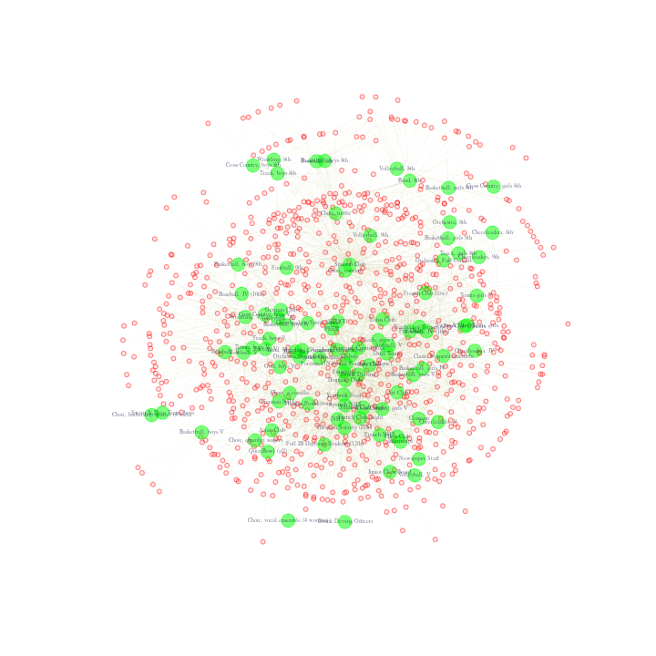
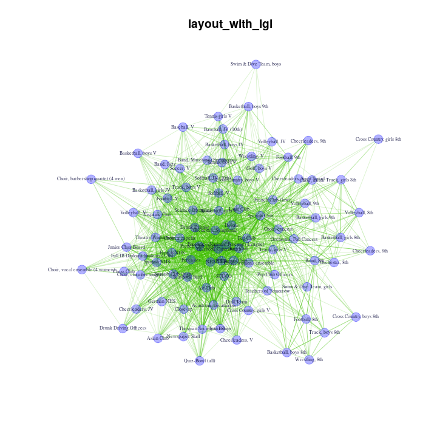
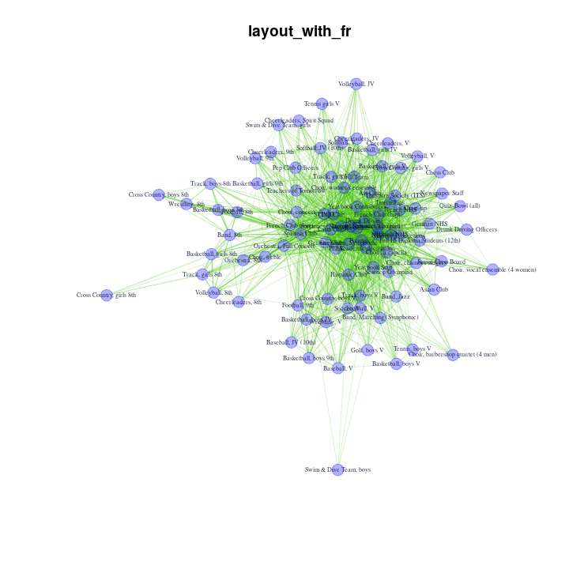
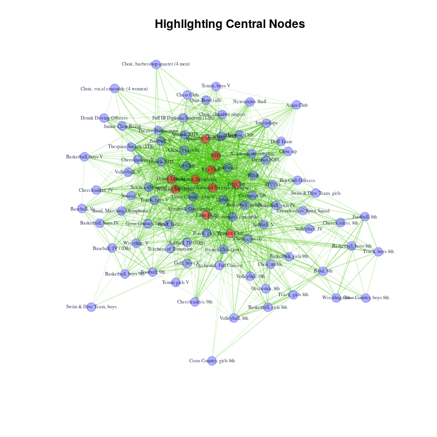
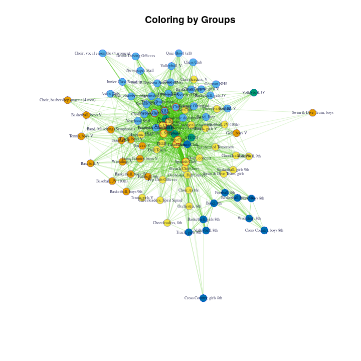
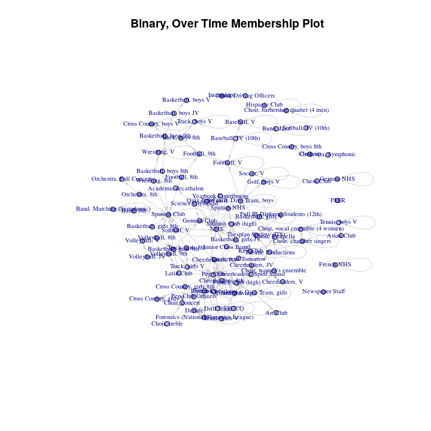

Duality, Affiliation Data
================
Saurabh Khanna
2020-05-14

# Chapter 11: R Tutorial on Duality, Affiliation Data

Built with R version 3.6.3

This tutorial walks through the analysis of two-mode (affiliation) data
in R. We will cover how to plot affiliation data using the igraph
package, how to transform it into one mode data and how to calculate
traditional measures, like centrality. We will then add a temporal
component to our analysis, looking at how affiliations change over time.
The tutorial will draw directly on many of the previous tutorials,
including Chapter 5 (visualization), Chapter 8 (cohesion and groups) and
Chapter 9 (centrality). We will work with affiliation data collected by
Daniel McFarland on student extracurricular affiliations (McFarland
1999). It is a longitudinal data set, with 3 waves - 1996, 1997, 1998,
although we will only use the first two waves, 1996 and 1997. It
consists of students (anonymized) and the student clubs in which they
are members (e.g., National Honor Society, wrestling team, cheerleading
squad, etc.).

Substantively, we are motivated by the following questions: a) Which
student clubs serve to integrate the school and which are more
peripheral? b) Which student clubs tend to share members at high rates?
What is the shared feature, or theme, that brings these clubs together
in a cluster? c) How do students tend to move from club to club over
time? Do certain clubs tend to lose members at higher rates than others?
Overall, we are interested in the manner in which membership in clubs
serves to integrate (or divide) the school.

## Reading in Example Affiliation Data and Basic Data Management

We will use the igraph library for this tutorial.

``` r
library(igraph) 
```

Let’s read in the data files. First for the 1996 school
year:

``` r
magact96=read.delim(file="https://sites.google.com/site/jeffreysmithdatafiles/mag_act96.txt", 
                    na.strings="na", check.names=FALSE)
```

Now for the 1997 school
year:

``` r
magact97=read.delim(file="https://sites.google.com/site/jeffreysmithdatafiles/mag_act97.txt",
                    na.strings="na", check.names=FALSE)
```

Missing data are coded as “na” in this data, which is why we gave R the
command na.strings = “na”. We need to preserve the original column names
for labeling our visualizations so we use the “check.names = FALSE”
argument as well. These files consist of four columns of
individual-level attributes (ID, gender, grade, race), then a series of
club membership dummy variables (coded “1” for membership, “0” for no
membership). Let’s take a look at the data (just the first 10 rows and
10
    columns):

``` r
magact96[1:10, 1:10] 
```

    ##       ID# GND GRD RCE Asian Club Hispanic Club Latin Club French Club (low) French Club (high) French NHS
    ## 1  101498   2  12   4          0             0          0                 0                  0          0
    ## 2  104452   1  10   3          0             0          1                 0                  0          0
    ## 3  104456   2  10   4          0             0          1                 0                  0          0
    ## 4  104462   1  10   3          0             0          1                 0                  0          0
    ## 5  104471   2  10   3          0             0          0                 0                  0          0
    ## 6  105215   2  12   4          0             0          0                 0                  0          0
    ## 7  106517   2  10   3          0             0          0                 0                  0          0
    ## 8  106569   1   9   3          0             0          0                 0                  0          0
    ## 9  106572   2   9   3          0             0          0                 0                  0          0
    ## 10 106587   2  10   3          0             0          0                 0                  0          0

We can see, for example, that the second, third and fourth students in
the data are part of the Latin Club while the first student is not.

Now we will start to get our data together to form our igraph objects.
We begin by creating the attribute data, which is simply the first four
columns in the data we read in. Attributes appear the same in both the
1996 and 1997 data frames.

``` r
magattrib=magact96[,1:4]
head(magattrib)
```

    ##      ID# GND GRD RCE
    ## 1 101498   2  12   4
    ## 2 104452   1  10   3
    ## 3 104456   2  10   4
    ## 4 104462   1  10   3
    ## 5 104471   2  10   3
    ## 6 105215   2  12   4

Now, we will grab the affiliation data. We will drop the attribute
columns from the original data frame to create a square incidence matrix
for each year. This will leave us (for each school year) with a matrix
of affiliations, with students on the rows, and clubs on the columns.
Practically, this requires taking out the first four columns of the data
frame and turning it into a matrix. First for 1996:

``` r
affil96=as.matrix(magact96[,-(1:4)]) 
```

We will also set the row names of our affiliation matrix to the ids of
the students.

``` r
rownames(affil96)=magattrib[,1]
```

We now repeat this for the 1997 school year:

``` r
affil97=as.matrix(magact97[,-(1:4)])
rownames(affil97)=magattrib[,1]
```

To get a sense of the data, let’s look at the affiliations for the first
student in 1996. Here we grab the first row in the affiliation data and
locate the 1s in that row:

``` r
affils_student1=affil96[1, ]
affils_student1[affils_student1==1]
```

    ##    Spanish Club (high)            Spanish NHS                    NHS    Theatre Productions Thespian Society (ITS) 
    ##                      1                      1                      1                      1                      1

We can see that student 1 was a member of the Spanish club, Spanish NHS,
NHS, Theatre Club and Thespian society in 1996.

We are now in position to create our two-mode graphs in igraph. We will
do this for each school year. The function is
graph\_from\_incidence\_matrix. The main inputs are the two-mode
incidence (or affiliation) matrix and mode. Here we set mode to “all”,
telling igraph to create mutual connections between student and club.

``` r
affil_net96=graph_from_incidence_matrix(affil96, mode="all")
affil_net96 
```

    ## IGRAPH 370a1eb UN-B 1386 2650 -- 
    ## + attr: type (v/l), name (v/c)
    ## + edges from 370a1eb (vertex names):
    ##   [1] 101498--Spanish Club (high)                   101498--Spanish NHS                           101498--NHS                                   101498--Theatre Productions                   101498--Thespian Society (ITS)                104452--Latin Club                            104452--Band, Marching (Symphonic)            104452--Football, 9th                         104452--Basketball, boys 9th                  104456--Latin Club                            104456--German Club                           104462--Latin Club                            104462--Spanish Club                          104462--Choir, concert                        104462--Football, 9th                         104462--Basketball, boys JV                   105215--Theatre Productions                   105215--Thespian Society (ITS)                106517--Pep Club                              106517--Orchestra, Full Concert               106517--Basketball, girls 9th                
    ##  [22] 106517--Track, girls V                        106572--Basketball, girls 8th                 106587--Pep Club                              106587--Orchestra, Full Concert               106587--Cheerleaders, 9th                     106592--Band, 8th                             106592--Football, 8th                         106604--Spanish Club                          106604--Pep Club                              106604--Orchestra, 8th                        106604--Choir, treble                         106609--Spanish Club                          106609--Band, Jazz                            106621--Track, boys 8th                       106709--Spanish Club                          106709--Orchestra, Symphonic                  109492--Baseball, V                           109493--French Club (high)                    109493--Wrestling, V                          113047--Asian Club                            113047--Football, V                          
    ##  [43] 113047--Tennis, boys V                        113050--Football, V                           113053--German Club                           113053--Forensics                             113053--Forensics (National Forensics League) 113060--PEER                                  113060--NHS                                   113107--Soccer, V                             113107--Swim & Dive Team, boys                113122--Spanish Club                          113122--Choir, women's ensemble               113123--Choir, women's ensemble               113127--Spanish Club                          113127--Debate                                113127--Forensics (National Forensics League) 113127--Key Club                              113137--Debate                                113137--Forensics                             113137--Forensics (National Forensics League) 113140--German Club                           113140--Spanish Club                         
    ##  [64] 113140--Debate                                113140--Forensics (National Forensics League) 113168--Latin Club                            113168--French Club (low)                     113211--Spanish Club                          113211--Pep Club                              113211--Choir, concert                        113211--Cheerleaders, Spirit Squad            113214--German Club                           113214--Pep Club                              113214--Choir, concert                        113214--Drill Team                            113214--Softball, V                           113429--Science Olympiad                      113429--Academic decathalon                   113429--Pep Club                              113429--Key Club                              113429--Orchestra, Full Concert               113433--Football, V                           113479--PEER                                  113479--Drunk Driving                        
    ##  [85] 113479--Key Club                              113479--Choir, women's ensemble               113694--Asian Club                            113694--Orchestra, Symphonic                  113694--Choir, a capella                      113694--Choir, chamber singers                113719--French Club (high)                    113719--Yearbook Contributors                 113719--Pep Club                              113719--Orchestra, Symphonic                  113939--French Club (high)                    113939--NHS                                   114002--Football, V                           114002--Wrestling, V                          114010--Yearbook Staff                        114010--PEER                                  114010--Pep Club                              114015--Yearbook Contributors                 114015--Softball, V                           114025--Theatre Productions                   114025--Orchestra, Symphonic                 
    ## [106] 114025--Choir, a capella                      114037--Latin Club                            114037--Spanish Club (high)                   114037--Spanish NHS                           114037--Forensics (National Forensics League) 114037--STUCO                                 114037--Yearbook Staff                        114037--NHS                                   114037--Orchestra, Symphonic                  114037--Basketball, girls JV                  114071--Forensics                             114071--Forensics (National Forensics League) 114071--Key Club                              114073--Debate                                114073--Forensics                             114073--Forensics (National Forensics League) 114076--Latin Club                            114076--Key Club                              114076--Orchestra, Symphonic                  114078--Latin Club                            114078--Spanish Club                         
    ## [127] 114078--Basketball, boys JV                   114085--Spanish Club                          114097--French Club (high)                    114097--Yearbook Contributors                 114097--Pep Club                              114097--Orchestra, Symphonic                  114097--Choir, women's ensemble               114097--Cheerleaders, JV                      114111--Orchestra, Symphonic                  114111--Volleyball, JV                        114111--Basketball, girls JV                  114126--French Club (low)                     114126--Drunk Driving                         114126--Orchestra, Symphonic                  114126--Soccer, V                             114134--Latin Club                            114134--Spanish Club                          114134--Football, 9th                         114134--Wrestling, V                          114187--Spanish Club                          114189--Spanish Club                         
    ## [148] 114189--Orchestra, 8th                        114493--Pep Club                              114493--Choir, women's ensemble               114493--Cheerleaders, V                       114671--French Club (high)                    114671--French NHS                            114671--Yearbook Contributors                 114671--NHS                                   114671--Theatre Productions                   114671--Choir, a capella                      114671--Choir, chamber singers                114671--Cross Country, girls V                114671--Track, girls V                        114679--Hispanic Club                         114679--Spanish Club (high)                   114679--Spanish NHS                           114679--NHS                                   114679--Theatre Productions                   114679--Tennis, boys V                        114843--Junior Class Board                    114843--PEER                                 
    ## + ... omitted several edges

Note that the two mode network has a vertex attribute called type that
indicates the kind of node. A False corresponds to the students and True
corresponds to the clubs. We thus have a network of students and clubs
where all ties link students to clubs (based on membership). Let’s grab
the vertex attribute type from the two-mode graph object.

``` r
type96=vertex_attr(affil_net96, "type") 
table(type96) 
```

    ## type96
    ## FALSE  TRUE 
    ##  1295    91

We see that there are 1295 students and 91 clubs in the school. Here we
create the analogous igraph object for 1997:

``` r
affil_net97=graph_from_incidence_matrix(affil97, mode="all")
```

## Plotting the Network

Now that we have our affiliation networks constructed, let’s first
figure out how to create a nice plot. The igraph package has excellent
plotting functionality that allows you to assign visual attributes to
igraph objects before you plot. The alternative is to pass 20 or so
arguments to the plot.igraph() function, which can get messy.

Each node (or “vertex”) object is accessible by calling V(g), and you
can call (or create) a node attribute by using the $ operator (i.e.,
V(g)$name\_of\_attribute). Let’s now use this notation to set the vertex
color, with special attention to making graph objects slightly
transparent. We’ll use the rgb function in R to do this. We specify the
levels of Red, Green, and Blue and “alpha-channel” (a.k.a. opacity)
using this syntax: rgb(red, green, blue, alpha). To return solid red,
one would use this call: rgb(red = 1, green =0, blue = 0, alpha = 1). We
will make nodes, edges, and labels slightly transparent so that when
things overlap it is still possible to read them. You can read up on the
RGB color model at <http://en.wikipedia.org/wiki/RGB_color_model>. In
this case let’s color the students red and the affiliations green. Here
we set the students red and set the opacity to
.5:

``` r
V(affil_net96)$color[type96==FALSE]=rgb(red=1, green=0, blue=0, alpha=.5)
```

And now we set the clubs
green:

``` r
V(affil_net96)$color[type96==TRUE]=rgb(red=0, green=1, blue=0, alpha=.5) 
```

Notice that we index the V(g)$color object by using the type96 variable
used above. Students correspond to False in the type variable and clubs
correspond to True. From here on out, we do not specify “red =”, “green
=”, “blue =”, and “alpha =”. These are the default arguments (R knows
the first number corresponds to red, the second to blue, and so on). Now
we’ll set some other graph
attributes:

``` r
V(affil_net96)$label=V(affil_net96)$name #setting label to id of student or name of club
V(affil_net96)$label.color=rgb(0, 0, .2, .5) #set the color of the labels
V(affil_net96)$label.cex=.4 #make the labels of the nodes a bit smaller
V(affil_net96)$size=6 #set size of nodes to 6
V(affil_net96)$frame.color=V(affil_net96)$color #set frame of nodes to match color of nodes
```

We can also set edge attributes. We set the edge attributes using the
E() function. Here we’ll make the edges nearly transparent and slightly
yellow because there will be so many edges in this graph:

``` r
E(affil_net96)$color=rgb(.5, .5, 0, .2)
```

We can also specify which layout we will use. In this case, we will use
the Fruchterman-Reingold force-directed layout algorithm. Generally
speaking, when you have a ton of edges, the Kamada-Kawai layout
algorithm works well. It can, however, be slow for networks with many
nodes. As a default, igraph will use the grid based implementation of
the algorithm in the case of more than a thousand vertices. This
implementation is faster, but can fail to produce a plot with any
meaningful pattern if you have too many isolates. Also note that for
more recent versions of igraph, the F-R layout has been rewritten and
will produce bad looking plots if a network has more than 999 vertices.
You need to fix the grid parameter to “nogrid” to fix the problem. Our
network has more than 999 vertices and has many isolates. Therefore, we
want to offset the default and specify that we do not want to use the
grid implementation.

``` r
layout=layout_with_fr(affil_net96, grid ="nogrid")
```

Now, we’ll open a pdf “device” on which to plot. This is just a
connection to a pdf file. We will go ahead and save it to our working
directory, which can be set using `setwd` and checked using `getwd()`.

``` r
pdf("magact_stdnt_actvts_1996.pdf")
plot(affil_net96, layout=layout)
dev.off() 
```

<!-- -->

Once we break off the connection, the created plot will be saved out in
the working directory, saved as “magact\_stdnt\_actvts\_1996.pdf” (for
convenience, we have also included a version of the plot in this html
ouput). Now, if you open the pdf output, you’ll notice that you can zoom
in on any part of the graph ad infinitum without losing any resolution.
How is that possible in such a small file? It’s possible because the pdf
device output consists of data based on vectors: lines, polygons,
circles, ellipses, etc., each specified by a mathematical formula that
your pdf program renders when you view it. Regular bitmap or jpeg
picture output, on the other hand, consists of a pixel-coordinate
mapping of the image in question, which is why you lose resolution when
you zoom in on a digital photograph or a plot produced as a picture.

Looking at the output, this plot is oddly reminiscent of a crescent and
star, but impossible to read. Part of the problem is the way in which
the layout algorithms deal with the isolates. For example,
layout\_with\_fr will squish all of the connected nodes into the center
creating a useless “hairball”-like visualization. The same applies to
layout\_with\_fr.grid (it’s even worse).

Let’s remove all of the isolates (the crescent), change a few aesthetic
features, and replot. First, we’ll remove isolates, by deleting all
nodes with a degree of 0, meaning that they have zero edges. In this
case, this means students who are part of no clubs or clubs that have no
members. Then, we’ll suppress labels for students and make their nodes
smaller and more transparent. Then we’ll make the edges narrower and
more transparent. Then, we’ll replot using various layout algorithms.

Here we identify the isolates and then remove them from the network:

``` r
degree0=which(degree(affil_net96)==0)
affil_net96_noisolates=delete_vertices(affil_net96, degree0)
affil_net96_noisolates
```

    ## IGRAPH 2490acc UN-B 948 2650 -- 
    ## + attr: type (v/l), name (v/c), color (v/c), label (v/c), label.color (v/c), label.cex (v/n), size (v/n), frame.color (v/c), color (e/c)
    ## + edges from 2490acc (vertex names):
    ##   [1] 101498--Spanish Club (high)                   101498--Spanish NHS                           101498--NHS                                   101498--Theatre Productions                   101498--Thespian Society (ITS)                104452--Latin Club                            104452--Band, Marching (Symphonic)            104452--Football, 9th                         104452--Basketball, boys 9th                  104456--Latin Club                            104456--German Club                           104462--Latin Club                            104462--Spanish Club                          104462--Choir, concert                        104462--Football, 9th                         104462--Basketball, boys JV                   105215--Theatre Productions                   105215--Thespian Society (ITS)                106517--Pep Club                              106517--Orchestra, Full Concert               106517--Basketball, girls 9th                
    ##  [22] 106517--Track, girls V                        106572--Basketball, girls 8th                 106587--Pep Club                              106587--Orchestra, Full Concert               106587--Cheerleaders, 9th                     106592--Band, 8th                             106592--Football, 8th                         106604--Spanish Club                          106604--Pep Club                              106604--Orchestra, 8th                        106604--Choir, treble                         106609--Spanish Club                          106609--Band, Jazz                            106621--Track, boys 8th                       106709--Spanish Club                          106709--Orchestra, Symphonic                  109492--Baseball, V                           109493--French Club (high)                    109493--Wrestling, V                          113047--Asian Club                            113047--Football, V                          
    ##  [43] 113047--Tennis, boys V                        113050--Football, V                           113053--German Club                           113053--Forensics                             113053--Forensics (National Forensics League) 113060--PEER                                  113060--NHS                                   113107--Soccer, V                             113107--Swim & Dive Team, boys                113122--Spanish Club                          113122--Choir, women's ensemble               113123--Choir, women's ensemble               113127--Spanish Club                          113127--Debate                                113127--Forensics (National Forensics League) 113127--Key Club                              113137--Debate                                113137--Forensics                             113137--Forensics (National Forensics League) 113140--German Club                           113140--Spanish Club                         
    ##  [64] 113140--Debate                                113140--Forensics (National Forensics League) 113168--Latin Club                            113168--French Club (low)                     113211--Spanish Club                          113211--Pep Club                              113211--Choir, concert                        113211--Cheerleaders, Spirit Squad            113214--German Club                           113214--Pep Club                              113214--Choir, concert                        113214--Drill Team                            113214--Softball, V                           113429--Science Olympiad                      113429--Academic decathalon                   113429--Pep Club                              113429--Key Club                              113429--Orchestra, Full Concert               113433--Football, V                           113479--PEER                                  113479--Drunk Driving                        
    ##  [85] 113479--Key Club                              113479--Choir, women's ensemble               113694--Asian Club                            113694--Orchestra, Symphonic                  113694--Choir, a capella                      113694--Choir, chamber singers                113719--French Club (high)                    113719--Yearbook Contributors                 113719--Pep Club                              113719--Orchestra, Symphonic                  113939--French Club (high)                    113939--NHS                                   114002--Football, V                           114002--Wrestling, V                          114010--Yearbook Staff                        114010--PEER                                  114010--Pep Club                              114015--Yearbook Contributors                 114015--Softball, V                           114025--Theatre Productions                   114025--Orchestra, Symphonic                 
    ## [106] 114025--Choir, a capella                      114037--Latin Club                            114037--Spanish Club (high)                   114037--Spanish NHS                           114037--Forensics (National Forensics League) 114037--STUCO                                 114037--Yearbook Staff                        114037--NHS                                   114037--Orchestra, Symphonic                  114037--Basketball, girls JV                  114071--Forensics                             114071--Forensics (National Forensics League) 114071--Key Club                              114073--Debate                                114073--Forensics                             114073--Forensics (National Forensics League) 114076--Latin Club                            114076--Key Club                              114076--Orchestra, Symphonic                  114078--Latin Club                            114078--Spanish Club                         
    ## [127] 114078--Basketball, boys JV                   114085--Spanish Club                          114097--French Club (high)                    114097--Yearbook Contributors                 114097--Pep Club                              114097--Orchestra, Symphonic                  114097--Choir, women's ensemble               114097--Cheerleaders, JV                      114111--Orchestra, Symphonic                  114111--Volleyball, JV                        114111--Basketball, girls JV                  114126--French Club (low)                     114126--Drunk Driving                         114126--Orchestra, Symphonic                  114126--Soccer, V                             114134--Latin Club                            114134--Spanish Club                          114134--Football, 9th                         114134--Wrestling, V                          114187--Spanish Club                          114189--Spanish Club                         
    ## [148] 114189--Orchestra, 8th                        114493--Pep Club                              114493--Choir, women's ensemble               114493--Cheerleaders, V                       114671--French Club (high)                    114671--French NHS                            114671--Yearbook Contributors                 114671--NHS                                   114671--Theatre Productions                   114671--Choir, a capella                      114671--Choir, chamber singers                114671--Cross Country, girls V                114671--Track, girls V                        114679--Hispanic Club                         114679--Spanish Club (high)                   114679--Spanish NHS                           114679--NHS                                   114679--Theatre Productions                   114679--Tennis, boys V                        114843--Junior Class Board                    114843--PEER                                 
    ## + ... omitted several edges

Here we extract the type of node for this subsetted network:

``` r
type96_noisolates=vertex_attr(affil_net96_noisolates, "type")
table(type96_noisolates) 
```

    ## type96_noisolates
    ## FALSE  TRUE 
    ##   857    91

We see that we still have 91 clubs but many students have been removed.
Now, let’s tweak some of the plotting
parameters.

``` r
V(affil_net96_noisolates)$label[type96_noisolates==FALSE]=NA #taking off the labels for the students
V(affil_net96_noisolates)$color[type96_noisolates==FALSE]=rgb(1, 0, 0, .1) #setting color of students
V(affil_net96_noisolates)$size[type96_noisolates==FALSE]=2  #making students nodes smaller
```

Here we change some of the edge attributes for the plot.

``` r
E(affil_net96_noisolates)$width=.3
E(affil_net96_noisolates)$color=rgb(.5, .5, 0, .1)
```

Now let’s create the plot, saving out it out as a pdf. First with
Kamada-Kawai layout:

``` r
pdf("magact_stdnt_actvts_1996_layout_with_kk.pdf")
plot(affil_net96_noisolates, layout=layout_with_kk)
dev.off()
```

<!-- -->

We can see that the clubs are colored green and have labels, while the
students are colored a transparent red and have no labels. Now with the
FR layout.

``` r
pdf("magact_stdnt_actvts_1996_layout_with_fr.pdf")
plot(affil_net96_noisolates, layout=layout_with_fr)
dev.off()
```

<!-- -->

Note that if we ran this again we would get a slightly different figure.
To check this:

``` r
pdf("magact_stdnt_actvts_1996_layout_with_fr2.pdf")
plot(affil_net96_noisolates, layout=layout_with_fr)
dev.off()
```

The nice thing about the Fruchterman-Reingold layout in this case is
that it really emphasizes centrality – the nodes that are most central
are nearly always placed in the middle of the plot. More generally,
these plots are nice in that they emphasize the dualistic nature of
student and club (or person and affiliation). We see that certain clubs
and students are placed in close proximity to each other. In this way,
we get a space, where students and clubs tend to cluster together, with
sets of students tending to join the same kinds of clubs. For example,
we can see that eighth grade boy’s track and eighth grade boy’s
cross-country tend to cluster together. They are linked in the sense
that students in one club tend to be in another. From the other side,
students on these teams are placed close together in the space, as they
are linked through common patterns of club membership (here eighth grade
boy sports). While the two-mode network representation is useful and
intuitive, it is often easier to actually analyze the one-mode
projections of the network, and that is what we turn to next.

## Single Mode Networks

Having plotted our two-mode network for the 1996 year (we could produce
similar plots for 1997), we now move to an analysis that focuses on the
one-mode projections of the network. We will produce two networks, one
for student-to-student ties and one for club-to-club ties based on the
student-to-club network analyzed above. For the student-to-student
network, all of the nodes are students and we define a tie between two
students based on the number of clubs they have in common. For the
club-to-club network, all the nodes are clubs, and we define a tie
between clubs based on the number of members they have in common.

### Constructing One-Mode Projections

We will begin by producing the one-mode projection using matrix
multiplication. This is done using R’s matrix algebra commands. You
first need to get your affiliation data into the matrix format. We
already have a matrix representation of our data, but if you did not, a
network object can be coerced via as\_incidence\_matrix in the igraph
package. To get the one-mode representation of ties between rows
(students in our example), multiply the matrix by its transpose. To get
the one-mode representation of ties between columns (clubs in our
example), multiply the transpose of the matrix by the matrix. Note that
you must use the matrix-multiplication operator %\*% rather than a
simple asterisk. For the club to club
    network:

``` r
club_club96 = t(affil96) %*% affil96 
```

``` r
club_club96[1:5, 1:5]
```

    ##                    Asian Club Hispanic Club Latin Club French Club (low) French Club (high)
    ## Asian Club                  8             1          0                 0                  0
    ## Hispanic Club               1            31          4                 2                  1
    ## Latin Club                  0             4         93                14                  4
    ## French Club (low)           0             2         14                43                  2
    ## French Club (high)          0             1          4                 2                 61

The values in the matrix capture the number of people who are members of
the row club and column club. For example, there is one student who is
part of the Asian club and the Hispanic club. Note that the diagonal
tells us the number of students in that club. So, there are 8 students
in the Asian club.

``` r
dim(club_club96) 
```

    ## [1] 91 91

Note that the matrix is square with the number of rows and columns equal
to the number of clubs, 91 in this case. If we wanted to the get the
student to student network, we would take the affiliation matrix and
multiply it by the transpose of the affiliation matrix:

``` r
student_student96 = affil96 %*% t(affil96) 
student_student96[1:5, 1:5] 
```

    ##        101498 104452 104456 104462 104471
    ## 101498      5      0      0      0      0
    ## 104452      0      4      1      2      0
    ## 104456      0      1      2      1      0
    ## 104462      0      2      1      5      0
    ## 104471      0      0      0      0      0

The values capture the number of clubs that student i (on the rows) and
j (on the columns) have in common.

``` r
dim(student_student96) 
```

    ## [1] 1295 1295

Again, we have a square matrix, but this time the rows and columns are
equal to the number of students in the school. We can now take those
matrices and create two igraph objects. This will make it possible to
plot and calculate statistics on the one-mode networks.

It is also possible to use the functions within igraph to construct the
one-mode networks directly from the two-mode network, without having to
do the matrix multiplication. Here we will rely on the
bipartite\_projection function, which converts a two-mode network to two
one-mode networks.

``` r
onemode96=bipartite_projection(affil_net96)
onemode96
```

    ## $proj1
    ## IGRAPH 7860c62 UNW- 1295 69493 -- 
    ## + attr: name (v/c), color (v/c), label (v/c), label.color (v/c), label.cex (v/n), size (v/n), frame.color (v/c), weight (e/n)
    ## + edges from 7860c62 (vertex names):
    ##   [1] 101498--114037 101498--114679 101498--114977 101498--115477 101498--115805 101498--120854 101498--121353 101498--122618 101498--122626 101498--122627 101498--122631 101498--122635 101498--122639 101498--122640 101498--122644 101498--126782 101498--129059 101498--129083 101498--129114 101498--129204 101498--129235 101498--129796 101498--133025 101498--133027 101498--133962 101498--133976 101498--134405 101498--138131 101498--138287 101498--139161 101498--139362 101498--141490 101498--148531 101498--888885 101498--888898 101498--888901 101498--888903 101498--888911 101498--888912 101498--888913 101498--888940 101498--888944 101498--888967 101498--888968 101498--888980 101498--888981 101498--888989 101498--888991 101498--888998 101498--889006 101498--889014 101498--889016 101498--889017 101498--889029 101498--889035 101498--889036 101498--889042 101498--889046 101498--889047 101498--889053 101498--889057 101498--889059 101498--889068 101498--889076 101498--889078 101498--889079
    ##  [67] 101498--889084 101498--129817 101498--888925 101498--889021 101498--889075 101498--113060 101498--113939 101498--114671 101498--114850 101498--117526 101498--118543 101498--119301 101498--119516 101498--120888 101498--121314 101498--122625 101498--122630 101498--122632 101498--122634 101498--122638 101498--122673 101498--126495 101498--129256 101498--133042 101498--133924 101498--133964 101498--134023 101498--147258 101498--150526 101498--888882 101498--888883 101498--888888 101498--888891 101498--888892 101498--888893 101498--888895 101498--888896 101498--888907 101498--888908 101498--888909 101498--888914 101498--888916 101498--888917 101498--888918 101498--888919 101498--888920 101498--888929 101498--888931 101498--888933 101498--888939 101498--888942 101498--888943 101498--888947 101498--888948 101498--888956 101498--888957 101498--888960 101498--888962 101498--888964 101498--888965 101498--888966 101498--888969 101498--888970 101498--888975 101498--888976 101498--888977
    ## [133] 101498--888978 101498--888983 101498--888984 101498--888987 101498--888988 101498--888990 101498--888992 101498--888997 101498--888999 101498--889000 101498--889007 101498--889010 101498--889013 101498--889024 101498--889025 101498--889026 101498--889027 101498--889032 101498--889033 101498--889038 101498--889043 101498--889048 101498--889051 101498--889052 101498--889056 101498--889060 101498--889069 101498--889071 101498--889074 101498--889081 101498--889082 101498--889085 101498--889086 101498--105215 101498--114025 101498--116724 101498--116862 101498--119263 101498--121373 101498--121385 101498--122656 101498--124451 101498--126274 101498--129483 101498--132669 101498--133022 101498--133970 101498--134002 101498--146858 101498--888894 101498--888930 101498--888935 101498--888973 101498--888982 101498--888994 101498--889058 101498--120202 101498--122662 101498--129366 101498--889005 104452--104456 104452--104462 104452--113168 104452--114037 104452--114076 104452--114078
    ## [199] 104452--114134 104452--114849 104452--114977 104452--114992 104452--115101 104452--117977 104452--118680 104452--118699 104452--118871 104452--120202 104452--121375 104452--121455 104452--121456 104452--121470 104452--121485 104452--121852 104452--122626 104452--122661 104452--122662 104452--122677 104452--122683 104452--122713 104452--122722 104452--122726 104452--122730 104452--122731 104452--122735 104452--125567 104452--126066 104452--126259 104452--126274 104452--126784 104452--127198 104452--127502 104452--127535 104452--127761 104452--127777 104452--128168 104452--128398 104452--128413 104452--128996 104452--129158 104452--129351 104452--129366 104452--129473 104452--129475 104452--129482 104452--129486 104452--132863 104452--132942 104452--132959 104452--133365 104452--133507 104452--134002 104452--134072 104452--136912 104452--136934 104452--138473 104452--138562 104452--138672 104452--138703 104452--138751 104452--138966 104452--138976 104452--139095 104452--139161
    ## [265] 104452--139314 104452--140442 104452--141006 104452--141490 104452--142112 104452--143136 104452--143231 104452--143336 104452--144312 104452--145077 104452--145500 104452--146757 104452--147404 104452--149552 104452--888902 104452--888921 104452--889021 104452--889036 104452--889039 104452--889077 104452--121385 104452--122644 104452--126869 104452--129800 104452--133505 104452--138690 104452--888904 104452--888928 104452--888953 104452--889084 104452--889090 104452--121857 104452--122717 104452--122729 104452--126062 104452--126823 104452--127329 104452--128041 104452--128962 104452--134494 104452--139735 104452--140259 104452--141134 104452--153386 104452--888884 104452--122706 104452--122719 104452--122723 104452--127510 104452--138896 104452--139163 104452--146769 104452--151812 104456--104462 104456--113168 104456--114037 104456--114076 104456--114078 104456--114134 104456--114849 104456--114977 104456--114992 104456--115101 104456--117977 104456--118680 104456--118699
    ## [331] 104456--118871 104456--120202 104456--121375 104456--121455 104456--121456 104456--121470 104456--121485 104456--121852 104456--122626 104456--122661 104456--122662 104456--122677 104456--122683 104456--122713 104456--122722 104456--122726 104456--122730 104456--122731 104456--122735 104456--125567 104456--126066 104456--126259 104456--126274 104456--126784 104456--127198 104456--127502 104456--127535 104456--127761 104456--127777 104456--128168 104456--128398 104456--128413 104456--128996 104456--129158 104456--129351 104456--129366 104456--129473 104456--129475 104456--129482 104456--129486 104456--132863 104456--132942 104456--132959 104456--133365 104456--133507 104456--134002 104456--134072 104456--136912 104456--136934 104456--138473 104456--138562 104456--138672 104456--138703 104456--138751 104456--138966 104456--138976 104456--139095 104456--139161 104456--139314 104456--140442 104456--141006 104456--141490 104456--142112 104456--143136 104456--143231 104456--143336
    ## [397] 104456--144312 104456--145077 104456--145500 104456--146757 104456--147404 104456--149552 104456--888902 104456--888921 104456--889021 104456--889036 104456--889039 104456--889077 104456--113053 104456--113140 104456--113214 104456--114850 104456--119324 104456--119447 104456--120729 104456--121864 104456--122638 104456--122665 104456--122710 104456--122721 104456--122724 104456--122732 104456--122747 104456--123938 104456--126353 104456--128172 104456--129059 104456--133579 104456--133595 104456--133964 104456--134023 104456--134039 104456--134040 104456--134051 104456--134058 104456--137539 104456--139331 104456--139404 104456--139638 104456--139649 104456--139696 104456--140421 104456--141015 104456--141017 104456--141123 104456--142284 104456--144843 104456--144877 104456--146866 104456--147317 104456--149145 104456--150526 104456--155177 104456--167500 104456--167510 104456--167519 104456--888929 104456--888946 104456--888947 104456--888956 104456--888963 104456--889003
    ## [463] 104456--889041 104456--889058 104456--889066 104456--889067 104456--889069 104462--113168 104462--114037 104462--114076 104462--114078 104462--114134 104462--114849 104462--114977 104462--114992 104462--115101 104462--117977 104462--118680 104462--118699 104462--118871 104462--120202 104462--121375 104462--121455 104462--121456 104462--121470 104462--121485 104462--121852 104462--122626 104462--122661 104462--122662 104462--122677 104462--122683 104462--122713 104462--122722 104462--122726 104462--122730 104462--122731 104462--122735 104462--125567 104462--126066 104462--126259 104462--126274 104462--126784 104462--127198 104462--127502 104462--127535 104462--127761 104462--127777 104462--128168 104462--128398 104462--128413 104462--128996 104462--129158 104462--129351 104462--129366 104462--129473 104462--129475 104462--129482 104462--129486 104462--132863 104462--132942 104462--132959 104462--133365 104462--133507 104462--134002 104462--134072 104462--136912 104462--136934
    ## + ... omitted several edges
    ## 
    ## $proj2
    ## IGRAPH a563f50 UNW- 91 1361 -- 
    ## + attr: name (v/c), color (v/c), label (v/c), label.color (v/c), label.cex (v/n), size (v/n), frame.color (v/c), weight (e/n)
    ## + edges from a563f50 (vertex names):
    ##   [1] Asian Club       --Football, V                           Asian Club       --Tennis, boys V                        Asian Club       --Orchestra, Symphonic                  Asian Club       --Choir, a capella                      Asian Club       --Choir, chamber singers                Asian Club       --Debate                                Asian Club       --Forensics                             Asian Club       --Forensics (National Forensics League) Asian Club       --German Club                           Asian Club       --Chess Club                            Asian Club       --Newspaper Staff                       Asian Club       --NHS                                   Asian Club       --Internships                           Asian Club       --Hispanic Club                         Asian Club       --Spanish Club (high)                   Asian Club       --PEER                                  Asian Club       --Pep Club                             
    ##  [18] Asian Club       --Close-up                              Asian Club       --Academic decathalon                   Asian Club       --STUCO                                 Asian Club       --Yearbook Staff                        Asian Club       --Key Club                              Hispanic Club    --Spanish Club (high)                   Hispanic Club    --Spanish NHS                           Hispanic Club    --NHS                                   Hispanic Club    --Theatre Productions                   Hispanic Club    --Tennis, boys V                        Hispanic Club    --Spanish Club                          Hispanic Club    --Science Olympiad                      Hispanic Club    --Academic decathalon                   Hispanic Club    --Pep Club                              Hispanic Club    --Orchestra, Full Concert               Hispanic Club    --Latin Club                            Hispanic Club    --PEER                                 
    ##  [35] Hispanic Club    --Choir, women's ensemble               Hispanic Club    --Chess Club                            Hispanic Club    --Choir, a capella                      Hispanic Club    --Football, V                           Hispanic Club    --Baseball, JV (10th)                   Hispanic Club    --Baseball, V                           Hispanic Club    --French Club (low)                     Hispanic Club    --Pep Club Officers                     Hispanic Club    --Drunk Driving                         Hispanic Club    --Key Club                              Hispanic Club    --Forensics (National Forensics League) Hispanic Club    --Art Club                              Hispanic Club    --Debate                                Hispanic Club    --Forensics                             Hispanic Club    --STUCO                                 Hispanic Club    --Orchestra, Symphonic                  Hispanic Club    --Golf, boys V                         
    ##  [52] Hispanic Club    --Close-up                              Hispanic Club    --Full IB Diploma Students (12th)       Hispanic Club    --Soccer, V                             Hispanic Club    --French Club (high)                    Hispanic Club    --Choir, chamber singers                Hispanic Club    --Choir, barbershop quartet (4 men)     Hispanic Club    --Track, boys V                         Latin Club       --Band, Marching (Symphonic)            Latin Club       --Football, 9th                         Latin Club       --Basketball, boys 9th                  Latin Club       --German Club                           Latin Club       --Spanish Club                          Latin Club       --Choir, concert                        Latin Club       --Basketball, boys JV                   Latin Club       --French Club (low)                     Latin Club       --Spanish Club (high)                   Latin Club       --Spanish NHS                          
    ##  [69] Latin Club       --Forensics (National Forensics League) Latin Club       --STUCO                                 Latin Club       --Yearbook Staff                        Latin Club       --NHS                                   Latin Club       --Orchestra, Symphonic                  Latin Club       --Basketball, girls JV                  Latin Club       --Key Club                              Latin Club       --Wrestling, V                          Latin Club       --Chess Club                            Latin Club       --Drunk Driving                         Latin Club       --Yearbook Contributors                 Latin Club       --Pep Club                              Latin Club       --Pep Club Officers                     Latin Club       --Orchestra, Full Concert               Latin Club       --Science Olympiad                      Latin Club       --Academic decathalon                   Latin Club       --PEER                                 
    ##  [86] Latin Club       --Choir, women's ensemble               Latin Club       --Teachers of Tomorrow                  Latin Club       --Thespian Society (ITS)                Latin Club       --Band, Jazz                            Latin Club       --Softball, V                           Latin Club       --Swim & Dive Team, girls               Latin Club       --Cheerleaders, Spirit Squad            Latin Club       --Soccer, V                             Latin Club       --Forensics                             Latin Club       --Tennis girls V                        Latin Club       --Theatre Productions                   Latin Club       --Debate                                Latin Club       --Choir, a capella                      Latin Club       --Cross Country, boys V                 Latin Club       --Track, boys V                         Latin Club       --Art Club                              Latin Club       --Volleyball, 9th                      
    ## [103] Latin Club       --Softball, JV (10th)                   Latin Club       --Golf, boys V                          Latin Club       --Football, V                           Latin Club       --French Club (high)                    Latin Club       --French NHS                            Latin Club       --Cross Country, girls V                Latin Club       --Cheerleaders, JV                      Latin Club       --Cheerleaders, 9th                     Latin Club       --Choir, treble                         Latin Club       --Close-up                              Latin Club       --Track, girls V                        Latin Club       --Basketball, girls 9th                 Latin Club       --Basketball, girls V                   Latin Club       --Drill Team                            Latin Club       --German NHS                            Latin Club       --Quiz-Bowl (all)                       French Club (low)--Drunk Driving                        
    ## [120] French Club (low)--Orchestra, Symphonic                  French Club (low)--Soccer, V                             French Club (low)--Choir, treble                         French Club (low)--Debate                                French Club (low)--Forensics (National Forensics League) French Club (low)--Pep Club                              French Club (low)--Pep Club Officers                     French Club (low)--Orchestra, Full Concert               French Club (low)--French Club (high)                    French Club (low)--Cheerleaders, JV                      French Club (low)--Swim & Dive Team, girls               French Club (low)--Cheerleaders, Spirit Squad            French Club (low)--Forensics                             French Club (low)--STUCO                                 French Club (low)--Football, 9th                         French Club (low)--Baseball, JV (10th)                   French Club (low)--Key Club                             
    ## + ... omitted several edges

This is a list with two objects. The first is the student-student
projection and the second is the club-club projection. Let’s take a look
at the club-to-club network:

``` r
club_net96=onemode96$proj2
```

Note that an edge weight has been automatically passed to the
constructed graph. The weight for the club-to-club network is based on
the number of shared members between i and j. This is stored as an edge
attribute called weight. We can extract useful information from this
object, including the names of the nodes, here the clubs.

``` r
club_names=V(club_net96)$name 
length(club_names) 
```

    ## [1] 91

We see there are 91 names. We can also grab the matrix from this igraph
object. We include an attr option to get the values in the matrix.

``` r
mat=as_adjacency_matrix(graph=club_net96, attr="weight", sparse=F)
mat[1:5, 1:5]
```

    ##                    Asian Club Hispanic Club Latin Club French Club (low) French Club (high)
    ## Asian Club                  0             1          0                 0                  0
    ## Hispanic Club               1             0          4                 2                  1
    ## Latin Club                  0             4          0                14                  4
    ## French Club (low)           0             2         14                 0                  2
    ## French Club (high)          0             1          4                 2                  0

This matrix is the same as club\_club96 except for the diagonal. The
diagonal here is set to 0, as igraph takes out the self-weight (number
of members) when constructing the network.

We now turn to plotting the single mode, club-to-club network (we could
do an analogous plot for students). One of the main challenges of
plotting these networks is that the one-mode projections of two-mode
networks tend to be quite dense. We will thus need to pay special
attention to the coloring of the edges, noting that the edges themselves
are weighted. We will begin by setting vertex attributes, making sure to
make them slightly transparent by altering the alpha input to the rgb
function.

``` r
V(club_net96)$label.color=rgb(0, 0, .2, .8)
V(club_net96)$label.cex=.5 #making labels a bit smaller 
V(club_net96)$size=6
V(club_net96)$color=rgb(0, 0, 1, .3) #setting the color and transparency of the clubs
V(club_net96)$frame.color=V(club_net96)$color 
```

We will also set the edge opacity/transparency as a function of how many
students each group has in common (the weight of the edge that connects
the two groups). In order to do so, we need to transform the edge
weights so that they are between about .05 and 1, otherwise they will
not show up on the plot. We use the log function to make sure all
transparencies are on relatively the same scale, then divide by the
maximum edge weight to get them on a scale from about .2 and 1.

``` r
egalpha=log1p(E(club_net96)$weight)/max(log1p(E(club_net96)$weight))
E(club_net96)$color=rgb(.25, .75, 0, egalpha)
```

For illustrative purposes, let’s compare how the LGL (layout generator
for larger graphs) and Fruchterman-Reingold algorithms render this
graph:

``` r
pdf("magact_stdnt_actvts_1996_clubs.pdf")
plot(club_net96, main="layout_with_lgl", layout=layout_with_lgl)
plot(club_net96, main="layout_with_fr", layout=layout_with_fr) 
dev.off()
```

<!-- --><!-- -->

Be sure to go to the second page in the pdf to see the FR layout. You
might like the LGL layout for this graph, because the center of the
graph is very busy if you use the Fruchterman-Reingold layout.

The plot offers important insight into the structure of club membership
in the school. We can see that there are a number of grade-specific
sports teams on the periphery and a core consisting of more generalist
clubs, like Pep Club and National Honor Society (NHS). Now, we want to
take the basic intuition from our plot and analyze the network more
formally. We will consider key measures of centrality and group
structure.

### Analysis of One-mode Network

We will analyze the weighted version of the club-to-club network, based
on the idea that some clubs share more members than others. We could, of
course, also analyze the binary version of the network (equal to 1 if ij
have at least one member in common and 0 if not). The problem with the
binary network is that it equates two clubs who have one shared member
with clubs who have 5 (6, 7, etc.) common members. Binary networks also
tend to be quite dense, as they capture pretty weak relationships in the
case of one-mode projections. Many clubs may share at least one member
together, making the ties in the network not very differentiating. Thus,
we will generally want to use the weighted version of the network when
analyzing a one-mode projection of a two-mode network.

One thing we have to consider is what form the weights should take when
doing different calculations. There are a number of different options
and different weights are appropriate for different measures. Note that
igraph will use the edge weights on the graph object by default. We can,
however, tell igraph, within particular functions, to use a different
set of weights, which will be useful in certain cases. Let’s go ahead
and create a couple different versions of the edge weights (based on the
number of shared members). Let’s first create a set of standardized edge
weights. Here we take the number of members that i and j share but here
we divide by the standard deviation of those counts, thus standardizing
the weights by the spread of the data. Standardizing the weights is
useful as the centrality scores can be interpreted on a common metric;
convenient, for example, if we are trying to make comparisons across
networks.

``` r
weights=E(club_net96)$weight 
scaled_weights=weights/sd(weights) 
```

For certain measures, we will want to use a set of weights based on the
inverse of the original weights. Here we take the inverse of the scaled
weights calculated above:

``` r
invscaled_weights=1/scaled_weights
```

#### Centrality

We begin by calculating a simple weighted degree measure. Here we use a
strength function. The main inputs are:

  - graph=network of interest
  - mode=in, out or all (type of degree)
  - weights=edge weights to use, by default ‘weight’ variable on network

We begin with the default weights, the count of members in common.

``` r
deg_normalweights=strength(club_net96, mode="all") 
```

And here we use the scaled version of the
weights.

``` r
deg_scaledweights=strength(club_net96, mode="all", weights=scaled_weights) 
```

Let’s look at the first 10 values for our two centrality calculations:

``` r
deg_data=data.frame(deg_normalweights, deg_scaledweights)
deg_data[1:10,]
```

    ##                     deg_normalweights deg_scaledweights
    ## Asian Club                         29          6.443409
    ## Hispanic Club                      83         18.441481
    ## Latin Club                        329         73.099366
    ## French Club (low)                 119         26.440196
    ## French Club (high)                246         54.657884
    ## French NHS                        145         32.217046
    ## German Club                       179         39.771387
    ## German NHS                         42          9.331834
    ## Spanish Club                      443         98.428629
    ## Spanish Club (high)               248         55.102257

Note that if we use the degree function (as we did in other tutorials),
this would not use the weights at all, just using a binarized version of
the network (where ij=0 if they have at least one member in common).

``` r
deg_noweight=degree(club_net96, mode="all")
```

``` r
cor(deg_scaledweights, deg_noweight) 
```

    ## [1] 0.8587968

We can see that the non-weighted version is highly correlated with the
weighted calculation but it is not identical. Let’s also calculate
closeness centrality. The function is closeness (like in Chapter 9) but
here we will include an input for weights. Note that by default the
weights will be set to the weight vector included on the network object.
We can also directly specify a weight vector. For closeness, we will use
the inverted version of the weights, as two clubs with more common
members are actually closer. Using the regular weights can lead to some
odd results, as we demonstrate below. This is the case as higher edge
weights mean more members in common, which in turn means lower
distance/higher closeness. But in calculating distance (the first step
in calculating closeness), igraph treats the weights in the opposite
manner, assuming that higher weights imply higher distances between
nodes. We thus adjust for that and use the inverted weights. Here we
calculate both versions, first using the inverted weights, and then
using the regular weights.

``` r
close_invweights=closeness(club_net96, weights=invscaled_weights)
close_weights=closeness(club_net96, weights=scaled_weights)
```

As a quick check let’s see how correlated these closeness measures are
with the degree centrality:

``` r
cor(deg_normalweights, close_invweights) 
```

    ## [1] 0.7987784

Using the inverted weights, closeness and degree are highly correlated,
as we would expect. What about the correlation between closeness and
degree when we do not use the inverted weights?

``` r
cor(deg_normalweights, close_weights) 
```

    ## [1] 0.06905582

Using the regular weights, the correlation (between degree and
closeness) is close to 0, much lower than what we would expect,
suggesting it is problematic to calculate closeness using the regular,
not-inverted weighting scheme. Given our two measures of centrality (we
could of course consider others), let’s get a sense of which clubs tend
to be most important to this school, in terms of integrating the school
socially.

Let’s see which clubs are the most central for degree, just looking at
the top 10. Let’s order the centrality scores from high to low and just
grab the first 10.

``` r
deg_top10=order(deg_scaledweights, decreasing=T)[1:10] 
```

Now, let’s see which clubs correspond to those top 10.

``` r
toptenclubs=club_names[deg_top10]
toptenclubs
```

    ##  [1] "Pep Club"                              "NHS"                                   "Spanish Club"                          "Drunk Driving"                         "Latin Club"                            "Key Club"                              "Forensics (National Forensics League)" "Orchestra, Symphonic"                  "Spanish Club (high)"                   "French Club (high)"

Let’s redo our plot but color those ‘top 10’ a light red.

``` r
V(club_net96)$color[deg_top10] = rgb(1, 0, 0, .5)
```

``` r
pdf("magact_stdnt_actvts_1996_clubs_centralnodes.pdf")
plot(club_net96, main="Highlighting Central Nodes", layout=layout_with_lgl)
dev.off()
```

<!-- -->

And now for closeness:

``` r
close_top10=order(close_invweights, decreasing=T)[1:10]
club_names[close_top10]
```

    ##  [1] "Pep Club"                              "Spanish Club"                          "NHS"                                   "Key Club"                              "Drunk Driving"                         "Forensics (National Forensics League)" "French Club (high)"                    "Latin Club"                            "Orchestra, Symphonic"                  "Choir, a capella"

We can see that we get almost exactly the same list with closeness as
with degree, although not necessarily the same order. Let’s also take a
look at the bottom 10 for closeness (setting decreasing to F):

``` r
close_bottom10=order(close_invweights, decreasing=F)[1:10]
club_names[close_bottom10]
```

    ##  [1] "Swim & Dive Team, boys"   "Cross Country, girls 8th" "Tennis, boys V"           "Chess Club"               "Swim & Dive Team, girls"  "Basketball, boys V"       "Baseball, V"              "Volleyball, JV"           "Drunk Driving Officers"   "Quiz-Bowl (all)"

What can we substantively conclude about the organization of this
school? First, we can see that central clubs tend to be generalist,
serving a potentially wide part of the school. We see things like Pep
Club, Spanish Club and National Honor School. These are clubs with
relatively low bars for membership and relatively low time commitments.
This makes it possible for many people to be members of those clubs,
while also simultaneously being part of other clubs in the school. On
the other end, we tend to see sports teams on the periphery of the
club-to-club network. Sports are a kind of greedy institution, demanding
full commitment from its members. This may create internal cohesion, but
it also means that sports teams are unlikely to create bridges or to
integrate the school as a whole. Members of the tennis team may only see
other members of the tennis team. Note that a more formal test could
code each club as a type (sports, music, etc.) and then use that to
predict centrality.

#### Groups

We will now turn to a short analysis of the group structure of this
club-to-club network. The basic question is which clubs tend to cluster
together, so that a large number of students tend to be members of the
same set of clubs. We will use a simple fast and greedy algorithm here,
with the weights included as a key input. In this case, we do not want
the inverted version of the weights. A higher number of shared members
means the clubs are more likely to be in the same group, indicating a
stronger relationship between the clubs. We use the scaled version of
the
weights.

``` r
groups_scaledweights=cluster_fast_greedy(club_net96, weights=scaled_weights)
groups_scaledweights
```

    ## IGRAPH clustering fast greedy, groups: 5, mod: 0.21
    ## + groups:
    ##   $`1`
    ##    [1] "Band, Marching (Symphonic)"        "Choir, barbershop quartet (4 men)" "Football, 9th"                     "Football, V"                       "Soccer, V"                         "Basketball, boys 9th"              "Basketball, boys JV"               "Basketball, boys V"                "Baseball, JV (10th)"               "Baseball, V"                       "Cross Country, boys V"             "Golf, boys V"                      "Swim & Dive Team, boys"            "Tennis, boys V"                    "Track, boys V"                     "Wrestling, V"                     
    ##   
    ##   $`2`
    ##    [1] "Asian Club"                      "French Club (high)"              "French NHS"                      "German NHS"                      "Spanish Club (high)"             "Spanish NHS"                     "Close-up"                        "Full IB Diploma Students (12th)" "Internships"                     "Chess Club"                      "Science Olympiad"                "Quiz-Bowl (all)"                 "Academic decathalon"             "Junior Class Board"              "Newspaper Staff"                 "Yearbook Contributors"           "Yearbook Staff"                  "NHS"                             "Drunk Driving Officers"          "Theatre Productions"             "Thespian Society (ITS)"          "Band, Jazz"                      "Choir, a capella"                "Choir, chamber singers"          "Choir, vocal ensemble (4 women)" "Volleyball, V"                   "Basketball, girls JV"            "Basketball, girls V"             "Softball, V"                    
    ##   [30] "Cross Country, girls V"         
    ##   
    ##   $`3`
    ##   [1] "Debate"                                "Forensics"                             "Forensics (National Forensics League)" "STUCO"                                 "Volleyball, JV"                       
    ##   
    ##   + ... omitted several groups/vertices

Let’s see what kinds of clubs are in each group, where a group is
defined by a set of clubs that have high (weighted) rates of interaction
with each other, defined here by sharing
    students.

``` r
club_names[groups_scaledweights$membership==1]
```

    ##  [1] "Band, Marching (Symphonic)"        "Choir, barbershop quartet (4 men)" "Football, 9th"                     "Football, V"                       "Soccer, V"                         "Basketball, boys 9th"              "Basketball, boys JV"               "Basketball, boys V"                "Baseball, JV (10th)"               "Baseball, V"                       "Cross Country, boys V"             "Golf, boys V"                      "Swim & Dive Team, boys"            "Tennis, boys V"                    "Track, boys V"                     "Wrestling, V"

``` r
club_names[groups_scaledweights$membership==2]
```

    ##  [1] "Asian Club"                      "French Club (high)"              "French NHS"                      "German NHS"                      "Spanish Club (high)"             "Spanish NHS"                     "Close-up"                        "Full IB Diploma Students (12th)" "Internships"                     "Chess Club"                      "Science Olympiad"                "Quiz-Bowl (all)"                 "Academic decathalon"             "Junior Class Board"              "Newspaper Staff"                 "Yearbook Contributors"           "Yearbook Staff"                  "NHS"                             "Drunk Driving Officers"          "Theatre Productions"             "Thespian Society (ITS)"          "Band, Jazz"                      "Choir, a capella"                "Choir, chamber singers"          "Choir, vocal ensemble (4 women)" "Volleyball, V"                   "Basketball, girls JV"            "Basketball, girls V"             "Softball, V"                    
    ## [30] "Cross Country, girls V"

``` r
club_names[groups_scaledweights$membership==3]
```

    ## [1] "Debate"                                "Forensics"                             "Forensics (National Forensics League)" "STUCO"                                 "Volleyball, JV"

``` r
club_names[groups_scaledweights$membership==4]
```

    ##  [1] "Hispanic Club"              "Latin Club"                 "French Club (low)"          "Spanish Club"               "Teachers of Tomorrow"       "PEER"                       "Pep Club"                   "Pep Club Officers"          "Drunk Driving"              "Key Club"                   "Art Club"                   "Orchestra, 8th"             "Orchestra, Full Concert"    "Orchestra, Symphonic"       "Choir, treble"              "Choir, concert"             "Choir, women's ensemble"    "Drill Team"                 "Volleyball, 9th"            "Basketball, girls 9th"      "Softball, JV (10th)"        "Cheerleaders, 8th"          "Cheerleaders, 9th"          "Cheerleaders, Spirit Squad" "Cheerleaders, JV"           "Cheerleaders, V"            "Swim & Dive Team, girls"    "Tennis girls V"             "Track, girls V"

``` r
club_names[groups_scaledweights$membership==5]
```

    ##  [1] "German Club"              "Band, 8th"                "Football, 8th"            "Volleyball, 8th"          "Basketball, boys 8th"     "Basketball, girls 8th"    "Cross Country, boys 8th"  "Cross Country, girls 8th" "Track, boys 8th"          "Track, girls 8th"         "Wrestling, 8th"

It looks like group 1 is made up of mostly sport teams, while group 2 is
quite heterogeneous, including language clubs, theatre and generalist
clubs (like NHS). Group 3 is a small group centered on debate and
forensics and group 4 is another heterogeneous group, with sport teams,
language clubs, choir/orchestra and generalist clubs (like key club).
Finally, looking at group 5, we see a small group centered around sports
teams (specifically for younger students). Now, let’s get a broader
picture of the group structure. Let’s plot the network but color the
nodes based on group membership.

``` r
V(club_net96)$color=membership(groups_scaledweights)
```

Let’s also highlight those nodes who have high degree. This will let us
see how the central nodes fall into different groups. We will color the
frame of the top ten nodes red, as a means of highlighting those high
degree clubs.

``` r
V(club_net96)$frame.color[deg_top10]=rgb(1, 0, 0, .75)
```

``` r
pdf("magact_stdnt_actvts_1996_groups.pdf")
plot(club_net96, main="Coloring by Groups", layout=layout_with_fr)
dev.off()
```

<!-- -->

Note that a few of these clubs don’t seem to be placed very well. For
example, the Swim and dive team (boys) is quite isolated and difficult
to place in a group (see also JV volleyball). We may consider breaking
them out into their own group. Assuming we are satisfied with the
analysis, we can proceed to interpret the found groups. The plot makes
clear that there are two periphery groups (group 1 and group 5) that
consist of sports teams that have low co-membership with other clubs.
The remaining groups (2, 3, 4) are more heterogeneous and make up the
core of the network, with lots of co-membership across clubs. We also
see that the most central clubs are spread across those three groups.
So, it is not the case that all of the most central clubs fall into a
single group. Instead, the different groups revolve around different
clubs that help integrate that set of students. For example, group 2 is
centered around NHS, Spanish club high and French Club high. Group 4 is
centered around Spanish Club (low), French Club (low) and Pep club.
Roughly speaking then, both group 2 and group 4 are integrative,
heterogeneous groups, but one centers more strongly on academic
excellence/status than the other. We thus have a set of membership
patterns that generally fall into: sports (group 1 and 5), non-sports
but not high academic (group 4), non-sports and high academic (group 2
and 3).

### Analysis of One-Mode Data using tnet

We have thus far analyzed our weighted networks by treating the edges as
valued, and summing up those valued edges when calculating things like
degree centrality. The downside of this approach is that it does not
differentiate the weights on the edges from the number of edges. For
example, an actor with one very strong relationship could have high
weighted degree, perhaps higher than other actors with many (somewhat
weaker) relationships. On the other hand, ignoring the weights only
captures the number of edges, treating each edge as a 0 or a 1. We can
draw on the work of Tore Opshal, in the tnet package, to calculate
measures that get beyond some of these limitations (Opsahl, T., 2009.
Structure and Evolution of Weighted Networks. University of London
(Queen Mary College), London, UK, pp. 104-122. Available at
<http://toreopsahl.com/publications/thesis/>;
<http://toreopsahl.com/tnet/>). The basic idea is to include a parameter
that puts a relative weight on the number of edges compared to the edge
weights (strength of relationship). Let’s first read in the tnet
package.

``` r
library(tnet)
```

And now we need to get the data in a form that tnet can use. The tnet
package takes a weighted edgelist, with the last column capturing the
weights. Let’s get the edgelist from the igraph object.

``` r
club_edgelist96=as_edgelist(graph=club_net96, names=F)
```

And now we add the scaled weights to the edgelist and put useful columns
names onto the matrix.

``` r
club_edgelist96=cbind(club_edgelist96, scaled_weights)
colnames(club_edgelist96)=c("sender", "receiver", "weights")
```

The tnet package doesn’t handle undirected networks especially well. So,
before we run any analysis, we need to construct the edgelist so that
every edge from i to j has the reverse edge also included (j to i). We
will accomplish this by taking the edgelist, switching column 1 and
column 2, and then stacking it underneath the current edgelist.

``` r
club_edgelist96=rbind(club_edgelist96, club_edgelist96[ ,c(2, 1, 3)])
head(club_edgelist96)
```

    ##      sender receiver   weights
    ## [1,]      1       54 0.2221865
    ## [2,]      1       84 0.2221865
    ## [3,]      1       43 0.4443730
    ## [4,]      1       47 0.4443730
    ## [5,]      1       48 0.2221865
    ## [6,]      1       16 0.4443730

``` r
dim(club_edgelist96)
```

    ## [1] 2722    3

We can see that there are 2722 edges (or 1361 undirected edges). Now, we
are ready to calculate our weighted centrality measures. For degree, the
function is degree\_w. The main inputs are:

  - net=network of interest, as weighted edgelist
  - measure=type of measure: degree calculates measure ignoring the
    weights; alpha considers the weights
  - type=out or in degree
  - alpha=weight to put on counts compared to edge weights. 0=all weight
    on counts; 1=all weight on edge weights

We will first calculate degree putting all of the weight on the edge
weights, setting alpha to 1. This means that the number of edges is
ignored in the calculation, and we simply sum up all of the weights
(i.e., the weights for each edge involving node
i).

``` r
degree_alpha1=degree_w(net=club_edgelist96, measure="alpha", type="out", alpha=1)
head(degree_alpha1) 
```

    ##      node     alpha
    ## [1,]    1  6.443409
    ## [2,]    2 18.441481
    ## [3,]    3 73.099366
    ## [4,]    4 26.440196
    ## [5,]    5 54.657884
    ## [6,]    6 32.217046

The output is a matrix with two columns, one with the ids and one with
the centrality score (the alpha column). This is the same as the
calculation in igraph using the weights to calculate degree. We stored
those results in deg\_scaledweights.

``` r
head(deg_data)
```

    ##                    deg_normalweights deg_scaledweights
    ## Asian Club                        29          6.443409
    ## Hispanic Club                     83         18.441481
    ## Latin Club                       329         73.099366
    ## French Club (low)                119         26.440196
    ## French Club (high)               246         54.657884
    ## French NHS                       145         32.217046

Now, let’s do the other extreme and put all the weight on the edge
count, ignoring the edge weights
(alpha=0).

``` r
degree_alpha0=degree_w(net=club_edgelist96, measure="alpha", type="out", alpha=0)
head(degree_alpha0)
```

    ##      node alpha
    ## [1,]    1    22
    ## [2,]    2    37
    ## [3,]    3    61
    ## [4,]    4    46
    ## [5,]    5    55
    ## [6,]    6    45

This is the same as the calculation in igraph that ignores the weights,
stored in
    deg\_noweight.

``` r
head(deg_noweight)
```

    ##         Asian Club      Hispanic Club         Latin Club  French Club (low) French Club (high)         French NHS 
    ##                 22                 37                 61                 46                 55                 45

Finally, let’s do something in between and set alpha to .5, putting some
weight on both the counts and edge
weights.

``` r
degree_alpha.5=degree_w(net=club_edgelist96, measure="alpha", type="out", alpha=.5)
```

We can check to see how much this affects the results by calculating the
correlation between our measures. We need to take the second column from
the output, as this is the centrality measure of interest.

``` r
cor(degree_alpha1[,2], degree_alpha.5[,2])
```

    ## [1] 0.9748883

``` r
cor(degree_alpha0[,2], degree_alpha.5[,2]) 
```

    ## [1] 0.9489745

We can see that in this case setting alpha to .5 offers very similar
results to having full or no weight on the edge weights.

We now turn to the same exercise for closeness. Here the function is
closeness\_w. The main inputs are again net and alpha. We start by
setting alpha to 1, putting full weight on the edge weights. Note that
in this case we do not have to invert the weights (as we did in igraph)
as the algorithm employed here does this by default.

``` r
close_alpha1=closeness_w(net=club_edgelist96, alpha=1) 
head(close_alpha1) 
```

    ##      node   closeness  n.closeness
    ## [1,]    1 0.006162187 6.846874e-05
    ## [2,]    2 0.010791220 1.199024e-04
    ## [3,]    3 0.014903857 1.655984e-04
    ## [4,]    4 0.012385057 1.376117e-04
    ## [5,]    5 0.014034875 1.559431e-04
    ## [6,]    6 0.012855870 1.428430e-04

The output is a matrix with three columns: ids, closeness and scaled
closeness (closeness/(n-1)). This is directly analogous (although there
are some slight technical differences) to our calculation in igraph
using the inverted weights and the closeness function. This was stored
as close\_invweights. And now we can do the same thing setting alpha to
0 (ignoring edge weights).

``` r
close_alpha0=closeness_w(club_edgelist96, alpha=0) 
head(close_alpha0) 
```

    ##      node   closeness  n.closeness
    ## [1,]    1 0.006250000 6.944444e-05
    ## [2,]    2 0.006993007 7.770008e-05
    ## [3,]    3 0.008403361 9.337068e-05
    ## [4,]    4 0.007462687 8.291874e-05
    ## [5,]    5 0.008000000 8.888889e-05
    ## [6,]    6 0.007352941 8.169935e-05

To get the same calculation in igraph we would do the following.

``` r
close_igraph_noweight=closeness(club_net96, weights=NA)
```

Note that weights is set to NA, as the default is to use the weights on
the igraph object and we don’t want that
    here.

``` r
head(close_igraph_noweight)
```

    ##         Asian Club      Hispanic Club         Latin Club  French Club (low) French Club (high)         French NHS 
    ##        0.006250000        0.006993007        0.008403361        0.007462687        0.008000000        0.007352941

We can see it is the same as the second column above. And again we can
set alpha to a value different than 0 or 1.

``` r
close_alpha.5=closeness_w(club_edgelist96, alpha=.5) 
```

Let’s check the correlation between putting no weight on the edge
weights (alpha=0) and .5 weight:

``` r
cor(close_alpha0[,2], close_alpha.5[,2]) 
```

    ## [1] 0.8762864

We see the versions of closeness centrality are highly correlated but
far from identical.

## Membership Through Time (Supplementary Section)

We now turn to an analysis that incorporates time. We are interested in
utilizing two waves of membership data to uncover the patterns of
co-membership across time. How does membership in 1996 relate to
membership in 1997? And what does that tell us about the nature of the
clubs, the social organization of the school and the experience of
students?

We will begin by creating a matrix that shows the number of students
moving from club i in 1996 to club j in 1997. Before we actually do
this, we need to make sure that the rows and columns for the 1996 and
1997 affiliation data are the same. We will work with the original data,
affil96 and affil97. Both matrices have students on the rows and clubs
on the columns. We will limit the analysis to only those students (rows)
and clubs (columns) that are in both years.

First, let’s identify which column names (clubs) are common between the
two years. Let’s grab the column names from each year from the
affiliation matrices:

``` r
club_names96=colnames(affil96)
club_names97=colnames(affil97)
```

Now we will us an intersect function to identify which clubs are in both
years. The inputs are the vectors we want to compare. The output is the
values common in both vectors. Here the inputs are the club names in
1996 and 1997.

``` r
club_names_keep=intersect(club_names96, club_names97) 
```

Now for the student ids. Here the inputs are the student ids in 1996 and
1997. We grab the ids from the rows of the affiliation matrix:

``` r
student_ids96=rownames(affil96)
student_ids97=rownames(affil97)
```

And now we identify the rows common to both years.

``` r
student_ids_keep=intersect(student_ids96, student_ids97) 
```

Now we need to make sure we are only using the rows and columns of each
matrix that are in both years. We also need to make sure that the
columns and rows are in the same order. This is accomplished by
subsetting the rows and column in each year using student\_ids\_keep and
club\_names\_keep, defined above:

``` r
affil96matched=affil96[student_ids_keep, club_names_keep]
affil97matched=affil97[student_ids_keep, club_names_keep]
```

Let’s check to make sure things worked correctly. We will use a which
function to ask if any rows (or columns) in 1996 do not match the 1997
rows (or columns).

``` r
which(rownames(affil96matched) != rownames(affil97matched)) 
```

    ## integer(0)

``` r
which(colnames(affil96matched) != colnames(affil97matched))
```

    ## integer(0)

Looks good. All the rows/columns in 1996 match the rows/columns in 1997.
Now we can multiply to get the transition matrix. We take the transpose
of the 1996 affiliation matrix and multiply it by the 1997 affiliation
matrix. This is equivalent to the procedure used above to do the
club-to-club matrix for each year. In this case, the resulting matrix
will show the number of students in club i in 1996 and club j in 1997.

``` r
mobility96_97 = t(affil96matched) %*% affil97matched 
mobility96_97[1:5, 1:5]
```

    ##                    Asian Club Hispanic Club Latin Club French Club (low) French Club (high)
    ## Asian Club                  2             0          1                 0                  1
    ## Hispanic Club               1            10          3                 0                  1
    ## Latin Club                  2             3         11                 2                 16
    ## French Club (low)           0             1          7                 9                 20
    ## French Club (high)          0             0          2                 0                 18

The rows correspond to 1996 and the columns correspond to 1997. For
example, we see that 2 students were in the Asian club in 1996 and 1997,
1 student was in the Asian club in 1996 and the Latin club in 1997, and
so on. It will be useful to divide the transition matrix by the number
of people that started in each club in 1996. This will give us the
probability of a student who was in club i in 1996 moving to club j in
1997. We thus need the number of students who were in each club in 1996.
Let’s calculate this just on the subset of students in both years (using
affil96matched). We can sum up the columns of our affiliation matrix for
1996 to get the number of members in each club.

``` r
size_clubs96=colSums(affil96matched)
```

Now, we will divide the transition matrix above by the size of the
clubs. This amounts to dividing each row by the size of the club.

``` r
mobility_prob96_97=mobility96_97/size_clubs96
mobility_prob96_97[1:5, 1:5]  
```

    ##                    Asian Club Hispanic Club Latin Club French Club (low) French Club (high)
    ## Asian Club         0.25000000    0.00000000 0.12500000        0.00000000         0.12500000
    ## Hispanic Club      0.03225806    0.32258065 0.09677419        0.00000000         0.03225806
    ## Latin Club         0.02150538    0.03225806 0.11827957        0.02150538         0.17204301
    ## French Club (low)  0.00000000    0.02325581 0.16279070        0.20930233         0.46511628
    ## French Club (high) 0.00000000    0.00000000 0.03278689        0.00000000         0.29508197

The values are transition probabilities. For example, the .25 value we
see in the first row, first column, tells us that .25 of the people who
were in the Asian club in 1996 are still in the Asian club in 1997. The
.125 in the Latin club (row 1, column 3) tells us that .125 of the
students in the Asian club in 1996 were in the Latin club in 1997.
Substantively, the matrix captures the common memberships through time
for the clubs. Higher values indicate that club i in 1996 and club j in
1997 share a high number of members, an indication that they are part of
the same social world, or part of the same ‘career’ path of students
through the school. We now have a transition probability matrix of over
time membership. The question is what will adding this temporal
component tell us substantively about student life.

### Plots

Let’s first create an igraph object based on the probability matrix
constructed above. The network we create will be weighted. In this case
we create a directed network. The network is directed because the
transition probabilities will not be symmetric across groups. For
example, .46 of French Low members move into the French High, but 0
French High members move into French Low:

``` r
mobility_prob96_97[c("French Club (low)","French Club (high)"), 
                   c("French Club (low)", "French Club (high)")]
```

    ##                    French Club (low) French Club (high)
    ## French Club (low)          0.2093023          0.4651163
    ## French Club (high)         0.0000000          0.2950820

This makes sense, as students are unlikely to move backwards in
development. There is thus a kind of natural path that students take
over time that differs from the pattern of co-membership seen in the
cross section. Thus, while there may be few people who are
simultaneously in high French and low French, many people may transition
from low French to high French from year to year. This also creates
asymmetries in the
data.

``` r
club_net96_97=graph_from_adjacency_matrix(mobility_prob96_97, mode="directed", weighted=T) 
club_net96_97
```

    ## IGRAPH 29a4df7 DNW- 90 2395 -- 
    ## + attr: name (v/c), weight (e/n)
    ## + edges from 29a4df7 (vertex names):
    ##   [1] Asian Club       ->Asian Club                            Asian Club       ->Latin Club                            Asian Club       ->French Club (high)                    Asian Club       ->French NHS                            Asian Club       ->German Club                           Asian Club       ->Pep Club                              Asian Club       ->NHS                                   Asian Club       ->Drunk Driving                         Asian Club       ->Art Club                              Asian Club       ->Theatre Productions                   Asian Club       ->Soccer, V                             Asian Club       ->Tennis, boys V                        Hispanic Club    ->Asian Club                            Hispanic Club    ->Hispanic Club                         Hispanic Club    ->Latin Club                            Hispanic Club    ->French Club (high)                    Hispanic Club    ->Spanish Club                         
    ##  [18] Hispanic Club    ->Spanish Club (high)                   Hispanic Club    ->Spanish NHS                           Hispanic Club    ->Internships                           Hispanic Club    ->Debate                                Hispanic Club    ->Forensics                             Hispanic Club    ->Forensics (National Forensics League) Hispanic Club    ->Science Olympiad                      Hispanic Club    ->Academic decathalon                   Hispanic Club    ->STUCO                                 Hispanic Club    ->PEER                                  Hispanic Club    ->Pep Club                              Hispanic Club    ->Pep Club Officers                     Hispanic Club    ->NHS                                   Hispanic Club    ->Drunk Driving                         Hispanic Club    ->Key Club                              Hispanic Club    ->Theatre Productions                   Hispanic Club    ->Thespian Society (ITS)               
    ##  [35] Hispanic Club    ->Band, Marching (Symphonic)            Hispanic Club    ->Choir, concert                        Hispanic Club    ->Choir, a capella                      Hispanic Club    ->Football, V                           Hispanic Club    ->Basketball, girls JV                  Hispanic Club    ->Baseball, V                           Hispanic Club    ->Tennis, boys V                        Latin Club       ->Asian Club                            Latin Club       ->Hispanic Club                         Latin Club       ->Latin Club                            Latin Club       ->French Club (low)                     Latin Club       ->French Club (high)                    Latin Club       ->French NHS                            Latin Club       ->German Club                           Latin Club       ->German NHS                            Latin Club       ->Spanish Club                          Latin Club       ->Spanish Club (high)                  
    ##  [52] Latin Club       ->Spanish NHS                           Latin Club       ->Close-up                              Latin Club       ->Full IB Diploma Students (12th)       Latin Club       ->Internships                           Latin Club       ->Debate                                Latin Club       ->Forensics                             Latin Club       ->Forensics (National Forensics League) Latin Club       ->Science Olympiad                      Latin Club       ->Quiz-Bowl (all)                       Latin Club       ->Academic decathalon                   Latin Club       ->Junior Class Board                    Latin Club       ->STUCO                                 Latin Club       ->Newspaper Staff                       Latin Club       ->Yearbook Contributors                 Latin Club       ->PEER                                  Latin Club       ->Pep Club                              Latin Club       ->Pep Club Officers                    
    ##  [69] Latin Club       ->NHS                                   Latin Club       ->Drunk Driving                         Latin Club       ->Drunk Driving Officers                Latin Club       ->Key Club                              Latin Club       ->Art Club                              Latin Club       ->Theatre Productions                   Latin Club       ->Thespian Society (ITS)                Latin Club       ->Band, Marching (Symphonic)            Latin Club       ->Band, Jazz                            Latin Club       ->Orchestra, Symphonic                  Latin Club       ->Choir, treble                         Latin Club       ->Choir, concert                        Latin Club       ->Choir, women's ensemble               Latin Club       ->Choir, a capella                      Latin Club       ->Choir, chamber singers                Latin Club       ->Choir, barbershop quartet (4 men)     Latin Club       ->Drill Team                           
    ##  [86] Latin Club       ->Football, V                           Latin Club       ->Volleyball, 8th                       Latin Club       ->Volleyball, JV                        Latin Club       ->Volleyball, V                         Latin Club       ->Basketball, boys JV                   Latin Club       ->Basketball, boys V                    Latin Club       ->Basketball, girls JV                  Latin Club       ->Basketball, girls V                   Latin Club       ->Baseball, V                           Latin Club       ->Softball, V                           Latin Club       ->Cheerleaders, Spirit Squad            Latin Club       ->Cheerleaders, JV                      Latin Club       ->Cheerleaders, V                       Latin Club       ->Cross Country, boys V                 Latin Club       ->Golf, boys V                          Latin Club       ->Swim & Dive Team, girls               Latin Club       ->Tennis, boys V                       
    ## [103] Latin Club       ->Tennis girls V                        Latin Club       ->Track, boys V                         Latin Club       ->Track, girls V                        Latin Club       ->Wrestling, V                          French Club (low)->Hispanic Club                         French Club (low)->Latin Club                            French Club (low)->French Club (low)                     French Club (low)->French Club (high)                    French Club (low)->French NHS                            French Club (low)->Spanish Club                          French Club (low)->Spanish Club (high)                   French Club (low)->Teachers of Tomorrow                  French Club (low)->Debate                                French Club (low)->Forensics                             French Club (low)->Forensics (National Forensics League) French Club (low)->Academic decathalon                   French Club (low)->Junior Class Board                   
    ## [120] French Club (low)->STUCO                                 French Club (low)->Yearbook Contributors                 French Club (low)->Pep Club                              French Club (low)->Pep Club Officers                     French Club (low)->Drunk Driving                         French Club (low)->Drunk Driving Officers                French Club (low)->Key Club                              French Club (low)->Art Club                              French Club (low)->Theatre Productions                   French Club (low)->Band, Marching (Symphonic)            French Club (low)->Band, Jazz                            French Club (low)->Orchestra, Full Concert               French Club (low)->Orchestra, Symphonic                  French Club (low)->Choir, treble                         French Club (low)->Choir, concert                        French Club (low)->Choir, women's ensemble               French Club (low)->Choir, a capella                     
    ## + ... omitted several edges

Note that the network has self loops (showing the proportion staying in
club i between school years). For the sake of creating a cleaner plot,
let’s create a second version of this network that has dichotomized
values. The advantage of a binary network is that it is easier to
analyze and plot. The disadvantage is that much of the important
information is lost and one must choose a fairly arbitrary cutoff to
dichotomize the edges. Here will use the binary network in the plot but
not in the actual analysis that follows. We will set any value greater
than 30% transitions as a 1:

``` r
binarymobility_prob96_97=(mobility_prob96_97 > .30)
binaryclub_net96_97=graph_from_adjacency_matrix(binarymobility_prob96_97, 
                                                  mode="directed", weighted=T)
```

Let’s go ahead and get a simple plot.

``` r
V(binaryclub_net96_97)$size=4
V(binaryclub_net96_97)$color=rgb(0, 0, 1, .3)

plot(binaryclub_net96_97, main="Binary, Over Time Membership Plot", 
     edge.arrow.size=.5, edge.arrow.width=.5, edge.color="light gray", 
     vertex.label.cex=.65, margin=.30)
```

<!-- -->

We could of course tweak the layout and parameters until we were happy
with the plot. At first glance, one of the clearest things is that many
nodes have a self loop, as many clubs keep a high portion of their
members between years. Let’s examine the network a little more formally.

### Centrality

Let’s again take a look at the ‘top ten’ clubs and compare that to what
we saw before, when we just looked at shared members in 1996. We will
again use the strength function, using the weighted network and default
weights.

``` r
indeg96_97=strength(club_net96_97, mode="in") 
head(indeg96_97) 
```

    ##         Asian Club      Hispanic Club         Latin Club  French Club (low) French Club (high)         French NHS 
    ##           1.561937           1.980166           7.279573           2.091504           8.292426           4.317957

And now we order the clubs by in-degree.

``` r
deg_top10=order(indeg96_97, decreasing=T)[1:10]
toptenclubs96_97=club_names_keep[deg_top10]
toptenclubs96_97
```

    ##  [1] "Pep Club"                              "NHS"                                   "Drunk Driving"                         "Spanish Club"                          "French Club (high)"                    "Spanish Club (high)"                   "Key Club"                              "Forensics (National Forensics League)" "Theatre Productions"                   "Latin Club"

And now let’s compare to the results we saw
before:

``` r
compare_dat=data.frame(toptenclubs96=toptenclubs, toptenclubs96_97=toptenclubs96_97)
compare_dat
```

    ##                            toptenclubs96                      toptenclubs96_97
    ## 1                               Pep Club                              Pep Club
    ## 2                                    NHS                                   NHS
    ## 3                           Spanish Club                         Drunk Driving
    ## 4                          Drunk Driving                          Spanish Club
    ## 5                             Latin Club                    French Club (high)
    ## 6                               Key Club                   Spanish Club (high)
    ## 7  Forensics (National Forensics League)                              Key Club
    ## 8                   Orchestra, Symphonic Forensics (National Forensics League)
    ## 9                    Spanish Club (high)                   Theatre Productions
    ## 10                    French Club (high)                            Latin Club

There is very strong overlap in which clubs are most central (here using
weighted in-degree). Clubs that share lots of members with other clubs
(in a single year) also tend to be destinations over time, creating a
predictable sink for people to land in from year to year. The main
exception is that the Symphonic Orchestra is now less central than it
was using just cross sectional data. Thus, members of the Orchestra are
members of many other clubs, but few clubs serve as pathways to joining
the Orchestra. In this way, Orchestra is integrating, linked to other
clubs through its members, but there is a barrier to entry that is less
true of other central clubs. Compare this to the Pep club, for example,
which has lots of shared members with other clubs and takes in lots of
members year to year from a wide variety of clubs.

### Membership Over Time: Which Clubs Keep their Members?

As a final question, we ask which clubs are better able to keep their
members year to year, an important question in studies of organizations.
In this case, we will ask if more central clubs are better able to keep
their members or if they have high turnover. We define centrality based
on the over time network, so that more central clubs are those that
receive lots of members from many different organizations. A club that
brings in members from many different clubs may end up losing its own
members, as there is natural churn in the organization, or generally low
commitment. On the other hand, clubs that bring in members may be
attractive (i.e., able to attract new members) and may be able to
convince people to stay over time.

Let’s begin by grabbing the proportion of members for each club in 1996
that are still there in 1997. This is simply the diagonal from the
probability matrix calculated above.

``` r
prop_stay=diag(mobility_prob96_97)
head(prop_stay)
```

    ##         Asian Club      Hispanic Club         Latin Club  French Club (low) French Club (high)         French NHS 
    ##          0.2500000          0.3225806          0.1182796          0.2093023          0.2950820          0.3333333

Let’s also recalculate in-degree. Here, we will exclude the diagonal
when calculating centrality (setting loops to F). The diagonal captures
the proportion of members staying over time, the outcome of interest. We
thus do not want to include it in the construction of the main
predictor.

``` r
indeg96_97_noloops=strength(club_net96_97, mode="in", loops=F)
head(indeg96_97_noloops)
```

    ##         Asian Club      Hispanic Club         Latin Club  French Club (low) French Club (high)         French NHS 
    ##           1.311937           1.657585           7.161293           1.882202           7.997344           3.984624

This a (weighted) count of the number of clubs in 1996 that send to club
j in 1997, not counting those members that stay in the club j over time.
Before we can answer our question we must deal with some tricky
structural issues in the data. For example, some clubs are grade
specific (eighth grade cross country). Thus, all students from that club
will exit between years. We need to identify such clubs before making
any conclusions. As an initial pass at identifying ‘problematic’ cases,
let’s find any club that has a grade specific identifier in the name
(specifically 8th or 9th grade). Let’s create a binary variable, 0 if
not 8th or 9th grade specific, and 1 otherwise. First, we create a
vector of 0s, length equal to the number of clubs in the data.

``` r
grade89_club=rep(0, length(prop_stay)) 
```

Now we will identify which clubs should be a 1. We will use a grep
function to find any club name that has an 8th or 9th in
it.

``` r
which_grade89=c(grep("8th", club_names_keep), grep("9th", club_names_keep))
```

Here, we put a 1 in all cases where 8th or 9th is found.

``` r
grade89_club[which_grade89]=1 
```

Let’s check to make sure this
    worked:

``` r
club_names_keep[grade89_club==1]
```

    ##  [1] "Band, 8th"                "Orchestra, 8th"           "Football, 8th"            "Football, 9th"            "Volleyball, 8th"          "Volleyball, 9th"          "Basketball, boys 8th"     "Basketball, boys 9th"     "Basketball, girls 8th"    "Basketball, girls 9th"    "Cheerleaders, 8th"        "Cheerleaders, 9th"        "Cross Country, boys 8th"  "Cross Country, girls 8th" "Track, boys 8th"          "Track, girls 8th"         "Wrestling, 8th"

Now, we are ready to do an analysis predicting proportion staying as a
function of club centrality. Let’s start with a simple correlation:

``` r
cor(prop_stay, indeg96_97_noloops) 
```

    ## [1] 0.2985717

It looks like a moderate, positive relationship. Clubs that are more
central are more likely to have higher proportion of people staying
between 1996 and 1997. Now let’ do a simple regression, allowing us to
put in other variables into the model. We will utilize linear regression
here but a fuller analysis could employ more sophisticated choices,
appropriate for data based on proportions (bounded between 0 and 1).

``` r
reg=lm(prop_stay ~ indeg96_97_noloops)
summary(reg)
```

    ## 
    ## Call:
    ## lm(formula = prop_stay ~ indeg96_97_noloops)
    ## 
    ## Residuals:
    ##      Min       1Q   Median       3Q      Max 
    ## -0.25640 -0.20009 -0.02656  0.12812  0.65837 
    ## 
    ## Coefficients:
    ##                    Estimate Std. Error t value Pr(>|t|)    
    ## (Intercept)         0.20009    0.02967   6.744 1.56e-09 ***
    ## indeg96_97_noloops  0.02277    0.00776   2.935  0.00426 ** 
    ## ---
    ## Signif. codes:  0 '***' 0.001 '**' 0.01 '*' 0.05 '.' 0.1 ' ' 1
    ## 
    ## Residual standard error: 0.2048 on 88 degrees of freedom
    ## Multiple R-squared:  0.08915,    Adjusted R-squared:  0.07879 
    ## F-statistic: 8.613 on 1 and 88 DF,  p-value: 0.004258

We again see a moderate positive relationship. Let’s add controls to the
model, here for whether the club was specific to the eighth or ninth
grade.

``` r
reg=lm(prop_stay ~ indeg96_97_noloops + grade89_club)
summary(reg)
```

    ## 
    ## Call:
    ## lm(formula = prop_stay ~ indeg96_97_noloops + grade89_club)
    ## 
    ## Residuals:
    ##      Min       1Q   Median       3Q      Max 
    ## -0.31372 -0.10110 -0.00111  0.06804  0.57459 
    ## 
    ## Coefficients:
    ##                     Estimate Std. Error t value Pr(>|t|)    
    ## (Intercept)         0.294669   0.030038   9.810 9.88e-16 ***
    ## indeg96_97_noloops  0.007897   0.007090   1.114    0.268    
    ## grade89_club       -0.294118   0.050382  -5.838 8.91e-08 ***
    ## ---
    ## Signif. codes:  0 '***' 0.001 '**' 0.01 '*' 0.05 '.' 0.1 ' ' 1
    ## 
    ## Residual standard error: 0.1746 on 87 degrees of freedom
    ## Multiple R-squared:  0.3455, Adjusted R-squared:  0.3305 
    ## F-statistic: 22.96 on 2 and 87 DF,  p-value: 9.808e-09

Predictably, we see that clubs that are specific to eighth or ninth
grade have lower proportion of their members staying year to year. Once
we control for this structural feature, we see the relationship between
centrality and keeping members is weaker. This suggests that clubs that
are restricted to specific grades tend to be on the periphery of the
network (receiving few members from other clubs) and, by definition,
also cannot keep their members year to year. In that way they are on the
periphery of the school and have no institutional memory year to year.
More generally, we see that central clubs really are not more likely to
keep (or lose) their members, suggesting that being attractive and
receiving students from many clubs does not substantially increase the
rate of commitment, but nor does it lead to large turnover.

Overall, the over time analysis suggests that: a) central, generalist
clubs tend to hang on to their members at rates that are similar to less
central clubs (if anything central clubs are advantaged here); b) that
there are certain patterns, or paths, that students take across time
(moving from low French to high French but not vice versa); and c) that
certain clubs do play different roles in the cross section compared to
over time change (e.g., the Orchestra shares many members with other
clubs but there are barriers to initial membership). Thus, we begin to
paint a picture of the ecology of clubs and students that make up this
school. Further analyses could look more closely at the kinds of
trajectories that students tend to take and the consequences for such
different ‘career’ paths within the school. Chapter 12 will take up
related issues of duality when analyzing cultural (or textual) data. We
will cover topic modeling and latent spaces.
