Latent Spaces
================
Saurabh Khanna
2020-05-06

  - [Chapter 12: R Tutorial on Latent
    Spaces](#chapter-12-r-tutorial-on-latent-spaces)
      - [Correspondence Analysis](#correspondence-analysis)
      - [Choosing the Number of
        Dimensions](#choosing-the-number-of-dimensions)
      - [Importance and Position of Specific Rows/Columns (Optional
        Topic)](#importance-and-position-of-specific-rowscolumns-optional-topic)
      - [Hierarchical Clustering](#hierarchical-clustering)

# Chapter 12: R Tutorial on Latent Spaces

Built with R version 3.6.3

In this tutorial we cover latent space approaches in R. Latent space
approaches (like multi-dimensional scaling and correspondence analysis)
offer a useful, ‘birds-eye’ view of the system in question. These
methods produce a map of the data, showing which objects cluster
together and which do not. We will mostly cover correspondence analysis,
which is a method for placing multiple types of objects into the same
latent space. Correspondence analysis is thus ideally suited for
two-mode data and for capturing ideas of duality. This tutorial thus
builds directly on the material covered in the two labs in Chapter 11
(two-mode data and topic modeling).

Our substantive case is based on the dissertation topics of PhD students
in sociology and related disciplines. We have data on the topic and
department of students who submitted a dissertation between 1990 and
2013 (limited to topics typically studied by sociologists). Our main
question is how students in different departments fall into different
topics and what structures this relationship. We also want to know which
topics are ‘close’ to which other topics (where topics are close if they
are covered by the same kinds of departments) and which departments are
close to which other departments (where departments are close if they
cover the same kinds of topics). We want to understand the
department/topic structure in a holistic manner, capturing the
department-department, topic-topic and department-topic relationships
simultaneously. It is important to recognize that the data are not
network data per se (just counts of people in departments and topics)
but we will analyze such data from a relational, network perspective,
applying ideas of duality, position, distance and the like.

## Correspondence Analysis

Let’s start by loading some useful packages.

``` r
library(ca)
library(FactoMineR)
library(factoextra)
library(CAinterprTools)
library(gplots)
library(plot3D)
library(NbClust)
```

Now we will read in the data.

``` r
department_topic = read.table("https://sites.google.com/site/jeffreysmithdatafiles/department_topic_data.txt", 
                              header=T)
```

Let’s take a look at the data (here just for the first 5 rows and
columns).

``` r
department_topic[1:5, 1:5]
```

    ##                                          LIFE_COURSE SOCIOLOGY_OF_DEVIANCE
    ## SBS__Sociology                                   742                   715
    ## H__Languages__Societies_and_Cultures              80                   103
    ## SBS__Social_and_Developmental_Psychology          75                   165
    ## H__History                                        49                     7
    ## SBS__Clinical_Psychology                          34                   211
    ##                                          SOCIOLOGY_OF_RACE MEDICAL_SOCIOLOGY
    ## SBS__Sociology                                         445               525
    ## H__Languages__Societies_and_Cultures                   136                51
    ## SBS__Social_and_Developmental_Psychology                63                33
    ## H__History                                              47                12
    ## SBS__Clinical_Psychology                                25                37
    ##                                          CHILD_DEVELOPMENT
    ## SBS__Sociology                                         905
    ## H__Languages__Societies_and_Cultures                    83
    ## SBS__Social_and_Developmental_Psychology               272
    ## H__History                                               8
    ## SBS__Clinical_Psychology                               120

The rows correspond to the department of the student (with the prefix
corresponding to department type: SBS is social behavioral sciences; H
is humanities; Ed is the education school; B is business; HS is health
sciences). The columns correspond to the main topic of the dissertation.
The values are the number of people in that department and topic. So 742
students submitted a dissertation on the life course and were in a
sociology department.

``` r
dim(department_topic)
```

    ## [1] 25 33

We have 25 departments and 33 topics. Let’s grab the department and
topic names, as this will be useful later on.

``` r
department_names=rownames(department_topic)
topic_names=colnames(department_topic)
```

We will start with a basic correspondence analysis (CA) to get a sense
of what these analyses yield. For a quick primer on correspondence
analysis, see “Correspondence analysis is a useful tool to uncover the
relationships among categorical variables.” Journal of clinical
epidemiology vol. 63,6 (2010): 638-46.
<doi:10.1016/j.jclinepi.2009.08.008>

Correspondence analysis will place both the rows (departments) and the
columns (topics) into the same space. Departments, for example, will be
close together if students from those departments cover the same kinds
of topics; i.e., they are structurally equivalent (see Chapter 10).
\[More formally, correspondence analysis works by taking chi-square
distances between rows/columns (i.e., a weighted distance between rows
based on the probabilities of falling into each column) and decomposing
them into a smaller number of dimensions to create a plot where the
distances between points approximates those raw chi-square distances.\]
The main function is CA. The input is the data frame of interest. We
also set graph to FALSE as we do not want to plot anything here.

``` r
ca_mod1= CA(department_topic, graph = FALSE)
ca_mod1
```

    ## **Results of the Correspondence Analysis (CA)**
    ## The row variable has  25  categories; the column variable has 33 categories
    ## The chi square of independence between the two variables is equal to 20620.07 (p-value =  0 ).
    ## *The results are available in the following objects:
    ## 
    ##    name              description                   
    ## 1  "$eig"            "eigenvalues"                 
    ## 2  "$col"            "results for the columns"     
    ## 3  "$col$coord"      "coord. for the columns"      
    ## 4  "$col$cos2"       "cos2 for the columns"        
    ## 5  "$col$contrib"    "contributions of the columns"
    ## 6  "$row"            "results for the rows"        
    ## 7  "$row$coord"      "coord. for the rows"         
    ## 8  "$row$cos2"       "cos2 for the rows"           
    ## 9  "$row$contrib"    "contributions of the rows"   
    ## 10 "$call"           "summary called parameters"   
    ## 11 "$call$marge.col" "weights of the columns"      
    ## 12 "$call$marge.row" "weights of the rows"

The output is a CA object containing the overall fit of the model (eig),
the results for the columns (col) and the results for the rows (row).
Note that by default up to 5 dimensions will be kept in the results.
This can be changed using the ncp option. Let’s use a summary function
to take a look at the results. Here we will tell R to print 2 decimal
places (using nb.dec), print the first five rows/columns (setting
nbelements to 5) and print 3 dimensions (setting ncp to 3).

``` r
summary(ca_mod1, nb.dec = 2, nbelements = 5, ncp = 3)
```

    ## 
    ## Call:
    ## CA(X = department_topic, graph = FALSE) 
    ## 
    ## The chi square of independence between the two variables is equal to 20620.07 (p-value =  0 ).
    ## 
    ## Eigenvalues
    ##                       Dim.1  Dim.2  Dim.3  Dim.4  Dim.5  Dim.6  Dim.7  Dim.8
    ## Variance               0.13   0.07   0.05   0.03   0.03   0.02   0.01   0.01
    ## % of var.             33.21  16.65  13.48   7.94   6.29   4.65   3.41   2.73
    ## Cumulative % of var.  33.21  49.87  63.35  71.29  77.58  82.23  85.64  88.37
    ##                       Dim.9 Dim.10 Dim.11 Dim.12 Dim.13 Dim.14 Dim.15 Dim.16
    ## Variance               0.01   0.01   0.01   0.01   0.00   0.00   0.00   0.00
    ## % of var.              2.58   1.85   1.67   1.31   1.11   0.86   0.79   0.42
    ## Cumulative % of var.  90.95  92.80  94.47  95.77  96.89  97.74  98.53  98.95
    ##                      Dim.17 Dim.18 Dim.19 Dim.20 Dim.21 Dim.22 Dim.23 Dim.24
    ## Variance               0.00   0.00   0.00   0.00   0.00   0.00   0.00   0.00
    ## % of var.              0.35   0.25   0.17   0.15   0.07   0.04   0.02   0.01
    ## Cumulative % of var.  99.30  99.55  99.72  99.87  99.94  99.97  99.99 100.00
    ## 
    ## Rows (the 5 first)
    ##                                                    Iner*1000   Dim.1   ctr
    ## SBS__Sociology                                   |      3.39 | -0.01  0.03
    ## H__Languages__Societies_and_Cultures             |     12.86 |  0.09  0.43
    ## SBS__Social_and_Developmental_Psychology         |     27.21 | -0.55 12.96
    ## H__History                                       |     46.28 |  0.99 25.41
    ## SBS__Clinical_Psychology                         |     28.00 | -0.74 12.66
    ##                                                   cos2   Dim.2   ctr  cos2  
    ## SBS__Sociology                                    0.01 |  0.05  2.26  0.45 |
    ## H__Languages__Societies_and_Cultures              0.04 | -0.17  2.85  0.15 |
    ## SBS__Social_and_Developmental_Psychology          0.63 | -0.02  0.03  0.00 |
    ## H__History                                        0.73 | -0.08  0.34  0.00 |
    ## SBS__Clinical_Psychology                          0.60 |  0.09  0.35  0.01 |
    ##                                                  Dim.3   ctr  cos2  
    ## SBS__Sociology                                   -0.01  0.04  0.01 |
    ## H__Languages__Societies_and_Cultures              0.14  2.43  0.10 |
    ## SBS__Social_and_Developmental_Psychology          0.25  6.36  0.13 |
    ## H__History                                        0.18  2.11  0.02 |
    ## SBS__Clinical_Psychology                          0.40  9.07  0.18 |
    ## 
    ## Columns (the 5 first)
    ##                                                    Iner*1000   Dim.1   ctr
    ## LIFE_COURSE                                      |      0.55 |  0.03  0.01
    ## SOCIOLOGY_OF_DEVIANCE                            |     18.69 | -0.57  6.89
    ## SOCIOLOGY_OF_RACE                                |      2.97 |  0.06  0.05
    ## MEDICAL_SOCIOLOGY                                |     21.03 | -0.32  1.55
    ## CHILD_DEVELOPMENT                                |     15.13 | -0.52  7.06
    ##                                                   cos2   Dim.2   ctr  cos2  
    ## LIFE_COURSE                                       0.03 |  0.10  0.43  0.53 |
    ## SOCIOLOGY_OF_DEVIANCE                             0.49 |  0.13  0.71  0.03 |
    ## SOCIOLOGY_OF_RACE                                 0.02 | -0.23  1.46  0.33 |
    ## MEDICAL_SOCIOLOGY                                 0.10 |  0.46  6.49  0.21 |
    ## CHILD_DEVELOPMENT                                 0.62 | -0.11  0.64  0.03 |
    ##                                                  Dim.3   ctr  cos2  
    ## LIFE_COURSE                                      -0.04  0.08  0.08 |
    ## SOCIOLOGY_OF_DEVIANCE                             0.40  8.13  0.24 |
    ## SOCIOLOGY_OF_RACE                                 0.04  0.05  0.01 |
    ## MEDICAL_SOCIOLOGY                                 0.14  0.73  0.02 |
    ## CHILD_DEVELOPMENT                                 0.09  0.51  0.02 |

These results are a bit hard to interpret but there is lots of useful
information here. For example, the eigenvalue output tells us how much
of the variance in the data is explained by 1, 2, 3, etc. dimensions. If
we use two dimensions (for example) we could explain about 50% of the
total variance. We will return to this later on. The row and column
output includes (amongst other things) the locations of each department
and topic, showing which departments/topics are close together. This is
easier to see in a plot. We can plot the results using fviz\_ca\_biplot.

``` r
fviz_ca_biplot(ca_mod1)
```

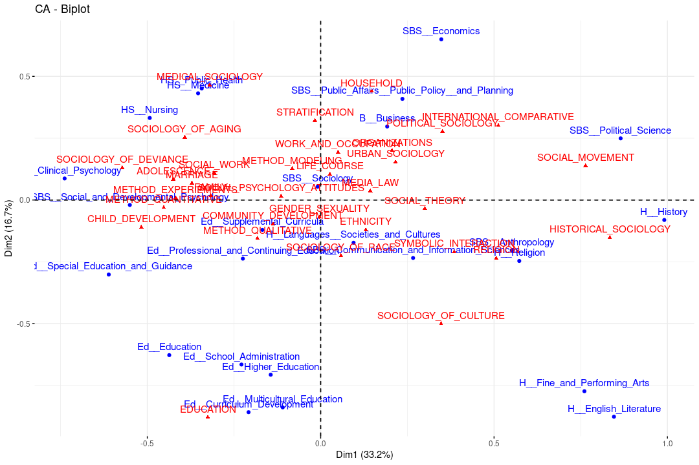<!-- -->

We can change some of the inputs to make it easier to interpret, here
changing the size and color of the labels. We make departments orange
and topics blue.

``` r
fviz_ca_biplot(ca_mod1, col.row="orange", col.col ="steelblue", labelsize=3) +
  theme_minimal()
```

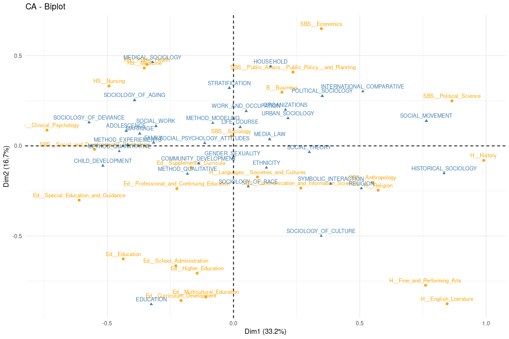<!-- -->

Note that the plot only includes the first two dimensions, and that both
topics and departments are included, with different colors as a means of
differentiating the type of object. Departments are close to topics when
those departments have a high proportion of their students doing those
topics. For example, students in public health, nursing and medicine
tend to take on topics related to medical sociology.

Substantively, what have we learned from the plot? First, we may be
interested in the overall structure of the space, or the latent
dimensions in our two dimensional plot. Looking at the x-axis, we see
the far left is constituted by topics like child development and
deviance and departments like clinical psychology. On the far right, we
see topics like social movements and historical sociology and
departments like political science and history. The left-right continuum
thus runs from micro-level studies of adolescence to macro-level studies
of politics and history. Looking at the y-axis, the bottom includes
topics like culture and education and includes education and humanities
departments. The top is constituted by topics like medical sociology and
stratification and departments like economics and public policy. The
y-axis thus runs (more or less) from culture to stratification/health.
We thus have a two-dimensional space of micro to macro and culture to
stratification.

Second, we may be interested in which topics/departments tend to cluster
together. For example, the top left quadrant includes medical sociology
topics and public health departments. We see sociology of aging close
by, as well as topics related to stratification. We also see that some
departments are closer together than others. Public health is closer to
nursing and public policy than it is to English or history. This means
that the topics that public health students tend to take on are very
different than those in the humanities. It is worth noting that the
college that these departments are affiliated with only sometimes
predicts which department are close together. For example, the
departments in the social behavioral sciences (SBS) are pretty spread
out, all the way from the far left (social and developmental psychology)
to the far right (political science). Thus, political science has more
in common, topic wise, with history (in the humanities) than fellow
social sciences like clinical psychology.

We can also clean the plot up a bit to focus on just the rows or just
the columns. If we wanted to just have the rows on the plot we would use
fviz\_ca\_row (or fviz\_ca\_col for just the columns):

``` r
fviz_ca_row(ca_mod1, col.row="orange", labelsize=3 ) +
  theme_minimal()
```

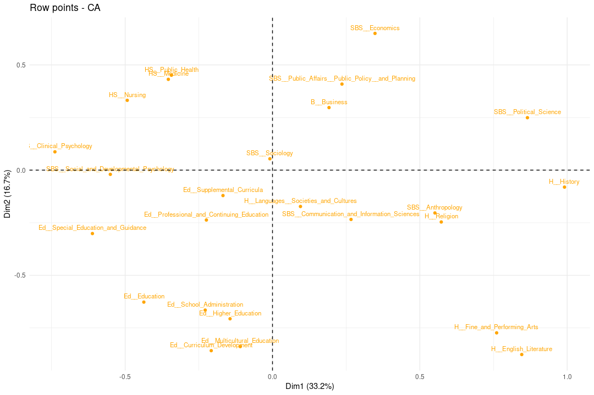<!-- -->

## Choosing the Number of Dimensions

We have so far run an initial correspondence analysis and interpreted
the results. Here we want to take a closer look at the analysis, to make
sure we have the proper set of results. There are a number of issues we
need to consider. First, we need to decide how many dimensions are
sufficient to represent the space. This means we need to decide on the
appropriate number of dimensions to use when interpreting the results.
We need to balance fit (more dimensions) with ease of interpretation and
presentation (fewer dimensions). Remember that the eigenvalues tell us
how much each dimension contributes to explaining the total variance in
the data. So let’s start by looking at the eigenvalues for each
dimension more closely.

``` r
eig = get_eigenvalue(ca_mod1)
eig
```

    ##          eigenvalue variance.percent cumulative.variance.percent
    ## Dim.1  1.332917e-01     33.212926405                    33.21293
    ## Dim.2  6.683516e-02     16.653627519                    49.86655
    ## Dim.3  5.410294e-02     13.481083156                    63.34764
    ## Dim.4  3.185661e-02      7.937859321                    71.28550
    ## Dim.5  2.524612e-02      6.290692990                    77.57619
    ## Dim.6  1.867087e-02      4.652307510                    82.22850
    ## Dim.7  1.368130e-02      3.409034054                    85.63753
    ## Dim.8  1.095477e-02      2.729651666                    88.36718
    ## Dim.9  1.036783e-02      2.583399490                    90.95058
    ## Dim.10 7.408050e-03      1.845898466                    92.79648
    ## Dim.11 6.710398e-03      1.672061276                    94.46854
    ## Dim.12 5.237564e-03      1.305068324                    95.77361
    ## Dim.13 4.471813e-03      1.114262479                    96.88787
    ## Dim.14 3.433716e-03      0.855595118                    97.74347
    ## Dim.15 3.153639e-03      0.785806937                    98.52927
    ## Dim.16 1.680187e-03      0.418660133                    98.94793
    ## Dim.17 1.422663e-03      0.354491571                    99.30243
    ## Dim.18 9.880741e-04      0.246203022                    99.54863
    ## Dim.19 6.808799e-04      0.169658023                    99.71829
    ## Dim.20 6.083445e-04      0.151584047                    99.86987
    ## Dim.21 2.616822e-04      0.065204580                    99.93508
    ## Dim.22 1.465193e-04      0.036508898                    99.97158
    ## Dim.23 8.747367e-05      0.021796222                    99.99338
    ## Dim.24 2.656286e-05      0.006618791                   100.00000

By first inspection, the model would appear to perform okay with a small
number of dimensions, although we may be concerned that the first 2
dimensions only explains about 50% of the variance (looking at column 3,
cumulative.variance.percent). Let’s produce a scree plot to make the
comparisons clearer.

``` r
fviz_screeplot(ca_mod1)
```

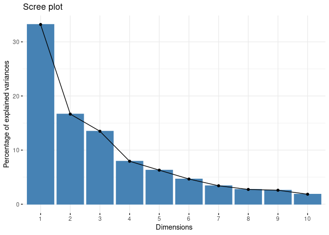<!-- -->

The y-axis shows the percent of total variance explained as we add a
dimension and the x-axis shows the number of dimensions. We can see that
additional variance explained seems to drop off after the third
dimension, so there would appear to be diminishing returns to adding a
fourth, fifth, etc. dimension. We may opt for a 2 or 3 dimensional
solution based on the plot.

Another potentially useful approach is to apply the average rule
heuristic, which chooses the number of dimensions by selecting all
dimensions that explain more than the average dimension. The function is
aver.rule and the input is the raw data (not the CA object).

``` r
aver.rule(department_topic)
```

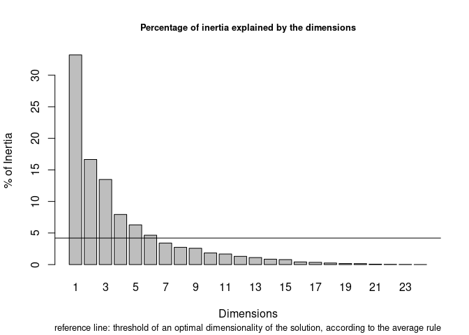<!-- -->

The dashed line indicates the average variance explained and the bars
show the percent variance explained for each dimension. The average rule
would suggest a solution of 6 dimensions. But if we take a closer look
we can see that dimensions 5 and 6 only add around 5% to the explained
variance, a fairly low return on adding an entire dimension to the plot.
So, we may think that the average rule tends to yield solutions with too
many dimensions, at least in this case.

How about Malinvaud’s test? This sequential test checks the significance
of the remaining dimensions once the first k ones have been selected.
The function is malinvaud and the input is the raw data.

``` r
malinvaud(department_topic)
```

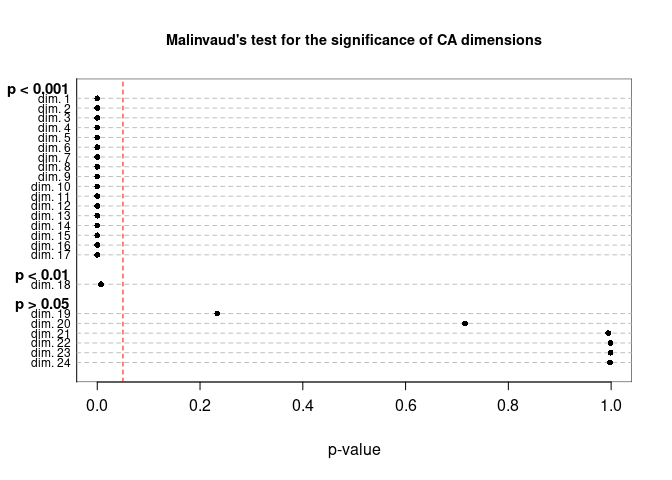<!-- -->

    ##     K Dimension   Eigenvalue   Chi-square  df       p-value   p-class
    ## 1   0    dim. 1 1.332917e-01 20620.073926 768  0.000000e+00 p < 0.001
    ## 2   1    dim. 2 6.683516e-02 13771.543949 713  0.000000e+00 p < 0.001
    ## 3   2    dim. 3 5.410294e-02 10337.553643 660  0.000000e+00 p < 0.001
    ## 4   3    dim. 4 3.185661e-02  7557.744330 609  0.000000e+00 p < 0.001
    ## 5   4    dim. 5 2.524612e-02  5920.951870 560  0.000000e+00 p < 0.001
    ## 6   5    dim. 6 1.867087e-02  4623.806325 513  0.000000e+00 p < 0.001
    ## 7   6    dim. 7 1.368130e-02  3664.497077 468  0.000000e+00 p < 0.001
    ## 8   7    dim. 8 1.095477e-02  2961.551735 425  0.000000e+00 p < 0.001
    ## 9   8    dim. 9 1.036783e-02  2398.695543 384 1.039277e-287 p < 0.001
    ## 10  9   dim. 10 7.408050e-03  1865.996659 345 1.036095e-206 p < 0.001
    ## 11 10   dim. 11 6.710398e-03  1485.371030 308 3.065673e-153 p < 0.001
    ## 12 11   dim. 12 5.237564e-03  1140.590759 273 2.492875e-106 p < 0.001
    ## 13 12   dim. 13 4.471813e-03   871.484706 240  1.658228e-72 p < 0.001
    ## 14 13   dim. 14 3.433716e-03   641.722959 209  1.659357e-45 p < 0.001
    ## 15 14   dim. 15 3.153639e-03   465.298613 180  3.872782e-27 p < 0.001
    ## 16 15   dim. 16 1.680187e-03   303.264642 153  5.705095e-12 p < 0.001
    ## 17 16   dim. 17 1.422663e-03   216.936613 128  1.532274e-06 p < 0.001
    ## 18 17   dim. 18 9.880741e-04   143.840189 105  7.114028e-03  p < 0.01
    ## 19 18   dim. 19 6.808799e-04    93.072944  84  2.335258e-01  p > 0.05
    ## 20 19   dim. 20 6.083445e-04    58.089334  65  7.156535e-01  p > 0.05
    ## 21 20   dim. 21 2.616822e-04    26.832591  48  9.942444e-01  p > 0.05
    ## 22 21   dim. 22 1.465193e-04    13.387359  33  9.990331e-01  p > 0.05
    ## 23 22   dim. 23 8.747367e-05     5.859197  20  9.990747e-01  p > 0.05
    ## 24 23   dim. 24 2.656286e-05     1.364800   9  9.980310e-01  p > 0.05

The last column of the table prints the significance level associated
with that dimension. Lower p-values suggest the (scaled) eigenvalues are
significantly different from 0, an indication that the dimension is
worth including. The results don’t appear to be that informative in this
case, however, as all dimensions up to (but not including) 19 are
significant (assuming a traditional .05 threshold).

Given our results, how many dimensions should we use? In this case the
scree plot probably offers the most useful information, where a 2 or 3
dimensional solution is the most appropriate. Let’s go ahead and take a
look at that third dimension, to see what it adds to the story. Let’s
create a 3-d plot, focusing just on the departments. Let’s first get the
locations of our departments. We can find the locations under row and
then coord of our CA object:

``` r
locs_department= ca_mod1$row$coord
```

Now, we will use a text3D function to plot the departments in three
dimensions. Note that there are a number of packages that will allow for
3d plotting, but here we utilize the functions in the plot3D package.
The text3D function has a number of possible inputs. The main inputs are
x, y z, showing the locations of each label to be plotted. The labels
input shows what should be printed in each location. Here we set the
locations based on the first three dimensions in our CA object and set
the labels to the names of the departments, defined above. The rest of
the inputs control the look and rotation of the plot.

``` r
text3D(x=locs_department[,"Dim 1"], y=locs_department[,"Dim 2"], z=locs_department[,"Dim 3"], 
       labels = department_names, col = "black", theta = 120, phi = 20, 
       xlab = "dim1", ylab = "dim2", zlab = "dim3", axes=T, 
       ticktype="detailed", main = "Departments in 3 Dimensions", 
       cex = 0.75, bty = "g", d = 2, adj = 1, font = 1)
```

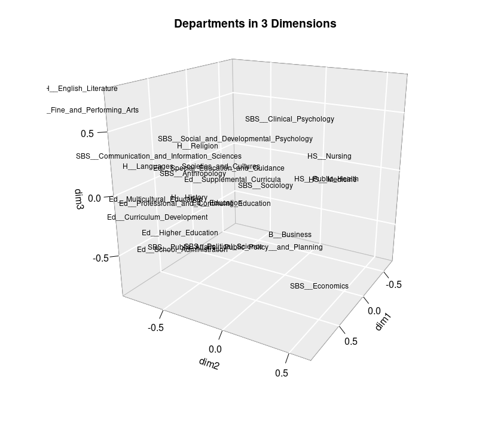<!-- -->

The plot is somewhat hard to read in three dimensions, but if we look at
the third (z) dimension, we can see that on one extreme we have higher
education and administration and on the other end we have English and
performing arts. Thus, dimension 3 basically separates some of the
departments that are close together on dimension 2 (English and higher
education) but unless we really think that distinction is crucial we may
be able to get away with the simpler 2-d plot, especially as those
departments are already pretty different on dimension 1.

## Importance and Position of Specific Rows/Columns (Optional Topic)

So far we have been examining the quality of the whole model. It will
also be useful to assess the specific objects (departments and topics)
in terms of their contribution to the fit for each dimension. This can
help us in interpreting the dimensions of the space, by showing which
rows/columns are most important in fitting a given dimension. Higher
values mean that the row is more important in defining that dimension
(i.e. the locations of other departments are based on the extreme
location of the given department). We can get a handy plot that will
sort from high to low on each dimension. The function is fviv\_contrib.
The inputs are the CA object, the choice (either row or column) and the
axes (i.e., dimension) of interest. Here we plot the contribution of
each row for the first dimension. We also change the size and angle of
the axis labels to make them easier to read (using ggplot functions).

``` r
fviz_contrib(ca_mod1, choice = "row", axes = 1)+
  theme(axis.text.x = element_text(size=8.0, angle=75))
```

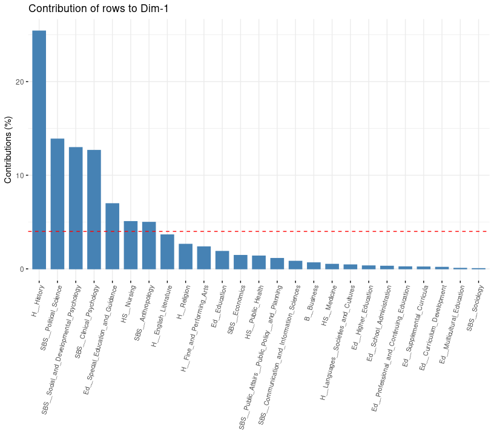<!-- -->

The red line represents the expected value if all rows contributed
equally to the dimension. We can see that the first dimension is defined
primarily by history, political science and the psychology departments.
Rows that contribute a lot to the fit tend to be far from the center on
the dimension of interest; in this case history and political science on
the far right and psychology on the far left. This is consistent with
our interpretation from above. Let’s look at dimension 2:

``` r
fviz_contrib(ca_mod1, choice = "row", axes = 2)+
    theme(axis.text.x = element_text(size=8.0, angle=75)) 
```

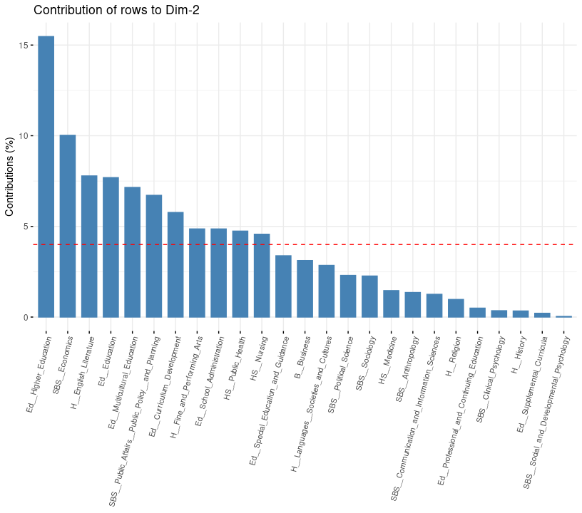<!-- -->

And the same thing for the columns:

``` r
fviz_contrib(ca_mod1, choice = "col", axes = 1)+
  theme(axis.text.x = element_text(size=8.0, angle=75)) 
```

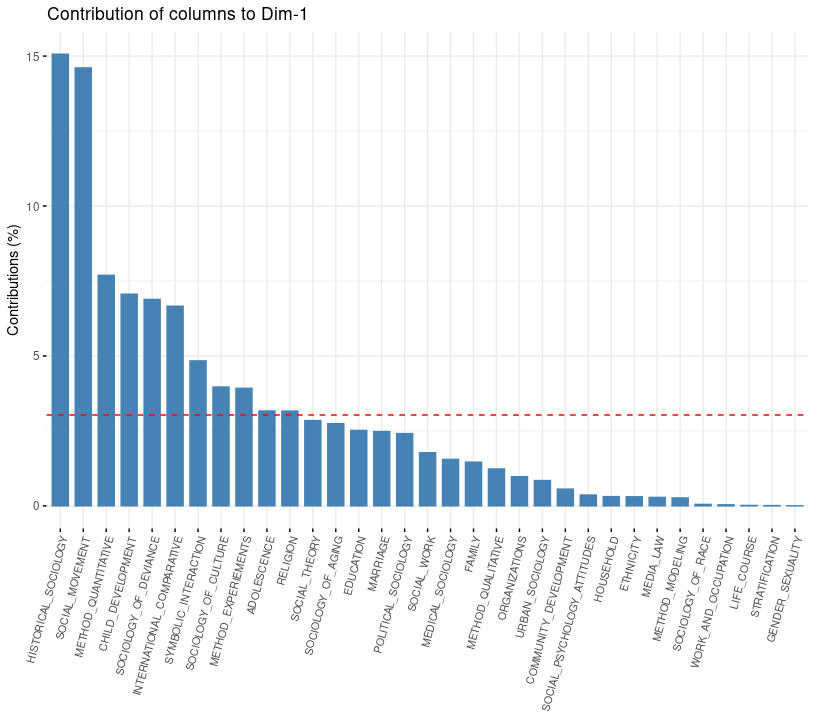<!-- -->

``` r
fviz_contrib(ca_mod1, choice = "col", axes = 2)+
  theme(axis.text.x = element_text(size=8.0, angle=75)) 
```

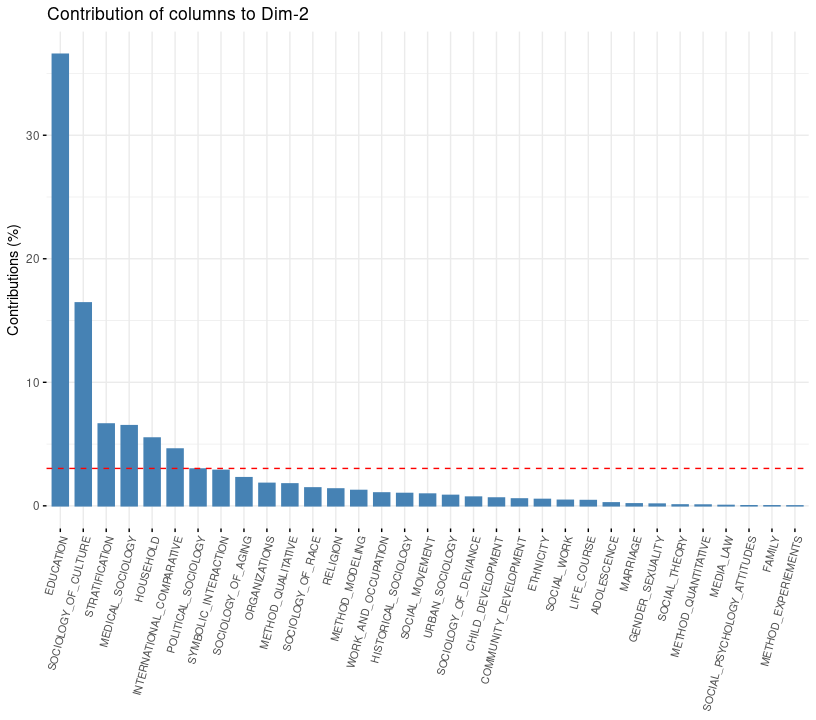<!-- -->

Let’s plot the 2-dimensional solution again, but shade the labels by the
contribution to the overall fit (summed over the first two dimensions).
This is accomplished by setting col.row and col.col to “contrib”. We
also include a scale\_color\_gradient function to set how the color
scale should look.

``` r
fviz_ca_biplot(ca_mod1, col.row="contrib", col.col ="contrib", labelsize=3) +
  scale_color_gradient2(low="white", mid="steelblue", high="darkblue", midpoint=8) +
  theme_minimal()
```

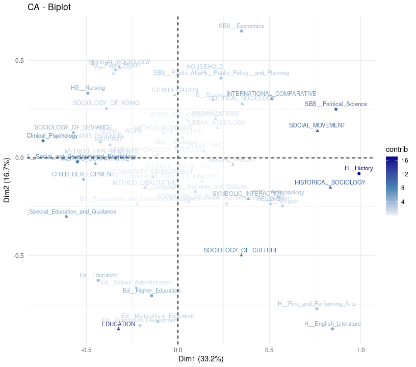<!-- -->

Looking at our figure, it is worth thinking about what it means to be in
the center of the plot compared to the extremes on one of the
dimensions. For example, sociology (department) and life course (topic)
are in the center, while political science and social movements are not.
This would suggest that sociology PhDs tend to take on dissertations
that span many of the topics in the field. Similarly, this means that
individuals from a wide variety of disciplines study life course. On the
other hand, social movements is not studied by a wide variety of
departments while those in political science tend not to study a large
number of (sociological) topics, focused mainly on social movements. We
thus have distinctions between central, generalist departments/topics
and those that occupy more peripheral, niche locations.

## Hierarchical Clustering

To aid in interpretation, it may be useful to cluster the departments
and topics into distinct, structurally equivalent sets, where
departments (or topics) that are close together in the space are placed
in the same cluster (they are structurally equivalent in the sense of
having the same pattern of topics). This can make it easier to talk
through the results, as we can start to identify particular regions of
the space, and not just the dimensions making up the space. Here we will
make use of hierarchical clustering (see also Ch 10). We begin by
calculating the distance matrix between objects, both topics and
departments, based on the locations from the two dimensional solution.
Let’s first put locations for the departments and topics together into
one data frame. We already have the locations for the departments, so
let’s just grab the locations for the topics:

``` r
locs_topic= ca_mod1$col$coord
```

And now we stack them with the locations of the departments using a
rbind command:

``` r
locs=rbind(locs_department, locs_topic)
```

We just want the locations for the first two dimensions, so let’s subset
the data.

``` r
locs=locs[,1:2]
```

And now we create the distance matrix using the dist command, setting
the method to Euclidean. We will then fit a hierarchal clustering model
to the distance matrix using hclust:

``` r
d = dist(locs, method = "euclidean") 
fit = hclust(d, method="ward.D") 
```

We need to pick an optimal number of clusters before we can interpret
the results. As in Ch 10, we can make use of the functions in the
NbClust package to help us make a choice. The function is NbClust. In
this case we just include the distance matrix as the main inputs. We set
distance to NULL and tell R to use the silhouette index as the criterion
(there are a number of other choices we could have made).

``` r
clusters=NbClust(data=NULL, diss=d, distance = NULL, method="ward.D", index=c("silhouette"))  
```

``` r
clusters$Best.nc
```

    ## Number_clusters     Value_Index 
    ##          8.0000          0.4401

Under this criterion the optimal solution has 8 clusters. The specific
clusters can be found under:

``` r
head(clusters$Best.partition)  
```

    ##                           SBS__Sociology 
    ##                                        1 
    ##     H__Languages__Societies_and_Cultures 
    ##                                        1 
    ## SBS__Social_and_Developmental_Psychology 
    ##                                        2 
    ##                               H__History 
    ##                                        3 
    ##                 SBS__Clinical_Psychology 
    ##                                        2 
    ##                              HS__Nursing 
    ##                                        4

Note that both the topics and the departments are included in the same
cluster, so it is a simultaneous clustering of rows/columns. Let’s name
the clusters in a useful way for the plot. Here we add the word cluster
before the cluster number using a paste command.

``` r
cluster_names=paste("cluster", clusters$Best.partition, sep="") 
```

And let’s also put the department/topic names on the vector of clusters
so we know what each value corresponds to.

``` r
names(cluster_names)=names(clusters$Best.partition)
head(cluster_names)
```

    ##                           SBS__Sociology 
    ##                               "cluster1" 
    ##     H__Languages__Societies_and_Cultures 
    ##                               "cluster1" 
    ## SBS__Social_and_Developmental_Psychology 
    ##                               "cluster2" 
    ##                               H__History 
    ##                               "cluster3" 
    ##                 SBS__Clinical_Psychology 
    ##                               "cluster2" 
    ##                              HS__Nursing 
    ##                               "cluster4"

And finally, let’s split those out by rows and columns.

``` r
row_clusters=cluster_names[department_names]
col_clusters=cluster_names[topic_names]
```

Now, let’s go back and redo our 2-d plot but color the departments and
topics by cluster.

``` r
fviz_ca_biplot(ca_mod1, col.row=row_clusters, col.col =col_clusters, labelsize=3) +
  theme_minimal()
```

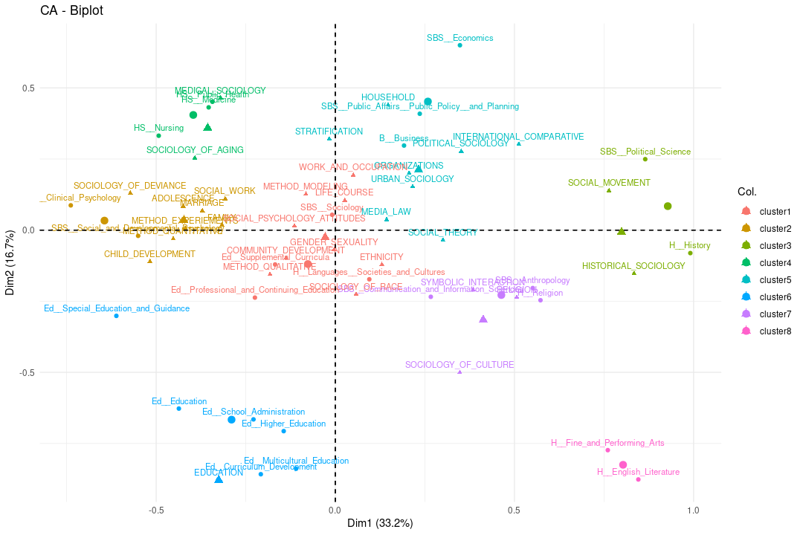<!-- -->

Our first impression is that the clusters align pretty well with the
spatial layout. There are a few exceptions, where the department or
topic is hard to fit (e.g., social theory or special education) but, on
the whole, the clusters capture distinct regions of the larger field. We
see an education cluster, a health cluster, a culture cluster, a
psychology cluster and so on. In this way, we have two main dimensions
(micro to macro; culture to stratification) but distinct regions (or
niches) carved out within the larger space. These niches are constituted
by both topic and department, so that a health cluster (cluster 4) is
not merely the topic studied, but institutionally, the departments that
tend to study it. Most illuminating from the cluster analysis, perhaps,
is that the center of the figure splits into 2 clusters, divided between
sets of ‘core’ sociology topics: first, we have a cluster including
topics like gender and race/ethnicity (cluster 1); and second, we have a
cluster containing topics like stratification and organizations (cluster
5).

Note that clustering objects in a joint space is somewhat disputed since
the distance between row and column objects does not have a clear
statistical interpretation (i.e., might not be Euclidian). Empirical
tests support joint clustering, but it may be preferred to cluster the
rows and columns separately. Here we can rely on the functions from the
FactoMiner package. We will start by rerunning the correspondence
analysis but set ncp to 2 (indicating that only the first 2 dimensions
will be retained in the output). We do this to be consistent with the
hierarchical clustering analysis done above.

``` r
ca_mod2 = CA(department_topic, ncp=2, graph= FALSE)
```

We will now use a HCPC function to cluster the departments and topics.
In this analysis we will do this separately. We include the CA object as
the main input. The nb.clust input sets the number of clusters. Here we
will set it at 8 to match the analysis above. We could also allow R to
find the optimal number of clusters (by setting nb.clust=-1). We also
tell R not to plot the results (the default). We set cluster.CA to
“rows” to do the rows only.

``` r
clust_rows = HCPC(ca_mod2, nb.clust=8,  graph=FALSE, cluster.CA="rows")
```

And now for the columns:

``` r
clust_cols = HCPC(ca_mod2, nb.clust=8,  graph=FALSE, cluster.CA="columns")
```

Now we plot the correspondence analysis and color the departments by the
found cluster. We set choice to “map” to get the factor map (based on
the correspondence analysis). We set draw.tree to FALSE as we do not
want to plot the hierarchical tree structure.

``` r
plot(clust_rows, choice="map", draw.tree=FALSE)
```

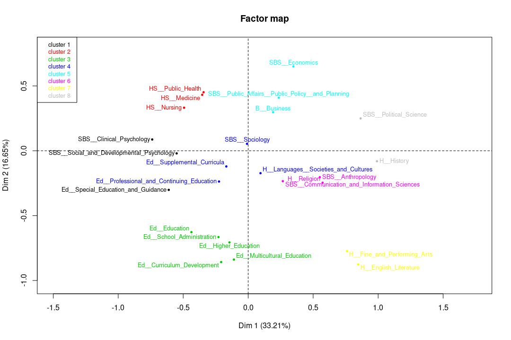<!-- -->

It looks pretty similar to what we had before, but it is not exactly the
same. We can check this by doing a table on the clusters found above
(row\_clusters) and the clusters found here. We need to make sure that
the departments are in the same order as above, so the table is
meaningful. Here we grab the clust variable and sort by
department\_names, before calculating our table.

``` r
row_clusters2=clust_rows$data[department_names,"clust"] 
table(row_clusters,  row_clusters2)
```

    ##             row_clusters2
    ## row_clusters 1 2 3 4 5 6 7 8
    ##     cluster1 0 0 0 4 0 0 0 0
    ##     cluster2 2 0 0 0 0 0 0 0
    ##     cluster3 0 0 0 0 0 0 0 2
    ##     cluster4 0 3 0 0 0 0 0 0
    ##     cluster5 0 0 0 0 3 0 0 0
    ##     cluster6 1 0 5 0 0 0 0 0
    ##     cluster7 0 0 0 0 0 3 0 0
    ##     cluster8 0 0 0 0 0 0 2 0

We can see that while the labels are different, the departments are
placed together in the same way (e.g., cluster 1 is now cluster 4 but
the departments are the same). The only difference turns out to be the
special education department (easy to see from the two plots), which we
noted was difficult to place. Overall, the results are almost identical
between the two clustering solutions, so we can pretty confident in our
results. We can also plot the column results.

``` r
plot(clust_cols, choice="map", draw.tree=FALSE)
```

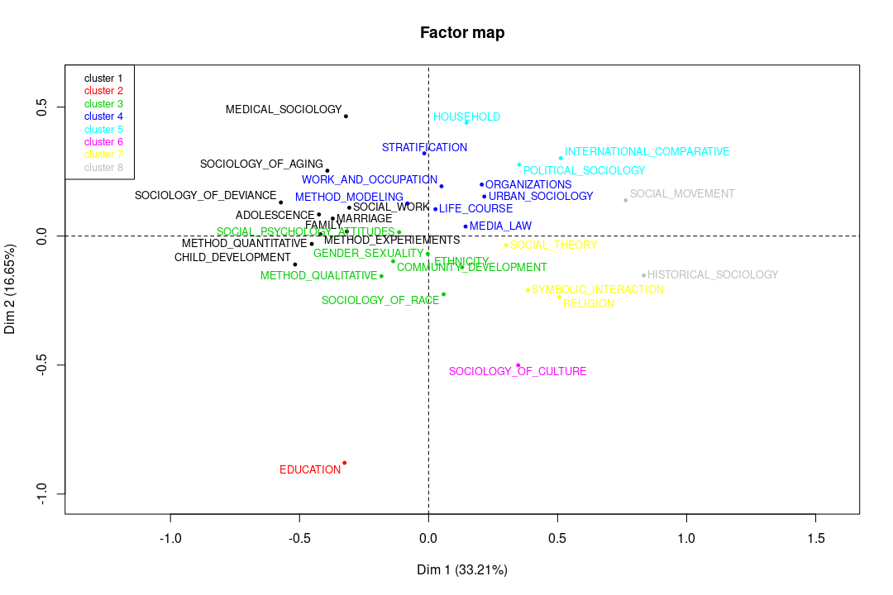<!-- -->

In the end, we have a holistic representation of an academic field, here
based on topics and departments, that can serve as a useful way of
analyzing non-network data in a way that is consistent with network
ideas. These kinds of analyses push us beyond what we may traditionally
think of as the purview of network analysis (actors and the
relationships between them) but the ideas of duality, niches, and
position are widely applicable, offering important alternatives to
traditional regression frameworks.
