ERGMs
================
Saurabh Khanna
2020-05-14

# Chapter 13: R Tutorial on Statistical Network Models for Cross-Sectional Network Data

Built with R version 3.6.3

This tutorial offers an extended example in R demonstrating how to
analyze networks using statistical models. We will focus on
exponential-family random graph models (ERGMs). ERGMs are useful as they
make it possible to uncover what micro tendencies are important in
network formation, comparing rates of reciprocity, homophily (for
example) net of other network processes. The tutorial will draw on many
of the previous tutorials, most directly the tutorials on dyads/triads
(Chapter 7) and centrality/hierarchy (Chapter 9). The goals of the
tutorial are to get acquainted with: model fitting, interpretation,
diagnostics, model comparison, and simulating from a known model. We
will offer two examples, one based on a small school-based network, and
one based on a much larger coauthorship network. Both examples are based
on cross-sectional network data (so one time point). We will consider
dynamic extensions to the ERGM framework in the second tutorial for
Chapter 13. We will cover relational event models in the third tutorial,
appropriate for continuous-time network data.

### 1\. Setting up the Session

We will utilize a small school-based network for the first part of the
ERGM tutorial. Our main question is what micro-level processes are
important for the formation of the network. In particular, we want to
explore some of the processes around gender and grade. For example, do
boys tend to have more friends than girls? Is gender homophily a strong
driver of tie formation? Is gender homophily stronger than grade
homophily? How does controlling for other micro tendencies, like
reciprocity and transitive closure, change our conclusions?

First, let’s load the necessary packages.

``` r
library(ergm)
library(sna)
library(car)
```

Note that the ergm package uses network objects consistent with the
network package. We can cite ergm as: Hunter D, Handcock M, Butts C,
Goodreau S, Morris M (2008). “ergm: A Package to Fit, Simulate and
Diagnose Exponential-Family Models for Networks.” Journal of Statistical
Software, 24(3), 1-29. It is also useful to have latticeExtra package
installed.

Now, let’s read in our example network data representing a high school
friendship network. The network data are saved as an adjacency
matrix:

``` r
school_mat=read.csv("https://sites.google.com/site/jeffreysmithdatafiles/example_schoolmat.csv", row.names=1) 
```

Note that we have added a row.names=1 option to tell R that the first
column should be used to set the row names. Let’s turn that data frame
into a matrix.

``` r
school_mat=as.matrix(school_mat)
```

And now let’s take look at the matrix (just the first five rows and
columns). A 1 indicates that person i named person j as a friend.

``` r
school_mat[1:5, 1:5] 
```

    ##     id1 id2 id3 id4 id5
    ## id1   0   0   0   0   0
    ## id2   0   0   0   0   0
    ## id3   0   0   0   0   0
    ## id4   0   0   0   0   0
    ## id5   0   0   0   0   0

Now, we will read in the attribute file, containing nodal
characteristics, including gender, grade and
ses.

``` r
school_attributes=read.csv("https://sites.google.com/site/jeffreysmithdatafiles/example_schooldata.csv") 

head(school_attributes)
```

    ##   ids gender grade ses
    ## 1   1      1    12   7
    ## 2   2      1    10   7
    ## 3   3      0     8  10
    ## 4   4      0    11   9
    ## 5   5      1     7  10
    ## 6   6      1    10   9

Let’s make it easier to interpret the gender variable. Let’s recode the
0s and 1s into male and female using a recode command.

``` r
school_attributes$gender_recode=recode(school_attributes$gender,
                                       as.factor=F, 
                                       "c(0)='male'; c(1)='female'")
head(school_attributes)
```

    ##   ids gender grade ses gender_recode
    ## 1   1      1    12   7        female
    ## 2   2      1    10   7        female
    ## 3   3      0     8  10          male
    ## 4   4      0    11   9          male
    ## 5   5      1     7  10        female
    ## 6   6      1    10   9        female

Let’s construct a network object and put the attributes onto the
network. First, we need to create a list of attributes based on our
attribute data frame.

``` r
attribute_list=do.call(list, school_attributes) 
attribute_list
```

    ## $ids
    ##  [1]  1  2  3  4  5  6  7  8  9 10 11 12 13 14 15 16 17 18 19 20 21 22 23 24 25 26 27 28 29 30 31 32
    ## 
    ## $gender
    ##  [1] 1 1 0 0 1 1 0 1 1 0 0 0 1 1 1 1 0 1 0 0 1 0 0 0 0 1 1 1 0 0 1 0
    ## 
    ## $grade
    ##  [1] 12 10  8 11  7 10  8  9 12 11 10  7  7 12 11  9  9  8  7  9  7 11 12 12 11  9 10 10 12  8  7  7
    ## 
    ## $ses
    ##  [1]  7  7 10  9 10  9 10  7  7  7 10 10  9  6  3  6  6  9  9  4  9  3  9  8  6  9  9  9  9  9  6  7
    ## 
    ## $gender_recode
    ##  [1] "female" "female" "male"   "male"   "female" "female" "male"   "female" "female" "male"   "male"   "male"   "female" "female" "female" "female" "male"   "female" "male"   "male"   "female" "male"   "male"   "male"   "male"   "female" "female" "female" "male"   "male"   "female" "male"

Now we create the network based on the matrix and attribute list. We set
the network as
directed.

``` r
school_net=network(x=school_mat, directed=T, vertex.attr=attribute_list) 

school_net
```

    ##  Network attributes:
    ##   vertices = 32 
    ##   directed = TRUE 
    ##   hyper = FALSE 
    ##   loops = FALSE 
    ##   multiple = FALSE 
    ##   bipartite = FALSE 
    ##   total edges= 124 
    ##     missing edges= 0 
    ##     non-missing edges= 124 
    ## 
    ##  Vertex attribute names: 
    ##     gender gender_recode grade ids ses vertex.names 
    ## 
    ## No edge attributes

### 2\. Descriptive Statistics and Plots

Before we go ahead and try to fit an exponential random graph model, it
will be useful to know a bit about the network in question. Here we will
plot the network and calculate basic network statistics.

``` r
plot(school_net)
```

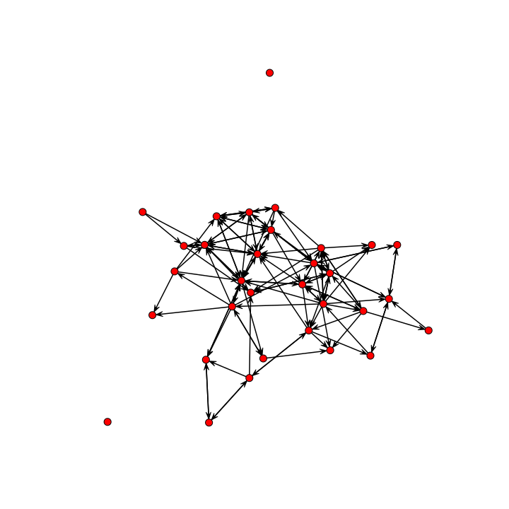<!-- -->

One main question is how gender and grade shape the formation of ties in
the network. So, let’s look at the network but color the nodes by gender
and then by grade. Let’s color the nodes by gender, blue for boys and
pink for
girls:

``` r
cols=recode(school_attributes$gender, as.factor=F, "c(0)='blue'; c(1)='pink'")
```

We will now use the cols vector in our plot statement (using the default
plot function in the network package).

``` r
plot(school_net, vertex.col=cols) 
```

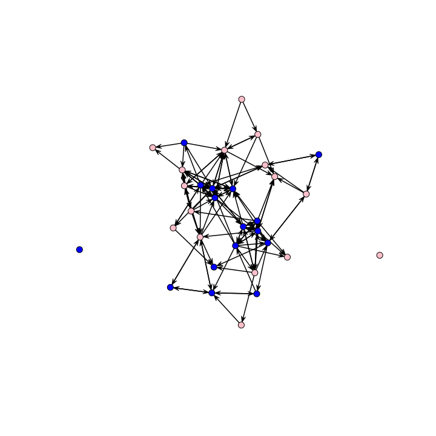<!-- -->

It looks like there is moderate homophily along gender lines. What about
grade?

``` r
plot(school_net, vertex.col=school_attributes$grade) 
```

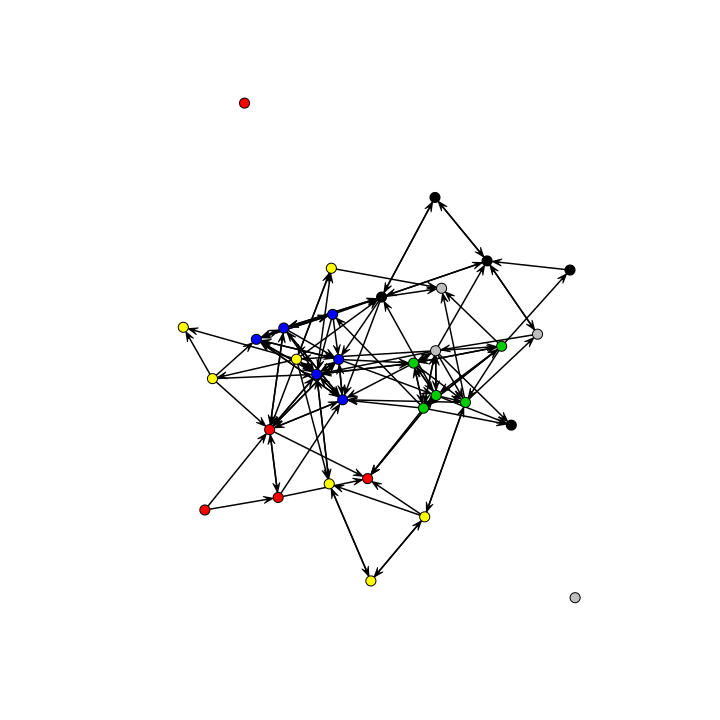<!-- -->

We see pretty clear social divisions by grade. It is also useful to know
a bit about indegree and outdegree, seeing which groups (if any) are
particularly likely to have high degree. Let’s calculate indegree and
outdegree for the network:

``` r
outdegree=degree(school_net, cmode="outdegree")
indegree=degree(school_net, cmode="indegree")
```

Let’s see if boys or girls have higher degree. We will check this by
calculating mean indegree by gender. We can use a tapply statement, with
indegree as the first input, gender as the second, and the function
(here mean) as the third.

``` r
tapply(indegree, school_attributes$gender_recode, mean) 
```

    ## female   male 
    ##   3.25   4.50

Here we calculate the same thing for outdegree.

``` r
tapply(outdegree, school_attributes$gender_recode, mean) 
```

    ## female   male 
    ##  3.125  4.625

It looks like boys receive and send out more ties than girls.

### 3\. Simple Statistical Tests (Conditional Uniform Graph Tests)

We now turn to some simple statistical tests about the features of the
network. This will give us useful information about the network, setting
our base expectations before running the full model below. Here we will
focus on Conditional Uniform Graph Tests (CUG test). See also Chapter 7.

We begin by calculating the features of interest, like reciprocity or
transitivity. We will then compare the observed statistic with the
values that one would see in a random network of the same size (and
possibly other constraints). As a researcher, you specify the baseline
model of interest, specifying how to construct the random network. This
sets the comparison of interest, effectively holding certain desired
features constant and allowing others to vary randomly. The question is
whether the observed statistic is above/below (or similar to) what one
would expect by chance. Let’s walk through a few examples to get a sense
of the features of our network and how this compares to a random
network. First, let’s calculate density on the network.

``` r
gden(school_net) 
```

    ## [1] 0.125

We can see that .125 of all possible ties exist. Now, let’s compare the
observed density to what we are likely to see in a random network of the
same size (i.e., if we took a network of the same size and just started
randomly forming ties with probability .5, what would the density look
like?). Here, we will run the CUG test with the function of interest set
to “gden”, calculating density. The conditioning is set to “size”,
holding size constant at the true network size. Everything else is
allowed to vary randomly. We set dat to our network of interest.

``` r
cug.test(dat=school_net, FUN="gden", cmode="size") 
```

    ## 
    ## Univariate Conditional Uniform Graph Test
    ## 
    ## Conditioning Method: size 
    ## Graph Type: digraph 
    ## Diagonal Used: FALSE 
    ## Replications: 1000 
    ## 
    ## Observed Value: 0.125 
    ## Pr(X>=Obs): 1 
    ## Pr(X<=Obs): 0

The results clearly show that the density of .125 is well below what we
would expect in a random network of size 32. This shouldn’t be
surprising however, as people have a limited capacity to form ties and
the number of possible ties increases non-linearly as size goes up.
Density thus tends to decrease non-linearly as system size increases.

Now, let’s do something a little more interesting and look at the rate
of reciprocity. Reciprocity captures how often i is tied to j when j is
tied to i. Here, we will condition the randomly generated networks on
density. The question is thus: is the observed rate of reciprocity
higher/lower than what we would expect in a network of the same size and
number of edges, but where the edges are formed randomly? First, let’s
calculate reciprocity on the observed network, not including the null
dyads in the calculation.

``` r
grecip(school_net, measure="dyadic.nonnull")
```

    ##       Mut 
    ## 0.4090909

This says that about 41% of the non-null dyads are reciprocated (where
i-\>j and j-\>i). And now we will run a CUG test. Here the function of
interest is grecip, calculating reciprocity; the input to the function
is measure, set to “dyadic.nonnull”. This is passed to grecip via the
FUN.args option. cmode is set to “edges” to condition the random graphs
on density.

``` r
cug.test(dat=school_net, FUN="grecip", 
         FUN.args=list(measure="dyadic.nonnull"), cmode="edges") 
```

    ## 
    ## Univariate Conditional Uniform Graph Test
    ## 
    ## Conditioning Method: edges 
    ## Graph Type: digraph 
    ## Diagonal Used: FALSE 
    ## Replications: 1000 
    ## 
    ## Observed Value: 0.4090909 
    ## Pr(X>=Obs): 0 
    ## Pr(X<=Obs): 1

The results suggest that the reciprocity rate, .409, is above what we
would expect in a network of the same size and number of edges but
otherwise random ties. We can see this as the probability of finding a
randomly generated value higher than the observed value is 0. This would
suggest that reciprocity is an important micro process shaping the
formation of ties. We can do similar analyses with transitivity (or
other statistics), constraining the randomly formed networks to make
useful comparisons. For example, it may be useful to ask if the rate of
transitivity is higher than what we would expect in a network with the
same dyad census, showing if there are triadic effects (if i is friends
with j and j is friends with k, is i friends with k?), above what can be
induced by dyadic processes (i.e., reciprocity).

### 4\. Fitting an Exponential Random Graph Model to the School Network

We have so far learned a bit about our network. We know there is strong
grade homophily and weaker gender homophily. We know that boys tend to
give and receive more ties than girls. We also know that there are
likely norms around reciprocating friendship. We now want to consider
these micro-processes together, to see (in a systematic way) how
important each factor is in predicting the existence of a tie, net of
the other network processes. We saw a very simple version of this above
with the CUG test (looking at the rate of reciprocity net of density)
but we want to consider a number of factors together. We also want to
see how these factors work together to generate the larger features of
the network, like distance, thus linking the micro-processes to the
emergent, global features of the network.

An exponential random graph model allows us to take the network as the
item of interest. The model predicts the presence/absence of a tie
between all i-j pairs as a function of different network features, like
reciprocity and homophily (on gender for example). It is useful to think
of the terms added to the model in terms of dependencies. By including a
term for reciprocity (for example), one is claiming that the existence
of the i-\>j tie is dependent on whether or not j-\>i exists. We can
apply similar logic to other terms, where different terms correspond to
different arguments about what the formation of the i-\>j tie is (or is
not) dependent on.

Before we actually fit any ERGMs, it will be useful to look at some of
the help files for the main functions: `?ergm`, `?'ergm-terms'`,
`?mcmc.diagnostics`, `?gof`.

The function to actually run the model is ergm. There are a large number
of possible inputs to ergm. We focus on the main ones here:

  - formula=a formula object with network on the left followed by a ~
    and then the set of terms we want to include in the model.
  - control=list of options used in the algorithm, like sample size and
    burnin. The inputs are set via a control.ergm function.
  - constraints=a formula dictating if there should be any constraints
    on the networks generated in the MCMC sample (used to estimate the
    parameters). This can be useful when certain networks are impossible
    (i.e., because the survey constrained the number of friends the
    respondents could name). For example: `constraints=~bd(maxout=10)`
    would only consider networks where the max outdegree is 10 or less.

#### 4.1 Edges Only

We will start simple and run an ERGM with only edges as a predictor. We
thus predict the school network as a function of the number of edges in
the network and nothing else.

``` r
mod_rand=ergm(formula=school_net ~ edges) 
```

Let’s take a look at the model results.

``` r
summary(mod_rand) 
```

    ## 
    ## ==========================
    ## Summary of model fit
    ## ==========================
    ## 
    ## Formula:   school_net ~ edges
    ## 
    ## Iterations:  5 out of 20 
    ## 
    ## Monte Carlo MLE Results:
    ##       Estimate Std. Error MCMC % z value Pr(>|z|)    
    ## edges   -1.946      0.096      0  -20.27   <1e-04 ***
    ## ---
    ## Signif. codes:  0 '***' 0.001 '**' 0.01 '*' 0.05 '.' 0.1 ' ' 1
    ## 
    ##      Null Deviance: 1375.2  on 992  degrees of freedom
    ##  Residual Deviance:  747.5  on 991  degrees of freedom
    ##  
    ## AIC: 749.5    BIC: 754.4    (Smaller is better.)

The interpretation of the model coefficients is straightforward in this
case. The log-odds of any tie existing is -1.946. The probability of any
tie existing is: exp(-1.946)/(1+exp(-1.946))=.125, which is just the
density. Note that if we do a summary on the ergm formula, we get the
counts for each network statistic in the observed network.

``` r
summary(school_net~edges) 
```

    ## edges 
    ##   124

We see here that there are 124 edges in the observed network.

#### 4.2 Edges and Homophily

We know that homophily matters from the plots, so let’s add nodematch
terms for gender and grade. The nodematch terms count the number of
times that an edge exists where i and j have the same attribute (here
gender or grade).

``` r
mod_homoph1=ergm(school_net ~ edges + nodematch("gender_recode") + 
                     nodematch("grade")) 

summary(mod_homoph1)
```

    ## 
    ## ==========================
    ## Summary of model fit
    ## ==========================
    ## 
    ## Formula:   school_net ~ edges + nodematch("gender_recode") + nodematch("grade")
    ## 
    ## Iterations:  6 out of 20 
    ## 
    ## Monte Carlo MLE Results:
    ##                         Estimate Std. Error MCMC % z value Pr(>|z|)    
    ## edges                    -2.6140     0.1703      0 -15.351   <1e-04 ***
    ## nodematch.gender_recode   0.1137     0.2086      0   0.545    0.586    
    ## nodematch.grade           2.3088     0.2144      0  10.769   <1e-04 ***
    ## ---
    ## Signif. codes:  0 '***' 0.001 '**' 0.01 '*' 0.05 '.' 0.1 ' ' 1
    ## 
    ##      Null Deviance: 1375.2  on 992  degrees of freedom
    ##  Residual Deviance:  635.7  on 989  degrees of freedom
    ##  
    ## AIC: 641.7    BIC: 656.4    (Smaller is better.)

The results suggest that there is strong homophily on grade, well above
that expected by chance (conditioned on density and homophily on
gender). Grade thus appears to be an important factor in the formation
of ties in the network. The nodematch term on gender is not significant,
suggesting that the number of edges that match on gender is not clearly
above what we would expect in a random network of the same size
(conditioned on the other terms in the model, including density).

Let’s interpret our grade nodematch coefficient. For a tie between two
nodes that match on grade and mismatch on gender the conditional
log-odds is: `-2.6140+.1137*0+2.3088*1`=-.3052. The probability of a tie
is: `exp(-.3052)/(1+exp(-.3052))`=.424. For a tie between two nodes that
mismatch on grade and mismatch on gender the conditional log-odds is:
`-2.6140+.1137*0+2.3088*0`=-2.6140. The probability of a tie is:
`exp(-2.6140)/(1+exp(-2.6140))`=.068. We can see that the probability of
a tie goes down substantially when the two nodes are not in the same
grade. In terms of odds ratios, we can say that the odds of a tie
existing is `exp(2.3088)`=10.06 times higher if the nodes match on grade
than if they differ on grade, net of the other terms in the model.

#### 4.3 Edges, Homophily, and Node Covariates

We can ask related questions about gender and grade by adding terms to
the model that show if boys (compared to girls) send out and/or receive
more ties. We will add nodeifactor terms and nodeofactor terms for
gender. nodeifactor captures the ties coming in and nodeofactor captures
the ties going out. The terms capture if the mean number of ties coming
in or going out is higher for boys than girls. We can add analogous
terms for grade using nodeicov and nodeocov. Nodecov terms are
appropriate for continuous variables, rather than factors.

``` r
mod_homoph2=ergm(school_net ~ edges + nodematch("gender_recode") + 
                     nodematch("grade") + nodeifactor("gender_recode") + 
                     nodeofactor("gender_recode") +
                     nodeicov("grade") + nodeocov("grade"))

summary(mod_homoph2) 
```

    ## 
    ## ==========================
    ## Summary of model fit
    ## ==========================
    ## 
    ## Formula:   school_net ~ edges + nodematch("gender_recode") + nodematch("grade") + 
    ##     nodeifactor("gender_recode") + nodeofactor("gender_recode") + 
    ##     nodeicov("grade") + nodeocov("grade")
    ## 
    ## Iterations:  4 out of 20 
    ## 
    ## Monte Carlo MLE Results:
    ##                                Estimate Std. Error MCMC % z value Pr(>|z|)    
    ## edges                          -7.54896    0.82637      0  -9.135   <1e-04 ***
    ## nodematch.gender_recode         0.03797    0.22294      0   0.170   0.8648    
    ## nodematch.grade                 2.49128    0.23497      0  10.603   <1e-04 ***
    ## nodeifactor.gender_recode.male  0.45209    0.22428      0   2.016   0.0438 *  
    ## nodeofactor.gender_recode.male  0.55980    0.22467      0   2.492   0.0127 *  
    ## nodeicov.grade                  0.26617    0.06388      0   4.167   <1e-04 ***
    ## nodeocov.grade                  0.18685    0.06275      0   2.978   0.0029 ** 
    ## ---
    ## Signif. codes:  0 '***' 0.001 '**' 0.01 '*' 0.05 '.' 0.1 ' ' 1
    ## 
    ##      Null Deviance: 1375.2  on 992  degrees of freedom
    ##  Residual Deviance:  586.6  on 985  degrees of freedom
    ##  
    ## AIC: 600.6    BIC: 634.9    (Smaller is better.)

It looks like individuals who are male are more likely to send and
receive friendship nominations, net of the other terms in the model. The
results also suggest that individuals in higher grades tend to receive
and send more ties while forming strong boundaries around grade (looking
at the nodematch term on grade).

##### 4.4 Edges, Homophily, Node Covariates, and Reciprocity

Now, let’s go ahead and make a more complicated model, one that
incorporates reciprocity. We will do this by adding a mutual term to the
model. The mutual term counts the number of pairs where i-\>j and j-\>i
exist. Note that by adding mutual to the model the model will now be fit
using MCMC
techniques.

``` r
mod_homoph_mutual1=ergm(school_net ~ edges + nodematch("gender_recode") +
                            nodematch("grade") + nodeifactor("gender_recode") +
                            nodeofactor("gender_recode") + nodeicov("grade") +
                            nodeocov("grade") + mutual) 
```

Note that in the R console there we will be added output telling you
what the algorithm is doing, although we suppress this here. And now we
do a quick summary on the model results.

``` r
summary(mod_homoph_mutual1)
```

    ## 
    ## ==========================
    ## Summary of model fit
    ## ==========================
    ## 
    ## Formula:   school_net ~ edges + nodematch("gender_recode") + nodematch("grade") + 
    ##     nodeifactor("gender_recode") + nodeofactor("gender_recode") + 
    ##     nodeicov("grade") + nodeocov("grade") + mutual
    ## 
    ## Iterations:  2 out of 20 
    ## 
    ## Monte Carlo MLE Results:
    ##                                Estimate Std. Error MCMC % z value Pr(>|z|)    
    ## edges                          -6.49042    0.70547      0  -9.200  < 1e-04 ***
    ## nodematch.gender_recode         0.02364    0.18990      0   0.124  0.90095    
    ## nodematch.grade                 1.75221    0.21943      0   7.985  < 1e-04 ***
    ## nodeifactor.gender_recode.male  0.28054    0.23764      0   1.181  0.23780    
    ## nodeofactor.gender_recode.male  0.45488    0.23515      0   1.934  0.05306 .  
    ## nodeicov.grade                  0.21659    0.06894      0   3.142  0.00168 ** 
    ## nodeocov.grade                  0.10304    0.06779      0   1.520  0.12852    
    ## mutual                          2.35045    0.37300      0   6.302  < 1e-04 ***
    ## ---
    ## Signif. codes:  0 '***' 0.001 '**' 0.01 '*' 0.05 '.' 0.1 ' ' 1
    ## 
    ##      Null Deviance: 1375.2  on 992  degrees of freedom
    ##  Residual Deviance:  547.1  on 984  degrees of freedom
    ##  
    ## AIC: 563.1    BIC: 602.3    (Smaller is better.)

##### 4.4.1 Checking Model Convergence

Our model is now being estimated via MCMC sampling. It is important to
make sure that the algorithm converged, so that the sampled networks
(which the estimates are based on) offer reasonable, consistent
statistics (or counts) sample to sample. Let’s see how the model looks
using a mcmc.diagnostics
function:

``` r
mcmc.diagnostics(mod_homoph_mutual1, vars.per.page=4)
```

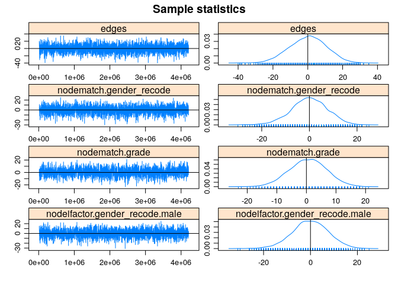<!-- -->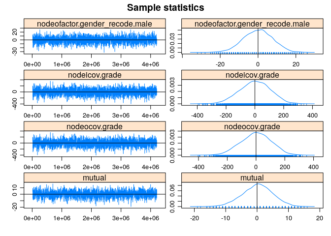<!-- -->

The function plots the MCMC sample of network statistics (showing how
far the values from the sampled networks are from the observed value).
In this case everything looks okay and the model seems to have
converged. The networks statistics haven’t gone off dramatically in one
direction and are not erratic, changing dramatically sample to sample
(but there is still variation). We will consider examples later on where
the models do not converge. Note that if we had found problems one
possible option is to tweak the input parameters using a control.ergm
argument, generally allowing for a longer burnin, more iterations
between samples and so on. Let’s see how to do this. Here we will
increase the sample size using a MCMC.samplesize option and increase the
burnin using a MCMC.burnin
option.

``` r
mod_homoph_mutual1b=ergm(school_net ~ edges + nodematch("gender_recode") +
                             nodematch("grade") + nodeifactor("gender_recode") +
                             nodeofactor("gender_recode") + nodeicov("grade") +
                             nodeocov("grade") + mutual,
                         control=control.ergm(MCMC.burnin=50000, 
                                              MCMC.samplesize=5000))

summary(mod_homoph_mutual1b)
```

    ## 
    ## ==========================
    ## Summary of model fit
    ## ==========================
    ## 
    ## Formula:   school_net ~ edges + nodematch("gender_recode") + nodematch("grade") + 
    ##     nodeifactor("gender_recode") + nodeofactor("gender_recode") + 
    ##     nodeicov("grade") + nodeocov("grade") + mutual
    ## 
    ## Iterations:  2 out of 20 
    ## 
    ## Monte Carlo MLE Results:
    ##                                Estimate Std. Error MCMC % z value Pr(>|z|)    
    ## edges                          -6.47543    0.70817      0  -9.144  < 1e-04 ***
    ## nodematch.gender_recode         0.02658    0.18996      0   0.140  0.88873    
    ## nodematch.grade                 1.74392    0.21345      0   8.170  < 1e-04 ***
    ## nodeifactor.gender_recode.male  0.28259    0.24027      0   1.176  0.23955    
    ## nodeofactor.gender_recode.male  0.45394    0.24071      0   1.886  0.05932 .  
    ## nodeicov.grade                  0.21574    0.06847      0   3.151  0.00163 ** 
    ## nodeocov.grade                  0.10223    0.06796      0   1.504  0.13254    
    ## mutual                          2.35449    0.36218      0   6.501  < 1e-04 ***
    ## ---
    ## Signif. codes:  0 '***' 0.001 '**' 0.01 '*' 0.05 '.' 0.1 ' ' 1
    ## 
    ##      Null Deviance: 1375.2  on 992  degrees of freedom
    ##  Residual Deviance:  546.8  on 984  degrees of freedom
    ##  
    ## AIC: 562.8    BIC: 602    (Smaller is better.)

The results suggest, first, that if i nominates j then j is much more
likely to nominate i. We can see this as the number of mutual pairs is
well above what we would expect based on density and homophily alone.
More formally, the odds of a tie increase by exp(2.36) times if adding
i-\>j adds a mutual pair to the network. This suggests that there are
norms of reciprocity in the network guiding tie formation. We also see
that the gender differences in indegree and outdegree are no longer
significant. This suggests that while boys do receive more ties than
girls, this is largely explained by expectations of reciprocity. So that
boys get more nominations only because they send out more friendship
ties and part of friendship is to reciprocate. Or, more substantively,
boys have a larger number of reciprocated ties, but there are not
necessarily status differences between girls and boys.

##### 4.4.2 Checking Model Fit

It is generally a good idea to see if the specified model can reproduce
the macro features of the network. If not, then there is good reason to
believe that other micro-processes important for network formation are
being missed by the model. Here, we will ask if our model can reproduce
distance and the shared partner distribution from the true network.
Distance captures the distribution of shortest paths between all ij
pairs. The shared partner distribution shows for each ij pair how many
other nodes both i and j are friends with. This captures clustering in
the network, showing if i and j tend to be friends with the same people.
Let’s take a quick look at the edgewise shared partner distribution in
the observed
    network:

``` r
summary(school_net~esp(0:10)) 
```

    ##  esp0  esp1  esp2  esp3  esp4  esp5  esp6  esp7  esp8  esp9 esp10 
    ##    24    37    29    19    12     2     1     0     0     0     0

This says that 24 students who are friends have 0 friends in common, 37
have 1 friend in common, and so on. The function to run the goodness of
fit test is gof. The inputs are the fitted model followed by the
statistics of interest you want to test against. The gof function will
simulate a set of networks based on the estimated model; it will then
take the generated networks, calculate the macro features of interest
(here distance and the shared partner distribution) and compare that to
the true value, based on the empirical network. We will also include a
model term in the formula. This asks if the model is reproducing the
terms included in the model itself (like mutual and homophily on grade).
This is a useful check, although not a good test of model
fit.

``` r
gof_mod_homoph_mutual1=gof(mod_homoph_mutual1~distance+espartners+model) 
```

We first set up the plot to have three columns and then plot the
goodness of fit statistics.

``` r
par(mfrow=c(1,3)) 
plot(gof_mod_homoph_mutual1)
```

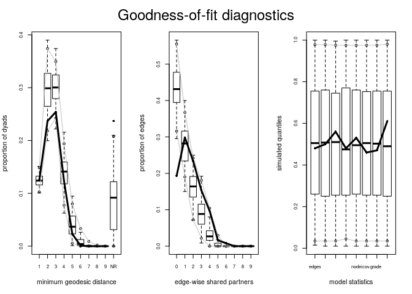<!-- -->

The boxplots capture the values from the simulated network and the dots
represent the values from the observed network. A good model will have
the values from the simulated networks close to the true values. Our
model is fitting okay in this case, particularly with distance, but we
are clearly missing something with the shared partners. We can see that
the simulated networks greatly overestimate the number of (tied) pairs
with 0 common partners. Or, more substantively, it is clear that the
model underestimates local clustering (or the tendency for a friend of a
friend to be a friend). We can also look at the goodness of fit
statistics directly.

``` r
gof_mod_homoph_mutual1
```

    ## 
    ## Goodness-of-fit for minimum geodesic distance 
    ## 
    ##     obs min   mean max MC p-value
    ## 1   124 100 123.59 150       0.96
    ## 2   235 198 294.63 387       0.18
    ## 3   252 220 299.38 371       0.10
    ## 4   122  62 137.14 214       0.60
    ## 5    23   1  39.50  94       0.52
    ## 6     1   0   8.63  50       0.62
    ## 7     0   0   1.37  16       1.00
    ## 8     0   0   0.17   5       1.00
    ## 9     0   0   0.01   1       1.00
    ## Inf 235   0  87.58 261       0.02
    ## 
    ## Goodness-of-fit for edgewise shared partner 
    ## 
    ##      obs min  mean max MC p-value
    ## esp0  24  39 53.22  69       0.00
    ## esp1  37  18 34.42  52       0.82
    ## esp2  29   4 19.95  34       0.20
    ## esp3  19   1 11.20  28       0.20
    ## esp4  12   0  4.06  16       0.10
    ## esp5   2   0  0.72   7       0.36
    ## esp6   1   0  0.02   1       0.04
    ## 
    ## Goodness-of-fit for model statistics 
    ## 
    ##                                 obs  min    mean  max MC p-value
    ## edges                           124  100  123.59  150       0.96
    ## nodematch.gender_recode          62   44   61.79   81       1.00
    ## nodematch.grade                  63   51   63.41   77       1.00
    ## nodeifactor.gender_recode.male   72   56   72.04   93       0.96
    ## nodeofactor.gender_recode.male   74   57   74.24   95       1.00
    ## nodeicov.grade                 1263 1003 1259.84 1515       0.92
    ## nodeocov.grade                 1247 1007 1245.76 1516       0.94
    ## mutual                           36   26   36.07   45       1.00

A significant p-value tells us that the observed value (from the true
network) is significantly different from the values from the simulated
networks, a clear sign that the model is not fitting well. For example,
there is clear difference for the esp0 (0 shared partner) count. Note
also that when doing the goodness of fit test we can include the same
kinds of control and constraint inputs as with the actual model fitting.

Let’s see if we can complicate our model a bit to account for local
clustering. First, let’s make a small tweak to the model, here changing
the way we estimate homophily on grade. By adding a diff=T option to the
grade nodematch term we add 6 terms to the model, one for each grade.
The idea is that in-group bias may be stronger/weaker for certain
grades.

``` r
mod_homoph_mutual2=ergm(school_net ~ edges + nodematch("gender_recode") +
                            nodematch("grade", diff=T) +
                            nodeifactor("gender_recode") +
                            nodeofactor("gender_recode") + 
                            nodeicov("grade") +nodeocov("grade") + mutual)

summary(mod_homoph_mutual2)
```

    ## 
    ## ==========================
    ## Summary of model fit
    ## ==========================
    ## 
    ## Formula:   school_net ~ edges + nodematch("gender_recode") + nodematch("grade", 
    ##     diff = T) + nodeifactor("gender_recode") + nodeofactor("gender_recode") + 
    ##     nodeicov("grade") + nodeocov("grade") + mutual
    ## 
    ## Iterations:  2 out of 20 
    ## 
    ## Monte Carlo MLE Results:
    ##                                Estimate Std. Error MCMC % z value Pr(>|z|)    
    ## edges                          -6.26510    1.11525      0  -5.618  < 1e-04 ***
    ## nodematch.gender_recode         0.05816    0.19927      0   0.292  0.77041    
    ## nodematch.grade.7               1.98125    0.45873      0   4.319  < 1e-04 ***
    ## nodematch.grade.8               0.45246    0.95805      0   0.472  0.63673    
    ## nodematch.grade.9               1.71123    0.43141      0   3.967  < 1e-04 ***
    ## nodematch.grade.10              1.41315    0.44532      0   3.173  0.00151 ** 
    ## nodematch.grade.11              1.78688    0.45473      0   3.930  < 1e-04 ***
    ## nodematch.grade.12              2.13587    0.46530      0   4.590  < 1e-04 ***
    ## nodeifactor.gender_recode.male  0.29504    0.24552      0   1.202  0.22949    
    ## nodeofactor.gender_recode.male  0.47096    0.24830      0   1.897  0.05786 .  
    ## nodeicov.grade                  0.20383    0.08330      0   2.447  0.01441 *  
    ## nodeocov.grade                  0.09107    0.08109      0   1.123  0.26139    
    ## mutual                          2.30049    0.37208      0   6.183  < 1e-04 ***
    ## ---
    ## Signif. codes:  0 '***' 0.001 '**' 0.01 '*' 0.05 '.' 0.1 ' ' 1
    ## 
    ##      Null Deviance: 1375.2  on 992  degrees of freedom
    ##  Residual Deviance:  541.5  on 979  degrees of freedom
    ##  
    ## AIC: 567.5    BIC: 631.2    (Smaller is better.)

Here, we see that grade 12 has the highest in-group bias (where they
disproportionately have friends within the same grade) while grade 8 has
the lowest in-group bias. Let’s again look at goodness of
fit.

``` r
gof_mod_homoph_mutual2=gof(mod_homoph_mutual2~distance+espartners+model) 
```

``` r
par(mfrow=c(1,3)) 
plot(gof_mod_homoph_mutual2)
```

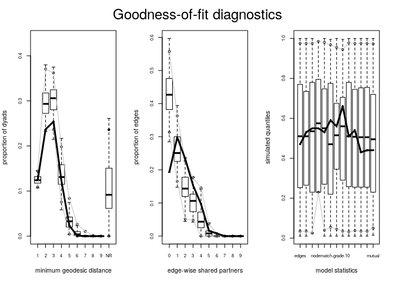<!-- -->

It doesn’t look much better in terms of fit. Of course, it still may be
of interest to know if there are different levels of in-group bias
across
grades.

#### 4.5 Edges, Homophily, Node Covariates, and Local Clustering (Transitivity)

We have so far fit a number of models, learned about reciprocity and
homophily but have not captured the local clustering in the network. So,
let’s go ahead and add a term to the model that will capture the
tendency for nodes who are tied to have the same friends. For these
models we will use our simple specification on grade homophily. Note
that there are a number of ways of specifying triadic effects like
clustering and dominance. For example, one could include terms for
different triad types (i.e., including different terms of the triad
census). By including different combinations of triad counts, one could
test different hypotheses about the formation of the network, comparing
the fit of a ‘clustering’ model compared to a ‘ranked clustering model’.
This would be akin to a traditional tau statistic (see Chapter 9).

Here, to capture clustering we will first include a triangle term. A
triangle is defined as all cases where i-j and j-k exist and then either
k-\>i or i-\>k exist. Based on past work this is unlikely to be a good
choice. Let’s run the model but cut the algorithm short, just to see
what a problematic model looks like. Here we include the messages
printed in the console.

``` r
mod_triangle=ergm(school_net ~ edges + nodematch("gender_recode") + 
                      nodematch("grade") + nodeifactor("gender_recode") + 
                      nodeofactor("gender_recode") + 
                      nodeicov("grade") + nodeocov("grade") + 
                      mutual + triangle, 
                  control=control.ergm(MCMLE.maxit=1))
```

    ## Starting maximum pseudolikelihood estimation (MPLE):

    ## Evaluating the predictor and response matrix.

    ## Maximizing the pseudolikelihood.

    ## Finished MPLE.

    ## Starting Monte Carlo maximum likelihood estimation (MCMLE):

    ## Iteration 1 of at most 1:

    ## Optimizing with step length 0.0174755304940977.

    ## The log-likelihood improved by 0.2119.

    ## MCMLE estimation did not converge after 1 iterations. The estimated coefficients may not be accurate. Estimation may be resumed by passing the coefficients as initial values; see 'init' under ?control.ergm for details.

    ## Finished MCMLE.

    ## Evaluating log-likelihood at the estimate. Using 20 bridges: 1 2 3 4 5 6 7 8 9 10 11 12 13 14 15 16 17 18 19 20 .
    ## This model was fit using MCMC.  To examine model diagnostics and check for degeneracy, use the mcmc.diagnostics() function.

It looks like the model did not converge based on the warning messages.
Let’s also look at the
    diagnostics.

``` r
mcmc.diagnostics(mod_triangle) 
```

    ## Warning in approx.hotelling.diff.test(x1, x2, var.equal = TRUE): Effective degrees of freedom (-0.300394963314789) must exceed the number of varying parameters (9). P-value will not be computed.

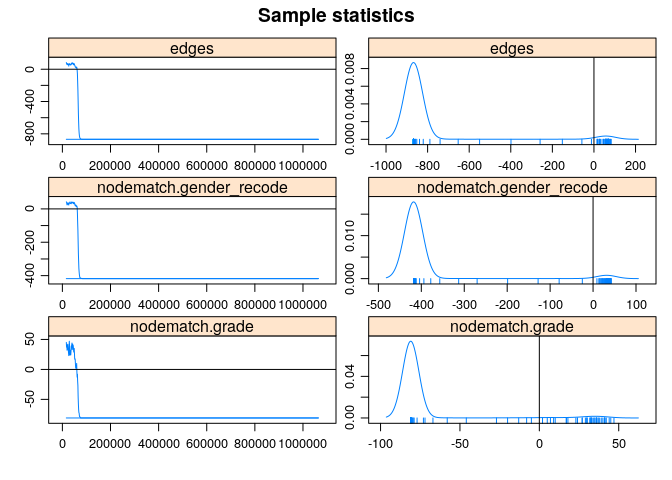<!-- -->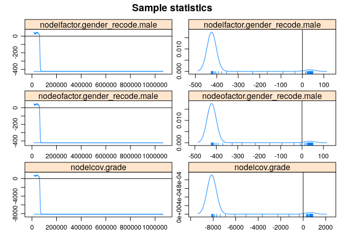<!-- -->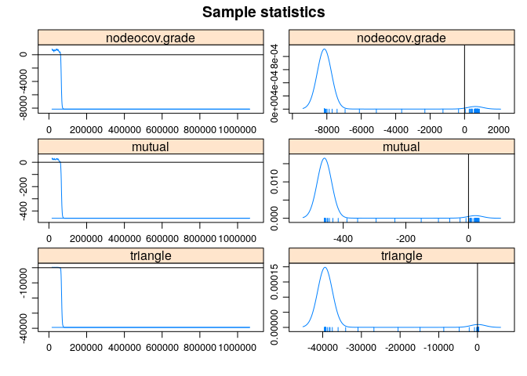<!-- -->

This is a clear example of a degenerate model. We can see that that
there is no variation sample to sample and the simulated networks have
extreme characteristics, far from the observed values in the network.
Another quick way of judging if the sample of MCMC statistics are okay
is plotting the last network from the MCMC sample.

``` r
plot(mod_triangle$newnetwork) 
```

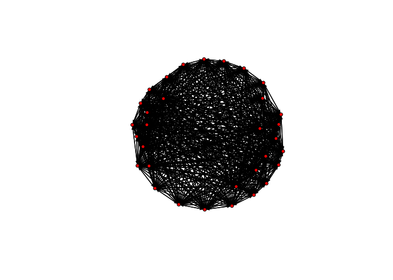<!-- -->

A complete or empty network is not what you want to see. In general,
there are two reasons we could have a degenerate model. 1. A poorly
specified model. In a poorly specified model, the terms in the model do
not reflect the actual processes that generated the network. When this
happens, the simulated networks do not have realistic features, making
it difficult to estimate the parameters very well. 2. The inputs that
control the algorithm (like burnin) are not sufficient for the model to
converge.

Here, let’s change our model, including a different term to capture
local clustering. We will now include a gwesp term to the model, or a
geometrically weighted edge-wise shared partner term, dropping the
triangle term. GWESP is a weighted count of the distribution of shared
partners discussed above. If there is local clustering in the network,
we would expect nodes who are tied to have many friends in common (and
more than what we would expect based on chance expectations). Unlike the
triangle term, GWESP is not focused solely on what happens in a given
triad, as it counts all shared partners for a given ij pair. Note that
we must specify a decay parameter, dictating the weighting on how much
the first shared partners counts (in terms of increasing the probability
of a tie) compared to the second, third, fourth, etc. Lower values put
more weight on the initial partners and less weight on adding additional
partners. Here we will set decay to 1. And to save time let’s limit the
algorithm run time to three iterations.

``` r
mod_homoph_mutual_gwesp1=ergm(school_net ~ edges + 
                                  nodematch("gender_recode") + 
                                  nodematch("grade") + 
                                  nodeifactor("gender_recode") + 
                                  nodeofactor("gender_recode") + 
                                  nodeicov("grade") + nodeocov("grade") + 
                                  mutual + gwesp(decay=1, fixed=T), 
                        control=control.ergm(MCMLE.maxit=3))
```

Looking at the
diagnostics:

``` r
mcmc.diagnostics(mod_homoph_mutual_gwesp1)
```

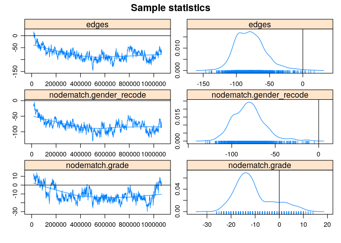<!-- -->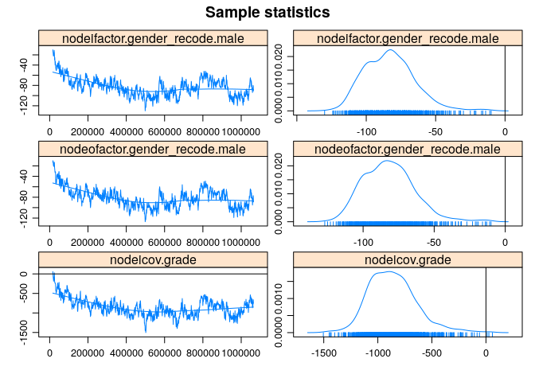<!-- -->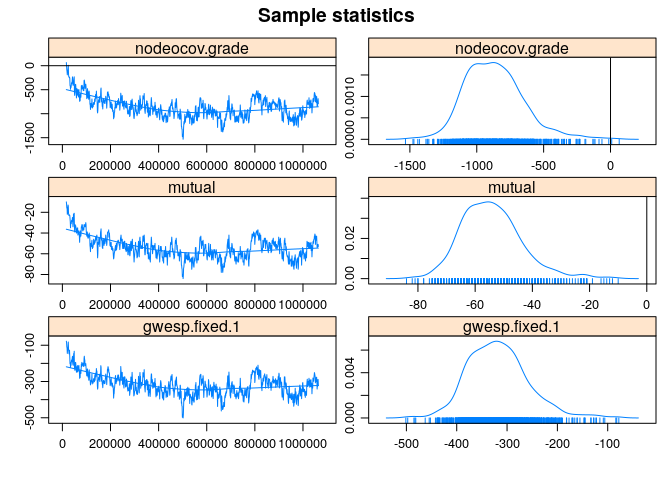<!-- -->

The model did not converge very well. Maybe we should try a different
specification of the model. For example, we can change the input decay
value. Here we will set the decay value lower. When decay is high, the
probability of a tie is greatly increased by adding another shared
partner, even if the pair already have many shared partners. When decay
is low, adding more shared partners does not greatly increase the
probability of a tie if the pair already have a few shared partners. For
this next model we will decrease the decay parameter to .5. We will also
change some of the control parameters (like burnin, number of iterations
and sample size) to let the algorithm run longer. This can take a bit to
run, but we can try and speed that up using parallel processing (here
utilizing 2
cores):

``` r
mod_homoph_mutual_gwesp2=ergm(school_net ~ edges + nodematch("gender_recode") + 
                                  nodematch("grade") + 
                                  nodeifactor("gender_recode") + 
                                  nodeofactor("gender_recode") + 
                                  nodeicov("grade") + nodeocov("grade") + 
                                  mutual + gwesp(decay=.5, fixed=T), 
                              control=control.ergm(MCMC.burnin=25000,           
                                                   MCMC.samplesize=5000,
                                                   parallel=2, 
                                                   parallel.type="PSOCK"))
```

``` r
mcmc.diagnostics(mod_homoph_mutual_gwesp2, vars.per.page=3) 
```

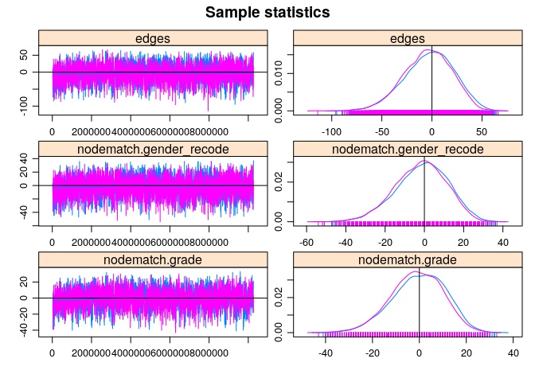<!-- -->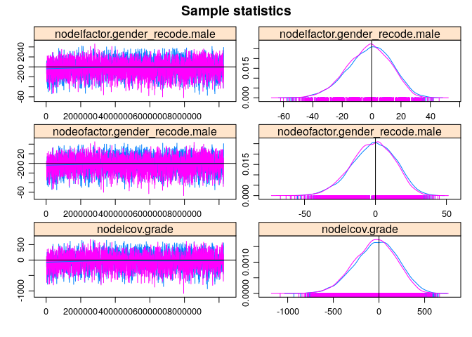<!-- -->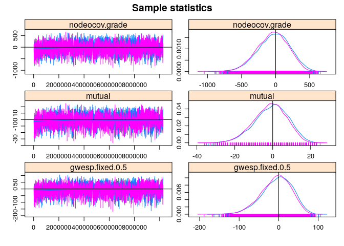<!-- -->

Convergence looks good\! Now let’s look at model
fit.

``` r
gof_mod_homoph_mutual_gwesp2=gof(mod_homoph_mutual_gwesp2~distance+espartners
                                 +model) 
```

``` r
par(mfrow=c(1,3))
plot(gof_mod_homoph_mutual_gwesp2) 
```

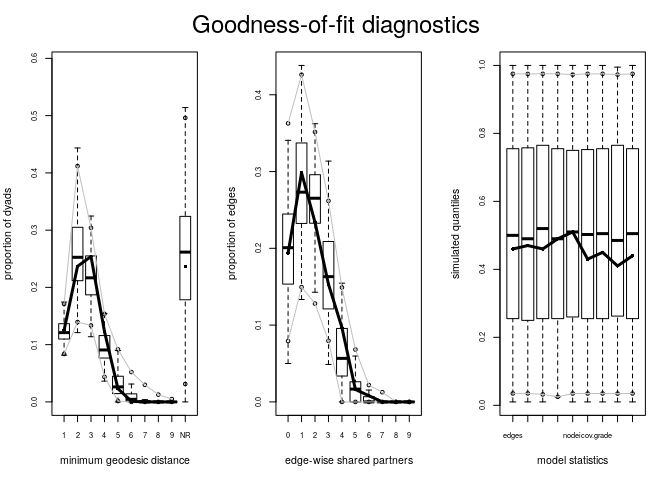<!-- -->

As we can see, the fit is good (and improved) for both distance and the
shared partner distribution. This suggests that our previous model
(mod\_homoph\_mutual2) was, in fact, missing the local clustering in the
network; without a gwesp term we overestimate the number of people who
are tied together but have no common friends. This is now accurately
captured in our new model (mod\_homoph\_mutual\_gwesp3). We can also see
that the fit, in terms of AIC and BIC, is better in the full model.

``` r
summary(mod_homoph_mutual2)
```

    ## 
    ## ==========================
    ## Summary of model fit
    ## ==========================
    ## 
    ## Formula:   school_net ~ edges + nodematch("gender_recode") + nodematch("grade", 
    ##     diff = T) + nodeifactor("gender_recode") + nodeofactor("gender_recode") + 
    ##     nodeicov("grade") + nodeocov("grade") + mutual
    ## 
    ## Iterations:  2 out of 20 
    ## 
    ## Monte Carlo MLE Results:
    ##                                Estimate Std. Error MCMC % z value Pr(>|z|)    
    ## edges                          -6.26510    1.11525      0  -5.618  < 1e-04 ***
    ## nodematch.gender_recode         0.05816    0.19927      0   0.292  0.77041    
    ## nodematch.grade.7               1.98125    0.45873      0   4.319  < 1e-04 ***
    ## nodematch.grade.8               0.45246    0.95805      0   0.472  0.63673    
    ## nodematch.grade.9               1.71123    0.43141      0   3.967  < 1e-04 ***
    ## nodematch.grade.10              1.41315    0.44532      0   3.173  0.00151 ** 
    ## nodematch.grade.11              1.78688    0.45473      0   3.930  < 1e-04 ***
    ## nodematch.grade.12              2.13587    0.46530      0   4.590  < 1e-04 ***
    ## nodeifactor.gender_recode.male  0.29504    0.24552      0   1.202  0.22949    
    ## nodeofactor.gender_recode.male  0.47096    0.24830      0   1.897  0.05786 .  
    ## nodeicov.grade                  0.20383    0.08330      0   2.447  0.01441 *  
    ## nodeocov.grade                  0.09107    0.08109      0   1.123  0.26139    
    ## mutual                          2.30049    0.37208      0   6.183  < 1e-04 ***
    ## ---
    ## Signif. codes:  0 '***' 0.001 '**' 0.01 '*' 0.05 '.' 0.1 ' ' 1
    ## 
    ##      Null Deviance: 1375.2  on 992  degrees of freedom
    ##  Residual Deviance:  541.5  on 979  degrees of freedom
    ##  
    ## AIC: 567.5    BIC: 631.2    (Smaller is better.)

``` r
summary(mod_homoph_mutual_gwesp2)
```

    ## 
    ## ==========================
    ## Summary of model fit
    ## ==========================
    ## 
    ## Formula:   school_net ~ edges + nodematch("gender_recode") + nodematch("grade") + 
    ##     nodeifactor("gender_recode") + nodeofactor("gender_recode") + 
    ##     nodeicov("grade") + nodeocov("grade") + mutual + gwesp(decay = 0.5, 
    ##     fixed = T)
    ## 
    ## Iterations:  3 out of 20 
    ## 
    ## Monte Carlo MLE Results:
    ##                                Estimate Std. Error MCMC % z value Pr(>|z|)    
    ## edges                          -5.13773    0.45084      0 -11.396   <1e-04 ***
    ## nodematch.gender_recode         0.02401    0.19852      0   0.121   0.9037    
    ## nodematch.grade                 1.39985    0.17549      0   7.977   <1e-04 ***
    ## nodeifactor.gender_recode.male  0.11392    0.21237      0   0.536   0.5917    
    ## nodeofactor.gender_recode.male  0.27311    0.21061      0   1.297   0.1947    
    ## nodeicov.grade                  0.10245    0.05742      0   1.784   0.0744 .  
    ## nodeocov.grade                  0.01108    0.05637      0   0.197   0.8442    
    ## mutual                          1.83410    0.37903      0   4.839   <1e-04 ***
    ## gwesp.fixed.0.5                 0.79804    0.13531      0   5.898   <1e-04 ***
    ## ---
    ## Signif. codes:  0 '***' 0.001 '**' 0.01 '*' 0.05 '.' 0.1 ' ' 1
    ## 
    ##      Null Deviance: 1375.2  on 992  degrees of freedom
    ##  Residual Deviance:  511.2  on 983  degrees of freedom
    ##  
    ## AIC: 529.2    BIC: 573.3    (Smaller is better.)

Substantively, we can see that after controlling for local clustering
(gwesp) there is still a significant effect for grade homophily and
reciprocity. The gwesp term is significant and clearly improved the fit
of the model. A positive coefficient suggests that students tend to have
more shared partners than we would expect based on density, homophily
and reciprocity alone. More generally, the main micro drivers of tie
formation in this network (sufficient to reproduce the macro features of
the network) are grade homophily, reciprocity and local clustering.
Moreover, net of other micro-processes, there would appear to be very
little gender effects, as gender homophily is relatively weak and the
nodefactor terms for gender are not significant (showing that boys don’t
have more ties net of other factors).

Let’s simulate a network to see how it looks compared to the true
network. This offers another useful check to see if the model is working
as expected. The function is simulate. The main inputs are:

  - object=the estimated ergm
  - nsim=number of simulated networks

Note that we can include constraints and control as with ergm, although
the inputs must be set by control.simulate.ergm:

``` r
sim_schoolnet=simulate(mod_homoph_mutual_gwesp2, nsim=1,
                       control=control.simulate.ergm(MCMC.burnin=100000))
```

And now let’s create a plot to compare the true network to the simulated
one.

``` r
par(mfrow=c(1,2))
plot(school_net, vertex.col="grade", main="True Network")
plot(sim_schoolnet, vertex.col="grade", main="Simulated Network") 
```

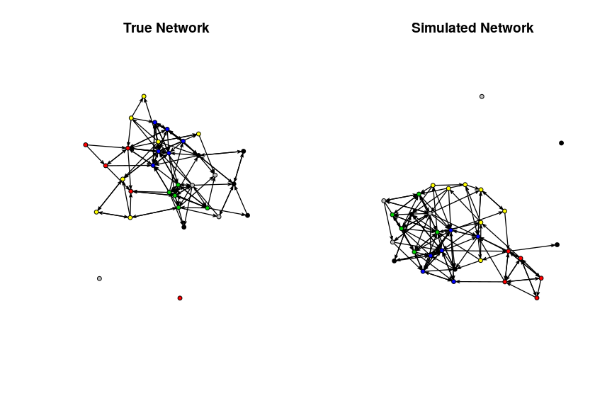<!-- -->

Looks reasonably close to the true network, but if we are unsatisfied,
we may want to consider adding other terms to the model.

### 5\. Simulation

Simulation is often used, as above, as a means of checking model fit.
Simulation can also be used as a useful tool in itself. In this case, we
are not trying to estimate an ERGM. Instead, we will use the ERGM
framework to simulate networks with desired properties. We can use the
generated networks to ask theoretical questions. We can also use the
generated network as inputs in other analyses (e.g., as inputs into a
diffusion model-see Chapter 14).

Here, we ask an important theoretical question about homophily. What
would happen to the network structure if we altered the strength of
homophily? For example, if homophily on grade was weaker or stronger,
how would transitivity in the network change? We will continue to make
use of the school network for this example. Our goal is to generate two
simple networks. Both networks will be of the same size and density as
the original network but they will differ on grade homophily. We could
consider other features, like reciprocity, but we will keep this simple
and just look at networks conditioned on density and grade homophily.

The simulation has two main steps: first, estimate ERGM coefficients to
use in the simulation; second, use the coefficients to generate
networks. In the first step, we will estimate an ERGM, where the
estimated parameters will be used in the subsequent simulation. The main
inputs are the target statistics we want to use in the simulation
itself, here based on the number of edges and the number of edges that
match on grade. We need to decide, first, what those target statistics
should look like. Let’s first take a look at the values in the observed
network:

``` r
summary(school_net ~ edges + nodematch("grade")) 
```

    ##           edges nodematch.grade 
    ##             124              63

We can see that there are 124 edges in the original network and that 63
of the edges match on grade. Let’s generate two networks, both with 124
edges but one where there are 90 edges that match on grade (strong
homophily) and one where there are 30 edges that match on grade (weak
homophily). We are basically setting matching on grade to be +/- 30
edges from the observed network. Let’s initialize a network with the
same size as our school network and set it as directed. We will use this
as the starting point for the simulation.

``` r
net=network.initialize(32, directed=T)
```

Here we seed the network with attributes, based on the distribution of
grade from the observed data.

``` r
net %v% "grade"=get.vertex.attribute(school_net, "grade")
net
```

    ##  Network attributes:
    ##   vertices = 32 
    ##   directed = TRUE 
    ##   hyper = FALSE 
    ##   loops = FALSE 
    ##   multiple = FALSE 
    ##   bipartite = FALSE 
    ##   total edges= 0 
    ##     missing edges= 0 
    ##     non-missing edges= 0 
    ## 
    ##  Vertex attribute names: 
    ##     grade vertex.names 
    ## 
    ## No edge attributes

Now we will estimate the ERGMs, first for strong homophily. This will
get us the coefficients to use in the simulation below. The call is
similar to what we saw above but here we include a target.stats input.
The target stats correspond to the desired counts for the terms included
in the model. Here we include an edges and a nodematch term for grade.
We set edges to 124 and nodematch to 90.

``` r
mod_stronghomophily=ergm(net ~ edges + nodematch("grade"), 
                         target.stats=c(124, 90)) 
mod_stronghomophily
```

    ## 
    ## MLE Coefficients:
    ##           edges  nodematch.grade  
    ##          -3.176            3.686

Now we simulate a network based on the estimated model above. We will
generate a network of the right size, with (approximately) 124 edges and
90 of those going to people of the same grade. The main input is the
estimated model.

``` r
sim_strong_homophily=simulate(mod_stronghomophily) 
```

Note that we could also have constrained the simulation on the number of
edges strictly, ensuring that the simulated networks have exactly 124
edges: `sim_strong_homophily=simulate(mod_stronghomophily,
constraints=~edges)`

Let’s check the network statistics of the simulated network:

``` r
summary(sim_strong_homophily ~ edges + nodematch("grade")) 
```

    ##           edges nodematch.grade 
    ##             124              96

It looks okay. Now, let’s do the same thing for the weak homophily case.
We need to first estimate an ERGM based on the desired target
statistics. Here the number of edges is the same but only 30 edges go
within grade.

``` r
mod_weakhomophily=ergm(net ~ edges + nodematch("grade"), 
                       target.stats=c(124, 30))
```

Now we simulate network based on the estimated model.

``` r
sim_weak_homophily=simulate(mod_weakhomophily) 
```

Let’s check the network statistics of the simulated network:

``` r
summary(sim_weak_homophily ~ edges + nodematch("grade")) 
```

    ##           edges nodematch.grade 
    ##             127              28

Let’s plot the networks.

``` r
par(mfrow=c(1,2))
plot(sim_weak_homophily, vertex.col="grade", main="Weak Homophily")
plot(sim_strong_homophily, vertex.col="grade", main="Strong Homophily")
```

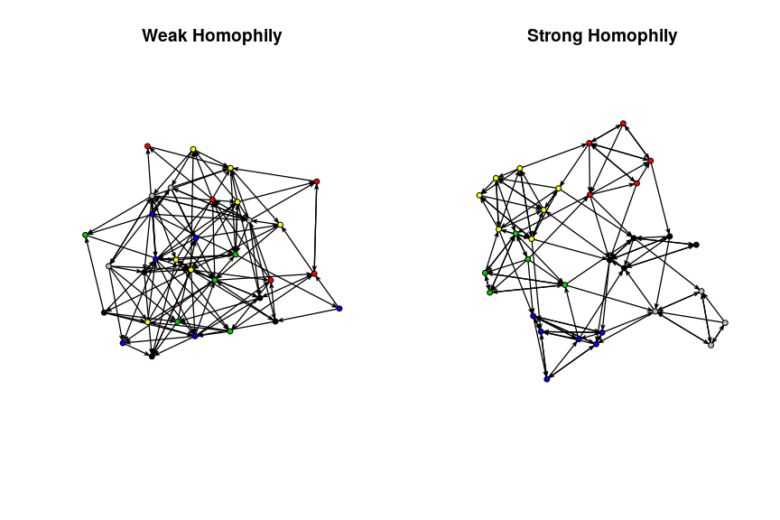<!-- -->

Now, let’s look at the transitivity in the network to see how shifting
patterns of homophily affect network structure.

``` r
gtrans(sim_weak_homophily)
```

    ## [1] 0.1369863

``` r
gtrans(sim_strong_homophily)
```

    ## [1] 0.3514151

We can see that the network with stronger homophily has higher
transitivity, so that a friend of a friend is more likely to be a
friend. This follows as the network with higher homophily is separated
more clearly into social groups (based on grade). See plot above. Note
that the simulate function is quite general and can handle complicated
conditions, allowing for realistic, nuanced networks to be generated
with desired properties.

### 6\. Example on a Large Network

We now turn to an example on a much larger network than the school
network used above. In this case, we model a coauthorship network with
60098 nodes. The actors (or nodes) are sociologists who published at
least one paper. Two actors are tied together if they coauthored a paper
together. The network is undirected. A network of this size creates
practical issues for statistical models and we will consider how a
researcher can navigate such difficulties. First, let’s read in the
edgelist.

``` r
coauthor_edgelist=read.table(file="https://sites.google.com/site/jeffreysmithdatafiles/coauthorship_edgelist.txt", header=T)

head(coauthor_edgelist)
```

    ##   sender receiver
    ## 1     14       24
    ## 2    134      151
    ## 3      6      170
    ## 4     15      212
    ## 5     19      219
    ## 6    267      283

Now, let’s read in the attribute
file.

``` r
coauthor_attributes=read.table(file="https://sites.google.com/site/jeffreysmithdatafiles/coauthorship_attributes.txt", header=T)

head(coauthor_attributes)
```

    ##   ids gender prestige research_type subject
    ## 1   1     NA        0             1       1
    ## 2   2      1        0             0      24
    ## 3   3      0        0             1      20
    ## 4   4      0        0             1       7
    ## 5   5      1        0             1      19
    ## 6   6     NA        0             1       3

We will focus on two key attributes: prestige and research type. For
prestige, 0=never published in high prestige journals; 1=has published
in high prestige journal. For research\_type, 0=primarily a qualitative
scholar; 1=primarily a quantitative scholar; 2=primarily uses mixed
methods. Research type thus captures the kinds of methods and data
employed in their research. Let’s recode things to make it a little
easier to interpret.

``` r
coauthor_attributes$prestige=recode(coauthor_attributes $prestige,
                                     as.factor=F, 
                                     "0='low prestige'; 1='high prestige'")

coauthor_attributes$research_type=recode(coauthor_attributes $research_type, 
                                          as.factor=F, 
                                          "0='qualitative'; 1='quantitative'; 
                                         2='mixed'")
```

And now let’s construct our network. As a good practice, let’s begin by
putting the size of the network as an attribute on the edgelist. We will
then create a list from the attribute data using a do.call function.

``` r
attr(coauthor_edgelist,"n")=60098 
coauthorship_attribute_list=do.call(list, coauthor_attributes) 
```

We will now create the network with the edgelist and attribute list as
inputs.

``` r
coauthorship_net=network(x=coauthor_edgelist, directed=F, 
                         vertex.attr=coauthorship_attribute_list) 
coauthorship_net 
```

    ##  Network attributes:
    ##   vertices = 60098 
    ##   directed = FALSE 
    ##   hyper = FALSE 
    ##   loops = FALSE 
    ##   multiple = FALSE 
    ##   bipartite = FALSE 
    ##   total edges= 94338 
    ##     missing edges= 0 
    ##     non-missing edges= 94338 
    ## 
    ##  Vertex attribute names: 
    ##     gender ids prestige research_type subject vertex.names 
    ## 
    ##  Edge attribute names not shown

We can see there are 60098 nodes and 94338 edges. Now, let’s try to run
some simple ERGMs on the coauthorship network. Given the size of the
network, it will be difficult to run certain models using the ergm
package. In particular, dyadic dependent models (i.e., models that
include terms like gwesp, where the ij tie is dependent on the
presence/absence of other ties) pose difficult computational challenges.
This estimation problem is an important topic for current research. For
example, see the work of Byshkin et al. 2017 (“Fast Maximum Likelihood
Estimation via Equilibrium Expectation for Large Network Data”) for new
algorithms to make the estimation of such models on large networks
faster and more plausible.

Here, we will focus on the simpler case, where we only try to estimate a
dyadic independent model, focusing on homophily and node-level factors.
Substantively, we will focus on the social divisions that exist in
coauthorship in terms of prestige and type of research
(quantitative/qualitative/mixed). For example, do ‘high prestige’
scholars tend to coauthor with other ‘high prestige’ scholars?

We can go ahead and run some simple models. We start with a model that
looks at homophily for prestige and research type. Note that this can
take a bit to run, but that ERGMs scale reasonably well in the case of
dyadic independent models.

``` r
mod1=ergm(coauthorship_net ~ edges + nodematch("research_type") +
              nodematch("prestige"))

summary(mod1)
```

    ## 
    ## ==========================
    ## Summary of model fit
    ## ==========================
    ## 
    ## Formula:   coauthorship_net ~ edges + nodematch("research_type") + nodematch("prestige")
    ## 
    ## Iterations:  10 out of 20 
    ## 
    ## Monte Carlo MLE Results:
    ##                           Estimate Std. Error MCMC % z value Pr(>|z|)    
    ## edges                   -11.023030   0.015555      0 -708.64   <1e-04 ***
    ## nodematch.research_type   1.379024   0.008049      0  171.34   <1e-04 ***
    ## nodematch.prestige        0.278454   0.014511      0   19.19   <1e-04 ***
    ## ---
    ## Signif. codes:  0 '***' 0.001 '**' 0.01 '*' 0.05 '.' 0.1 ' ' 1
    ## 
    ##      Null Deviance: 2.503e+09  on 1.806e+09  degrees of freedom
    ##  Residual Deviance: 2.012e+06  on 1.806e+09  degrees of freedom
    ##  
    ## AIC: 2012159    BIC: 2012217    (Smaller is better.)

Looking at the results, we won’t worry too much with the statistical
tests and standard errors, given the size of the network (i.e., the
number of dyads). We will focus more on the magnitude of the coefficient
for each term. Substantively, the results suggest that homophily does
strongly shape the probability of a tie forming. For example, the odds
of a tie forming when two scholars match on research type is
exp(1.38)=3.97 times higher than the odds of a tie forming when the
scholars differ on research type (controlling for matching on prestige).

We now run the same basic model but add nodefactor terms for each
attribute of interest. This will make it possible to look at homophily
net of the differences in degree across categories (e.g., quantitative
scholars may coauthor more than qualitative scholars). Note that the
added terms are nodefactor terms (rather than nodeifactor or nodeofactor
terms) as the network is undirected.

``` r
mod2=ergm(coauthorship_net ~ edges + nodematch("research_type") +
              nodematch("prestige") + nodefactor("research_type") +
              nodefactor("prestige"))

summary(mod2)
```

    ## 
    ## ==========================
    ## Summary of model fit
    ## ==========================
    ## 
    ## Formula:   coauthorship_net ~ edges + nodematch("research_type") + nodematch("prestige") + 
    ##     nodefactor("research_type") + nodefactor("prestige")
    ## 
    ## Iterations:  10 out of 20 
    ## 
    ## Monte Carlo MLE Results:
    ##                                        Estimate Std. Error MCMC % z value Pr(>|z|)    
    ## edges                                 -8.618833   0.024499      0 -351.81   <1e-04 ***
    ## nodematch.research_type                1.550283   0.008788      0  176.42   <1e-04 ***
    ## nodematch.prestige                     1.564879   0.018794      0   83.27   <1e-04 ***
    ## nodefactor.research_type.qualitative  -0.638366   0.009080      0  -70.30   <1e-04 ***
    ## nodefactor.research_type.quantitative -0.639703   0.008731      0  -73.27   <1e-04 ***
    ## nodefactor.prestige.low prestige      -1.312286   0.012411      0 -105.74   <1e-04 ***
    ## ---
    ## Signif. codes:  0 '***' 0.001 '**' 0.01 '*' 0.05 '.' 0.1 ' ' 1
    ## 
    ##      Null Deviance: 2.503e+09  on 1.806e+09  degrees of freedom
    ##  Residual Deviance: 2.002e+06  on 1.806e+09  degrees of freedom
    ##  
    ## AIC: 2002310    BIC: 2002426    (Smaller is better.)

The results suggest, as before, that high prestige researcher tend to
coauthor with high prestige researchers, while researchers tend to
coauthor with others doing similar kinds of research. This time,
however, we see that the coefficient on nodematch for prestige is higher
than seen in model 1, where we did not control for the degree
differences across categories. Model 2 makes clear that those with high
prestige tend to coauthor more than those with lower prestige (see
negative coefficient on nodefactor.prestige.low prestige). Controlling
for these differences in degree, the tendency for researchers to
coauthor with researchers of similar prestige appears to be amplified,
although we would want to explore this more formally (i.e., by using
probabilities to look at the marginal effect of homophily on prestige
across the two models).

This tutorial has covered exponential random graph models for
cross-sectional data. The second tutorial in Chapter 13 considers models
that extend ERGM to handle longitudinal (or dynamic) data. In Chapter
14, we consider statistical models that deal with the co-evolution of
networks and attributes (like behaviors).
