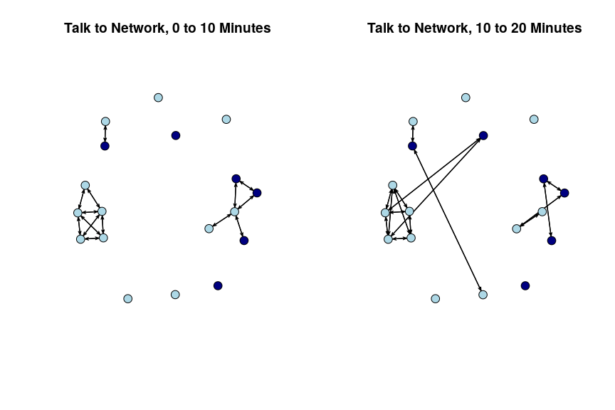
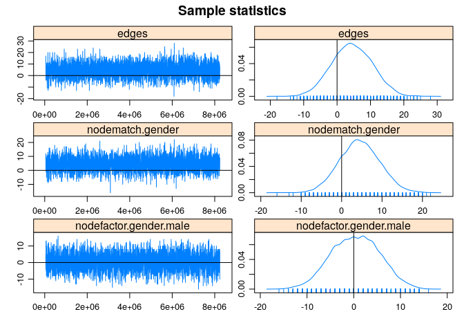
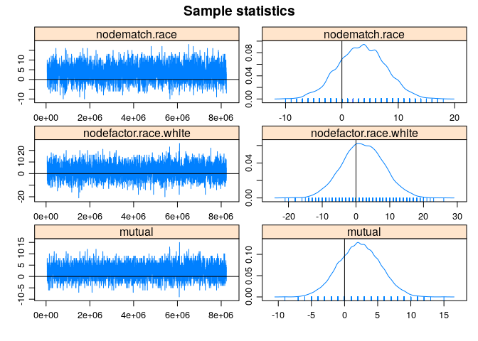

STERGMs
================
Saurabh Khanna
2020-05-14

# Chapter 13: R Tutorial on Statistical Network Models for Longitudinal Network Data

Built with R version 3.6.3

This is the second tutorial for Chapter 13 on statistical network
models. The first tutorial covered the case of cross-sectional network
data. Here, we assume that a researcher has data on at least two time
points and is interested in modeling change in the network over time. In
this tutorial, we will walk through the estimation and interpretation of
Separable Temporal Exponential Random Graph Models, STERGM. We can think
of STERGM as a longitudinal extension to ERGM (see previous tutorial).

With STERG models, we are interested in predicting the formation and
dissolution of edges from time T to T+1 (however defined). The model is
appropriate for cases where the edges can be defined discretely, for the
periods defined in the study. For example, we could predict the
formation/dissolution of edges from data collected on relationships
amongst students at two different time points. We will consider
relational event models, appropriate for continuous-time, streaming data
in the next tutorial (Chapter 13c).

For this tutorial, we will use network data collected by Daniel
McFarland on adolescents in a classroom. We have four discrete networks,
capturing changes in network ties across different segments of a single
class period. An edge exists in the first network if i talked to j in
the first 10 minutes of the class (0-10 minutes); there is an edge in
the second network if i talked to j in the second 10 minutes (10-20
minutes); there is an edge in the third network if i talked to j in the
third 10 minutes (20-30 minutes); and there is an edge in the fourth
network if i talked to j in the last segment of the class (30-40
minutes).

Substantively, our main question is how interaction partners in the
classroom shift over a single class period. What mechanisms predict the
adding of a tie that did not exist earlier in the class? What mechanisms
predict the dropping of a tie? And are the mechanisms that predict the
adding of a tie the same as dropping one? For example, students are
likely to initiate conversations (i.e., add ties) with students who are
sitting physically nearby. On the other hand, once two students are
talking, sitting adjacent might not have a large effect on maintaining
the tie over time; as they have already overcome the initial hurdle of
being physically distant.

## 1\. Getting the Data Ready

We will make use of the network and sna packages in this tutorial
(rather than igraph).

``` r
library(sna)
library(network)
```

As a first step, we will load our four networks, already constructed as
network
objects.

``` r
load(url("https://sites.google.com/site/jeffreysmithdatafiles/discrete_talk_nets.RData"))
```

Let’s take a look at the four networks, talk\_time1, talk\_time2,
talk\_time3 and talk\_time4:

``` r
talk_time1
```

    ##  Network attributes:
    ##   vertices = 18 
    ##   directed = TRUE 
    ##   hyper = FALSE 
    ##   loops = FALSE 
    ##   multiple = FALSE 
    ##   bipartite = FALSE 
    ##   total edges= 28 
    ##     missing edges= 0 
    ##     non-missing edges= 28 
    ## 
    ##  Vertex attribute names: 
    ##     gender race vertex.names 
    ## 
    ## No edge attributes

``` r
talk_time2
```

    ##  Network attributes:
    ##   vertices = 18 
    ##   directed = TRUE 
    ##   hyper = FALSE 
    ##   loops = FALSE 
    ##   multiple = FALSE 
    ##   bipartite = FALSE 
    ##   total edges= 32 
    ##     missing edges= 0 
    ##     non-missing edges= 32 
    ## 
    ##  Vertex attribute names: 
    ##     gender race vertex.names 
    ## 
    ## No edge attributes

``` r
talk_time3
```

    ##  Network attributes:
    ##   vertices = 18 
    ##   directed = TRUE 
    ##   hyper = FALSE 
    ##   loops = FALSE 
    ##   multiple = FALSE 
    ##   bipartite = FALSE 
    ##   total edges= 23 
    ##     missing edges= 0 
    ##     non-missing edges= 23 
    ## 
    ##  Vertex attribute names: 
    ##     gender race vertex.names 
    ## 
    ## No edge attributes

``` r
talk_time4
```

    ##  Network attributes:
    ##   vertices = 18 
    ##   directed = TRUE 
    ##   hyper = FALSE 
    ##   loops = FALSE 
    ##   multiple = FALSE 
    ##   bipartite = FALSE 
    ##   total edges= 24 
    ##     missing edges= 0 
    ##     non-missing edges= 24 
    ## 
    ##  Vertex attribute names: 
    ##     gender race vertex.names 
    ## 
    ## No edge attributes

talk\_time1 corresponds to interactions taking place in the first
‘period’ (0-10 minutes), talk\_time2 corresponds to interactions
taking place in the second ‘period’(10-20 minutes) and so on. Note that
each of these networks already has attributes mapped onto them;
specifically gender and race.

Let’s plot the networks for the first two periods. We will set the color
of the nodes by gender (navy blue for male and light blue for female).
We start by extracting gender from the first network.

``` r
gender=get.vertex.attribute(talk_time1, "gender")
gender
```

    ##  [1] "female" "female" "female" "female" "female" "male"   "female" "male"  
    ##  [9] "male"   "female" "female" "male"   "female" "female" "male"   "female"
    ## [17] "female" "male"

We now set color based on gender.

``` r
cols=ifelse(gender=="male", "navy blue", "light blue")
```

We will also set the layout for the plot to be the same across the two
periods. This makes it easier to see how edges are dropped/added from
period to period. We accomplish this by defining the locations (locs) to
place the nodes and then using the coord option in the plot statement.
We define the locations of the nodes based on the period 1 network.

``` r
locs=network.layout.fruchtermanreingold(talk_time1, layout.par=NULL)

par(mfrow=c(1, 2))

plot(talk_time1, main="Talk to Network, 0 to 10 Minutes", vertex.col=cols, coord=locs, vertex.cex=2)
plot(talk_time2, main="Talk to Network, 10 to 20 Minutes", vertex.col=cols, coord=locs, vertex.cex=2) 
```

<!-- -->

We see that the basic structure of the network is pretty similar period
to period, but specific edges do change. For example, in a number of
instances students who were isolates (did not talk to anyone in the
first 10 minutes) become active, socially, making connections to
existing groups of talking students. We also see that one social group
is almost entirely female, but otherwise boys and girls seem to mix
pretty freely in this classroom.

STERG models require that our discrete, longitudinal networks be put
together as a networkDynamic object. The function is networkDynamic. In
this case, the only input we need is a list of networks, where the
networks are placed into a list in sequential order (see Chapter 3c for
more complicated examples; e.g., where there are time changing vertex
attributes or nodes becoming inactive/active over time). The resulting
networkDynamic object will serve as input into our STERG model.

``` r
library(networkDynamic)
net_dynamic_4periods=networkDynamic(network.list=list(talk_time1, talk_time2, talk_time3, talk_time4))
```

``` r
net_dynamic_4periods
```

    ## NetworkDynamic properties:
    ##   distinct change times: 5 
    ##   maximal time range: 0 until  4 
    ## 
    ## Includes optional net.obs.period attribute:
    ##  Network observation period info:
    ##   Number of observation spells: 1 
    ##   Maximal time range observed: 0 until 4 
    ##   Temporal mode: discrete 
    ##   Time unit: step 
    ##   Suggested time increment: 1 
    ## 
    ##  Network attributes:
    ##   vertices = 18 
    ##   directed = TRUE 
    ##   hyper = FALSE 
    ##   loops = FALSE 
    ##   multiple = FALSE 
    ##   bipartite = FALSE 
    ##   net.obs.period: (not shown)
    ##   total edges= 48 
    ##     missing edges= 0 
    ##     non-missing edges= 48 
    ## 
    ##  Vertex attribute names: 
    ##     active gender race vertex.names 
    ## 
    ##  Edge attribute names: 
    ##     active

Note that the default here is to set the start time (or onset) at 0 and
the terminus at 4, defined as the period where no further change is
recorded. We thus have a starting point of period 0 and changes
occurring in period 1 , 2 and 3. Let’s look at the object as a data
frame.

``` r
net_dynamic_4periods_dat=as.data.frame(net_dynamic_4periods)
head(net_dynamic_4periods_dat)
```

    ##   onset terminus tail head onset.censored terminus.censored duration edge.id
    ## 1     0        4   11    2          FALSE             FALSE        4       1
    ## 2     0        4    2   11          FALSE             FALSE        4       2
    ## 3     0        4    2    5          FALSE             FALSE        4       3
    ## 4     0        2    5    2          FALSE             FALSE        2       4
    ## 5     3        4    5    2          FALSE             FALSE        1       4
    ## 6     0        3    9    8          FALSE             FALSE        3       5

We can see that node 11 sends an edge to node 2 in period 0 (onset) and
this lasts to the end of the observation period. As another example, the
edge between node 5 and 2 is present in period 0 and period 1
(duration=2), but is dropped during period 2. If we look at row 5, we
see that the 5-\>2 edge is added again during period 3.

We will also add an edge covariate to the networkDynamic object. Here we
will include the seating arrangement in the classroom, as we might
expect that students who sit close together are more likely to talk to
one another. Let’s read in the
edgelist.

``` r
seating_edgelist=read.table("https://sites.google.com/site/jeffreysmithdatafiles/discrete_talk_nets_seating.txt", 
                         header=T)
head(seating_edgelist)
```

    ##   ego_id alter_id
    ## 1      1        7
    ## 2      1        9
    ## 3      1       15
    ## 4      2        3
    ## 5      2        5
    ## 6      2       11

The data is stored as an edgelist, where i-\>j exists if node i is
sitting near (i.e., adjacent) to node j. Let’s turn the seating edgelist
into a matrix and then add it to the networkDynamic object. We will
accomplish this by first turning the edgelist into a network object and
then extracting the matrix. We will then attach the matrix to the
networkDynamic object using set.network.attribute.

``` r
seating_network=network(x=seating_edgelist, directed=F) 
seating_matrix=as.matrix(seating_network)
set.network.attribute(net_dynamic_4periods, "seating", seating_matrix)
```

#### 2\. STERGM

We are now ready to run an initial STERG model, where the goal is to
predict the adding/dropping of edges across discretely defined time
periods. This amounts to running separate ERGMs predicting the formation
and dissolution of edges, given the network at time T. For the formation
model, we run an ERGM predicting an edge between i-\>j in T+1, given
that the i-\>j edge does not exist in the current network, time T. For
the dissolution model, we run an ERGM predicting an edge between i-\>j
in time T+1, given that i-\>j does exist in time T. The dissolution
model can also be thought of as a persistence model, as positive effects
make it more likely for an edge to last from one period to another. In
this way, STERGM is a direct extension of the exponential random graph
models covered in the previous tutorial. The models are simply run with
the addition of a time component, and corresponding conditioning to
capture formation/persistence of edges. This means that the model
specifications that work in the ERGM case will (mostly) be appropriate
in the STERGM case.

Let’s load the tergm package. Note this depends on networkDynamic and
ergm. Let’s also load tsna.

``` r
library(tergm) 
library(tsna)
```

We can cite tergm as: Krivitsky P, Handcock M (2019). tergm: Fit,
Simulate and Diagnose Models for Network Evolution Based on
Exponential-Family Random Graph Models. The Statnet Project
(<https://statnet.org>\>). R package version 3.6.1,
<https://CRAN.R-project.org/package=tergm>.

#### 2.1 Model 1: Just Edges

The main function is stergm. The key inputs are:

  - nw=networkDynamic object of interest
  - formation=formula specifying the formation equation
  - dissolution=formula specifying the dissolution (or persistence)
    equation
  - estimate=type of estimation to use in fitting model
  - constraints=formula specifying any constraints to put on model
  - control=list of inputs to control estimation algorithm; set using
    control.stergm
  - times=periods to include in estimating model

Note that the formation and dissolution formulas are specified
separately and do not need to be the same. Note also that the
constraints and control inputs work in very similar ways to what we saw
in the ERGM case (see previous tutorial). For our first model, we will
do something simple and only include a term for edges, capturing the
base rate of tie formation/persistence. We set estimate to
CMLE.

``` r
stergm_mod1=stergm(net_dynamic_4periods, formation ~ edges, dissolution ~ edges, 
                   estimate="CMLE", times=0:3)
```

``` r
summary(stergm_mod1)
```

    ## 
    ## ==============================
    ## Summary of formation model fit 
    ## ==============================
    ## 
    ## Formula:   ~edges
    ## 
    ## Iterations:  6 out of 20 
    ## 
    ## Monte Carlo MLE Results:
    ##       Estimate Std. Error MCMC % z value Pr(>|z|)    
    ## edges   -3.325      0.189      0  -17.59   <1e-04 ***
    ## ---
    ## Signif. codes:  0 '***' 0.001 '**' 0.01 '*' 0.05 '.' 0.1 ' ' 1
    ## 
    ##      Null Deviance: 1157.6  on 835  degrees of freedom
    ##  Residual Deviance:  251.9  on 834  degrees of freedom
    ##  
    ## AIC: 253.9    BIC: 258.6    (Smaller is better.) 
    ## 
    ## ================================
    ## Summary of dissolution model fit
    ## ================================
    ## 
    ## Formula:   ~edges
    ## 
    ## Iterations:  4 out of 20 
    ## 
    ## Monte Carlo MLE Results:
    ##       Estimate Std. Error MCMC % z value Pr(>|z|)  
    ## edges   0.4155     0.2243      0   1.853   0.0639 .
    ## ---
    ## Signif. codes:  0 '***' 0.001 '**' 0.01 '*' 0.05 '.' 0.1 ' ' 1
    ## 
    ##      Null Deviance: 115.1  on 83  degrees of freedom
    ##  Residual Deviance: 111.6  on 82  degrees of freedom
    ##  
    ## AIC: 113.6    BIC: 116    (Smaller is better.)

We can see that we have two different equations, one for tie formation
and one for tie persistence. The results suggest that ties form at a
lower rate than if people were randomly forming ties (based on the
negative coefficient on edges for the formation model).

To get a sense of what the results mean, we can look at the coefficient
on edges for the tie persistence model. If we take the .4155, we can
calculate the probability of an edge persisting from one period to the
next:

``` r
exp(.4155 )/(1+exp(.4155))
```

    ## [1] 0.6024059

Thus, an edge that existed in one period has a .602 probability of still
existing in the next period.

Note that we set times to 0:3, as we want to model the formation and
persistence of edges across our four time periods. The default is just
to include period 0 and 1 (thus formation/persistence of edges in period
1, given the network at period 0). So, for example, if we run the
following bit of code we get the wrong
model:

``` r
wrong_mod1=stergm(net_dynamic_4periods, formation ~ edges, dissolution ~ edges, estimate="CMLE")
```

#### 3.2 Model 2: Edges, Homophily and Nodefactor

We will now try a little more interesting model, including nodematch and
nodefactor terms for gender and race. The nodefactor terms capture basic
differences in degree by the nodal attribute of interest (i.e., do girls
talk more than boys in class?), while the nodematch terms capture if
there is homophily on the attribute (do girls tend to talk to other
girls in class?). Here we will keep the formulas for formation and
dissolution/persistence the same.

``` r
stergm_mod2=stergm(net_dynamic_4periods, 
                   formation ~ edges + nodematch("gender") + nodefactor("gender") + 
                     nodematch("race") + nodefactor("race"), 
                   dissolution ~ edges + nodematch("gender") + nodefactor("gender") + 
                     nodematch("race") + nodefactor("race"), 
                   estimate="CMLE", times=0:3)
```

``` r
summary(stergm_mod2)
```

    ## 
    ## ==============================
    ## Summary of formation model fit 
    ## ==============================
    ## 
    ## Formula:   ~edges + nodematch("gender") + nodefactor("gender") + nodematch("race") + 
    ##     nodefactor("race")
    ## 
    ## Iterations:  6 out of 20 
    ## 
    ## Monte Carlo MLE Results:
    ##                        Estimate Std. Error MCMC % z value Pr(>|z|)    
    ## edges                   -2.9620     0.5987      0  -4.948   <1e-04 ***
    ## nodematch.gender         0.6450     0.4126      0   1.563   0.1180    
    ## nodefactor.gender.male   0.2539     0.2734      0   0.929   0.3531    
    ## nodematch.race          -0.1391     0.4708      0  -0.295   0.7677    
    ## nodefactor.race.white   -1.0245     0.3838      0  -2.670   0.0076 ** 
    ## ---
    ## Signif. codes:  0 '***' 0.001 '**' 0.01 '*' 0.05 '.' 0.1 ' ' 1
    ## 
    ##      Null Deviance: 1157.6  on 835  degrees of freedom
    ##  Residual Deviance:  238.5  on 830  degrees of freedom
    ##  
    ## AIC: 248.5    BIC: 272.2    (Smaller is better.) 
    ## 
    ## ================================
    ## Summary of dissolution model fit
    ## ================================
    ## 
    ## Formula:   ~edges + nodematch("gender") + nodefactor("gender") + nodematch("race") + 
    ##     nodefactor("race")
    ## 
    ## Iterations:  4 out of 20 
    ## 
    ## Monte Carlo MLE Results:
    ##                        Estimate Std. Error MCMC % z value Pr(>|z|)  
    ## edges                   0.74641    0.81299      0   0.918   0.3586  
    ## nodematch.gender        0.65429    0.57177      0   1.144   0.2525  
    ## nodefactor.gender.male -0.75858    0.39656      0  -1.913   0.0558 .
    ## nodematch.race         -0.59777    0.53460      0  -1.118   0.2635  
    ## nodefactor.race.white  -0.04825    0.36561      0  -0.132   0.8950  
    ## ---
    ## Signif. codes:  0 '***' 0.001 '**' 0.01 '*' 0.05 '.' 0.1 ' ' 1
    ## 
    ##      Null Deviance: 115.1  on 83  degrees of freedom
    ##  Residual Deviance: 101.4  on 78  degrees of freedom
    ##  
    ## AIC: 111.4    BIC: 123.5    (Smaller is better.)

Race and gender would not appear to play a large role in the formation
or dissolution of edges in this classroom network, although there is
some evidence that students who identify as white initiate interactions
at lower rates. The fit (based on BIC) is actually worse than in model
1, just including edges.

#### 3.3 Model 3: Edges, Homophily, Nodefactor and Reciprocity

Let’s go ahead and add mutual to the model, as there is good reason to
believe that there are strong norms of reciprocity in social
interactions. Before we fit the model, let’s use set.seed to help with
reproducibility.

``` r
set.seed(1000) 
stergm_mod3a=stergm(net_dynamic_4periods, 
                    formation ~ edges + nodematch("gender") + nodefactor("gender") +  
                      nodematch("race") + nodefactor("race") + mutual, 
                    dissolution ~ edges + nodematch("gender") + nodefactor("gender") +  
                      nodematch("race") + nodefactor("race") + mutual,
                    estimate="CMLE", times=0:3)
```

The model with mutual is estimated with MCMC estimation so we need to
check the diagnostics, to make sure the model is converging. This is
directly analogous to the kind of diagnostics we saw in the ERGM
case.

``` r
mcmc.diagnostics(stergm_mod3a, vars.per.page=3)
```

<!-- --><!-- --><!-- --><!-- -->

There are two sets of diagnostics; first for the formation model and
then for the dissolution model. If we look at the diagnostic plots, we
can see that the fit looks okay in some cases, but there are some
deviations between the true statistics and those generated by the model
in terms of number of edges, as well as the nodematch terms (looking at
the dissolution model, the last set of plots). Looking at these results,
we might try and change the control parameters, seeing if that helps
with fitting the model. Here we will increase the burnin and the
interval between sampled networks.

``` r
stergm_mod3b=stergm(net_dynamic_4periods, 
                    formation ~ edges + nodematch("gender") + nodefactor("gender") +  
                      nodematch("race") + nodefactor("race") + mutual, 
                    dissolution ~ edges + nodematch("gender") + nodefactor("gender") +  
                      nodematch("race") + nodefactor("race") + mutual, 
                    estimate="CMLE", times=0:3, 
                    control=control.stergm(CMLE.MCMC.burnin=50000, CMLE.MCMC.interval=2000))

mcmc.diagnostics(stergm_mod3b, vars.per.page=3)
```

<!-- --><!-- --><!-- --><!-- -->

It looks like changing the control parameters only helped a little in
terms of model estimation. Given that the nodefactor and nodematch terms
did not improve the fit, let’s go ahead and drop them from the
dissolution model and rerun the model, seeing if that helps.

``` r
stergm_mod3c=stergm(net_dynamic_4periods, 
                    formation ~ edges + nodematch("gender") + nodefactor("gender") + 
                      nodematch("race") + nodefactor("race") + mutual, 
                    dissolution ~ edges + mutual, 
                    estimate="CMLE", times=0:3, 
                    control=control.stergm(CMLE.MCMC.burnin=50000, CMLE.MCMC.interval=2000))

mcmc.diagnostics(stergm_mod3c, vars.per.page=3)
```

<!-- --><!-- --><!-- -->

The diagnostics look better, with statistics that are generally
distributed nicely around the true value. Let’s go ahead and interpret
the results.

``` r
summary(stergm_mod3c)
```

    ## 
    ## ==============================
    ## Summary of formation model fit 
    ## ==============================
    ## 
    ## Formula:   ~edges + nodematch("gender") + nodefactor("gender") + nodematch("race") + 
    ##     nodefactor("race") + mutual
    ## 
    ## Iterations:  4 out of 20 
    ## 
    ## Monte Carlo MLE Results:
    ##                        Estimate Std. Error MCMC % z value Pr(>|z|)    
    ## edges                   -5.0779     0.6840      0  -7.423   <1e-04 ***
    ## nodematch.gender         0.3142     0.3104      0   1.012   0.3114    
    ## nodefactor.gender.male   0.1223     0.1850      0   0.661   0.5085    
    ## nodematch.race          -0.1549     0.3531      0  -0.439   0.6609    
    ## nodefactor.race.white   -0.5013     0.2937      0  -1.707   0.0879 .  
    ## mutual                   7.0551     1.0683      0   6.604   <1e-04 ***
    ## ---
    ## Signif. codes:  0 '***' 0.001 '**' 0.01 '*' 0.05 '.' 0.1 ' ' 1
    ## 
    ##      Null Deviance: 1157.6  on 835  degrees of freedom
    ##  Residual Deviance:  148.8  on 829  degrees of freedom
    ##  
    ## AIC: 160.8    BIC: 189.2    (Smaller is better.) 
    ## 
    ## ================================
    ## Summary of dissolution model fit
    ## ================================
    ## 
    ## Formula:   ~edges + mutual
    ## 
    ## Iterations:  2 out of 20 
    ## 
    ## Monte Carlo MLE Results:
    ##        Estimate Std. Error MCMC % z value Pr(>|z|)    
    ## edges   -2.7282     0.7123      0  -3.830 0.000128 ***
    ## mutual   5.9770     1.3801      0   4.331  < 1e-04 ***
    ## ---
    ## Signif. codes:  0 '***' 0.001 '**' 0.01 '*' 0.05 '.' 0.1 ' ' 1
    ## 
    ##      Null Deviance: 115.06  on 83  degrees of freedom
    ##  Residual Deviance:  68.97  on 81  degrees of freedom
    ##  
    ## AIC: 72.97    BIC: 77.81    (Smaller is better.)

We will interpret the coefficient on mutual for both the formation and
dissolution/persistence model. For the formation model, the odds than an
edge will form from i-\>j is exp(7.05) times more likely if it creates a
mutual pair (so that in the previous period j-\>i existed, but i-\>j did
not). For the persistence model, the odds that an edge will persist
(given it existed in the previous period) is exp(5.98) times higher if
it is mutual. More generally, we can see that reciprocity is a strong
predictor of both the formation and persistence of a tie. Students are
likely to talk to someone who talked to them previously, and are likely
to continue talking where a mutal relationship exists.

#### 3.4 Model 4: Edges, Homophily, Nodefactor, Reciprocity and Seating

As a fourth model, we will incorporate seating arrangements into the
formation and dissolution/persistence models. The question is whether
students who sit close to one another are more likely to initiate, and
then maintain, interaction ties. Here, we will include an edgecov term
with the seating matrix as the input. Note that we have already included
the seating matrix on the networkDynamic object above (so no further
manipulation is necessary here).

``` r
stergm_mod4=stergm(net_dynamic_4periods, 
                   formation ~ edges + nodematch("gender") + nodefactor("gender") + 
                     nodematch("race") + nodefactor("race") + mutual + edgecov("seating"),
                   dissolution ~ edges + mutual + edgecov("seating"), 
                   estimate="CMLE", times=0:3, 
                   control=control.stergm(CMLE.MCMC.burnin=50000, CMLE.MCMC.interval=2000))
```

``` r
summary(stergm_mod4)
```

    ## 
    ## ==============================
    ## Summary of formation model fit 
    ## ==============================
    ## 
    ## Formula:   ~edges + nodematch("gender") + nodefactor("gender") + nodematch("race") + 
    ##     nodefactor("race") + mutual + edgecov("seating")
    ## 
    ## Iterations:  3 out of 20 
    ## 
    ## Monte Carlo MLE Results:
    ##                        Estimate Std. Error MCMC % z value Pr(>|z|)    
    ## edges                   -5.2315     0.7101      0  -7.367   <1e-04 ***
    ## nodematch.gender         0.1678     0.3275      0   0.512    0.608    
    ## nodefactor.gender.male  -0.2208     0.2268      0  -0.974    0.330    
    ## nodematch.race          -0.3249     0.3686      0  -0.881    0.378    
    ## nodefactor.race.white   -0.4146     0.3056      0  -1.356    0.175    
    ## mutual                   6.7603     1.0975      0   6.160   <1e-04 ***
    ## edgecov.seating          1.6237     0.3490      0   4.652   <1e-04 ***
    ## ---
    ## Signif. codes:  0 '***' 0.001 '**' 0.01 '*' 0.05 '.' 0.1 ' ' 1
    ## 
    ##      Null Deviance: 1157.6  on 835  degrees of freedom
    ##  Residual Deviance:  124.5  on 828  degrees of freedom
    ##  
    ## AIC: 138.5    BIC: 171.6    (Smaller is better.) 
    ## 
    ## ================================
    ## Summary of dissolution model fit
    ## ================================
    ## 
    ## Formula:   ~edges + mutual + edgecov("seating")
    ## 
    ## Iterations:  2 out of 20 
    ## 
    ## Monte Carlo MLE Results:
    ##                 Estimate Std. Error MCMC % z value Pr(>|z|)    
    ## edges            -3.1277     0.7751      0  -4.035   <1e-04 ***
    ## mutual            5.9438     1.3647      0   4.355   <1e-04 ***
    ## edgecov.seating   0.5230     0.4300      0   1.216    0.224    
    ## ---
    ## Signif. codes:  0 '***' 0.001 '**' 0.01 '*' 0.05 '.' 0.1 ' ' 1
    ## 
    ##      Null Deviance: 115.06  on 83  degrees of freedom
    ##  Residual Deviance:  67.97  on 80  degrees of freedom
    ##  
    ## AIC: 73.97    BIC: 81.23    (Smaller is better.)

We can see that sitting adjacent to someone raises the probability of
forming a tie but not of maintaining one; suggesting the importance of
opportunity for beginning social ties but not keeping them. Let’s check
the diagnostics on our
model.

``` r
mcmc.diagnostics(stergm_mod4,vars.per.page=4)
```

<!-- --><!-- --><!-- -->

The diagnostics look generally okay.

##### 3.4.1 Checking Model Fit

It is also useful to check the fit of the model. One way of seeing if
the model is fitting well is to simulate networks based on the
underlying model and then compare the statistics in the simulated
networks to that observed in the true networks (analogous to the gof
function in the ERGM case). Note that the simulations combine the
formation and dissolution processes and output the generated networks
(based on both processes) at a given time slice. We will use a simulate
function. The main inputs are:

  - object=model of interest
  - nsim=number of separate replications; set to 1 in case of
    networkDynamic object
  - time.slices=number of distinct periods to run dynamic simulation
    over
  - nw.start=indicator for what network to start simulation at;
    nw.start=1 to begin with first observed network
  - monitor=formula indicating statistics to calculate on the simulated
    networks.

For our simulation we will set time.slices to 1000, so we simulate
change over 1000 different time periods. Of course our actual data only
has 4 time periods, but since the model is about the general tendencies
of tie formation and dissolution, having a larger number of time periods
simply adds more information about how the model is fitting (i.e., can
it generate realistic networks over many periods that correspond to what
we saw in the actual data?). We will start the simulations at the time 1
network. We set monitor to the terms in the model, edges and mutual. We
include a seed input to ease
reproducibility.

``` r
sim_mod4=simulate(stergm_mod4, nsim=1, time.slices=1000, nw.start=1, seed=100, 
                    monitor= ~ edges + mutual)
```

If we take the generated object, sim\_mod4, and use the attributes
function, we can grab the statistics for each generated network
(specified in the monitor formula). This is housed under the stats part
of the object.

``` r
sim_stats=attributes(sim_mod4)$stats
head(sim_stats)
```

    ## Markov Chain Monte Carlo (MCMC) output:
    ## Start = 1 
    ## End = 7 
    ## Thinning interval = 1 
    ##      edges mutual
    ## [1,]    26     12
    ## [2,]    17      7
    ## [3,]    17      6
    ## [4,]    19      7
    ## [5,]    27     11
    ## [6,]    23      8
    ## [7,]    26      9

There are 1000 rows, 1 for each generated network. We see that there is
a column for edges and mutual, showing the count for edges and mutual
dyads for each simulated network (or time period in the larger
simulation). This can be compared to what we saw in the observed
network. We will use a tErgmStats function to calculate the statistics
on the observed network. The main inputs are:

  - nd=networkDynamic object
  - formula=ergm formula describing terms to calculate statistics on
  - start=period where calculations should start
  - end=period where calculations should end

We will set formula to include edges and mutual, matching what was
calculated on the simulated networks above. We set start to 0 and end to
3, as we have 4 time periods, starting from 0
(onset).

``` r
true_values=tErgmStats(nd=net_dynamic_4periods, formula='~ edges+mutual', 
                       start=0, end=3)
true_values
```

    ## Time Series:
    ## Start = 0 
    ## End = 3 
    ## Frequency = 1 
    ##   edges mutual
    ## 0    28     14
    ## 1    32     16
    ## 2    23     10
    ## 3    24     12

Here we summarize the statistics of the simulated networks using an
apply statement (summarizing over the columns):

``` r
apply(sim_stats, 2, summary)
```

    ##          edges mutual
    ## Min.    10.000  1.000
    ## 1st Qu. 20.000  6.000
    ## Median  24.000  8.000
    ## Mean    24.216  8.036
    ## 3rd Qu. 28.000 10.000
    ## Max.    44.000 18.000

The mean number of edges in the generated networks (24.216) is close to
what we observed in the actual networks (28, 32, 23, and 24), while
mutuality would appear to be underestimated slightly (with a mean value
of 8.036 in the simulated networks and values of 10, 12, 14 and 16 in
the observed networks). As another way of assessing fit, we can extract
networks from particular time periods and plot them against the observed
network (we could also run a movie over all of the simulated networks).
Here we will take the network from time period 10. We will use the
network.extract function, setting at to 10.

``` r
net10=network.extract(sim_mod4, at=10)
```

And now let’s plot the simulated network against the observed network,
here just from the first 10 minute period.

``` r
par(mfrow=c(1, 2))
plot(talk_time1, main="Observed Network from 0-10 Minutes")
plot(net10, main="Example Simulated Network")
```

<!-- -->

The observed network and the simulated network are similar in many
respects (both high reciprocity and sparse) but the observed network has
higher transitivity, breaking up into well-defined groups. One way of
seeing this more formally is to rerun the simulation, but this time
include other statistics in the monitor formula. Here we will include
the count on the number of transitive triads. Note that the transitive
term was not included in the original
model.

``` r
sim_mod4=simulate(stergm_mod4, nsim=1, time.slices=1000, nw.start=1, seed=100,
                    monitor= ~ edges + mutual + transitive)
```

Let’s summarize the values for our three statistics over the simulated
networks.

``` r
sim_values=apply(attributes(sim_mod4)$stats, 2, summary)
```

And now let’s add some useful rownames to the values calculated above.

``` r
rownames(sim_values)=paste("sim", rownames(sim_values), sep=".")
sim_values
```

    ##              edges mutual transitive
    ## sim.Min.     9.000  0.000      0.000
    ## sim.1st Qu. 22.000  6.000      3.000
    ## sim.Median  25.000  8.000      6.000
    ## sim.Mean    25.344  8.301      7.455
    ## sim.3rd Qu. 29.000 10.000     10.000
    ## sim.Max.    44.000 18.000     52.000

Here we calculate the true values over the 4 periods as a means of
comparison.

``` r
true_values=tErgmStats(nd=net_dynamic_4periods, formula='~ edges+mutual+transitive', start=0, end=3)
```

Now we take the mean over the 4 time periods.

``` r
true_values_mean=colMeans(true_values)
```

Putting together the true and simulated values:

``` r
rbind(sim_values, true.mean=true_values_mean)
```

    ##              edges mutual transitive
    ## sim.Min.     9.000  0.000      0.000
    ## sim.1st Qu. 22.000  6.000      3.000
    ## sim.Median  25.000  8.000      6.000
    ## sim.Mean    25.344  8.301      7.455
    ## sim.3rd Qu. 29.000 10.000     10.000
    ## sim.Max.    44.000 18.000     52.000
    ## true.mean   26.750 13.000     27.750

It looks like we badly underestimate the number of transitive triads,
with the simulated mean (8.19) well under the true mean (27.75). This
suggests, as we saw in the plot above, that we should include a term to
capture local clustering in the
network.

### 3.5 Model 5: Edges, Homophily, Nodefactor, Reciprocity, Seating and GWESP

For the last set of models, we will include a gwesp term, setting the
decay value at .4.

``` r
stergm_mod5a=stergm(net_dynamic_4periods,
                    formation~ edges + nodematch("gender") + nodefactor("gender") + 
                      nodematch("race") + nodefactor("race") + 
                      mutual + edgecov("seating") + gwesp(decay=.4, fixed=T), 
                    dissolution ~ edges + mutual + edgecov("seating") + gwesp(decay=.4, fixed=T), 
                    estimate="CMLE", times=0:3,
                    control=control.stergm(CMLE.MCMC.burnin=50000, CMLE.MCMC.interval=2000))
```

``` r
summary(stergm_mod5a)
```

    ## 
    ## ==============================
    ## Summary of formation model fit 
    ## ==============================
    ## 
    ## Formula:   ~edges + nodematch("gender") + nodefactor("gender") + nodematch("race") + 
    ##     nodefactor("race") + mutual + edgecov("seating") + gwesp(decay = 0.4, 
    ##     fixed = T)
    ## 
    ## Iterations:  3 out of 20 
    ## 
    ## Monte Carlo MLE Results:
    ##                        Estimate Std. Error MCMC % z value Pr(>|z|)    
    ## edges                  -5.28178    0.65234      0  -8.097  < 1e-04 ***
    ## nodematch.gender        0.06845    0.31951      0   0.214 0.830363    
    ## nodefactor.gender.male -0.01936    0.20303      0  -0.095 0.924029    
    ## nodematch.race         -0.66020    0.38984      0  -1.693 0.090361 .  
    ## nodefactor.race.white  -0.46509    0.29910      0  -1.555 0.119959    
    ## mutual                  6.26012    1.09744      0   5.704  < 1e-04 ***
    ## edgecov.seating         1.02486    0.31193      0   3.286 0.001018 ** 
    ## gwesp.fixed.0.4         0.65281    0.17336      0   3.766 0.000166 ***
    ## ---
    ## Signif. codes:  0 '***' 0.001 '**' 0.01 '*' 0.05 '.' 0.1 ' ' 1
    ## 
    ##      Null Deviance: 1157.6  on 835  degrees of freedom
    ##  Residual Deviance:  111.6  on 827  degrees of freedom
    ##  
    ## AIC: 127.6    BIC: 165.4    (Smaller is better.) 
    ## 
    ## ================================
    ## Summary of dissolution model fit
    ## ================================
    ## 
    ## Formula:   ~edges + mutual + edgecov("seating") + gwesp(decay = 0.4, fixed = T)
    ## 
    ## Iterations:  2 out of 20 
    ## 
    ## Monte Carlo MLE Results:
    ##                  Estimate Std. Error MCMC % z value Pr(>|z|)    
    ## edges           -3.151383   0.768640      0  -4.100   <1e-04 ***
    ## mutual           6.017294   1.355818      0   4.438   <1e-04 ***
    ## edgecov.seating  0.498063   0.433333      0   1.149    0.250    
    ## gwesp.fixed.0.4 -0.009619   0.163168      0  -0.059    0.953    
    ## ---
    ## Signif. codes:  0 '***' 0.001 '**' 0.01 '*' 0.05 '.' 0.1 ' ' 1
    ## 
    ##      Null Deviance: 115.06  on 83  degrees of freedom
    ##  Residual Deviance:  67.24  on 79  degrees of freedom
    ##  
    ## AIC: 75.24    BIC: 84.92    (Smaller is better.)

We can see that if i and j share a higher number of partners, they are
more likely to form an edge in a period, but this does not affect the
persistence of an edge. Note that the model fit, in terms of BIC, is
improved (from mod4) for the formation model but not the
dissolution/persistence model. Let’s rerun the model but drop the gwesp
term from the dissolution formula.

``` r
stergm_mod5b=stergm(net_dynamic_4periods,
                    formation ~ edges + nodematch("gender") + nodefactor("gender") + 
                      nodematch("race") + nodefactor("race") + 
                      mutual + edgecov("seating") + gwesp(decay=.4, fixed=T), 
                    dissolution ~ edges + mutual + edgecov("seating"), 
                    estimate="CMLE", times=0:3,
                    control=control.stergm(CMLE.MCMC.burnin=50000, CMLE.MCMC.interval=2000))
```

Let’s simulate from the model and see how things look. Here, we will set
the monitor formula to include edges, mutual, gwesp and transitive (not
included in the original
model).

``` r
sim_mod5b=simulate(stergm_mod5b, nsim=1, time.slices=1000, nw.start=1, seed=100,
                     monitor= ~ edges + mutual + gwesp(decay=.4, fixed=T) + transitive)
```

And now, let’s calculate the values from the simulated network and
compare that to the true values.

``` r
sim_values=apply(attributes(sim_mod5b)$stats, 2, summary)
rownames(sim_values)=paste("sim", rownames(sim_values), sep=".")
```

Here we calculate the true values, taking the mean over the 4 periods in
the next step.

``` r
true_values=tErgmStats(nd=net_dynamic_4periods, 
                       formula='~ edges+mutual+gwesp(decay=.4, fixed=T)+transitive', start=0, end=3)

true_values_mean=colMeans(true_values)
```

Putting together the true and simulated values:

``` r
rbind(sim_values, true.mean=true_values_mean)
```

    ##              edges mutual gwesp.fixed.0.4 transitive
    ## sim.Min.     4.000  0.000   -1.776357e-14      0.000
    ## sim.1st Qu. 26.000  8.000    1.123082e+01     12.000
    ## sim.Median  32.000 10.000    1.798904e+01     21.000
    ## sim.Mean    32.018 10.618    1.876957e+01     22.777
    ## sim.3rd Qu. 38.000 13.000    2.541645e+01     31.000
    ## sim.Max.    63.000 24.000    6.282125e+01    106.000
    ## true.mean   26.750 13.000    2.099339e+01     27.750

The model looks generally okay across the statistics, although there are
a few too many edges in the generated network (mean=32.20) compared to
the true mean (26.75). Assuming we are satisfied with the fit, we can go
ahead and interpret the final model.

``` r
summary(stergm_mod5b)
```

    ## 
    ## ==============================
    ## Summary of formation model fit 
    ## ==============================
    ## 
    ## Formula:   ~edges + nodematch("gender") + nodefactor("gender") + nodematch("race") + 
    ##     nodefactor("race") + mutual + edgecov("seating") + gwesp(decay = 0.4, 
    ##     fixed = T)
    ## 
    ## Iterations:  3 out of 20 
    ## 
    ## Monte Carlo MLE Results:
    ##                        Estimate Std. Error MCMC % z value Pr(>|z|)    
    ## edges                  -5.31548    0.66606      0  -7.980  < 1e-04 ***
    ## nodematch.gender        0.08567    0.33107      0   0.259 0.795807    
    ## nodefactor.gender.male -0.01712    0.21036      0  -0.081 0.935138    
    ## nodematch.race         -0.66613    0.40058      0  -1.663 0.096332 .  
    ## nodefactor.race.white  -0.45999    0.30475      0  -1.509 0.131199    
    ## mutual                  6.29270    1.09120      0   5.767  < 1e-04 ***
    ## edgecov.seating         1.06122    0.32980      0   3.218 0.001292 ** 
    ## gwesp.fixed.0.4         0.63911    0.18384      0   3.476 0.000508 ***
    ## ---
    ## Signif. codes:  0 '***' 0.001 '**' 0.01 '*' 0.05 '.' 0.1 ' ' 1
    ## 
    ##      Null Deviance: 1157.6  on 835  degrees of freedom
    ##  Residual Deviance:  110.9  on 827  degrees of freedom
    ##  
    ## AIC: 126.9    BIC: 164.7    (Smaller is better.) 
    ## 
    ## ================================
    ## Summary of dissolution model fit
    ## ================================
    ## 
    ## Formula:   ~edges + mutual + edgecov("seating")
    ## 
    ## Iterations:  2 out of 20 
    ## 
    ## Monte Carlo MLE Results:
    ##                 Estimate Std. Error MCMC % z value Pr(>|z|)    
    ## edges            -3.1383     0.7840      0  -4.003   <1e-04 ***
    ## mutual            5.9288     1.3989      0   4.238   <1e-04 ***
    ## edgecov.seating   0.5363     0.4423      0   1.212    0.225    
    ## ---
    ## Signif. codes:  0 '***' 0.001 '**' 0.01 '*' 0.05 '.' 0.1 ' ' 1
    ## 
    ##      Null Deviance: 115.06  on 83  degrees of freedom
    ##  Residual Deviance:  67.85  on 80  degrees of freedom
    ##  
    ## AIC: 73.85    BIC: 81.11    (Smaller is better.)

Overall, our results suggest that there are strong norms of reciprocity
in interactions. An edge is more likely to form when it closes a mutual
pair and is more likely to persist when it is mutual. We also see that
seating arrangements structure the formation of interaction ties.
Individuals sitting close together are likely to initiate interactions.
The fact that seating does not affect the persistence of edges suggests
that students tend to talk to other students who are physically close,
but once initiated, the interaction between i-j has its own internal
dynamics independent of where they are seated. We see similar results
for gwesp, where individuals are more likely to form a tie with someone
with many shared partners; once that tie is initiated, however, it tends
to persist at a baseline rate only affected by whether it is
reciprocated or not. Gender and race have relatively weak effects on the
formation and persistence of ties. For example, even though there is one
group of isolated girls, the overall effect of gender on formation and
persistence of ties is not particularly strong.

This tutorial has covered statistical models for discrete, longitudinal
network data. In the next tutorial, we take up the analogous problem
using streaming, continuous network data.
