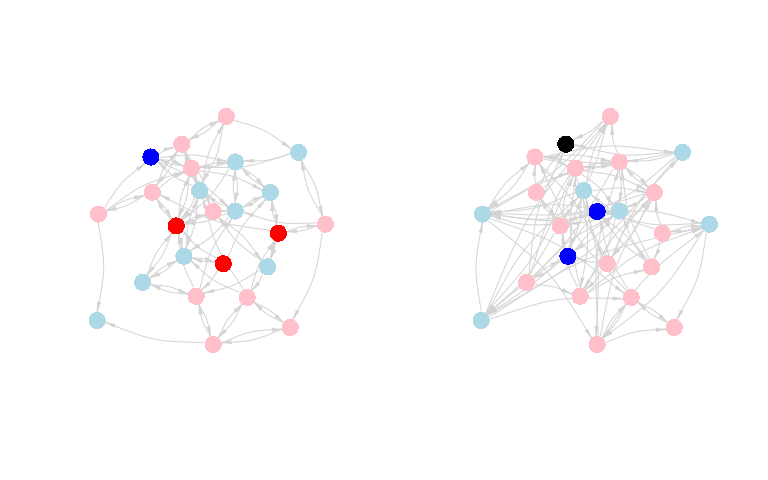
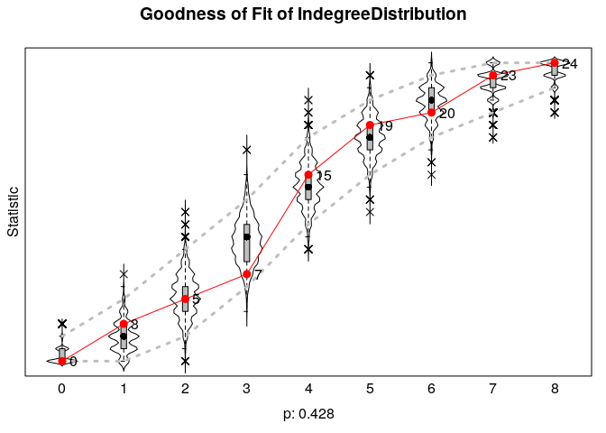
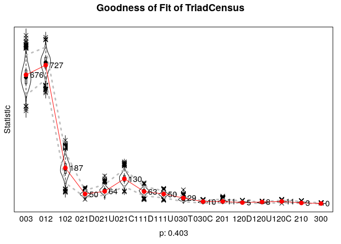
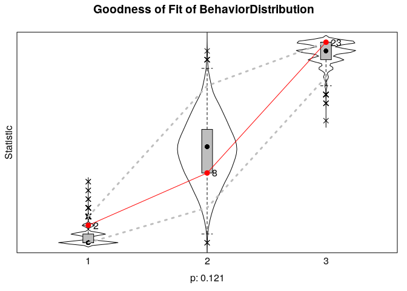
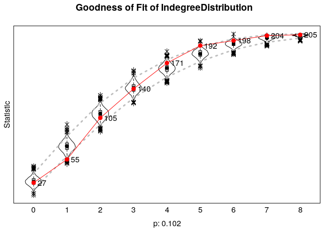
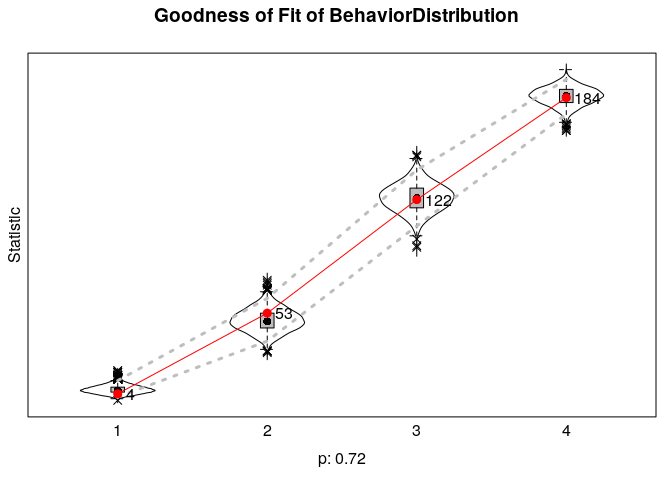

Network Coevolution
================
Saurabh Khanna
2020-05-14

## Chapter 14: R Tutorial on the Coevolution of Ties and Behaviors

Built with R version 3.6.3

Chapter 14 covers models of diffusion and peer influence. There are
three separate tutorials. In the first tutorial, we cover Siena models.
Siena is a stochastic actor orientated model (SOAM) designed to
statistically capture the coevolution of networks and behaviors. We
focus on questions of peer influence. The second tutorial focuses on
diffusion processes, using the adoption of an innovation (like a new
product) as the motivating case. The third tutorial covers dynamic
epidemiological models of infection spread. All three tutorials build on
the material from previous chapters, including the chapters on
dyads/triads (Chapter 7), groups (Chapter 8), centrality (Chapter 9),
and statistical network models (Chapter 13).

In this tutorial, we focus on modeling the coevolution of ties and
behaviors (attitudes, etc.). We will employ Siena models, which allow
for the joint estimation of network change and change in behaviors.
Siena models accomplish similar tasks as the STERG models in Chapter 13,
in terms of modeling network dynamics; with Siena, however, it becomes
possible to simultaneously look at changes in behaviors and network
ties, opening up questions about influence, selection and wider network
processes. Thus, with Siena, we can still predict how ties change from T
to T+1, as a function of mechanisms like reciprocity, but here we can
also ask about the spread of an item through the network (based on peer
influence processes). In this way, the tutorial is a bridge from the
statistical models of Chapter 13 (e.g., ERGM) to the diffusion models of
Chapter 14 (see Chapter 14b and Chapter 14c). And more substantively, we
can think of Siena as combining ERGM-like models with an explicit model
of influence.

Empirically, we focus on problems related to peer influence and
selection in the case of adolescents at school. We offer two empirical
examples. The first example utilizes a small classroom-based network.
The data were collected by Daniel McFarland. There are two waves of
data, corresponding to semester 1 and semester 2. The key outcome of
interest is how much each student liked the subject of the class,
measured in both semester 1 and semester 2. There is also data on
friendships for both semesters. We want to know if students tend to
converge on attitudes (about how much they like the subject) with people
they are friends with. We also want to see how peer influence fits into
a larger picture of network change, where ties are being added and
dropped over time. For example, are students similar in terms of liking
the subject because of peer influence or because they select friends
with similar attitudes about the class (i.e., we want to differentiate
between influence and selection)? The second part of the tutorial will
offer a short example focused on alcohol use.

### 1\. Setting up the Session: Classroom Example

We begin with the classroom example. Let’s read in the data and get it
ready for the analysis. Here we read in the semester 1
edgelist.

``` r
sem1_edgelist=read.table(file="https://sites.google.com/site/jeffreysmithdatafiles/class237_sem1_edgelist.txt", header=T)

head(sem1_edgelist)
```

    ##   sender receiver
    ## 1 113214   121470
    ## 2 113214   125522
    ## 3 113214   149552
    ## 4 113214   122728
    ## 5 113214   122706
    ## 6 115909   127535

The first column shows the sender of the tie and the second column shows
the receiver of the tie. An edge exists between i-\>j if i named j as a
friend. Let’s read in the semester 2
edgelist.

``` r
sem2_edgelist=read.table(file="https://sites.google.com/site/jeffreysmithdatafiles/class237_sem2_edgelist.txt", header=T)
```

Let’s also read in the attribute file, containing nodal
characteristics.

``` r
attributes=read.table("https://sites.google.com/site/jeffreysmithdatafiles/class237_attributes.txt", header=T)
```

The main variables are: ids=id of actor; sem\_id=semester where data
comes from; expected\_grade: D=1 C=2 B=3 A=4; like\_subject: 1-4 scale,
with 1=strong dislike to 4=like it a lot; like\_teacher: 1-4 scale, with
1=strong dislike to 4=like it a lot.

``` r
head(attributes[,c("ids", "sem_id", "like_subject", 
                   "expected_grade", "like_teacher")])
```

    ##      ids sem_id like_subject expected_grade like_teacher
    ## 1 113214      1            4              4            3
    ## 2 121470      1            2              3            3
    ## 3 122728      1            2              4            3
    ## 4 125522      1            3              4            3
    ## 5 126359      1            4              4            4
    ## 6 122706      1            3              4            3

Let’s load some useful packages. We will utilize the igraph package to
start.

``` r
library(igraph) 
library(reshape)
library(car)
```

As this is over time data, we need to be aware of the fact that nodes
can come in and out of the network through time. It is possible to do
the analysis while incorporating the changing composition of the
network, but here we will keep things simple and only consider students
who were in both semester 1 and semester 2. Let’s find out which
students were in both semesters.

``` r
ids_sem1=attributes$ids[attributes$sem_id==1]
ids_sem2=attributes$ids[attributes$sem_id==2]
```

Here we identify the cases from semester 1 that were also in semester 2.

``` r
ids_keep=ids_sem1[ids_sem1 %in% ids_sem2]
ids_keep
```

    ##  [1] 113214 121470 122728 125522 126359 122706 122710 122723 129483 139163 141006 151812 115909 127535 138473 144882 149552 122714 122724 122726 122732 122734 128033 140271

Now, let’s subset the attribute data frame and the edgelist to only
include those students in both semesters.

``` r
attributes=attributes[attributes$ids %in% ids_keep, ]

sem1_edgelist=sem1_edgelist[sem1_edgelist[,1] %in% ids_keep &
                              sem1_edgelist[,2] %in% ids_keep,]

sem2_edgelist=sem2_edgelist[sem2_edgelist[,1] %in% ids_keep & 
                              sem2_edgelist[,2] %in% ids_keep,]
```

Let’s also create separate attribute data frames for semester 1 and
semester 2.

``` r
sem1_attributes=attributes[attributes$sem_id==1, ]
sem2_attributes=attributes[attributes$sem_id==2, ]
```

With our attribute and edgelist data frames together, we can now go
ahead and construct the networks for each semester. First, we create an
igraph object using the semester 1 inputs:

``` r
sem1_net=graph_from_data_frame(d=sem1_edgelist, directed=T, 
                               vertices=sem1_attributes)
```

Now using the semester 2 inputs:

``` r
sem2_net=graph_from_data_frame(d=sem2_edgelist, directed=T, 
                               vertices=sem2_attributes)
```

We will begin with a simple plot of the two networks. The goal is to get
an initial picture of what the network looks like and whether there is
any evidence of influence, in terms of liking the subject matter. For
our plot, we want to color the nodes by how much they like the subject.
We will code it such that blue means not liking the subject and red
means liking the subject. We will set missing values to black.

``` r
cols_sem1=recode(sem1_attributes$like_subject, as.factor=F,
                 "1='blue'; 2='light blue'; 3='pink'; 4='red'; NA='black'")

cols_sem2=recode(sem2_attributes$like_subject, as.factor=F, 
                 "1='blue'; 2='light blue'; 3='pink'; 4='red'; NA='black'")
```

We want to plot both networks (semester 1 and semester 2) side by side.
We will first get the coordinates of the nodes so the networks are
aligned the same in the plot. We will base the layout on the first
semester network.

``` r
layout=layout.fruchterman.reingold(sem1_net)
```

Here we plot the semester 1 and semester 2 networks, coloring the nodes
based on how much they like the subject in that semester.

``` r
par(mfrow=c(1, 2))

plot(sem1_net, vertex.label=NA, layout=layout, edge.arrow.size=.5, 
     edge.arrow.width=.5, edge.color="light gray",  edge.curved=.2, 
     vertex.frame.color=NA, vertex.color=cols_sem1, margin=0) 

plot(sem2_net, vertex.label=NA, layout=layout, edge.arrow.size=.5, 
     edge.arrow.width=.5, edge.color="light gray", edge.curved=.2, 
     vertex.frame.color=NA, vertex.color=cols_sem2, margin=0) 
```

<!-- -->

It looks like there may be some weak clustering by how much people like
the subject. It is a bit difficult to tell from the plot if people are
converging with their friend’s attitudes, although it does look like
students who really like the subject in semester 1 tend to have more
moderate views by semester 2 (moving from red to pink). That could be a
sign of peer influence, but we need to examine such hypotheses more
carefully.

### 2\. Siena Models: Classroom Example

We now move to more formally testing our hypotheses about peer
influence. The question is whether students converge with their friends
in terms of how much they like the subject matter. We will address this
question while also considering the larger context in which actors are
forming and breaking ties. With Siena models, the basic idea is to model
the coevolution of network ties and outcomes, simultaneously predicting
changes in ties (what factors make a friendship more likely to be
added/kept?) and changes in behaviors (what factors make it more likely
to increase liking the subject?). In this way, we can explore the
existence (or not) of peer influence while also controlling for nodal,
dyadic and triadic processes that affect both the formation of ties and
the outcome of interest (here interest in the subject).

#### 2.1. Setting up the Analysis

The analysis requires the RSiena package.

``` r
library(RSiena)
```

We can cite Rsiena as: Ruth M. Ripley, Tom A. B. Snijders, Zsofia Boda,
Andras Voros, and Paulina Preciado(2018). Manual for Siena version 4.0.
R package version 1.2-12.
<https://www.cran.r-project.org/web/packages/RSiena/>.

RSiena requires that the data be shaped into very particular objects
before the model can be run. Here we walk through that process on our
classroom network data. Let’s first get the network data in a matrix
form. We will do this for both semester 1 and semester 2.

``` r
sem1_matrix=as_adjacency_matrix(graph=sem1_net, sparse=F)
sem2_matrix=as_adjacency_matrix(graph=sem2_net, sparse=F)
```

And let’s check that the rownames are the same between the semester 1
and semester 2
    matrices:

``` r
rownames(sem1_matrix)==rownames(sem2_matrix)
```

    ##  [1] TRUE TRUE TRUE TRUE TRUE TRUE TRUE TRUE TRUE TRUE TRUE TRUE TRUE TRUE TRUE TRUE TRUE TRUE TRUE TRUE TRUE TRUE TRUE TRUE

Looks good. Let’s see how much change there is in terms of ties from
semester 1 to semester 2.

``` r
tab_change=table(sem1_matrix, sem2_matrix)
tab_change
```

    ##            sem2_matrix
    ## sem1_matrix   0   1
    ##           0 429  58
    ##           1  47  42

We can see that 42 ties are stable, 47 were dropped and 58 new ties were
formed.

As a final preliminary check, let’s also make sure that the ids in the
attribute data frames are sorted in the same
    order.

``` r
sem1_attributes$ids==sem2_attributes$ids
```

    ##  [1] TRUE TRUE TRUE TRUE TRUE TRUE TRUE TRUE TRUE TRUE TRUE TRUE TRUE TRUE TRUE TRUE TRUE TRUE TRUE TRUE TRUE TRUE TRUE TRUE

Looks right. We can now go ahead and start to manipulate our data,
putting it in a form that the Rsiena package can use. As a first step,
we will gather the matrices into an array. Rsiena requires that the
networks be put together as an n X n X p array, where n is the size of
the network and p is the number of time periods. Let’s first define the
size of the network (based on the number of rows in the input matrix).

``` r
net_size=nrow(sem1_matrix)
net_size
```

    ## [1] 24

Now, we can create the array based on the two matrices, setting the
dimensions based on net\_size, as well as the number of time periods
(2).

``` r
sem12_array=array(c(sem1_matrix, sem2_matrix), dim=c(net_size, net_size, 2))

dim(sem12_array)  
```

    ## [1] 24 24  2

We can see that we have a 24 x 24 x 2 array. We can now begin to set up
the model, preparing certain objects for the main siena function.
Remember that Siena models allow for the joint modeling of network
change and behavior change. We thus have two kinds of models, and thus
two kinds of dependent variables. As a first step, we will construct a
dependent variable based on the network, so the ties (or tie change) is
the outcome of interest. The function is sienaDependent. The main inputs
are:

  - netarray=matrix (for behaviors) or array (for network outcomes)
    showing behavioral or network values to predict
  - type=type of dependent variable (e.g., behavior, oneMode)

Here we include the array constructed above based on the semester 1 and
semester 2 networks. The type is oneMode, indicating a one mode network.

``` r
networks=sienaDependent(netarray=sem12_array, type="oneMode") 
```

Now, we will construct the second dependent variable, based on our
‘behavior’ of interest, here how much they liked the subject in
semester 1 and semester 2. The inputs are the over time values for
liking the subject, constructed as a matrix.

``` r
like_subject_matrix=as.matrix(cbind(sem1_attributes$like_subject,
                                    sem2_attributes$like_subject))
head(like_subject_matrix)
```

    ##      [,1] [,2]
    ## [1,]    4    3
    ## [2,]    2    1
    ## [3,]    2    3
    ## [4,]    3    1
    ## [5,]    4    3
    ## [6,]    3    3

We again use the sienaDependent function to construct our dependent
variable, but here netarray is set to the like\_subject matrix and type
is set to
“behavior”.

``` r
like_subject=sienaDependent(netarray=like_subject_matrix, type="behavior") 
```

Let’s also create an object that captures covariates (i.e., predictors)
to be included in the model. This will typically be fixed
characteristics, like gender and race/ethnicity. Here, we will include a
covariate capturing if the students liked the teacher in semester 1. The
function to create covariates is coCovar.

``` r
like_teacher=coCovar(sem1_attributes$like_teacher)
```

Now, we will put the constructed objects together using a
sienaDataCreate function. This siena object will be one of the main
inputs into the function to run the model.

``` r
net_behavior_covar=sienaDataCreate(networks, like_subject, like_teacher)
net_behavior_covar 
```

    ## Dependent variables:  networks, like_subject 
    ## Number of observations: 2 
    ## 
    ## Nodeset                  Actors 
    ## Number of nodes              24 
    ## 
    ## Dependent variable networks 
    ## Type               oneMode  
    ## Observations       2        
    ## Nodeset            Actors   
    ## Densities          0.16 0.18
    ## 
    ## Dependent variable like_subject
    ## Type               behavior    
    ## Observations       2           
    ## Nodeset            Actors      
    ## Range              1 - 4       
    ## 
    ## Constant covariates:  like_teacher

We see basic information about our network, like density and number of
nodes, as well as useful information about the behavior of interest
(such as the range of values).

#### 2.2. Model Specification

We now take our constructed siena object and specify the model we want
to use to predict changes in ties and changes in behaviors, here about
how much they like the subject. The model is based on an evaluation
function, where actors evaluate adding/dropping ties and changing
behavior based on the specified model. Positive coefficients suggest the
change is more likely than chance expectations, while negative
coefficients suggest the change is less likely. The coefficients are
estimated based on the observed tendencies seen in the input data, in
terms of network and behavioral change. For example, with the network
model, if actors select friends with similar behaviors as themselves, we
would expect a positive coefficient on the selection term. Or, for the
behavior model, if actors tend to converge on behaviors with their
friends, we would expect a positive peer influence term.

RSiena works by ‘building up’ the model. We first get the base terms
using a getEffects function and then use an includeEffects function to
add terms to the base model. Let’s start with getting the base model,
with the main input as the siena object created above.

``` r
siena_effects=getEffects(net_behavior_covar)
siena_effects 
```

    ##   name         effectName                    include fix   test  initialValue parm
    ## 1 networks     basic rate parameter networks TRUE    FALSE FALSE    9.12260   0   
    ## 2 networks     outdegree (density)           TRUE    FALSE FALSE   -0.71940   0   
    ## 3 networks     reciprocity                   TRUE    FALSE FALSE    0.00000   0   
    ## 4 like_subject rate like_subject period 1    TRUE    FALSE FALSE    0.81028   0   
    ## 5 like_subject like_subject linear shape     TRUE    FALSE FALSE   -0.10773   0   
    ## 6 like_subject like_subject quadratic shape  TRUE    FALSE FALSE    0.00000   0

The first thing to note is that there are two kinds of model terms here,
one predicting how the network changes over time (name=networks) and one
predicting how much they like the subject changes over time
(name=like\_subject). We can see that the network model, by default,
includes a term for density, tie change (the rate of change between T1
and T2) and reciprocity. The default model for attitudes about the
subject are the base rate of change for liking the subject, and linear
and quadratic terms, showing tendencies for actors with too high (or
low) values (compared to the mean) to increase/decrease their
preferences. Now, let’s start adding terms to the model. First, we will
focus on the behavioral model, predicting how like\_subject changes
across semesters.

The function to add terms is includeEffects. The main inputs are:

  - myeff=siena object of effects
  - name of term to include
  - interaction1=siena object from which effects are being calculated
  - name=name of dependent variable for which effects are being included

First, let’s include a peer influence term, asking if people tend to
converge on liking the subject over time. Here we add an avSim term,
although there are other options to capture peer influence. avSim is the
average similarity effects, showing if actors tend to have values
similar to the average of their network alters. We set
interaction1=“networks” as the network data must be used to construct
the effect and we set name=“like\_subject” as the outcome of interest is
liking the subject between semester 1 and 2.

``` r
siena_effects=includeEffects(siena_effects, avSim, 
                               interaction1="networks", name="like_subject")  
```

Now, let’s include a term that captures if people with higher indegree
tend to decrease/increase their liking of the subject (compared to
people with lower indegree). The base term is called indeg, and we again
have the same inputs for interaction1 and name as above.

``` r
siena_effects=includeEffects(siena_effects, indeg, 
                               interaction1="networks", name="like_subject") 
```

It is useful to control for other individual-level characteristics that
may affect the outcome of interest, here liking the subject. In this
case, let’s control for how much the student likes the teacher
(like\_teacher). Thus, we may think that students will increase their
level of liking the subject if they like the teacher (measured in
semester 1 and held fixed). The term is called effFrom. The interaction1
input is now “like\_teacher” as we are interested using that variable as
the predictor; name is still is equal to “like\_subject” as this is the
outcome of interest.

``` r
siena_effects=includeEffects(siena_effects, effFrom, 
                               interaction1="like_teacher", name="like_subject") 
```

We could include a much more complicated set of terms to the model. This
is often desirable (and necessary), to answer the question of interest
and to obtain a reasonable fit. See the Rsiena manual for a full list
and discussion of possible terms. We will explore other terms below, in
particular those where network change is the outcome of interest.

#### 2.3. Model Estimation

We will now go ahead and estimate our simple model. Before we can
estimate the model we need to create an object of input specifications
using the sienaAlgorithmCreate function. There are a number of possible
inputs but here we will leave most things at the defaults. We will
include a MaxDegree option, telling the model what is the max degree
possible in the network. We set the max degree to 5 as students were
restricted to naming only up to 5 friends in the classroom. We also add
a seed option to make it easier to replicate.

``` r
input_options=sienaAlgorithmCreate(projname="class_model", 
                                     MaxDegree=c(networks=5), seed=30000) 
```

Now, we are ready to estimate the model using the siena07 function. The
main inputs are:

  - x=object of input specifications constructed using
    sienaAlgorithmCreate
  - data=main siena object constructed from sienaDataCreate function
  - effects=model effects specified using includeEffects function

It is also possible to include inputs to speed up the estimation. In
particular, we can tell R to use multiple processors in the estimation.
The main added inputs are:

  - useCluster=T/F; should we use multiple clusters?
  - nbrNodes=number of processors to use
  - clusterType=type of cluster to use

Here we estimate the model using 2 processors and the inputs specified
above, along with the siena object and the effects
object.

``` r
mod1=siena07(x=input_options, data=net_behavior_covar, effects= siena_effects, 
               useCluster=TRUE, nbrNodes=2, clusterType="PSOCK") 
```

Let’s take a look at the results.

``` r
mod1
```

    ## Estimates, standard errors and convergence t-ratios
    ## 
    ##                                                  Estimate   Standard   Convergence 
    ##                                                               Error      t-ratio   
    ## Network Dynamics 
    ##   1. rate basic rate parameter networks           8.9816  ( 1.5647   )    0.0882   
    ##   2. eval outdegree (density)                    -0.3132  ( 0.2274   )    0.0166   
    ##   3. eval reciprocity                             0.4045  ( 0.2469   )    0.0338   
    ## 
    ## Behavior Dynamics
    ##   4. rate rate like_subject period 1              2.3569  ( 1.5607   )   -0.0591   
    ##   5. eval like_subject linear shape              -0.5069  ( 2.0557   )   -0.0064   
    ##   6. eval like_subject quadratic shape           -0.2892  ( 0.9260   )   -0.0498   
    ##   7. eval like_subject average similarity         5.3771  ( 6.8575   )    0.0242   
    ##   8. eval like_subject indegree                   0.0851  ( 0.4742   )   -0.0033   
    ##   9. eval like_subject: effect from like_teacher  0.2248  ( 0.8012   )   -0.0797   
    ## 
    ## Overall maximum convergence ratio:    0.1641 
    ## 
    ## 
    ## Degrees constrained to maximum values:
    ## networks : 5 
    ## 
    ## 
    ## Total of 2363 iteration steps.

First, let’s check if the model converged. The overall convergence ratio
is under .25, which is considered acceptable. We can also look at the
convergence ratio of each estimated parameter in the model. Here values
above .1 (taking the absolute value) suggest problems with the
estimation. In this case the convergence looks good and we can move
ahead looking at our model results. If the model did not converge, we
would likely need to rerun the model under different specifications. For
example, adding/dropping terms, starting the model at better
coefficients (i.e., the coefficients estimated from the previous run)
and allowing for a longer run time.

The main items of interest in our results are the estimates and the
standard errors. Note that by dividing the estimates by the standard
errors we can do traditional t-tests on the coefficients. For example,
we can calculate the t-statistic for reciprocity (.4045/.2469)=1.63,
suggestive of a positive, but not significant, effect of reciprocity on
the formation and keeping of ties.

The average similarity effect captures peer influence, showing if the
focal actor tends to converge with their peers on liking the subject.
Unfortunately, here the model runs into a bit of trouble. We can see
that that the standard errors are quite high, as is the estimated peer
effect. So, while there may be peer influence, the estimate is very
uncertain. One possibility is that the model needs to run longer in
order to get more stable estimates. To see if this is the case, let’s
rerun the model, but this time increase the number of iterations used in
phase 3 of the estimation routine. We use a n3 option here.

``` r
input_options=sienaAlgorithmCreate(projname="class_model", 
                                     MaxDegree=c(networks=5), n3=3000, 
                                     seed=30000)
```

Let’s reestimate the model:

``` r
mod1b=siena07(x=input_options, data=net_behavior_covar, 
                effects=siena_effects, useCluster=TRUE, 
                nbrNodes=2, clusterType="PSOCK") 
```

``` r
mod1b
```

    ## Estimates, standard errors and convergence t-ratios
    ## 
    ##                                                  Estimate   Standard   Convergence 
    ##                                                               Error      t-ratio   
    ## Network Dynamics 
    ##   1. rate basic rate parameter networks           8.9816  ( 1.4576   )    0.0537   
    ##   2. eval outdegree (density)                    -0.3132  ( 0.2092   )   -0.0197   
    ##   3. eval reciprocity                             0.4045  ( 0.2311   )    0.0323   
    ## 
    ## Behavior Dynamics
    ##   4. rate rate like_subject period 1              2.3569  ( 1.3515   )   -0.0326   
    ##   5. eval like_subject linear shape              -0.5069  ( 2.3302   )   -0.0260   
    ##   6. eval like_subject quadratic shape           -0.2892  ( 0.9367   )   -0.0305   
    ##   7. eval like_subject average similarity         5.3771  ( 7.3376   )    0.0121   
    ##   8. eval like_subject indegree                   0.0851  ( 0.5232   )   -0.0330   
    ##   9. eval like_subject: effect from like_teacher  0.2248  ( 0.7688   )   -0.0424   
    ## 
    ## Overall maximum convergence ratio:    0.1237 
    ## 
    ## 
    ## Degrees constrained to maximum values:
    ## networks : 5 
    ## 
    ## 
    ## Total of 4363 iteration steps.

The standard errors are still quite high and the estimates are pretty
similar, even with increasing the number of iterations. This suggests
that the limitations of the data are the likely culprit. The main
limitation is that the example data only have 2 time points, making it
difficult to parse the effect of peer influence, especially net of other
terms in the model. Practically, a researcher may need to employ data
with 3 (or more) time points. We consider an example with more time
points below. Before we move to that second example, let’s continue to
model the classroom networks, seeing how we can include other terms in
the model and interpret the results.

##### 2.3.1 Adding Terms to the Network Model

Here, we will add terms to the model that predict the evolution of
friendship ties as the outcome of interest, where students form and drop
ties between semester 1 and 2. There are a number of terms we could add
to the model but let’s focus on 4 common ones.

First, we often want to know if actors form (and keep) ties based on
sharing some attitude or behavior of interest. In this case, we want to
know if actors select friends with similar attitudes about the subject.
We can think of this as selection, allowing us to include terms for both
influence and selection in the model. Here we build on our previous
model. We will create a new effects object, called siena\_effects2, that
will have all of our previous terms but will add the selection effects
term. We set interaction1 to “like\_subject” and name to “networks”, as
the outcome of interest is the ties, rather than liking the subject (as
above). The term is simX.

``` r
siena_effects2=includeEffects(siena_effects, simX, 
                                interaction1="like_subject", name="networks") 
```

Let’s also add degree effects, showing if people with certain attributes
(here liking the subject) send out more/less ties. The term is egoX and
the rest is the same. This captures the effect of liking the subject on
outdegree.

``` r
siena_effects2=includeEffects(siena_effects2, egoX, 
                                interaction1="like_subject", name="networks") 
```

Here we add the analogous term for ties coming in, showing if people
with certain attributes (here liking the subject) receive more/less
ties. The term is altX and the rest is the same. This captures the
effect of liking the subject on indegree.

``` r
siena_effects2=includeEffects(siena_effects2, altX, 
                                interaction1="like_subject", name="networks")
```

Finally, let’s add a term for transitivity, or local clustering, in tie
formation. transTrip captures the number of transitive patterns where i
is tied to h and j and h is tied
j.

``` r
siena_effects2=includeEffects(siena_effects2, transTrip, name="networks")
siena_effects2
```

Let’s estimate the model. We will add a returnDeps=T option to tell
siena to return the simulated networks, which will be useful when doing
model fit below.

``` r
mod2=siena07(x=input_options, data=net_behavior_covar, 
               effects=siena_effects2, returnDeps=T,
               useCluster=TRUE, nbrNodes=2, clusterType="PSOCK")
```

``` r
mod2
```

    ## Estimates, standard errors and convergence t-ratios
    ## 
    ##                                                   Estimate   Standard   Convergence 
    ##                                                                Error      t-ratio   
    ## Network Dynamics 
    ##    1. rate basic rate parameter networks           9.1907  ( 1.7798   )   -0.0467   
    ##    2. eval outdegree (density)                    -0.1832  ( 0.8314   )    0.0259   
    ##    3. eval reciprocity                             0.3977  ( 0.2313   )    0.0277   
    ##    4. eval transitive triplets                     0.1643  ( 0.1130   )    0.0435   
    ##    5. eval like_subject alter                     -0.1678  ( 0.2330   )   -0.0051   
    ##    6. eval like_subject ego                       -1.0923  ( 1.4643   )   -0.0252   
    ##    7. eval like_subject similarity                -0.0888  ( 1.6309   )   -0.0465   
    ## 
    ## Behavior Dynamics
    ##    8. rate rate like_subject period 1              2.3505  ( 1.5624   )   -0.0413   
    ##    9. eval like_subject linear shape              -0.4566  ( 2.0133   )   -0.0376   
    ##   10. eval like_subject quadratic shape           -0.3407  ( 0.9831   )   -0.0824   
    ##   11. eval like_subject average similarity         4.9813  ( 7.8368   )   -0.0014   
    ##   12. eval like_subject indegree                   0.0885  ( 0.4633   )   -0.0364   
    ##   13. eval like_subject: effect from like_teacher  0.2683  ( 0.8628   )   -0.0163   
    ## 
    ## Overall maximum convergence ratio:    0.1728 
    ## 
    ## 
    ## Degrees constrained to maximum values:
    ## networks : 5 
    ## 
    ## 
    ## Total of 4494 iteration steps.

#### 2.4. Interpretation

In interpreting the coefficients, it is important to consider the form
of the evaluation function specified in the model. It is also useful to
distinguish between the network dynamics model and the behavioral
dynamics model. We will start by interpreting the network dynamics
model.

##### 2.4.1 Interpreting Network Model

The coefficients can be understood as increasing/decreasing the log-odds
of the probability that i adds (or keeps) a tie to j compared to i
adding (or keeping) a tie to h, where j and h are different nodes in the
network with different attributes and structural positions relative to
i. For example, we see a coefficient for reciprocity of .40. This would
suggest that the odds of a tie from i being sent to j is exp(.40) times
higher than being sent to h, assuming that j-\>i exists but h-\>i does
not.

We can interpret each term in an analogous fashion, although some terms
offer more complicated functional forms and are thus harder to
interpret. For example, some attributes, like liking the subject may be
in multiple terms (indegree, outdegree, selection), making it
potentially important to consider all terms together when interpreting
effects.

##### 2.4.2 Interpreting Behavioral Model

We now turn to the behavioral model, where we are particularly
interested in peer influence effects. Note that our average similarity
term had very high standard errors and we should be hesitant in pushing
the interpretation of that coefficient too far, even as we use that
coefficient in our calculations below. More generally, peer influence
effects can be a little tricky to interpret as we need to incorporate
the proper functional form used in the evaluation function and we need
to include multiple terms in interpreting the effect of peer influence
(in particular the linear and quadratic shape terms along with the
average similarity term). Our goal here is to calculate a table of peer
influence that shows how strongly students are drawn to having the same
values as their peers. We will calculate the evaluation function for
different students with friends who are more/less similar to them. This
table of peer influence effects will aid in interpretation.

It is important to note that the function used to calculate the peer
effects will be different, depending on the exact term used in the
model. Here we will consider the evaluation function related to average
similarity. A researcher can calculate the influence table on their own
(see RSiena Manual) but there are now functions available from the Siena
development team to make this task much easier. As of the writing of
this tutorial, these functions must be read into R separately from the
base RSiena
package:

``` r
source(file="https://www.stats.ox.ac.uk/~snijders/siena/InfluenceTables.r")
```

The main function we will make use of is influenceTable. The inputs are:

  - x=estimated model
  - xd=siena network/behavior object
  - netname=network relation name
  - behname=behavioral name
  - levls=levels possible for behavioral outcome

<!-- end list -->

``` r
influence_table=influenceTable(x=mod2, xd=net_behavior_covar, 
                               netname="networks", behname="like_subject", 
                               levls=1:4) 
```

``` r
influence_table 
```

    ##    alter zalter zego      select
    ## 1      1      1    1  1.20783263
    ## 2      1      1    2 -0.14882249
    ## 3      1      1    3 -2.18686462
    ## 4      1      1    4 -4.90629377
    ## 5      2      2    1 -0.45261437
    ## 6      2      2    2  1.51162451
    ## 7      2      2    3 -0.52641762
    ## 8      2      2    4 -3.24584678
    ## 9      3      3    1 -2.11306137
    ## 10     3      3    2 -0.14882249
    ## 11     3      3    3  1.13402937
    ## 12     3      3    4 -1.58539978
    ## 13     4      4    1 -3.77350837
    ## 14     4      4    2 -1.80926948
    ## 15     4      4    3 -0.52641762
    ## 16     4      4    4  0.07504722

The first column (alter) corresponds to a given set of behaviors of the
alters. The third column (zego) corresponds to the potential choices of
behavior (here liking the subject more) of the ego. The select column
contains the contribution to the evaluation function, showing the
relative attractiveness of ego’s behavior. Looking at the first four
rows, we see that for an ego with all friends who have a value of 1
(alter=1), the most attractive option (looking at the select column) is
also to have a value of 1. Compare the positive value in the first row
to the negative value in row 4 (taking a value of 4 when everyone else
has a value of 1). We can use this table to see how much having all
one’s friends like the subject increases the odds of a student
increasing how much they like the subject. For example, if all of ego’s
friends had a value of 2 (alter=2) and ego had a value of 1 (zego=1),
the odds of ending up at a 2 is 7.12 times higher than staying a 1:
`exp(1.511)/exp(-.452)`=7.12. This is evidence of peer influence, but we
must, again, remember that our estimated parameter was quite uncertain,
and thus the estimates in this table are quite uncertain.

### 2.5. Checking Model Fit

Finally, it is a good idea (like with ERGM) to check the fit of the
model. Here, we ask if the estimated model can reproduce key features of
the network and behaviors. The basic idea is to simulate from the model
and then check if the networks and behavioral distributions based on the
model match the observed data.

Let’s first see if the model is reproducing the indegree distribution.
The function is sienaGOF. The inputs are:

  - sienaFitObject= model,
  - auxiliaryFunction= function to calculate
  - varName=network relation or behavior of
interest

<!-- end list -->

``` r
gof1=sienaGOF(sienaFitObject=mod2, auxiliaryFunction=IndegreeDistribution, 
              verbose=TRUE, join=TRUE, varName="networks") 
```

And now let’s plot the results.

``` r
plot(gof1)   
```

<!-- -->

We are looking for any large deviations between the observed and
simulated networks. Low p-values would indicate a potential problem. The
fit looks okay here. And now we look at the triad census.

``` r
gof2=sienaGOF(sienaFitObject=mod2, auxiliaryFunction=TriadCensus, 
               verbose=TRUE, join=TRUE, varName="networks")
```

``` r
plot(gof2)   
```

<!-- -->

Again, the fit looks okay. Here we look at the overall fit of the
behavior distribution.

``` r
gof_behaviour=sienaGOF(sienaFitObject=mod2,
                         auxiliaryFunction=BehaviorDistribution,
                         varName="like_subject")
```

``` r
plot(gof_behaviour)
```

<!-- -->

The fit looks okay. Note that RSiena makes it possible to add other,
user-defined statistics that are not currently defined in the Rsiena
package (e.g., we may want to look at fit for distance). See
`?sienaGOF-auxiliary` for examples.

### 3\. Example with more than 2 Time Periods

We now turn to a short example with 3 time periods, to see how the
mechanics and interpretation change in cases where there are more than
two time periods. In this case, we will make use of one of the example
data sets from the siena website, the glasgow friendship data:
<https://www.stats.ox.ac.uk/~snijders/siena/Glasgow_data.htm>. The data
are based on students in a secondary school in Glasgow. The data contain
friendship information, demographic information and substance use data
for three waves. Here we focus on alcohol use. Let’s read in the
data.

``` r
load(url("https://sites.google.com/site/jeffreysmithdatafiles/Glasgow-friendship.RData"))
load(url("https://sites.google.com/site/jeffreysmithdatafiles/Glasgow-substances.RData"))
load(url("https://sites.google.com/site/jeffreysmithdatafiles/Glasgow-demographic.RData"))
```

Let’s get the objects together to run the model. The friendship data is
housed in friendship.1, friendship.2 and friendship.3. Each is a matrix
showing if there is a tie between i and j, where 0=no tie; 1=best
friend; 2=friend; NA (or 10)= no information. Let’s look at a piece of
the matrix:

``` r
friendship.1[1:5, 1:5] 
```

    ##      s001 s002 s003 s004 s005
    ## s001    0    0    0    0    0
    ## s002    0    0    0    0    0
    ## s003    0    0    0    0    0
    ## s004    0    0    0    0    0
    ## s005    0    0    0    0    0

The alcohol data is housed in alcohol.

``` r
head(alcohol)
```

    ##      t1 t2 t3
    ## s001  3  1  3
    ## s002 NA NA NA
    ## s003  2  2  2
    ## s004  2  2  3
    ## s005  2  3  3
    ## s006  3  2  5

The data show the value on alcohol use in the three waves of data:
1=none; 2= once or twice a year; 3= once a month; 4= once a week; 5=
more than once a week.

We will begin by just keeping those actors who are there in all three
waves. Let’s identify any actor that was there in all three waves by if
they answered the alcohol question in time 1, 2 and 3.

``` r
ids_keep_glasgow=which(rowSums(is.na(alcohol))==0)
```

Let’s subset the matrices to just keep those in all three waves.

``` r
friendship.1keep=friendship.1[ids_keep_glasgow, ids_keep_glasgow]
friendship.2keep=friendship.2[ids_keep_glasgow, ids_keep_glasgow]
friendship.3keep=friendship.3[ids_keep_glasgow, ids_keep_glasgow]
```

Let’s also turn everything greater than a 0 into a 1, so the matrix is
just friend or no friend.

``` r
friendship.1keep[friendship.1keep>0]=1
friendship.2keep[friendship.2keep>0]=1
friendship.3keep[friendship.3keep>0]=1
```

Note that all the missing cases have been removed at this point so there
is no missing edge information (i.e., there are no values of 10 in the
matrices), although we would could check this by doing simple tables:
`table(friendship.1keep)`

Here we take those matrices and put them into a single array.

``` r
net_size_ex2=nrow(friendship.1keep)
  
net_array=array(c(friendship.1keep, friendship.2keep, friendship.3keep), 
                  dim=c(net_size_ex2, net_size_ex2, 3))
dim(net_array)  
```

    ## [1] 103 103   3

We have a 103 x 103 X 3 array. We can now create a siena object based on
the array of network data.

``` r
friendship=sienaDependent(netarray=net_array, type="oneMode") 
friendship
```

    ## Type         oneMode              
    ## Observations 3                    
    ## Nodeset      Actors (103 elements)

Now we deal with the behavioral outcome of interest, alcohol use. Let’s
just keep those people in all 3 waves with full information.

``` r
alcohol_keep=alcohol[ids_keep_glasgow, ] 
```

And now we create the behavioral siena object.

``` r
alcohol_depvar=sienaDependent(netarray=alcohol_keep, type="behavior") 
alcohol_depvar
```

    ## Type         behavior             
    ## Observations 3                    
    ## Nodeset      Actors (103 elements)

Let’s also create some covariates to be included in the model. Here we
create a variable for gender. Gender is housed as sex.F. 1=boys; 2=girls

``` r
head(sex.F)
```

    ## s001 s002 s003 s004 s005 s006 
    ##    2    1    2    1    1    1

Let’s just keep those in all waves and create a covariate object:

``` r
gender=coCovar(sex.F[ids_keep_glasgow]) 
```

Here we put the constructed objects together using a sienaDataCreate
function:

``` r
friend_behavior_covar=sienaDataCreate(friendship, alcohol_depvar, gender)
friend_behavior_covar
```

    ## Dependent variables:  friendship, alcohol_depvar 
    ## Number of observations: 3 
    ## 
    ## Nodeset                  Actors 
    ## Number of nodes             103 
    ## 
    ## Dependent variable friendship       
    ## Type               oneMode          
    ## Observations       3                
    ## Nodeset            Actors           
    ## Densities          0.028 0.026 0.027
    ## 
    ## Dependent variable alcohol_depvar
    ## Type               behavior      
    ## Observations       3             
    ## Nodeset            Actors        
    ## Range              1 - 5         
    ## 
    ## Constant covariates:  gender

#### 3.1 Model Specification and Estimation

Now, we specify our model of interest. We want to run a similar model as
above, where the focus is on selection/influence effects, here for
drinking behavior. We start with the base model.

``` r
siena_effects_3wave_example=getEffects(friend_behavior_covar) 
siena_effects_3wave_example 
```

    ##   name           effectName                          include fix   test  initialValue parm
    ## 1 friendship     constant friendship rate (period 1) TRUE    FALSE FALSE    6.19745   0   
    ## 2 friendship     constant friendship rate (period 2) TRUE    FALSE FALSE    5.27597   0   
    ## 3 friendship     outdegree (density)                 TRUE    FALSE FALSE   -1.63463   0   
    ## 4 friendship     reciprocity                         TRUE    FALSE FALSE    0.00000   0   
    ## 5 alcohol_depvar rate alcohol_depvar (period 1)      TRUE    FALSE FALSE    0.79250   0   
    ## 6 alcohol_depvar rate alcohol_depvar (period 2)      TRUE    FALSE FALSE    1.14392   0   
    ## 7 alcohol_depvar alcohol_depvar linear shape         TRUE    FALSE FALSE    0.36709   0   
    ## 8 alcohol_depvar alcohol_depvar quadratic shape      TRUE    FALSE FALSE    0.00000   0

Note that we now have rate parameters (controlling for change in ties
over time) for T1 to T2 and T2 to T3. Now we add a term for peer
influence, as before, using avSim (do people tend to move towards their
friends drinking behavior?)

``` r
siena_effects_3wave_example=includeEffects(siena_effects_3wave_example, 
                                           avSim, 
                                           interaction1="friendship", 
                                           name="alcohol_depvar")
```

Also, let’s include a term that controls for the main effect of gender
on drinking behavior.

``` r
siena_effects_3wave_example=includeEffects(siena_effects_3wave_example, 
                                             effFrom, 
                                             interaction1="gender", 
                                             name="alcohol_depvar")
```

Now, we include terms that predict friendship ties as the outcome of
interest, where students form and drop ties between T1 and T2 and T2 and
T3. We will include outdegree and indegree effects for drinking (do
people who drink send out/receive more ties?).

``` r
siena_effects_3wave_example=includeEffects(siena_effects_3wave_example, 
                                             egoX,  
                                             interaction1="alcohol_depvar", 
                                             name="friendship")

siena_effects_3wave_example=includeEffects(siena_effects_3wave_example, 
                                             altX,  
                                             interaction1="alcohol_depvar", 
                                             name="friendship")
```

Now we include a term for selection on drinking behavior (do people tend
to form and maintain ties with people with similar drinking behavior?)

``` r
siena_effects_3wave_example=includeEffects(siena_effects_3wave_example, 
                                             simX,  
                                             interaction1="alcohol_depvar", 
                                             name="friendship")
```

And now we add a term capturing the tendency for transitive closure in
tie formation.

``` r
siena_effects_3wave_example=includeEffects(siena_effects_3wave_example, 
                                           transTrip, name="friendship")
```

Let’s take a look at the model
    effects:

``` r
siena_effects_3wave_example
```

    ##    name           effectName                          include fix   test  initialValue parm
    ## 1  friendship     constant friendship rate (period 1) TRUE    FALSE FALSE    6.19745   0   
    ## 2  friendship     constant friendship rate (period 2) TRUE    FALSE FALSE    5.27597   0   
    ## 3  friendship     outdegree (density)                 TRUE    FALSE FALSE   -1.63463   0   
    ## 4  friendship     reciprocity                         TRUE    FALSE FALSE    0.00000   0   
    ## 5  friendship     transitive triplets                 TRUE    FALSE FALSE    0.00000   0   
    ## 6  friendship     alcohol_depvar alter                TRUE    FALSE FALSE    0.00000   0   
    ## 7  friendship     alcohol_depvar ego                  TRUE    FALSE FALSE    0.00000   0   
    ## 8  friendship     alcohol_depvar similarity           TRUE    FALSE FALSE    0.00000   0   
    ## 9  alcohol_depvar rate alcohol_depvar (period 1)      TRUE    FALSE FALSE    0.79250   0   
    ## 10 alcohol_depvar rate alcohol_depvar (period 2)      TRUE    FALSE FALSE    1.14392   0   
    ## 11 alcohol_depvar alcohol_depvar linear shape         TRUE    FALSE FALSE    0.36709   0   
    ## 12 alcohol_depvar alcohol_depvar quadratic shape      TRUE    FALSE FALSE    0.00000   0   
    ## 13 alcohol_depvar alcohol_depvar average similarity   TRUE    FALSE FALSE    0.00000   0   
    ## 14 alcohol_depvar alcohol_depvar: effect from gender  TRUE    FALSE FALSE    0.00000   0

Here we set up our control inputs. We set the max degree to 6 as
students were limited to naming 6
friends.

``` r
input_options_3wave_example=sienaAlgorithmCreate(MaxDegree=c(friendship=6), 
                                                   n3=3000, seed=5000) 
```

And now we estimate the model.

``` r
mod1_3wave_example=siena07(input_options_3wave_example, 
                             data=friend_behavior_covar,
                             effects=siena_effects_3wave_example, 
                             returnDeps=TRUE, initC=T, 
                             useCluster=TRUE, nbrNodes=2, clusterType="PSOCK") 
```

``` r
mod1_3wave_example
```

    ## Estimates, standard errors and convergence t-ratios
    ## 
    ##                                                Estimate   Standard   Convergence 
    ##                                                             Error      t-ratio   
    ## Network Dynamics 
    ##    1. rate constant friendship rate (period 1) 10.4269  ( 1.6053   )   -0.0078   
    ##    2. rate constant friendship rate (period 2)  6.5161  ( 0.7718   )    0.0136   
    ##    3. eval outdegree (density)                 -2.7403  ( 0.0813   )    0.0538   
    ##    4. eval reciprocity                          2.1840  ( 0.1182   )    0.0673   
    ##    5. eval transitive triplets                  0.5643  ( 0.0379   )    0.0669   
    ##    6. eval alcohol_depvar alter                 0.0194  ( 0.0939   )   -0.0133   
    ##    7. eval alcohol_depvar ego                   0.0718  ( 0.0984   )    0.0055   
    ##    8. eval alcohol_depvar similarity            1.3570  ( 0.4906   )    0.0391   
    ## 
    ## Behavior Dynamics
    ##    9. rate rate alcohol_depvar (period 1)       1.7342  ( 0.3593   )   -0.0427   
    ##   10. rate rate alcohol_depvar (period 2)       2.7792  ( 0.6688   )   -0.0078   
    ##   11. eval alcohol_depvar linear shape          0.4031  ( 0.1456   )   -0.0223   
    ##   12. eval alcohol_depvar quadratic shape      -0.0202  ( 0.0956   )   -0.0169   
    ##   13. eval alcohol_depvar average similarity    6.6923  ( 2.2332   )    0.0260   
    ##   14. eval alcohol_depvar: effect from gender   0.0281  ( 0.2252   )   -0.0164   
    ## 
    ## Overall maximum convergence ratio:    0.0961 
    ## 
    ## 
    ## Degrees constrained to maximum values:
    ## friendship : 6 
    ## 
    ## 
    ## Total of 4722 iteration steps.

The first thing we see is that the model appears to have converged
(looking at the overall convergence ratio and the t-ratios for each
term). Looking at the estimated model, we can see that a model with
three time periods looks better behaved. The standard errors tend to be
lower, most noticeably for the peer influence (average similarity)
coefficient. The estimate on average similarity is actually fairly
similar to what we saw above but the standard error is over 3 times
smaller. This means that the effect for peer influence is clearly
significant. We also see here that reciprocity is quite strong, as is
the tendency for transitive relations. We also see that there is
selection on alcohol use (a coefficient of 1.357 and a standard error of
.49 for similarity), suggesting that not only do students tend to
converge to the behaviors of their peers, they also tend to seek out
those with similar drinking behavior. Again, we can use the
influenceTable function to get the full picture of how influence
operates in the network in terms of alcohol use.

``` r
influence_table_3wave=influenceTable(x=mod1_3wave_example, 
                                     xd=friend_behavior_covar, 
                                     netname="friendship", 
                                     behname="alcohol_depvar", levls=1:5) 
```

``` r
influence_table_3wave
```

    ##    alter zalter zego     select
    ## 1      1      1    1  0.9767012
    ## 2      1      1    2 -0.2295136
    ## 3      1      1    3 -1.4761463
    ## 4      1      1    4 -2.7631969
    ## 5      1      1    5 -4.0906654
    ## 6      2      2    1 -0.6963790
    ## 7      2      2    2  1.4435666
    ## 8      2      2    3  0.1969339
    ## 9      2      2    4 -1.0901168
    ## 10     2      2    5 -2.4175853
    ## 11     3      3    1 -2.3694591
    ## 12     3      3    2 -0.2295136
    ## 13     3      3    3  1.8700140
    ## 14     3      3    4  0.5829634
    ## 15     3      3    5 -0.7445052
    ## 16     4      4    1 -4.0425393
    ## 17     4      4    2 -1.9025937
    ## 18     4      4    3  0.1969339
    ## 19     4      4    4  2.2560435
    ## 20     4      4    5  0.9285750
    ## 21     5      5    1 -5.7156194
    ## 22     5      5    2 -3.5756739
    ## 23     5      5    3 -1.4761463
    ## 24     5      5    4  0.5829634
    ## 25     5      5    5  2.6016551

We can also take a quick look at goodness of fit, here in terms of the
indegree distribution.

``` r
gof1=sienaGOF(mod1_3wave_example, IndegreeDistribution, verbose=TRUE,  
              join=TRUE, varName="friendship") 
```

``` r
plot(gof1)       
```

<!-- -->

Here we look at the overall fit of the behavior distribution.

``` r
gof_behaviour=sienaGOF(mod1_3wave_example, 
                         BehaviorDistribution, 
                         varName="alcohol_depvar")
```

``` r
plot(gof_behaviour)
```

<!-- -->

#### 3.2 Time Heterogeneity

Finally, when we have more than two time periods, it is important to
test for time heterogeneity, asking if the estimates are different from
T1 to T2 compared to T2 and T3 (in the case of three waves). Let’s test
whether the estimates differ from T1 to T2 vs. T2 to T3 using the
sienaTimeTest function. The input is the estimated model.

``` r
timetest=sienaTimeTest(mod1_3wave_example)
summary(timetest) 
```

    ## Joint significance test of time heterogeneity:
    ## chi-squared =  14.74, d.f. = 10, p= 0.1417, 
    ## where H0: The following parameters are zero:
    ##  ( 1) (*)Dummy2:outdegree (density)
    ##  ( 2) (*)Dummy2:reciprocity
    ##  ( 3) (*)Dummy2:transitive triplets
    ##  ( 4) (*)Dummy2:alcohol_depvar alter
    ##  ( 5) (*)Dummy2:alcohol_depvar ego
    ##  ( 6) (*)Dummy2:alcohol_depvar similarity
    ##  ( 7) (*)Dummy2:alcohol_depvar linear shape
    ##  ( 8) (*)Dummy2:alcohol_depvar quadratic shape
    ##  ( 9) (*)Dummy2:alcohol_depvar average similarity
    ##  (10) (*)Dummy2:alcohol_depvar: effect from gender
    ## 
    ## Individual significance tests and one-step estimators:
    ##                                              Initial Est. One Step Est. p-Value
    ## outdegree (density)                          -2.7403      -2.5773        0.0000
    ## reciprocity                                   2.1840       1.8905        0.0000
    ## transitive triplets                           0.5643       0.5159        0.0000
    ## alcohol_depvar alter                          0.0194       0.0860        0.8360
    ## alcohol_depvar ego                            0.0718       0.0141        0.4650
    ## alcohol_depvar similarity                     1.3570       1.4515        0.0060
    ## alcohol_depvar linear shape                   0.4031       0.4397        0.0060
    ## alcohol_depvar quadratic shape               -0.0202       0.1408        0.8330
    ## alcohol_depvar average similarity             6.6923       8.5650        0.0030
    ## alcohol_depvar: effect from gender            0.0281      -0.0887        0.9010
    ## (*)Dummy2:outdegree (density)                 0.0000      -0.3018        0.9970
    ## (*)Dummy2:reciprocity                         0.0000       0.5952        0.0680
    ## (*)Dummy2:transitive triplets                 0.0000       0.1231        0.0930
    ## (*)Dummy2:alcohol_depvar alter                0.0000      -0.1339        0.6380
    ## (*)Dummy2:alcohol_depvar ego                  0.0000       0.0704        0.8480
    ## (*)Dummy2:alcohol_depvar similarity           0.0000      -0.4427        0.7490
    ## (*)Dummy2:alcohol_depvar linear shape         0.0000       0.0010        0.9880
    ## (*)Dummy2:alcohol_depvar quadratic shape      0.0000      -0.2794        0.2420
    ## (*)Dummy2:alcohol_depvar average similarity   0.0000      -3.4043        0.8910
    ## (*)Dummy2:alcohol_depvar: effect from gender  0.0000       0.1296        0.9560
    ## 
    ## Effect-wise joint significance tests
    ## (i.e. each effect across all dummies):
    ##                                    chi-sq. df p-value
    ## outdegree (density)                   0.00  1   1.000
    ## reciprocity                           3.33  1   0.068
    ## transitive triplets                   2.82  1   0.093
    ## alcohol_depvar alter                  0.22  1   0.639
    ## alcohol_depvar ego                    0.04  1   0.841
    ## alcohol_depvar similarity             0.10  1   0.752
    ## alcohol_depvar linear shape           0.00  1   1.000
    ## alcohol_depvar quadratic shape        1.37  1   0.242
    ## alcohol_depvar average similarity     0.02  1   0.888
    ## alcohol_depvar: effect from gender    0.00  1   1.000
    ## 
    ## Period-wise joint significance tests
    ## (i.e. each period across all parameters):
    ##          chi-sq. df p-value
    ## Period 1   14.74 10   0.142
    ## Period 2   14.74 10   0.142
    ## 
    ## Use the following indices for plotting:
    ##   (1) outdegree (density)
    ##   (2) reciprocity
    ##   (3) transitive triplets
    ##   (4) alcohol_depvar alter
    ##   (5) alcohol_depvar ego
    ##   (6) alcohol_depvar similarity
    ##   (7) alcohol_depvar linear shape
    ##   (8) alcohol_depvar quadratic shape
    ##   (9) alcohol_depvar average similarity
    ##   (10) alcohol_depvar: effect from gender
    ## 
    ## If you would like to fit time dummies to your model,
    ## use the includeTimeDummy function.
    ## Type "?sienaTimeTest" for more information on this output.

The main test we are interested in is the ‘joint significance’ test. The
null hypothesis is that the effects are the same across the waves. A p
value \< .05 would offer evidence to reject that null (meaning the
effects may differ across waves). Here there is not strong evidence of
time differences. If we had found significant differences we may want to
include terms that allow the coefficients (at least some of them) to
vary by time. In particular, we would want to look at the significance
tests on the specific coefficients interacted with time; here we would
focus on the series of coefficients starting with ‘Dummy 2’, looking at
which cases there is a significant t-test (suggesting that the
coefficient for T2-T3, for example, is different than the coefficient in
T1-T2). We would then use an includeTimeDummy function to include the
desired terms, allowing those coefficients to vary across time. For
example, let’s run through a quick example where we allow the
coefficients on density and transitive triplets to vary between the
first period of change (T1 to T2) and the second (T2 to
T3).

``` r
siena_effects_3wave_example=includeTimeDummy(siena_effects_3wave_example, 
                                              density, transTrip, timeDummy="2")
```

``` r
siena_effects_3wave_example
```

    ##    name           effectName                          include fix   test  initialValue parm timeDummy
    ## 1  friendship     constant friendship rate (period 1) TRUE    FALSE FALSE    6.19745   0    ,        
    ## 2  friendship     constant friendship rate (period 2) TRUE    FALSE FALSE    5.27597   0    ,        
    ## 3  friendship     outdegree (density)                 TRUE    FALSE FALSE   -1.63463   0    2        
    ## 4  friendship     reciprocity                         TRUE    FALSE FALSE    0.00000   0    ,        
    ## 5  friendship     transitive triplets                 TRUE    FALSE FALSE    0.00000   0    2        
    ## 6  friendship     alcohol_depvar alter                TRUE    FALSE FALSE    0.00000   0    ,        
    ## 7  friendship     alcohol_depvar ego                  TRUE    FALSE FALSE    0.00000   0    ,        
    ## 8  friendship     alcohol_depvar similarity           TRUE    FALSE FALSE    0.00000   0    ,        
    ## 9  alcohol_depvar rate alcohol_depvar (period 1)      TRUE    FALSE FALSE    0.79250   0    ,        
    ## 10 alcohol_depvar rate alcohol_depvar (period 2)      TRUE    FALSE FALSE    1.14392   0    ,        
    ## 11 alcohol_depvar alcohol_depvar linear shape         TRUE    FALSE FALSE    0.36709   0    ,        
    ## 12 alcohol_depvar alcohol_depvar quadratic shape      TRUE    FALSE FALSE    0.00000   0    ,        
    ## 13 alcohol_depvar alcohol_depvar average similarity   TRUE    FALSE FALSE    0.00000   0    ,        
    ## 14 alcohol_depvar alcohol_depvar: effect from gender  TRUE    FALSE FALSE    0.00000   0    ,

Note that we now have a timeDummy column and we see a 2 in the density
and transitive triplets rows. Now let’s run the model and take a look at
the results.

``` r
mod2_3wave_example=siena07(input_options_3wave_example, 
                             data=friend_behavior_covar,
                             effects=siena_effects_3wave_example, 
                             returnDeps=TRUE, initC=T, 
                             useCluster=TRUE, nbrNodes=2, clusterType="PSOCK") 
```

``` r
mod2_3wave_example
```

    ## Estimates, standard errors and convergence t-ratios
    ## 
    ##                                                        Estimate   Standard   Convergence 
    ##                                                                     Error      t-ratio   
    ## Network Dynamics 
    ##    1. rate constant friendship rate (period 1)          9.8897  ( 1.1481   )   -0.0320   
    ##    2. rate constant friendship rate (period 2)          6.6329  ( 0.7281   )   -0.0059   
    ##    3. eval outdegree (density)                         -2.7407  ( 0.0777   )   -0.0040   
    ##    4. eval reciprocity                                  2.1896  ( 0.1195   )   -0.0279   
    ##    5. eval transitive triplets                          0.5665  ( 0.0393   )   -0.0658   
    ##    6. eval alcohol_depvar alter                         0.0217  ( 0.0817   )    0.0185   
    ##    7. eval alcohol_depvar ego                           0.0633  ( 0.0916   )   -0.0246   
    ##    8. eval alcohol_depvar similarity                    1.3024  ( 0.4915   )   -0.0390   
    ##    9. eval Dummy2:friendship ego                       -0.1519  ( 0.1091   )    0.0032   
    ##   10. eval Dummy2:friendship ego x transitive triplets  0.1460  ( 0.0772   )   -0.0477   
    ## 
    ## Behavior Dynamics
    ##   11. rate rate alcohol_depvar (period 1)               1.7429  ( 0.3350   )    0.0113   
    ##   12. rate rate alcohol_depvar (period 2)               2.7557  ( 0.6626   )   -0.0541   
    ##   13. eval alcohol_depvar linear shape                  0.4024  ( 0.1422   )   -0.0123   
    ##   14. eval alcohol_depvar quadratic shape              -0.0200  ( 0.0982   )   -0.0027   
    ##   15. eval alcohol_depvar average similarity            6.6714  ( 2.1142   )    0.0289   
    ##   16. eval alcohol_depvar: effect from gender           0.0344  ( 0.2199   )    0.0220   
    ## 
    ## Overall maximum convergence ratio:    0.1467 
    ## 
    ## 
    ## Degrees constrained to maximum values:
    ## friendship : 6 
    ## 
    ## 
    ## Total of 4595 iteration steps.

We see that there are now interactions between time and two terms
(density and transitive triplets). These two are labeled as ‘friendship
ego’ and ‘friendship ego X transitive triplets’. For example, we can see
that there is some evidence that the effect of transitivity is higher in
later time periods than in earlier ones.

Overall, this tutorial has offered two examples of running Siena models
in R. We have covered only a portion of the full range of applications
that the Rsiena package can handle. For example, it is possible to use
the Siena framework to do dynamic simulations (in an analogous fashion
as we saw in Chapter 13), making it possible to explore hypothetical
scenarios and test theories related to the coevolution of networks and
behaviors. In the next tutorial, we will explore diffusion processes in
the context of adopting a new innovation.
