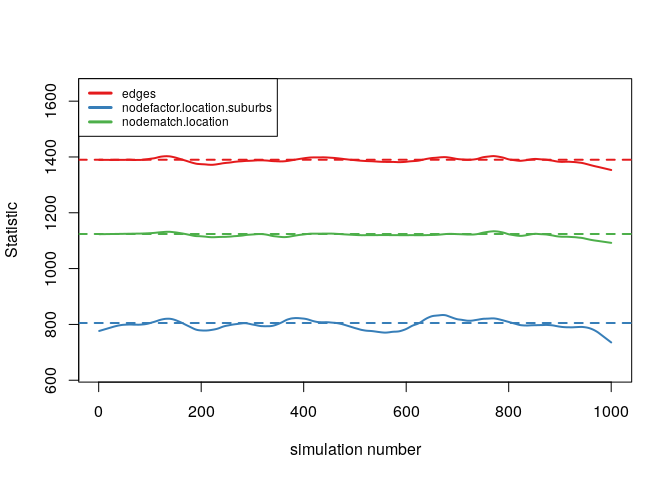
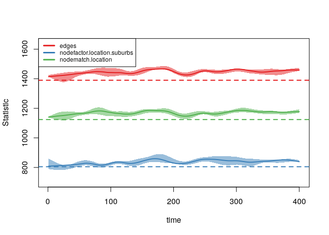
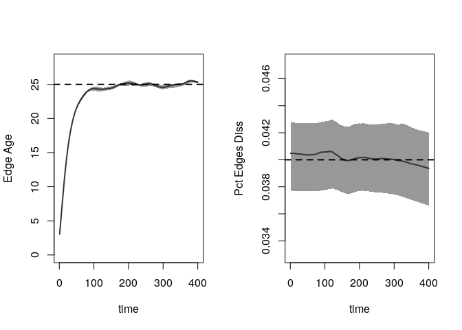
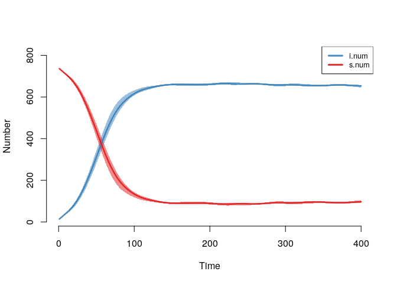
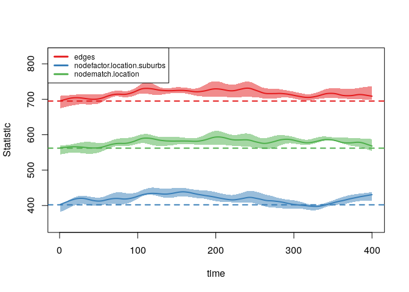
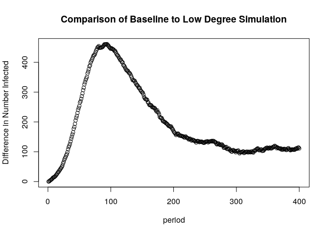
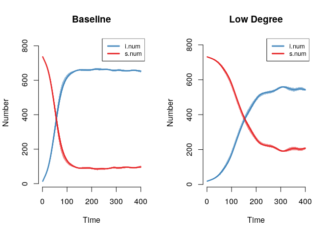
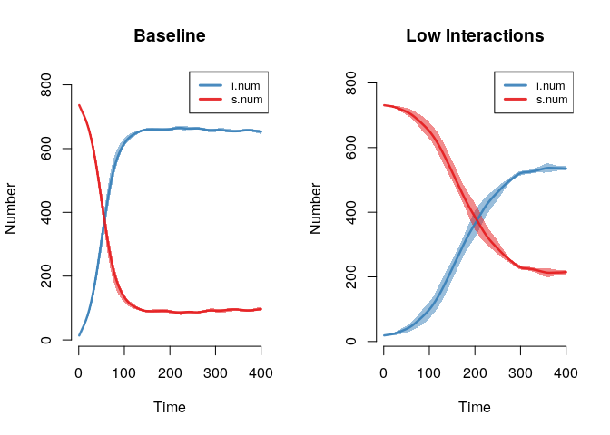

Epidemiology Diffusion Models
================
Saurabh Khanna
2020-05-14

## Chapter 14: R Tutorial on Epidemiological Models of Diffusion

Built with R version 3.6.3

This serves as the final tutorial for Chapter 14, covering models of
peer influence and diffusion. This tutorial will focus on dynamic
epidemiological models of diffusion. We will focus on the substantive
case of infection spread (like HIV or HCV) through a risk network (like
drug use or a sex network). We are particularly interested in how the
features of the network shape the potential for widespread contagion.
For example, how much does the epidemic potential decrease if the number
of current partners (e.g., number of sex partners during a given period)
decreases dramatically, so that network density decreases? We are also
interested in how risk behavior affects contagion potential.

We will utilize a dynamic network simulation in this tutorial.
Simulation models are useful as they can be conditioned on empirical
data, while also making it possible to explore complex, non-linear
dynamics; i.e., how individual behavior and wider network features
combine to shape infection potential. The model is dynamic as the
network is allowed to evolve as the simulation progresses. Thus, both
the network ties and the item of interest (the infection spreading over
the network) are allowed to update over time. The focus is still on
contagion, but actors are able to form and break ties as the simulation
progresses; making it possible to explore how the process of tie
formation, dissolution and maintenance affect the risk profile of a
population, in terms of infection spread.

The tutorial thus builds on the ideas from the Siena tutorial (that both
networks and behaviors can change through time) and the diffusion of
innovation tutorial (that network structure can affect diffusion in
important ways). See Chapters 14a and 14b. We will also draw on the
material from Chapters 13a and 13b, statistical models for network data.

### 1\. Reading in Data for Epidemiological Model

We will utilize the EpiModel package for this tutorial, so let’s go
ahead and load that first. We can cite EpiModel as: Jenness SM, Goodreau
SM, Morris M. EpiModel: An R Package for Mathematical Modeling of
Infectious Disease over Networks. Journal of Statistical Software. 2018;
84(8): 1-47. <DOI:10.18637/jss.v084.i08>.

``` r
library(EpiModel)
```

With EpiModel, the basic idea is to specify two kinds of processes, one
related to the formation and breaking of network ties, and one related
to the spread of an infection through the network, dictating how an
infection is spread from node i to node j. We will walk through both
processes below, but first we read in the data for our example.

Epidemiological simulations are often informed by empirical data. Given
the difficulty of collecting full network data on at-risk populations
(or sensitive relations), researchers will often use sampled data to
inform the simulation. With sampled network data, respondents are
sampled from the population (using a random sample, RDS or convenience
sample) and they answer questions about themselves and the people they
are connected to on the relation of interest, such as drug or sex
partners (see Chapter 6). This information is then used to inform the
simulation, both in terms of the network model and the model of
infection spread.

Here, we will use a faux ego network data set (constructed for this lab)
to demonstrate how sampled network data can be used to inform diffusion
models of infection spread. We can assume that this data is drawn from
an at-risk population of drug users. The data includes the following
information about the respondent, or ego: the number of alters named for
each ego (with no cap) and information on where ego lives (city or
suburbs). The data also includes information on up to 3 named drug
partners; we have information on whether each named alter lives in the
city or suburbs. We can assume that ego reports on the location for each
alter. Let’s first read in this example data
set.

``` r
ego_dat=read.table(file="https://sites.google.com/site/jeffreysmithdatafiles/ego_network_example_data.txt", header=T, stringsAsFactors=FALSE)

head(ego_dat)
```

    ##   ids location degree location1 location2 location3
    ## 1   1     city      1      city      <NA>      <NA>
    ## 2   2     city      9      city   suburbs      city
    ## 3   3     city      2      city      city      <NA>
    ## 4   4     city      2      city      city      <NA>
    ## 5   5     city      5      city      city      city
    ## 6   6     city      5      city   suburbs      city

The main variables are: ids=ego id; location=does ego live in city or
suburbs?; degree=number of current drug partners for ego (say in the
last 3 months); location1=does first named alter live in city or
suburbs?; location2=does second named alter live in city or suburbs?;
location3=does third named alter live in city or suburbs?

We will use this data to walk through the process of specifying the
network and epidemic models. We will begin by walking through the basic
steps of setting up the simulation. We will then systematically vary the
features of the simulation, to see how shifts in network formation and
risk behaviors change the epidemic potential.

### 2\. Specifying the Network Model

The first step in the process is to specify the features of the network
that will be utilized in the simulation. In this case, we will use the
ego network data read in above as a means of constructing the network.
This ensures that our simulation is based on information from the
population of interest. We will first define the size of the network to
be used in the simulation. For simplicity, we will set the network size
as the size of the sample. Note that it is also possible to employ a
network that is larger than the size of the sample. For example, if we
had known the true size of the population we could have set the number
of nodes to that value.

Let’s see how many people are in the sample:

``` r
num_nodes=nrow(ego_dat) 
num_nodes
```

    ## [1] 750

Here we create an empty, undirected network of size 750 (defined in
num\_nodes). This will be in the network (not igraph) format.

``` r
epi_network=network.initialize(n=num_nodes, directed=F)
```

Now, we will take our constructed network and add some nodal attributes,
based on the values seen in the observed data. To put the attributes
onto the empty network we use a set.vertex.attribute function. Here we
will add location as a vertex attribute, setting the nodes in the
network to have the same distribution of city/suburbs as seen in the ego
network data.

``` r
epi_network=set.vertex.attribute(epi_network, attrname="location", 
                                 value=ego_dat$location)
epi_network 
```

    ##  Network attributes:
    ##   vertices = 750 
    ##   directed = FALSE 
    ##   hyper = FALSE 
    ##   loops = FALSE 
    ##   multiple = FALSE 
    ##   bipartite = FALSE 
    ##   total edges= 0 
    ##     missing edges= 0 
    ##     non-missing edges= 0 
    ## 
    ##  Vertex attribute names: 
    ##     location vertex.names 
    ## 
    ## No edge attributes

Now that we have the most basic features of the network defined, we need
to specify a model that determines how ties form and break within the
simulation. Here, we will base the network formation model on the
information found in our ego network data. The ego network data in this
case is restricted to number of alters, location of ego and location of
named alter. Actual surveys may include much more detailed information;
for example, about the duration of the relationship and the frequency of
interaction.

We will now specify our tie formation formula, dictating how actors form
ties over time within the simulation. The formula takes the same kinds
of terms used in the ERGM and STERGM tutorials in Chapter 13 and is
based on the available information from the ego network data. We will
keep the model very simple and only include terms for edges (setting the
baseline rate for number of partners), a nodefactor term for location
(showing if people in the city have more/less ties than those in the
suburbs), and a nodematch term for location (setting the strength of
homophily for location—e.g., do people in the city disproportionately
form ties with people in the city?). There are a number of other terms
we could have added, including a concurrent term that captures how many
nodes have more than 2 edges in a given time step (an important
determinant of epidemic potential). Here we set the base formula.

``` r
formation_formula=formula(~ edges + nodefactor("location") + 
                              nodematch("location"))
```

Now, we set the target statistics for each term in the formula. This
will determine what kinds of networks are generated during the
simulation (in a given period). The networks will be generated to be
consistent with the target statistics on each term. The key is figuring
out how to use the ego network data to set empirically-grounded target
statistics.

First, we set the number of edges. This sets the baseline number of
edges in the simulation, or the number of edges that exist (on average)
per period. Here, we can use the mean degree in the ego network data,
coupled with the size of the network, to set the desired number of
edges. The total number of edges is just the mean degree X the number of
nodes in the network. Let’s calculate mean degree from the ego network
data.

``` r
mean_degree=mean(ego_dat$degree) 

mean_degree 
```

    ## [1] 3.706667

We can see that respondents have 3.7 edges on average. Now, we will take
the mean degree, 3.7, multiply it by the number of nodes, 750, and
divide it by 2 (as the network is undirected) to get the total number of
edges.

``` r
edges=mean_degree*num_nodes/2 

edges
```

    ## [1] 1390

Second, we set the nodefactor term on location. The nodefactor term is
defined by the total number of ties emanating from one group. This is
defined as: the mean degree of the group X the number of people in that
group. Let’s first calculate mean degree for those in the city and the
suburbs. We will use a tapply function to calculate mean degree by
location.

``` r
mean_degree_location=tapply(X=ego_dat$degree, INDEX=ego_dat$location, FUN=mean) 
mean_degree_location 
```

    ##    city suburbs 
    ##    3.95    3.22

We see those in the city have higher degree than those in the suburbs.
Now, let’s calculate the number in the city and the suburbs. We do a
simple table on location to see how many are in the city versus the
suburbs.

``` r
tab_location=table(ego_dat$location) 

tab_location
```

    ## 
    ##    city suburbs 
    ##     500     250

We now need to calculate the total number of edges for each group by
multiplying the mean degree for each group by the size of each group.

``` r
edges_by_group=mean_degree_location*tab_location

edges_by_group 
```

    ##    city suburbs 
    ##    1975     805

In this case, city will serve as the reference category (by default the
first category) in the formula and we thus only need the number of edges
for those in the suburbs.

``` r
edges_suburbs=edges_by_group[2] 
```

Finally, let’s set the target statistic for the nodematch term, showing
how strong homophily is for location. We need to calculate the number of
edges we expect to match on location (so ij are both in the city or both
in the suburbs). To get this from the ego network data, we first
calculate the proportion of ego-alter pairs where ego and alter are in
the same location (city/suburb). We will then take that proportion and
multiply it by the total number of edges in the network. We begin by
determining if the respondent has the same or different location as each
alter.

``` r
same_location=ego_dat[,"location"]==ego_dat[, c("location1", 
                                              "location2", "location3")] 
head(same_location)
```

    ##      location1 location2 location3
    ## [1,]      TRUE        NA        NA
    ## [2,]      TRUE     FALSE      TRUE
    ## [3,]      TRUE      TRUE        NA
    ## [4,]      TRUE      TRUE        NA
    ## [5,]      TRUE      TRUE      TRUE
    ## [6,]      TRUE     FALSE      TRUE

This says that respondent 1 has 1 alter and they are in the same
location; respondent 2 has 3 alters, and is in the same location as 1
and 3 but a different location as alter 2; and so on. Now, let’s see
what proportion of ego-alter pairs match on location. We will do a
simple table on the data frame constructed above, with a prop.table
function applied to get the proportions:

``` r
prop_match=prop.table(table(same_location))

prop_match 
```

    ## same_location
    ##     FALSE      TRUE 
    ## 0.1916966 0.8083034

So, about 81% of edges should match on location. Note that we still need
to calculate the number of edges we expect to match on location (so far
we just have the proportion). We will take the proportion matching (the
second element in prop\_match) and multiply it by the total number of
edges in the desired network:

``` r
num_match=round(prop_match[[2]]*edges)

num_match 
```

    ## [1] 1124

We see that 1124 edges should match on location. Now we put together the
target statistics into one input
vector.

``` r
target_statistics_baseline=c(edges=edges, nodefactor.location=edges_suburbs, 
                             nodematch.location=num_match) 
target_statistics_baseline
```

    ##                       edges nodefactor.location.suburbs          nodematch.location 
    ##                        1390                         805                        1124

This means that edges, in a given period, will form in a way consistent
with these input statistics. For example, we would expect 1390 edges (or
about 3.7 ties per person) in a given period, of which around 1124
should be within the same location. Note that we can alter these basic
values in subsequent simulations, to see how shifting network formation
patterns affect diffusion.

We also need to specify a model that will dictate how edges are dropped
over time. This is set via a dissolution\_coefs function. The inputs
are:

  - dissolution=a formula that determines how edges are dropped. This
    can take a number of forms. The simplest version is that all edges
    are dropped at the same rate; a more complicated model could allow
    edges of certain characteristics to end at different rates (so we
    may think that if two people share the same characteristic, then the
    edge may last longer).
  - duration=the average duration of an edge in the simulation; this is
    recorded in arbitrary time units (but we can think of this as months
    for concreteness)
  - d.rate=the death rate of the population (so that nodes can leave the
    network across time, at least potentially).

Here, we create a fairly simple dissolution model. In this case, all
edges dissolve at the same rate (set using `offset(edges)`), with
average duration of 25 time units (not based on actual data, although it
could be). The exit, or death rate, is set at .001.

``` r
dissolution_coefs=dissolution_coefs(dissolution= ~offset(edges), 
                                    duration=25, d.rate=.001)
dissolution_coefs  
```

    ## Dissolution Coefficients
    ## =======================
    ## Dissolution Model: ~offset(edges)
    ## Target Statistics: 25
    ## Crude Coefficient: 3.178054
    ## Mortality/Exit Rate: 0.001
    ## Adjusted Coefficient: 3.229321

### 3\. Estimating the Dynamic Network Model

We now estimate the statistical network model that will be used in our
epidemiological simulation. The function is netest, which is a wrapper
for the ergm and tergm functions explored in Chapter 13. The main inputs
are:

  - nw=network object used as basis for simulation
  - formation=formula specifying formation of edges
  - target.stats=input target statistics corresponding to formation
    formula
  - coefs.diss=coefficients for dissolution of edges

There are a number of other inputs which may be useful/necessary
depending on the particular problem at hand. For example, it is possible
to change the control parameters used in the estimation routine. Here,
we set nw as the base network constructed above; formation is set to our
formation formula; target.stats is set to our target statistics vector
and coef.diss is set to our dissolution coefficients calculated above.
We also use set.seed to help in reproducing the model.

``` r
set.seed(100)

net_mod=netest(nw=epi_network, formation=formation_formula, 
                 target.stats=target_statistics_baseline, 
                 coef.diss=dissolution_coefs) 
```

``` r
summary(net_mod)
```

    ## 
    ## ==========================
    ## Summary of model fit
    ## ==========================
    ## 
    ## Formula:   TARGET_STATS ~ edges + nodefactor("location") + nodematch("location")
    ## <environment: 0x557b191d7658>
    ## 
    ## Iterations:  2 out of 20 
    ## 
    ## Monte Carlo MLE Results:
    ##                             Estimate Std. Error MCMC % z value Pr(>|z|)    
    ## edges                       -6.26949    0.07070      0 -88.680  < 1e-04 ***
    ## nodefactor.location.suburbs  0.11631    0.03434      0   3.387 0.000707 ***
    ## nodematch.location           1.29273    0.07146      0  18.091  < 1e-04 ***
    ## ---
    ## Signif. codes:  0 '***' 0.001 '**' 0.01 '*' 0.05 '.' 0.1 ' ' 1
    ## 
    ## Log-likelihood was not estimated for this fit.
    ## To get deviances, AIC, and/or BIC from fit `object$fit` run 
    ##   > object$fit<-logLik(object$fit, add=TRUE)
    ## to add it to the object or rerun this function with eval.loglik=TRUE.
    ## 
    ## Dissolution Coefficients
    ## =======================
    ## Dissolution Model: ~offset(edges)
    ## Target Statistics: 25
    ## Crude Coefficient: 3.178054
    ## Mortality/Exit Rate: 0.001
    ## Adjusted Coefficient: 3.229321

Before we can use the model in a simulation, we need to make sure it is
acting like we expect. We can use the netdx function to see if the model
is producing networks that match the target statistics, an indication
that the model is working correctly. The netdx function will simulate
networks from the estimated model and compare the statistics from the
simulated networks to the input target statistics. There are two basic
versions of the comparison, one dynamic and one static. For the static
comparison, the model simulates networks based on the underlying model
for one time period, with no tie gain/loss over time. This is directly
akin to looking at convergence in an ERG model. For the dynamic
comparison, the model compares the target statistics in the simulated
network to the input target statistics (per period), while adjusting for
edge dissolution and creation. The main inputs to netdx are:

  - x=model estimated from netest
  - nsims=number of simulated networks
  - dynamic=should look at dynamic statistics (T/F)?
  - nsteps=number of time periods in dynamic simulation
  - nwstats.formula=formula of statistics to test against, default is
    the target statistics specified in the formation formula.

First, we will check the fit in the static case, to see if the base
model reproduces the target statistics. Note that we do not include a
nsteps option as the simulated networks are only based on a single time
period.

``` r
mod_fit1=netdx(x=net_mod, dynamic=F, nsims=1000) 
```

``` r
plot(mod_fit1) 
```

<!-- -->

The fit looks good, with the simulated networks matching the target
statistics in the cross-section. Now, let’s look at the target
statistics when we allow ties to dissolve and form over time. In this
case, we will set dynamic equal to T and set the number of time periods,
here equal to 400. Note that with 400 time periods for each simulation,
we want to keep the number of simulations (nsims) fairly low (given the
run time); here we set nsims to 5.

``` r
mod_fit2=netdx(x=net_mod, dynamic=T, nsims=5, nsteps=400) 
```

``` r
mod_fit2 
```

    ## EpiModel Network Diagnostics
    ## =======================
    ## Diagnostic Method: Dynamic
    ## Simulations: 5
    ## Time Steps per Sim: 400
    ## 
    ## Formation Diagnostics
    ## ----------------------- 
    ##                             Target Sim Mean Pct Diff Sim SD
    ## edges                         1390 1446.117    4.037 36.279
    ## nodefactor.location.suburbs    805  836.793    3.949 37.693
    ## nodematch.location            1124 1169.590    4.056 31.599
    ## 
    ## Dissolution Diagnostics
    ## ----------------------- 
    ##                Target Sim Mean Pct Diff Sim SD
    ## Edge Duration   25.00   23.318   -6.727 22.722
    ## Pct Edges Diss   0.04    0.040    0.330  0.005

We can see that there are two different sets of target statistics, one
capturing the target statistics at different time points in the
simulation and the second looking at the duration and dissolution of
edges. Let’s first look at the target statistics.

``` r
plot(mod_fit2) 
```

<!-- -->

This generally looks okay, although the statistics from the simulated
networks are bit above the target statistics. Now, let’s look at
duration and dissolution of ties. We will first set up the plot to have
two columns. To plot the statistics dealing with the duration of ties we
set type=“duration”. To plot the statistics dealing with the dissolution
of ties we set type=“dissolution”

``` r
par(mfrow=c(1,2))

plot(mod_fit2, type="duration") 
plot(mod_fit2, type="dissolution") 
```

<!-- -->

The dotted line represents the expected duration of ties (set at 25 in
this case). Note that there is a long initial time period before the
duration of the ties looks ‘right’. This is correct as the simulation
needs a sufficient number of time periods for ties to add and drop
before the overall duration reaches equilibrium. We can also look at the
bottom part of the output from above to see if the duration and
dissolution target values match the simulation.

``` r
mod_fit2
```

    ## EpiModel Network Diagnostics
    ## =======================
    ## Diagnostic Method: Dynamic
    ## Simulations: 5
    ## Time Steps per Sim: 400
    ## 
    ## Formation Diagnostics
    ## ----------------------- 
    ##                             Target Sim Mean Pct Diff Sim SD
    ## edges                         1390 1446.117    4.037 36.279
    ## nodefactor.location.suburbs    805  836.793    3.949 37.693
    ## nodematch.location            1124 1169.590    4.056 31.599
    ## 
    ## Dissolution Diagnostics
    ## ----------------------- 
    ##                Target Sim Mean Pct Diff Sim SD
    ## Edge Duration   25.00   23.318   -6.727 22.722
    ## Pct Edges Diss   0.04    0.040    0.330  0.005

We can see, for example, that the target percent of edges that dissolve
is .04, matching what we see in the simulation (looking at the Sim Mean
column).

### 4\. Specifying Epidemic Model

The second main step is to specify the epidemic part of the simulation,
determining the manner in which the infection spreads through social
connections. EpiModel allows for a flexible range of models to be
specified, although it is also possible to write additional code to
extend the functionality of the package. Here, we will consider a simple
contagion model, where actors, once infected, can pass it on to those
they interact with (e.g., share needles with) in a given time period. In
the language of epidemiological studies, we will consider a SIS model
(susceptible-infected-susceptible) where actors are either infected or
susceptible to be infected. We will assume that actors can be
reinfected, once recovered. We could alternatively assume that actors
cannot be reinfected, thus running an SIR model
(susceptible-infected-recovered). To run an epidemiological simulation,
in conjunction with our network model specified above, we need to create
a number of inputs, shaping the features of the simulation.

As a first step, we need to create a vector that captures the initial
state that each node is in at the start of the simulation. Each node
must be set to a “s” “i” or “r” for susceptible, infected or recovered.
Here, let’s randomly select 3% of the population to be infected. We will
use a sample function, randomly sampling an s, i, or r state for each
node, with probability .97, .03 and 0 (so no one is recovered). We set
size to num\_nodes so that each node in the simulation will have an
initial state.

``` r
initial_status=sample(c("s", "i", "r"), size=num_nodes, 
                      replace=T, prob=c(.97, .03, 0)) 
table(initial_status)
```

    ## initial_status
    ##   i   s 
    ##  18 732

We then need to feed this vector of initial states to the init.net
function, with status.vector set to the vector of initial states.

``` r
initial_status_inputs=init.net(status.vector=initial_status)
```

Now, we will go ahead and set the probabilities of infection and
recovery using a param.net function. The inputs are:

  - inf.prob=the probability of infection in a given interaction (or
    act)
  - act.rate=number of interactions (or acts) in a time period between i
    and j, assuming that i and j are connected in that period.
  - rec.rate=the rate of recovery in a time period

Here we will we set the probability of infection to .025, so that in a
given act between i and j (like sharing needles) the probability of
infection is .025. We set the number of acts per period to 1. This means
that a pair, ij, that have a relationship have 1 risk event on average,
per period. In each risk event, node i, if infected, can pass the
infection to j. Finally, we set the recovery rate to .01, so that a node
has a .01 probability of recovering in a given time period. These inputs
could be informed by actual data or could represent theoretical inputs,
as in this case (which could then be varied to see their effect on the
epidemic potential).

``` r
input_to_episim=param.net(inf.prob=0.025, act.rate=1, rec.rate=0.01) 

input_to_episim
```

    ## Network Model Parameters
    ## ===========================
    ## inf.prob = 0.025
    ## act.rate = 1
    ## rec.rate = 0.01

Finally, we need to create an object that controls the simulation
itself. Here we use the control.net function. The main inputs are:

  - type=SI, SIR, SIS
  - nsteps=number of time periods for simulation
  - nsims=number of simulations to perform
  - ncores=number of processors to use in simulation (if multiple cores
    are to be used)

Here we will we set type to “SIS”, have a simulation with 400 time
periods, do the simulation 4 times and run it over 2 processors. We
would want to do this with more simulations in an actual analysis.

``` r
control_episim=control.net(type="SIS", nsteps=400, nsims=4, ncores=2) 

control_episim
```

    ## Network Model Control Settings
    ## ===============================
    ## type = SIS
    ## nsteps = 400
    ## start = 1
    ## nsims = 4
    ## ncores = 2
    ## rec.rand = TRUE
    ## a.rand = TRUE
    ## d.rand = TRUE
    ## tea.status = TRUE
    ## use.pids = TRUE
    ## module.order =
    ## save.nwstats = TRUE
    ## nwstats.formula = formation
    ## delete.nodes = FALSE
    ## save.transmat = TRUE
    ## save.network = TRUE
    ## verbose = TRUE
    ## verbose.int = 1
    ## skip.check = FALSE
    ## attr.rules = <list>
    ## Base Modules: initialize.FUN departures.FUN arrivals.FUN recovery.FUN 
    ## edges_correct.FUN resim_nets.FUN infection.FUN get_prev.FUN verbose.FUN

We can now run our epidemiological simulation using the netsim function.
The main inputs are:

  - x=fitted network model, based on netest function
  - param=model parameters, based on param.net function
  - init=initial status inputs, based on init.net function
  - control=control object, based on control.net function

Let’s go ahead and run the simulation using the objects constructed
above.

``` r
episim_baseline = netsim(x=net_mod, param=input_to_episim, 
                         init=initial_status_inputs, control=control_episim) 
```

To get an initial sense of the results, we can do a quick summary on the
simulation object. We will first convert the object to a data frame. We
will use an out=“mean” option to tell R to output the mean values over
all simulations.

``` r
summary_data_baseline=as.data.frame(episim_baseline, out="mean") 

head(summary_data_baseline)
```

    ##   time  s.num i.num num is.flow si.flow
    ## 1    1 732.00 18.00 750    0.00    0.00
    ## 2    2 730.50 19.50 750    0.25    1.75
    ## 3    3 727.75 22.25 750    0.00    2.75
    ## 4    4 725.75 24.25 750    0.00    2.00
    ## 5    5 722.75 27.25 750    0.00    3.00
    ## 6    6 720.75 29.25 750    0.25    2.25

Each row in the data set corresponds to a different time period in the
simulation. The s.num column shows how many people in that period are
susceptible (but not infected) while i.num shows how many people are
infected. i.num is a cumulative distribution of the number infected,
while si.flow shows how many move from susceptible to infected (and
is.flow shows the opposite). The values correspond to the mean number
over all simulations. We can also print the rate of infected and
susceptible at particular days using a summary command and an at option.
Here we look at period 1.

``` r
summary(episim_baseline, at=1) 
```

    ## 
    ## EpiModel Summary
    ## =======================
    ## Model class: netsim
    ## 
    ## Simulation Details
    ## -----------------------
    ## Model type: SIS
    ## No. simulations: 4
    ## No. time steps: 400
    ## No. NW modes: 1
    ## 
    ## Model Statistics
    ## ------------------------------
    ## Time: 1 
    ## ------------------------------ 
    ##           mean  sd    pct
    ## Suscept.   732   0  0.976
    ## Infect.     18   0  0.024
    ## Total      750   0  1.000
    ## S -> I       0   0     NA
    ## I -> S       0   0     NA
    ## ------------------------------

Or period 100:

``` r
summary(episim_baseline, at=100)
```

    ## 
    ## EpiModel Summary
    ## =======================
    ## Model class: netsim
    ## 
    ## Simulation Details
    ## -----------------------
    ## Model type: SIS
    ## No. simulations: 4
    ## No. time steps: 400
    ## No. NW modes: 1
    ## 
    ## Model Statistics
    ## ------------------------------
    ## Time: 100 
    ## ------------------------------ 
    ##             mean      sd    pct
    ## Suscept.  134.25  26.399  0.179
    ## Infect.   615.75  26.399  0.821
    ## Total     750.00   0.000  1.000
    ## S -> I      9.00   4.243     NA
    ## I -> S      6.75   0.500     NA
    ## ------------------------------

We can also plot the number of infected and susceptible over time,
generating the diffusion curve for the simulation. The basic inputs are
the netsim object and then the items to plot. Here we want to plot the
number infected and susceptible, denoted by “i.num” and “s.num”. We also
add a legend=T option.

``` r
par(mfrow=c(1, 1))

plot(episim_baseline, y=c("i.num", "s.num"), legend=T) 
```

<!-- -->

We can see that in this particular simulation the infection spreads
relatively quickly through the network, with close to 85% infected by
the 100th time period. It is also useful to be able to grab networks
from the simulation. For example, we may want to know what the network
looks like at a given time period. We may also want to know who is
infected/susceptible at a given time period. This would make it possible
to see which groups (or individuals) are more likely to be infected over
time.

The function is get\_network. The main inputs are:

  - x=netsim object
  - sim=simulation number to grab network from
  - collapse=T/F should collapse dynamic network into static network at
    designated time period?
  - at=what time period should be used to collapse network (if
    collapse=T)

Here we just look at time period 20 for the first simulation, setting
collapse to TRUE.

``` r
netsim_at20=get_network(x=episim_baseline, sim=1, collapse=TRUE, at=20)

netsim_at20 
```

    ##  Network attributes:
    ##   vertices = 750 
    ##   directed = FALSE 
    ##   hyper = FALSE 
    ##   loops = FALSE 
    ##   multiple = FALSE 
    ##   bipartite = FALSE 
    ##   vertex.pid = vertex.pid 
    ##   edge.pid = edge.pid 
    ##   total edges= 1431 
    ##     missing edges= 0 
    ##     non-missing edges= 1431 
    ## 
    ##  Vertex attribute names: 
    ##     location testatus vertex.names vertex.pid 
    ## 
    ##  Edge attribute names not shown

Note that the network object has vertex attributes from the input
network, like location, as well as new attributes based on the
simulation. Most importantly, testatus tells us who is infected in that
time period. Let’s go ahead and extract infection status for each node
from the created network object using a get.vertex.attribute command.

``` r
status=get.vertex.attribute(netsim_at20, attrname="testatus")

table(status)
```

    ## status
    ##   i   s 
    ##  64 686

We can also extract the infection statuses and networks over all periods
by setting collapse to F in get\_network.

``` r
netsim_0_400=get_network(x=episim_baseline, sim=1, collapse=F)

netsim_0_400
```

    ## NetworkDynamic properties:
    ##   distinct change times: 402 
    ##   maximal time range: -Inf until  Inf 
    ## 
    ##  Dynamic (TEA) attributes:
    ##   Vertex TEAs:    testatus.active 
    ## 
    ## Includes optional net.obs.period attribute:
    ##  Network observation period info:
    ##   Number of observation spells: 2 
    ##   Maximal time range observed: 1 until 401 
    ##   Temporal mode: discrete 
    ##   Time unit: step 
    ##   Suggested time increment: 1 
    ## 
    ##  Network attributes:
    ##   vertices = 750 
    ##   directed = FALSE 
    ##   hyper = FALSE 
    ##   loops = FALSE 
    ##   multiple = FALSE 
    ##   bipartite = FALSE 
    ##   net.obs.period: (not shown)
    ##   vertex.pid = vertex.pid 
    ##   edge.pid = edge.pid 
    ##   total edges= 23266 
    ##     missing edges= 0 
    ##     non-missing edges= 23266 
    ## 
    ##  Vertex attribute names: 
    ##     active location testatus.active vertex.names vertex.pid 
    ## 
    ##  Edge attribute names not shown

We have created a networkDynamic object capturing the changes in nodes,
edges and attributes over the simulation (see Chapter 3c). Here, we will
focus on changing infection status. We can use a
get.vertex.attribute.active function to extract time varying vertex
attributes, here testatus. The inputs are the networkDynamic object, the
attribute to extract, and the period to extract over (here starting at 0
and going to 400). We set return.tea T to get the time varying attribute
over the periods specified.

``` r
infection_status=get.vertex.attribute.active(netsim_0_400, 
                                             "testatus", 
                                             onset=0, length=400,
                                             return.tea=T)
```

Each element in the list corresponds to a different node in the
simulation. Let’s take a look at the first node:

``` r
infection_status[[1]]
```

    ## [[1]]
    ## [[1]][[1]]
    ## [1] "s"
    ## 
    ## [[1]][[2]]
    ## [1] "i"
    ## 
    ## [[1]][[3]]
    ## [1] "s"
    ## 
    ## [[1]][[4]]
    ## [1] "i"
    ## 
    ## 
    ## [[2]]
    ##      [,1] [,2]
    ## [1,]    1   57
    ## [2,]   57  235
    ## [3,]  235  270
    ## [4,]  270  Inf

The output is organized in two parts. The first part describes the
values taken for the attribute of interest, here “s” (susceptible), “i”
(infected) or “r” (recovered). The second part describes the periods
where that node took on each value. We can see that node 1 moves back
and forth from being susceptible to infected a number of times during
the simulation. We can use this kind of output to see who is most likely
to get infected (i.e., city versus suburbs) and how this varies across
different simulations.

### 5\. Varying Network Features

One key advantage of a simulation is that we can systematically alter
the input parameters (while holding other things constant), allowing us
to see how shifting conditions could, theoretically, affect diffusion
through the population. Here, we will keep the basic epidemiological
simulation the same but tweak the network features to see how this
changes the epidemic potential. In particular, we will ask how the
spread of infection through the population is affected when the number
of partners per person decreases substantially. We will assume that the
number of edges in the network in a given time period is cut in half.
Here individuals have, on average, degree of 1.85, rather than 3.7. To
construct inputs for the simulation, we will take the target statistics
used originally and simply multiple all of them by .5. This will
directly cut the number of edges in half. It will also ensure that all
of the other target statistics, like nodematch on location, are based on
the new desired number of edges (here half the original).

``` r
target_statistics_lowdegree=round(target_statistics_baseline*.5)

target_statistics_lowdegree
```

    ##                       edges nodefactor.location.suburbs          nodematch.location 
    ##                         695                         402                         562

Now we run the network model using the new target statistics. All other
inputs are the same.

``` r
net_mod_lowdegree=netest(nw=epi_network, 
                         formation=formation_formula, 
                         target.stats=target_statistics_lowdegree, 
                         coef.diss=dissolution_coefs)
```

And let’s check to make sure the model is working as expected.

``` r
mod_fit_lowdegree=netdx(x=net_mod_lowdegree, dynamic=T, 
                          nsims=5, nsteps=400)
```

``` r
plot(mod_fit_lowdegree) 
```

<!-- -->

Looks okay, so we can go ahead and use the dynamic network model in the
epidemiological simulation. The inputs are the same as before but now we
use the network model based on the lower mean degree.

``` r
episim_lowdegree=netsim(x=net_mod_lowdegree, param=input_to_episim, 
                          init=initial_status_inputs, control=control_episim)
```

Let’s get a summary data frame of the new, lower degree simulation:

``` r
summary_data_lowdegree=as.data.frame(episim_lowdegree, out="mean")
```

And let’s compare period 10, 25, 50, 100, 150 and 400 between the two
simulations, just including the number infected (“i.num” in the summary
data frames).

``` r
period=c(10, 25, 50, 100, 150, 400)

compare_dat=data.frame(period=period, 
                       i.num.baseline=summary_data_baseline[period, "i.num"],
                       i.num.lowdegree=summary_data_lowdegree[period, "i.num"])

compare_dat
```

    ##   period i.num.baseline i.num.lowdegree
    ## 1     10          39.00           24.25
    ## 2     25          94.75           29.00
    ## 3     50         310.00           56.25
    ## 4    100         615.75          170.75
    ## 5    150         660.75          362.00
    ## 6    400         653.00          542.00

Each row reports the number infected for each simulation for that time
period. The second column reports the baseline model, run above (using
mean degree of 3.7), while the third column reports the low degree
simulation results. We can see that the low degree simulation has a
lower number of infected at each time period, but the differences are
striking around periods 50 to 150 (with differences of over 200 people
infected). We can also plot the difference in number infected between
the two
simulations.

``` r
diff_infected=summary_data_baseline[,"i.num"] - summary_data_lowdegree[,"i.num"]

plot(1:400, diff_infected, xlab="period", ylab="Difference in Number Infected",
     main="Comparison of Baseline to Low Degree Simulation")
```

<!-- -->

Now let’s plot the diffusion curves for the baseline simulation and the
low degree simulation on one plot.

``` r
par(mfrow=c(1, 2))

plot(episim_baseline, y=c("i.num", "s.num"), 
     legend=TRUE, main="Baseline")

plot(episim_lowdegree, y=c("i.num", "s.num"), 
     legend=TRUE, main="Low Degree")
```

<!-- -->

Overall, the average number of partners in a time period clearly affects
the diffusion potential. With fewer edges per period, the potential to
become infected and pass it on is greatly diminished. The decrease in
average number of partners affects both the final number of infected, as
well as the pace of infection, creating large differentials in infection
in the middle periods. This suggests that decreasing the number of
partners per period can reduce epidemic potential, but even here (in the
low degree case) we still see a high rate of cases infected by the end
of the simulation (around 75%).

### 6\. Varying Infection Simulation

Just as we were able to systematically vary the network model in the
simulation, we can also vary the input parameters to the epidemic
simulation. Here, we will keep the network the same as in the baseline
model (so average degree is set to 3.7, based on the original ego
network data). We will only alter the inputs to the epidemiological part
of the simulation. We will focus on the activity rate parameter. This
governs how many times, on average, two nodes with a connection interact
in a given time period. Given a connection, node i and j may interact 0,
1, 2, 3… times in a given period, with increasing risk of infection as
the number of interactions increases.

Here we will create a new set of input parameters using the param.net
function. We will again set the infection probability to .025 and the
recovery rate to .01. This time, however, we will lower the average
number of interactions per period (assuming i and j are connected) to
.40. This means that in a given period many ij pairs who are connected
will not actually interact and thus there is no chance for i to pass an
infection to j (in that period). Nodes thus have a relatively high
number of partners, but they only share risk events with a fraction of
them in a given time period. Formally, we set the act.rate input to .40
in the param.net function.

``` r
input_to_episim_lowinteraction=param.net(inf.prob=0.025, act.rate=.40, 
                                         rec.rate=0.01) 
```

We now rerun the epidemic simulation, using the lower interaction
inputs. All other inputs are the same as in the baseline
model.

``` r
episim_lowinteraction = netsim(x=net_mod, param=input_to_episim_lowinteraction,
                               init=initial_status_inputs, 
                               control=control_episim)
```

Now let’s plot the diffusion curves for the baseline simulation and the
low interaction simulation on one plot.

``` r
par(mfrow=c(1, 2))

plot(episim_baseline, y=c("i.num", "s.num"), 
     legend=T, main="Baseline")

plot(episim_lowinteraction, y=c("i.num", "s.num"),
     legend=T, main="Low Interactions")
```

<!-- -->

We can clearly see the effect of interaction rate on epidemic size
(looking at the “i.num” lines). When nodes only interact with some of
their partners in a given period (as the average rates falls below 1),
the potential for infection spread is greatly diminished. Even if nodes
maintain a large set of partners, if they don’t actually interact with
them, there is diminished chance for diffusion over the network. We thus
begin to see the importance of distinguishing between relationships that
exist and specific interactions that take place where there is a risk
for infection to spread.

Substantively, we have seen how average degree and number of
interactions per period affect epidemic potential. By lowering both the
number of partners and the number of interactions (within
relationships), the pace of infection spread decreases. In each case,
however, the number infected at the end of the simulation is still quite
high. As a further analysis, we could uncover how low these two inputs
(or other potential inputs) would have to be set to lower the final
epidemic size. We could also use this simulation platform to ask
different kinds of questions; for example we may be interested in seeing
the rate of infection between urban and suburban actors. We may also
want to know how the differences between urban/suburban change as the
features of the simulation change, in terms of network features and
epidemic behavior. Finally, note that the EpiModel package is quite
flexible, making it possible to specify a wide range of network and
disease spread processes. We have explored only a part of the full range
of possibilities.

This serves as the final tutorial for Chapter 14, as well as the book as
a whole. Throughout the tutorials, we have included in-depth analyses of
different network topics and models. Of course, a single book cannot
hope to cover everything a researcher may want to do, and we encourage
readers to explore the packages discussed in this book more thoroughly
with their own data and project in mind.
