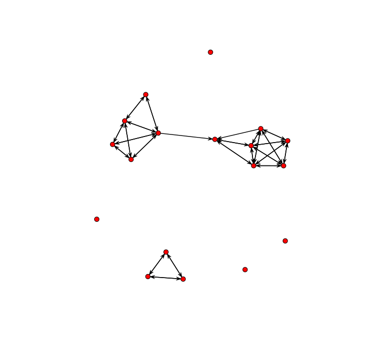

Dynamic Network Data
================
Saurabh Khanna
2020-04-16

  - [Chapter 3: R Tutorial on Dynamic Network
    Data](#chapter-3-r-tutorial-on-dynamic-network-data)
      - [1. Discrete Longitudinal Network
        Data](#discrete-longitudinal-network-data)
      - [2. Continuous-Time Network Data](#continuous-time-network-data)

# Chapter 3: R Tutorial on Dynamic Network Data

Built with R version 3.6.3

This is the third tutorial for Chapter 3, covering the basics of network
data in R. The second tutorial covered data management for
cross-sectional network data (a network observed at one time point),
while this tutorial will walk through the analogous steps for dynamic
network data. Here, we assume that a researcher has data on at least two
time points and is interested in exploring changes in the network over
time. We will cover the basics of handling dynamic network data and
calculating summary statistics on dynamic networks.

There are two basic types of dynamic network data. First, the data may
be a simple extension of cross-sectional data, where a researcher
collects network information, like friendships between students, at
multiple time points. The researcher can then ask how friendships change
between time T and T+1. The network data thus have a temporal component
to it, as ties can be dropped and added, but the time periods are
defined in a discrete manner. Alternatively, the data may take the form
of continuous-time, streaming data. In this case, the data are
time-stamped, with each interaction recorded sequentially. For example,
the data may be collected via cell phones (i sends a text message to j),
Bluetooth sensors (i and j are physically ‘close’), or first hand
observations of interactions (i talks to j in a meeting). The key
conceptual shift is from relationships (i and j are friends) to specific
interactions, or events. We begin the tutorial by exploring the case of
discrete longitudinal network data before turning to the case of
continuous-time network data.

### 1\. Discrete Longitudinal Network Data

We will utilize a small school-based network for the first part of this
tutorial, covering discrete longitudinal network data. The data were
collected by Daniel McFarland and are based on friendships between
students in a classroom. The network data were collected at two time
points, corresponding to the first and second semester of the school
year.

#### 1.1 Getting the Data Ready

Let’s begin by loading some useful packages. We will work with network
and sna, as well as the dynamic extensions of those packages,
networkDynamic (a package to manipulate dynamic network data) and tsna
(a package to calculate network statistics on dynamic networks). We will
not make use of igraph in this tutorial.

``` r
library(network)
library(sna)
library(networkDynamic)
library(tsna)
```

We can cite sna as: Carter T. Butts (2016). sna: Tools for Social
Network Analysis. R package version
2.4.https://CRAN.R-project.org/package=sna.

We can cite tsna as: Skye Bender-deMoll and Martina Morris (2019). tsna:
Tools for Temporal Social Network Analysis. R package version 0.3.0.
<https://CRAN.R-project.org/package=tsna>

And for networkDynamic: Carter T. Butts, Ayn Leslie-Cook, Pavel N.
Krivitsky and Skye Bender-deMoll (2019). networkDynamic: Dynamic
Extensions for Network Objects. R package version 0.10.0.
<https://CRAN.R-project.org/package=networkDynamic>

Let’s go ahead and walk through an example where we construct a dynamic
network object, which can then be used as input to other functions
(e.g., plotting functions). In the case of discrete-time data, we
construct our dynamic network object by creating separate networks for
each time period of interest and then putting the constructed networks
together in a single object.

We begin by reading in the data, starting with the semester 1 edgelist.
In reading in the data, we set colClasses to “character”. We want the
columns in the edgelist read in as character values because the sender
and receiver ids in the edgelist are labels for the nodes, and thus
cannot be interpreted as numeric values. This is different than in the
previous tutorial, where the ids of the nodes were numeric, running from
1 to N, where N was equal to the number of nodes in the network.

``` r
sem1_edgelist=read.table(file="https://sites.google.com/site/jeffreysmithdatafiles/class237_sem1_edgelist.txt", 
                         header=T, colClasses="character")
head(sem1_edgelist)
```

    ##   sender receiver
    ## 1 113214   121470
    ## 2 113214   125522
    ## 3 113214   149552
    ## 4 113214   122728
    ## 5 113214   122706
    ## 6 115909   127535

We see the ids of the senders and receivers of friendship ties. An edge
exists between i-\>j if i nominated j as a friend. Thus, 113214
nominated 121470 as a friend. Note that the values in the edgelist
(113214, 121470, etc. ) have no inherent meaning, and are only useful in
identifying each node.

Let’s also read in the attribute file, containing nodal characteristics.

``` r
sem1_attributes=read.table("https://sites.google.com/site/jeffreysmithdatafiles/class237_sem1_attributes.txt", 
                           header=T)
```

Let’s take a look at some of the main variables.

``` r
sem1_attributes[,c("ids", "sem_id", "expected_grade", "like_subject")]
```

    ##       ids sem_id expected_grade like_subject
    ## 1  113214      1              4            4
    ## 2  115909      1              4            3
    ## 3  121470      1              3            2
    ## 4  122706      1              4            3
    ## 5  122710      1              4            2
    ## 6  122714      1              4            3
    ## 7  122723      1              4            2
    ## 8  122724      1              3            2
    ## 9  122726      1              4            3
    ## 10 122728      1              4            2
    ## 11 122732      1              4            3
    ## 12 122734      1              4            3
    ## 13 125522      1              4            3
    ## 14 125567      1              4            4
    ## 15 126359      1              4            4
    ## 16 127535      1              4            3
    ## 17 128033      1              4            3
    ## 18 129483      1              3            2
    ## 19 138473      1              4            2
    ## 20 139163      1              4            1
    ## 21 140271      1              4            4
    ## 22 141006      1              4            3
    ## 23 144882      1              3            2
    ## 24 149552      1              4            3
    ## 25 151812      1              4            2

ids=id of node; sem\_id=semester where data comes from, 1 or 2;
expected\_grade: D=1 C=2 B=3 A=4; like\_subject: 1-4 scale, with
1=strong dislike to 4=like it a lot.

It will be useful to have the attribute file ordered from low to high in
terms of the ids. The network package will add vertices (or nodes) to
the network in order, based on the ids found in the edgelist. We thus
want our attributes of interest to be sorted in the same order (this
step would be unnecessary if were constructing networks using the igraph
package).

``` r
sem1_attributes=sem1_attributes[order(sem1_attributes$ids),]
```

And let’s also turn our data frame into a list, to make it easier to
place the vertex attributes onto the network.

``` r
attribute_list_sem1=do.call(list, sem1_attributes)
```

Let’s also set the size of the network on the edgelist (25 for both
semester 1 and semester 2).

``` r
attr(sem1_edgelist, "n")=25
```

With our attribute and edgelist objects together, we can now go ahead
and construct the network for semester 1, just like in the previous
tutorial.

``` r
sem1_net=network(x=sem1_edgelist, directed=T, vertex.attr=attribute_list_sem1)
```

Now, let’s go ahead and do the same thing to construct the second
semester network.

``` r
sem2_edgelist=read.table(file="https://sites.google.com/site/jeffreysmithdatafiles/class237_sem2_edgelist.txt", 
                         header=T, colClasses="character")

sem2_attributes=read.table("https://sites.google.com/site/jeffreysmithdatafiles/class237_sem2_attributes.txt", 
                           header=T)

attr(sem2_edgelist, "n")=25

sem2_attributes=sem2_attributes[order(sem2_attributes$ids),]

attribute_list_sem2=do.call(list, sem2_attributes)

sem2_net=network(x=sem2_edgelist, directed=T, vertex.attr=attribute_list_sem2)
```

As this is over time data, we need to be careful about the changing
composition of the network, where nodes can come and go over time. Some
students in semester 1 may not be in the class in semester 2 (and vice
versa). For this example, we will keep all nodes in the constructed
networks, even if they were not in the class for both semesters. This
means that the semester 1 network need not have the same set of nodes as
the semester 2 network. Alternatively, we could remove nodes from the
networks that were not present in both semesters. It is also important
to note that the attributes of the nodes are measured twice, once for
each semester. Thus, there can be change over time for nodal attributes,
like expected grade.

#### 1.2 Constructing networkDynamic Objects

We now have two network objects, one for each semester. The next task is
to put the two networks together as a networkDynamic object, which is
the dynamic version of a network object. networkDynamic objects are
useful as they can be used to calculate various statistics, produce
network movies (see Chapter 5) and serve as input to statistical models
(see Chapter 13b).

The main function is networkDynamic. There are a number of ways to
specify the input network data. With discretely observed longitudinal
data, we can use a list of networks as the main input. The list is
simply the network objects, in sequential order.

``` r
net_list=list(sem1_net, sem2_net)
```

We can now go ahead and create the networkDynamic object with the
network list as input. We will also set vertex.pid to “vertex.names”.
This ensures that all nodes present in at least one period will be
included in the constructed object, with a unique id attached to them.
Setting vertex.pid is particularly useful if there are nodes coming in
and out of the network across time, as in this case. Finally, we set
create.TEAs to T, telling the function to create time varying vertex
attributes for each attribute found on the input networks. This is
useful as it automatically creates vertex attributes based on the input
networks, while allowing the values to change across time.

``` r
net_dynamic_class=networkDynamic(network.list=net_list, vertex.pid="vertex.names", create.TEAs=T)
```

``` r
net_dynamic_class
```

    ## NetworkDynamic properties:
    ##   distinct change times: 3 
    ##   maximal time range: 0 until  2 
    ## 
    ##  Dynamic (TEA) attributes:
    ##   Vertex TEAs:    cls_id.active 
    ##      course_challenging.active 
    ##      expected_grade.active 
    ##      had_teacher_before.active 
    ##      ids.active 
    ##      like_subject.active 
    ##      like_teacher.active 
    ##      sem_id.active 
    ## 
    ## Includes optional net.obs.period attribute:
    ##  Network observation period info:
    ##   Number of observation spells: 1 
    ##   Maximal time range observed: 0 until 2 
    ##   Temporal mode: discrete 
    ##   Time unit: step 
    ##   Suggested time increment: 1 
    ## 
    ##  Network attributes:
    ##   vertices = 26 
    ##   directed = TRUE 
    ##   hyper = FALSE 
    ##   loops = FALSE 
    ##   multiple = FALSE 
    ##   bipartite = FALSE 
    ##   vertex.pid = vertex.names 
    ##   net.obs.period: (not shown)
    ##   total edges= 165 
    ##     missing edges= 0 
    ##     non-missing edges= 165 
    ## 
    ##  Vertex attribute names: 
    ##     active cls_id.active course_challenging.active expected_grade.active had_teacher_before.active ids.active like_subject.active like_teacher.active sem_id.active vertex.names 
    ## 
    ##  Edge attribute names: 
    ##     active

The networkDynamic object has 26 vertices (nodes present in at least one
period) and 165 edges (i is friends with j in at least one period). Note
that start time (or onset) is set to 0 and that the end time (or
terminus) is set to 2, defined as the period where no further change is
recorded. Thus, for a network with two discretely observed time periods,
the first network defines the ties existing during time period 0 (here
sem1\_net) while the second network defines the ties existing during
time period 1 (here sem2\_net). We also see a number of Dynamic (TEA)
time varying attributes, like expected\_grade, that are measured at our
two time points. Note that we can add fixed attributes to the object
(that do not change over time) using the set.vertex.attribute function.

Let’s take a look at the object as a data frame.

``` r
net_dat_class=as.data.frame(net_dynamic_class)
head(net_dat_class)
```

    ##   onset terminus tail head onset.censored terminus.censored duration edge.id
    ## 1     0        1    1    3          FALSE             FALSE        1       1
    ## 2     0        2    1   13          FALSE             FALSE        2       2
    ## 3     0        2    1   25          FALSE             FALSE        2       3
    ## 4     0        1    1   10          FALSE             FALSE        1       4
    ## 5     0        2    1    4          FALSE             FALSE        2       5
    ## 6     0        2    2   16          FALSE             FALSE        2       6

Each row is an edge spell, defining the duration of the i-\>j edge. The
main columns are: onset, the point where the relationship started;
terminus, when the relationship ended (or the end of the recorded time
points); tail (sender) and head (receiver) of the edge; duration,
showing how long the relationship lasted and edge.id, a unique
identifier for that edge. For example, node 1 sends an edge to node 3 in
period 0 (onset), but not in period 1 (duration is thus equal to 1).
This means 1-\>3 was in the semester 1 network but not the semester 2
network. On the other hand, node 1 sends an edge to node 13 in period 0
(onset) and this lasts to the end of the observation period
(duration=2). The 1-\>13 edge was thus in the semester 1 network and the
semester 2 network. An edge formed in semester 2 would have onset set to
1, terminus equal to 2, and duration equal to 1.

We can extract other useful information from the networkDynamic object.
For example, we can extract the ids of the nodes using a get.vertex.pid
function.

``` r
get.vertex.pid(net_dynamic_class)
```

    ##  [1] "113214" "115909" "121470" "122706" "122710" "122714" "122723" "122724" "122726" "122728" "122732" "122734" "125522" "125567" "126359" "127535" "127761" "128033" "129483" "138473" "139163" "140271" "141006" "144882" "149552" "151812"

Thus, node 1 is 113214, node 2 is 115909, and so on. This is useful in
interpreting output, such as the edge spells printed above (i.e., we can
determine which nodes are involved in each edge).

We can also extract the activity of the nodes, showing if they are
present in a given period. Here we use a get.vertex.activity function.
We set as.spellList to T, to output the results as a data frame.

``` r
activity_data=get.vertex.activity(net_dynamic_class, as.spellList=T)
head(activity_data)
```

    ##   onset terminus vertex.id onset.censored terminus.censored duration
    ## 1     0        2         1          FALSE             FALSE        2
    ## 2     0        2         2          FALSE             FALSE        2
    ## 3     0        2         3          FALSE             FALSE        2
    ## 4     0        2         4          FALSE             FALSE        2
    ## 5     0        2         5          FALSE             FALSE        2
    ## 6     0        2         6          FALSE             FALSE        2

The output is similar to the edge spells data frame, but here the focus
is on the nodes. We can see that node 1 (for example) is in both
semesters (duration=2). Let’s see if any nodes are not in both semesters
(duration less than 2):

``` r
activity_data[activity_data$duration<2,]
```

    ##    onset terminus vertex.id onset.censored terminus.censored duration
    ## 14     0        1        14          FALSE             FALSE        1
    ## 17     1        2        17          FALSE             FALSE        1

We can see that two nodes are not present in both semesters. Node 14 was
in semester 1 but not semester 2 (onset=0 and terminus=1), while node 17
was in semester 2 but not semester 1 (onset=1). Overall, there are 26
nodes, with 24 in both semesters, 1 in semester 1 only and 1 in semester
2 only (thus 25 in each semester).

#### 1.3 Summary Statistics

At this point, we are in a position to use our networkDynamic object.
Here, we will cover the basics of calculating summary statistics.

We will make use of the tSnaStats function to calculate our summary
statistics. This is a wrapper for using sna functions on networkDynamic
objects. With sna functions, we can calculate things like density,
distance and centrality scores. tSnaStats has the following inputs:

  - nd=networkDynamic object
  - snafun=function of interest
  - start=optional input specifying when to begin evaluation
  - end=optional input specifying when to end evaluation
  - time.interval=time between evaluations to be printed
  - aggregate.dur=time period to bin (or collapse) network when
    calculating statistic

Our networkDynamic object is simple, consisting of just two discrete
networks, so we do not need to be as explicit about the time.interval or
aggregate.dur inputs. Here we calculate density (using the gden function
in sna) for our semester 1 and semester 2 networks:

``` r
tSnaStats(nd=net_dynamic_class, snafun="gden")
```

    ## Time Series:
    ## Start = 0 
    ## End = 2 
    ## Frequency = 1 
    ##      Series 1
    ## [1,]    0.160
    ## [2,]    0.185
    ## [3,]       NA

This is the same as calculating density on each network separately.

``` r
gden(sem1_net)
```

    ## [1] 0.16

``` r
gden(sem2_net)
```

    ## [1] 0.185

Note that the tSnaStats function does not (at the moment) work so well
for node-level measures, like indegree centrality, when there are nodes
coming in and out of the network across time. We can still calculate
this, however, by calculating centrality on each network separately. The
only trick is to match the values in semester 1 to semester 2, as the
order of the nodes will not necessarily be the same (as some nodes
present in semester 1 will no longer be present in semester 2). Let’s
first calculate indegree centrality for the first semester, creating a
data frame with the first column as the ids and the second column as the
centrality score. With the sna package, the function is degree and we
set cmode to “indegree” to get the right calculation.

``` r
indegree_sem1=degree(sem1_net, cmode="indegree")
indegree_dat1=data.frame(ids=attribute_list_sem1$ids, indegree_sem1)

head(indegree_dat1)
```

    ##      ids indegree_sem1
    ## 1 113214             9
    ## 2 115909             2
    ## 3 121470             6
    ## 4 122706             6
    ## 5 122710             5
    ## 6 122714             3

And now for semester 2:

``` r
indegree_sem2=degree(sem2_net, cmode="indegree")
indegree_dat2=data.frame(ids=attribute_list_sem2$ids, indegree_sem2)
```

And now, let’s use a merge function to put together the two data frames.
We set by to “ids” to merge based on the ids variable. We set all to T
to include observations that were not in both semesters.

``` r
indegree_dat=merge(indegree_dat1, indegree_dat2, by="ids", all=T)
indegree_dat
```

    ##       ids indegree_sem1 indegree_sem2
    ## 1  113214             9             7
    ## 2  115909             2             4
    ## 3  121470             6             4
    ## 4  122706             6             5
    ## 5  122710             5             8
    ## 6  122714             3             3
    ## 7  122723             6             7
    ## 8  122724             2             3
    ## 9  122726             3             4
    ## 10 122728             3             1
    ## 11 122732             4             4
    ## 12 122734             3             4
    ## 13 125522             3             5
    ## 14 125567             4            NA
    ## 15 126359             1             2
    ## 16 127535             6             4
    ## 17 127761            NA             6
    ## 18 128033             2             5
    ## 19 129483             2             6
    ## 20 138473             3             2
    ## 21 139163             3             5
    ## 22 140271             4             1
    ## 23 141006             1             9
    ## 24 144882             5             4
    ## 25 149552             5             1
    ## 26 151812             5             7

We can see that 125567 received 4 friendship nominations in semester 1
but was not present in semester 2 (this corresponds to node 14 in our
networkDynamic object). 127761, in contrast, was not present in semester
1 but received 6 nominations in semester 2 (node 17 in our
networkDynamic object). The remaining nodes were present in both
semesters and we can compare their indegree across time.

### 2\. Continuous-Time Network Data

We now turn to the case where a researcher has time-stamped, streaming
network data. Here, we shift our focus away from discrete networks
observed at different time points and towards a series of events
observed in real time. We will cover network construction and summary
statistics for continuous-time dynamic network data. Much of this is an
extension of the discrete-time case, but there are important differences
and complications that arise. We are particularly concerned about
measuring the continuous-time data at different levels of aggregation,
and what that tells us about the network structure and dynamics.

#### 2.1 Getting the Data Ready

Our data are based on streaming interaction data collected by Daniel
McFarland on students in classrooms. Time-stamped interactions in each
classroom were recorded, with information on the ‘sender’ and ‘receiver’
of the interaction, as well as the nature of the interaction.
Interactions could be social or task-based, for example. Data were
collected across a large number of classrooms and days. Here we consider
one classroom on a single day.

We will begin by creating a dynamic network object based on our
classroom interaction data. This will serve as the main inputs to the
dynamic network visualization (see Chapter 5) and measurement functions.
As above, we will make use of the networkDynamic function. In this case,
however, the inputs will look a little different. Here, we do not have a
list of discrete networks. Instead, we construct the networkDynamic
object based on two main inputs: an edge spells data frame and a vertex
spells data frame.

Let’s begin by reading in the edge spells data frame. This is a data set
reporting on the social interactions, i.e. talking, between individuals
in the classroom.

``` r
edge_spells=read.csv(file="https://sites.google.com/site/jeffreysmithdatafiles/example_edge_spells.csv")
```

Here we take a look at the first six rows of the data.

``` r
head(edge_spells)
```

    ##   start_time end_time send_col receive_col
    ## 1      0.143    0.143       11           2
    ## 2      0.286    0.286        2          11
    ## 3      0.429    0.429        2           5
    ## 4      0.571    0.571        5           2
    ## 5      0.714    0.714        9           8
    ## 6      0.857    0.857        8           9

The edge spells data frame describes the start and end times for each
observed edge. The first column is the start time of the edge (here
interaction between i and j), the second column is the end time, the
third column is the sender and the fourth column is the receiver. The
time is recorded in standardized minutes. For example, we can see that
the first social interaction in this class period involved node 11
talking to node 2, while the second interaction, happening almost
immediately afterward, involved node 2 responding to node 11. Note that
the events are ordered sequentially. In this case we treat the start and
end time as the same (as interactions were very short) but in other
cases we might have clear durations of relationships. For example, i and
j may be sexual partners from period 1 to period 3, i and k may be
partners from period 4 to 5 and i and j may be partners again from 6-7.

Edges can be in the data frame multiple times, as i may talk to j at
different time points during the class. For example, let’s look at all
of the times that node 11 talks to node 2.

``` r
edge_spells[edge_spells$send_col==11 & edge_spells$receive_col==2,]
```

    ##     start_time end_time send_col receive_col
    ## 1        0.143    0.143       11           2
    ## 110     19.000   19.000       11           2
    ## 119     22.289   22.289       11           2
    ## 159     31.333   31.333       11           2
    ## 180     36.080   36.080       11           2

We also need to read in a vertex spells data frame, showing how nodes
move in and out of the network.

``` r
vertex_spells=read.csv(file="https://sites.google.com/site/jeffreysmithdatafiles/example_vertex_spells.csv")

head(vertex_spells)
```

    ##   start_time end_time id
    ## 1          0       43  1
    ## 2          0       43  2
    ## 3          0       43  3
    ## 4          0       43  4
    ## 5          0       43  5
    ## 6          0       43  6

The first column is the start time for the node (when they come into the
network) and the second column is the end time for the node (when they
leave, or are no longer present, in the network). Here we set the start
time to 0 for all nodes (as everyone is present for the whole time
period) and the end time as the end of the class period. The last column
is the id of the nodes.

#### 2.2 Constructing networkDynamic Objects

Now, we use the networkDynamic function to create our dynamic network.
The main inputs are vertex.spells and edge.spells. We use the objects
read in above as inputs.

``` r
net_dynamic_interactions=networkDynamic(vertex.spells=vertex_spells, edge.spells=edge_spells)
```

Note that the size of the base network is assumed to be equal to the
maximum vertex id value found in the edge spells data frame.
Alternatively, we could include a base.net option to set some of the
basic properties (like size) of the network in question.

Let’s take a look at the networkDynamic object.

``` r
net_dynamic_interactions
```

    ## NetworkDynamic properties:
    ##   distinct change times: 229 
    ##   maximal time range: 0 until  43 
    ## 
    ## Includes optional net.obs.period attribute:
    ##  Network observation period info:
    ##   Number of observation spells: 1 
    ##   Maximal time range observed: 0 until 43 
    ##   Temporal mode: continuous 
    ##   Time unit: unknown 
    ##   Suggested time increment: NA 
    ## 
    ##  Network attributes:
    ##   vertices = 18 
    ##   directed = TRUE 
    ##   hyper = FALSE 
    ##   loops = FALSE 
    ##   multiple = FALSE 
    ##   bipartite = FALSE 
    ##   net.obs.period: (not shown)
    ##   total edges= 48 
    ##     missing edges= 0 
    ##     non-missing edges= 48 
    ## 
    ##  Vertex attribute names: 
    ##     active vertex.names 
    ## 
    ##  Edge attribute names: 
    ##     active

We can see that the time periods range from 0 to 43 minutes. We also see
a network summary with 18 vertices and 48 edges. Those 48 edges
correspond to the network formed from any interaction over the entire
time period (so i-\>j exists if i talked to j at all during the class).

Now that we have our networkDynamic object together, we can go ahead and
summarize the features of the network. Let’s start with a simple plot.

``` r
plot(net_dynamic_interactions)
```

<!-- -->

The default is to plot the network based on the entire period, showing
if i talked to j at all over the class period. This amounts to
collapsing the dynamic, time-stamped data into a single binary network,
where we lose all of the dynamic information. Alternatively, we could
plot the network at different time ranges (interactions happening within
1 minute intervals, 10 minute intervals, etc.), shifting the ranges to
capture different network dynamics. We will explore how to do this in
Chapter 5, on network visualization.

#### 2.3 Summary Statistics

We now turn to calculating summary statistics on our continuous-time
networkDynamic object. Calculating summary statistics on continuous-time
networks is more complicated than in the discrete-time case.
Continuous-time networks do not have clearly defined points at which to
calculate measures like indegree or density. A researcher must make a
choice about the time range of interest and interpret the values with
this choice in mind.

We will again make use of the tSnaStats function. As an example, we will
calculate indegree for 10 minute intervals. We will collapse all
interactions that occur in that 10 minute window into a 0/1 (0=i did not
talk to j; 1=i did talk to j). We accomplish this by setting
time.interval to 10 and aggregate.dur to 10. We set snafun to degree,
with the added input of cmode set to “indegree”.

``` r
tSnaStats(nd=net_dynamic_interactions, snafun="degree", time.interval=10,
          aggregate.dur=10, cmode="indegree")
```

    ## Time Series:
    ## Start = 0 
    ## End = 40 
    ## Frequency = 0.1 
    ##    1 2 3 4 5 6 7 8 9 10 11 12 13 14 15 16 17 18
    ##  0 1 4 3 1 3 0 4 2 2  0  4  0  0  0  1  0  2  1
    ## 10 2 3 4 1 3 0 1 2 2  0  4  2  0  1  1  0  4  2
    ## 20 1 2 1 2 0 0 1 1 1  0  4  3  0  2  0  0  2  2
    ## 30 2 3 2 1 3 0 1 2 0  0  4  0  0  0  1  0  4  1
    ## 40 1 1 2 1 3 0 3 2 1  0  2  0  0  0  1  0  2  1

Looking at the output, this means that node 1 had one person talk to
them during the first 10 minutes, 2 people talk to them between 10 and
20 minutes and so on.

Note that we could do the same thing by calculating degree on a
collapsed (or time-flattened) version of the network. Let’s see how to
do this on the first period of interest, running from 0 to 10 minutes.
The first step is to extract the desired network from the networkDynamic
object. The main function is network.collapse (see also get.networks).
network.collapse creates static versions of continuous-time networks,
over the desired time range. The main inputs are:

  - dnet=a networkDynamic object
  - onset=start point for desired network
  - length=length of time for desired network

We will set onset to 0 (the starting point) and length to 10. This will
extract a network where an edge exists between i and j if i talked to j
at least once between 0 and 9.999 minutes.

``` r
net_0_10=network.collapse(dnet=net_dynamic_interactions, onset=0, length=10)
```

And now we can calculate indegree.

``` r
degree(net_0_10, cmode="indegree")
```

    ##  [1] 1 4 3 1 3 0 4 2 2 0 4 0 0 0 1 0 2 1

This is the same as the first row in the previous output. The advantage
of the tSnaStats function is that we avoid having to do separate steps
for extracting the network and then calculating the desired statistic.

As another example, let’s calculate density in the network, aggregated
at 10 minute intervals.

``` r
tSnaStats(nd=net_dynamic_interactions, "gden", time.interval=10, aggregate.dur=10)
```

    ## Time Series:
    ## Start = 0 
    ## End = 40 
    ## Frequency = 0.1 
    ##        Series 1
    ## [1,] 0.09150327
    ## [2,] 0.10457516
    ## [3,] 0.07189542
    ## [4,] 0.07843137
    ## [5,] 0.06535948

As we can see, density tends to decrease somewhat over time.

We can also explore more disaggregated calculations, where the
statistics of interest are calculated over a smaller time frame. Here,
we will redo our calculation for indegree and density but do so for 1
minute intervals. We will print out the results for every fifth minute.

``` r
tSnaStats(nd=net_dynamic_interactions, snafun="degree", time.interval=5, 
          aggregate.dur=1, cmode="indegree")
```

    ## Time Series:
    ## Start = 0 
    ## End = 40 
    ## Frequency = 0.2 
    ##    1 2 3 4 5 6 7 8 9 10 11 12 13 14 15 16 17 18
    ##  0 0 2 0 0 1 0 0 1 1  0  1  0  0  0  0  0  0  0
    ##  5 0 0 0 0 0 0 2 2 2  0  1  0  0  0  0  0  0  0
    ## 10 1 1 1 0 2 0 0 0 0  0  0  0  0  1  0  0  0  1
    ## 15 0 0 2 0 0 0 0 0 0  0  2  0  0  0  0  0  2  0
    ## 20 0 0 0 0 0 0 0 0 0  0  0  0  0  0  0  0  0  0
    ## 25 0 1 1 0 0 0 0 0 0  0  1  1  0  0  0  0  2  0
    ## 30 0 1 0 0 2 0 0 0 0  0  2  0  0  0  0  0  1  0
    ## 35 0 0 0 1 1 0 1 0 0  0  1  0  0  0  0  0  1  1
    ## 40 0 1 0 1 1 0 1 1 0  0  0  0  0  0  0  0  1  1

This suggests that 2 people talked to node 2 between minute 0 and 1; 0
people talked to them between 5 and 6 minutes; 1 person talked to them
between 10 and 11; etc.

And now for density:

``` r
tSnaStats(nd=net_dynamic_interactions, "gden", time.interval=5, aggregate.dur=1)
```

    ## Time Series:
    ## Start = 0 
    ## End = 40 
    ## Frequency = 0.2 
    ##         Series 1
    ##  [1,] 0.01960784
    ##  [2,] 0.02287582
    ##  [3,] 0.02287582
    ##  [4,] 0.01960784
    ##  [5,] 0.00000000
    ##  [6,] 0.01960784
    ##  [7,] 0.01960784
    ##  [8,] 0.01960784
    ##  [9,] 0.02287582

We see that density rates are much lower with this very short time frame
of one minute (as interactions within a given minute are fairly rare).

Overall, this tutorial has covered the basics of handling dynamic
network data. Network dynamics will come up again in Chapter 5
(visualization), Chapter 13 (statistical network models), and Chapter 14
(network diffusion). The next tutorial (Chapter 4) will deal with
missing network data, and we will restrict our attention to the simpler
case of cross-sectional data.
