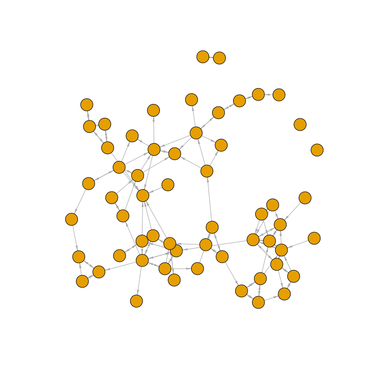
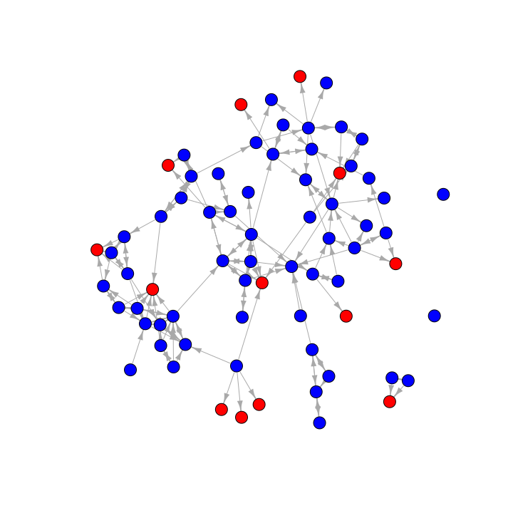

Missing Network Data
================
Saurabh Khanna
2020-05-01

  - [Chapter 4: R Tutorial on Missing Network
    Data](#chapter-4-r-tutorial-on-missing-network-data)
      - [Network Data with Missing
        Nodes](#network-data-with-missing-nodes)
      - [Constructing the Network Using no
        Imputation](#constructing-the-network-using-no-imputation)
      - [Gauging the Level of Bias](#gauging-the-level-of-bias)
      - [Simple Imputation Options: Network
        Reconstruction](#simple-imputation-options-network-reconstruction)
          - [Network Reconstruction: Directed (Asymmetric)
            Option](#network-reconstruction-directed-asymmetric-option)
          - [Network Reconstruction: Reciprocated
            Option](#network-reconstruction-reciprocated-option)
          - [Network Reconstruction: Probabilistic
            Option](#network-reconstruction-probabilistic-option)

# Chapter 4: R Tutorial on Missing Network Data

Built with R version 3.6.3

This tutorial offers an empirical example dealing with missing network
data in R. Missing data is a common problem faced by network
researchers. Actors in the network may be absent the day of the survey,
refuse to participate and in general offer incomplete information.
Practically, a researcher must deal with missing data before doing any
actual analyses. We will cover different strategies in assessing the
possible level of bias due to missing data (focusing on the case of
missing nodes). We will then cover simple imputation processes, with the
goal of limiting the bias due to missing data.

## Network Data with Missing Nodes

The data for our example are based on friendships between women in a
sorority. The true network has 72 nodes. In the example that follows we
will analyze the network assuming it has missing data, in the form of
missing nodes. In the example, there are 14 missing nodes so that no
information is available for those 14 nodes in terms of whom they
nominated. We can assume that those 14 nodes were absent the day of the
survey. Note that we still have any nominations from the non-missing
nodes (those who filled out the survey) to the missing nodes. Also note
that the actual missing data for this example is generated for the sake
of the tutorial, and does not reflect the missing data in the real
network.

Here we read in a data frame that indicates which nodes in our toy
example are assumed to be missing.

``` r
sorority_attributes=read.csv(file="https://sites.google.com/site/jeffreysmithdatafiles/sorority_attributes_wmissingdata.csv")
```

Here we will read in the matrix describing the friendship between women
in the sorority. Note that we need to add a row.names=1 option to tell R
that the first column should be used to set the row names.

``` r
sorority_matrix=read.csv(file="https://sites.google.com/site/jeffreysmithdatafiles/sorority_matrix_wmissingdata.csv", row.names=1)
```

And let’s turn that data frame into a matrix to make it easier to
manipulate.

``` r
sorority_matrix=as.matrix(sorority_matrix)
```

Let’s examine the data matrix and attribute file. We will first create a
vector showing which nodes are missing in the network, using the missing
variable in the attribute file. A “1” indicates the node is missing and
“0” indicates they are not missing. The which function returns which
element is equal to 1.

``` r
missing=which(sorority_attributes[,"missing"]==1)
missing
```

    ##  [1]  2  7 12 26 29 30 44 45 47 50 54 64 65 66

Let’s also create vector indicating which are not missing.

``` r
notmissing=which(sorority_attributes[,"missing"]==0)
notmissing
```

    ##  [1]  1  3  4  5  6  8  9 10 11 13 14 15 16 17 18 19 20 21 22 23 24 25 27 28 31 32 33 34 35 36 37 38 39 40 41 42 43 46 48 49 51 52 53 55 56 57 58 59 60 61 62 63 67 68 69 70 71 72

Now let’s look at the rows and columns of our matrix, focusing on the
missing cases. Here we just look at the first missing node, node 2 (just
looking at the first 15 columns):

``` r
sorority_matrix[2, 1:15]
```

    ##  id1  id2  id3  id4  id5  id6  id7  id8  id9 id10 id11 id12 id13 id14 id15 
    ##   NA   NA   NA   NA   NA   NA   NA   NA   NA   NA   NA   NA   NA   NA   NA

We can see that the row is full of NAs since node 2 is missing. The
matrix thus offers no information on the nominations from node 2 to
other nodes in the network. Now, let’s look at the column for our
missing node (just for the first 15 rows):

``` r
sorority_matrix[1:15, 2]
```

    ##  id1  id2  id3  id4  id5  id6  id7  id8  id9 id10 id11 id12 id13 id14 id15 
    ##    0   NA    0    0    0    0   NA    0    0    0    0   NA    1    0    0

There are 0s, 1s and NAs. A 1 indicates that a non-missing node reports
a friendship with the missing node (here person 2); a 0 means that no
tie is reported (between the non-missing node and missing node). For
example, node 13 reports a tie with node 2 while node 1 does not. It is
important to remember that we do not know about the nominations from the
missing nodes; so we do not know if node 2 would have nominated node 13
back. The NAs correspond to cases involving another missing node. For
example, node 7 is also missing and we see an NA in row 7, column 2.
More substantively, there is no information at all about ties between
two missing nodes. So we would also see an NA in row 2, column 7:

``` r
sorority_matrix[2, 7]
```

    ## [1] NA

## Constructing the Network Using no Imputation

We will begin by constructing the network assuming that the researcher
takes no action to deal with the missing data. In this case, all of the
missing nodes are dropped from the network when constructing the network
object. This means that all ties from non-missing nodes to missing nodes
will also not be included in the network. Let’s create a matrix that
just includes the non-missing nodes. Note that the syntax below uses the
“-” sign to tell R which rows and columns in the matrix should be
removed, here those cases that are missing.

``` r
sorority_matrix_removemissing=sorority_matrix[-missing, -missing]
dim(sorority_matrix_removemissing)
```

    ## [1] 58 58

Now there are only 58 rows and 58 columns as the 14 missing cases have
been removed. We will now take our reduced matrix (with only non-missing
cases) and create an igraph object.

``` r
library(igraph)

sororitynet_noimpute=graph_from_adjacency_matrix(adjmatrix=sorority_matrix_removemissing, mode="directed")
sororitynet_noimpute
```

    ## IGRAPH d43ba4e DN-- 58 125 -- 
    ## + attr: name (v/c)
    ## + edges from d43ba4e (vertex names):
    ##   [1] id1 ->id39 id1 ->id42 id3 ->id1  id8 ->id1  id8 ->id42 id8 ->id55 id9 ->id25 id9 ->id28 id9 ->id63 id9 ->id72 id10->id48 id11->id52 id11->id71 id13->id14 id13->id22 id13->id34 id13->id52 id13->id62 id14->id22 id14->id33 id14->id34 id14->id69 id15->id16 id15->id18 id15->id22 id16->id15 id16->id41 id17->id43 id18->id15 id18->id16 id19->id4  id19->id5  id19->id14 id19->id23 id19->id69 id20->id37 id20->id49 id20->id58 id21->id57 id23->id19 id23->id53 id24->id22 id25->id9  id25->id11 id25->id59 id25->id60 id25->id63 id25->id72 id27->id32 id28->id9  id28->id22 id28->id25 id28->id63 id28->id68 id31->id27 id31->id32 id31->id35 id31->id42 id32->id27 id32->id31 id32->id35 id35->id1  id35->id31 id35->id39 id35->id42 id36->id35 id37->id38 id37->id67 id38->id35 id38->id37 id38->id39 id38->id67 id39->id1  id39->id35 id39->id42 id41->id16 id42->id1  id42->id9  id42->id31 id42->id35 id42->id39 id43->id60 id46->id61 id48->id53 id49->id20 id49->id57 id49->id58 id51->id43 id51->id60 id52->id14
    ##  [91] id52->id69 id53->id23 id53->id48 id55->id8  id55->id39 id55->id42 id56->id58 id57->id21 id57->id22 id58->id20 id58->id49 id58->id70 id60->id43 id60->id51 id61->id46 id62->id13 id62->id17 id63->id9  id63->id22 id63->id25 id63->id28 id67->id27 id67->id37 id67->id38 id68->id28 id69->id14 id70->id5  id70->id19 id70->id69 id71->id11 id71->id52 id72->id9  id72->id25 id72->id56 id72->id57

Let’s go ahead and plot the network using no imputation, adding a few
plotting options to make the graph easier to interpret.

``` r
plot(sororitynet_noimpute, vertex.label=NA, vertex.size=10, edge.arrow.size=.5, edge.arrow.width=.5)
```

<!-- -->

We can also calculate network statistics of interest on our incomplete
network, with no imputation. Here we will assume that we are interested
in measuring the mean closeness between all nodes in the network. We
first define the shortest path between each pair of nodes. We then take
the inverse of those values (to avoid any problems with unreachable
nodes; see Ch 3) and then take the mean over those values. Here we
calculate closeness on the network constructed above, using only the
non-missing cases. This is the same as in Chapter 3, and we again use
the distances function with mode set to out. The diagonal is not
meaningful here, so we put in a NA for that.

``` r
dist_noimpute=distances(graph=sororitynet_noimpute, mode="out")
diag(dist_noimpute)=NA 
```

And now we can calculate how close everyone is, on average, by taking
the mean over the inverted distance matrix. We set na.rm=T to ignore the
NAs on the diagonal.

``` r
mean_closeness_noimpute=mean(1/dist_noimpute, na.rm=T) 
mean_closeness_noimpute
```

    ## [1] 0.1098182

We can also create a function that will do the same as above. Creating a
function will save us from having to retype each step every time we want
to calculate closeness. We will call the function closeness\_function
and make the input an igraph object. The rest of the steps are the same
as above.

``` r
closeness_function=function(network){
dist_matrix=distances(graph=network,mode="out")
diag(dist_matrix)=NA
mean_closeness=mean(1/dist_matrix, na.rm=T)
mean_closeness
}
```

Once we create the closeness function, all we need to do is input the
network of interest to calculate closeness.

``` r
closeness_function(sororitynet_noimpute)
```

    ## [1] 0.1098182

## Gauging the Level of Bias

The next question is how much bias we think there is in our estimate,
here for closeness. We will examine two different strategies for gauging
bias.

#### 3.1 Gauging Bias Using Past Results

First, we will use past results on missing data and network measurement
to estimate the level of bias. Past work has shown how missing data
biases different network measures (and networks) at different rates. The
idea is to use these results to gauge bias in the particular case of
interest, given the features of the network and the measure of interest.
A researcher would simply use the results that match their study most
closely. In this case the network is small and directed, and the measure
of interest is closeness. The percent missing is approxmiately 20% (14
missing nodes out of 72: `14/72`). Given these conditions, we can use
the tables in Smith and Moody (2013) as a guide \[Smith, Jeffrey A. and
James Moody. 2013. “Structural effects of network sampling coverage I:
Nodes missing at random.” Social Networks 35:652-668.\]. Looking at
Table 6 (in Smith and Moody 2013), we can see that for the smaller,
directed networks, we can miss up to 20-25% of the network and still be
under a bias of .25 for closeness (or distance). Given these results we
may expect the bias to be around .25 or so, assuming there is no
imputation.

#### 3.2 Gauging Bias Using Predictive Models

Our second strategy uses predictive modeling, where the researcher
inputs various features of the study into a model that yields an
estimated level of bias. Here we will rely on the model presented in
Smith et al. (2017) \[Smith, Jeffrey A., James Moody and Jonathan H.
Morgan. 2017. “Network Sampling Coverage II: The Effect of Non-Random
Missing Data on Network Measurement.” Social Networks 48:78-99.\]. They
have provided an easy to use bias calculator at:
<http://www.soc.duke.edu/~jmoody77/missingdata/calculator.htm>. The
researcher must set a number of inputs into the bias calculator and we
will walk through how to practically do this in the case of the sorority
network. The main inputs are: size, percent missing, indegree standard
deviation, directed/undirected and the type of missing data.

We start by setting the size of the true network. In this case, we set
the number of nodes to 72 (as this is the size of the network) and the
percent missing to 20. We can estimate the indegree standard deviation
using the network above:

``` r
indeg=degree(sororitynet_noimpute, mode="in")
sd(indeg)
```

    ## [1] 1.609203

We will thus set the standard deviation to 1.61. The next input is
directed/undirected and here the network is directed. The last input is
the correlation between the missing nodes and their centrality. Are
central nodes more/less likely to be missing? This can be difficult to
determine as we do not have much information on the missing nodes. One
possibility is to put in different inputs for this correlation and
calculate a range of possible bias. A second option is to compare the
indegree of the missing nodes to the indegree of the non-missing nodes
and see which is higher. When the indegree is higher for missing nodes,
the correlation is positive between being missing and centrality. Here
we will set the correlation between missing nodes and centrality at .25,
a slight positive correlation, although we could try alternative values.
Given these inputs, the expected bias for distance is around .19 (using
the bias calculator from Smith et al. 2017), similar to the estimate
above. Note that the results are somewhat different if we set network
type to a specific kind of network (here sorority).

## Simple Imputation Options: Network Reconstruction

We now turn to different options in dealing with missing nodes. Here we
will consider an approach that uses a simple imputation procedure,
network reconstruction. Network reconstruction is based on the idea that
a researcher can leverage the nominations from non-missing nodes to
missing nodes to help fill in some of the missing data. For directed
networks, there are three basic versions of network reconstruction
imputation: directed (or asymmetric), reciprocated, and probabilistic.
In this section we will walk through each one.

To begin, we will go back to the original matrix, sorority\_matrix, and
construct a network based on the non-missing nodes and any missing node
that was nominated by a non-missing node. Let’s identify which missing
nodes we will put back in the network.To identify these nodes, we first
subset the matrix, only looking at the nominations to the missing nodes.

``` r
nominations_missing_nodes=sorority_matrix[,missing]
```

Now we add up those columns, calculating the number of nominations each
missing node received.

``` r
indeg_missing=colSums(nominations_missing_nodes, na.rm=T)
```

Finally, we ask which column sums are greater than 0 indicating that the
missing node got at least one nomination from a non-missing node. We use
that to subset the missing cases, just keeping those who got at least
one nomination.

``` r
impute_nodes=missing[indeg_missing>0]
impute_nodes
```

    ##  [1]  2  7 12 26 29 30 44 45 47 50 54 64 66

Let’s also create a vector showing which nodes should be removed
completely, so missing nodes who did not get nominations from
non-missing nodes.

``` r
still_missing=missing[indeg_missing==0]
still_missing
```

    ## [1] 65

### Network Reconstruction: Directed (Asymmetric) Option

So far, we have defined which missing nodes should go back into the
imputed network. Next, we must decide on what ties should be imputed.
Here, we will focus on the potential ties from missing nodes to the
non-missing nodes who nominated them. We have no observed information on
these ties so we must decide how to treat them. In this ‘directed’ (or
‘asymmetric’) option, we do the simplest thing and just assume that no
ties exist from the missing nodes back to the non-missing nodes who
nominated them. Thus, we assume that all ties from n to m (where n is a
non-missing node and m is a missing node) are asymmetric, so that m to n
does not exist.

First, we copy the raw matrix read in above, so we don’t make any
changes to the original data.

``` r
sorority_matrix_impute_directed=sorority_matrix 
```

Next, we set all potential outgoing ties from missing nodes to 0:

``` r
sorority_matrix_impute_directed[missing,]=0 
```

And finally we create the network based on the imputed matrix.

``` r
sororitynet_impute_directed=graph_from_adjacency_matrix(adjmatrix=sorority_matrix_impute_directed,
                                                        mode="directed")
```

Let’s plot the network, coloring the nodes based on missing-status. We
will color the nodes red if they are missing nodes and blue if they are
not missing. We will use an ifelse function and the node attribute file
denoting if nodes are missing.

``` r
cols=ifelse(sorority_attributes[,"missing"]==1, "red", "blue")
table(cols, sorority_attributes[,"missing"])
```

    ##       
    ## cols    0  1
    ##   blue 58  0
    ##   red   0 14

The coding looks right, so let’s go ahead and put the cols vector onto
the network.

``` r
V(sororitynet_impute_directed)$color=cols 
```

Note that right now this network includes missing nodes that received no
nominations and should not be in the imputed network. They are defined
in still\_missing. Let’s go ahead and remove them. We will use a
delete\_vertices function. The inputs are: graph=network; v=nodes to
remove.

``` r
sororitynet_impute_directed=delete_vertices(graph=sororitynet_impute_directed, v=still_missing)
```

And now let’s plot the network.

``` r
plot(sororitynet_impute_directed, vertex.label=NA, vertex.size=7, edge.arrow.size=.75, edge.arrow.width=.75)
```

<!-- -->

And for a comparison let’s calculate closeness using our closeness
function. We will calculate closeness under each of our imputation
strategies, to see how different choices affect our estimates of a basic
network property.

``` r
mean_closeness_impute_directed=closeness_function(sororitynet_impute_directed)
mean_closeness_impute_directed
```

    ## [1] 0.08920313

In this case, we can see that the directed imputation strategy yields a
lower value of closeness (or higher distances) than under no imputation
(where closeness was .11)

### Network Reconstruction: Reciprocated Option

Here we repeat the same process as above, still using network
reconstruction as the imputation strategy, but we make different
assumptions about the ties going from the missing nodes back to the
non-missing nodes that nominated them. Here we assume that all ties from
n to m (where n is a non-missing node and m is a missing node) are
reciprocated, so that m to n exists.

As before, we start by creating a copy of the friendship matrix, so we
don’t make any changes to the original data.

``` r
sorority_matrix_impute_recip=sorority_matrix 
```

Now, for any case where a missing node nominates a non-missing node we
impute a tie from the missing node back to the non-missing node. We do
this by setting the outgoing ties for the missing nodes equal to the
ties sent to them. Let’s first grab the columns for the missing nodes to
see who nominated them. This was defined as nominations\_missing\_nodes
above.

``` r
head(nominations_missing_nodes)
```

    ##     id2 id7 id12 id26 id29 id30 id44 id45 id47 id50 id54 id64 id65 id66
    ## id1   0   0    0    0    0    0    0    0    0    0    0    0    0    0
    ## id2  NA  NA   NA   NA   NA   NA   NA   NA   NA   NA   NA   NA   NA   NA
    ## id3   0   1    0    1    0    0    0    0    0    0    0    1    0    1
    ## id4   0   0    0    0    0    0    0    0    0    0    0    0    0    0
    ## id5   0   0    0    0    0    0    0    0    0    0    0    0    0    0
    ## id6   0   0    0    0    0    0    0    0    0    0    0    0    0    0

Remember that each 1 shows which non-missing node nominates which
missing node, on the columns. We can see that node 3 nominates a missing
case, node 7. Note that there are 14 columns as this data only includes
nominations to the missing nodes (on the columns). Also note that the
NAs correspond to ties involving two missing nodes. We set those to 0
here as we are not imputing the ties between missing nodes, just
assuming they do not exist (perhaps incorrectly). We also transpose the
nomination matrix to make it the right dimensions to be outgoing ties
(from missing nodes to non-missing nodes who nominated them). Thus, if
node n (non-missing) nominates node m (missing) we would see a 1 in the
n,m cell in the matrix; by taking the transpose, we will be able to
impute a nomination back from n to m.

``` r
nominations_missing_nodes[is.na(nominations_missing_nodes)]=0
outgoing_ties_recip=t(nominations_missing_nodes) 
```

And now we set the outgoing ties for the missing nodes based on the
imputation from above.

``` r
sorority_matrix_impute_recip[missing,]=outgoing_ties_recip
```

Let’s take a look at the results, focusing on the first missing node
(person 2) (for the first 15 rows):

``` r
sorority_matrix_impute_recip[1:15, 2]
```

    ##  id1  id2  id3  id4  id5  id6  id7  id8  id9 id10 id11 id12 id13 id14 id15 
    ##    0    0    0    0    0    0    0    0    0    0    0    0    1    0    0

Here we see that node 13 nominates person 2, and in this version of the
imputed matrix, there is also a tie from 2 to 13.

``` r
sorority_matrix_impute_recip[2, 13]
```

    ## [1] 1

And note that there is no tie from 2 to 13 in the previous imputation
procedure:

``` r
sorority_matrix_impute_directed[2, 13]
```

    ## [1] 0

Again, we can create a network based on the imputed data.

``` r
sororitynet_impute_recip=graph_from_adjacency_matrix(adjmatrix=sorority_matrix_impute_recip, 
                                                     mode="directed")
```

Now let’s take out any nodes that are missing and were not put back into
the network, as before.

``` r
sororitynet_impute_recip=delete_vertices(graph=sororitynet_impute_recip, v=still_missing)
sororitynet_impute_recip
```

    ## IGRAPH 48d9a9e DN-- 71 189 -- 
    ## + attr: name (v/c)
    ## + edges from 48d9a9e (vertex names):
    ##   [1] id1 ->id39 id1 ->id42 id2 ->id13 id2 ->id62 id3 ->id1  id3 ->id7  id3 ->id26 id3 ->id64 id3 ->id66 id7 ->id3  id8 ->id1  id8 ->id42 id8 ->id55 id9 ->id25 id9 ->id28 id9 ->id63 id9 ->id64 id9 ->id72 id10->id44 id10->id48 id10->id64 id11->id50 id11->id52 id11->id71 id12->id20 id12->id31 id12->id32 id12->id35 id12->id42 id12->id55 id13->id2  id13->id14 id13->id22 id13->id34 id13->id52 id13->id62 id14->id22 id14->id33 id14->id34 id14->id44 id14->id69 id15->id16 id15->id18 id15->id22 id16->id15 id16->id41 id17->id43 id18->id15 id18->id16 id19->id4  id19->id5  id19->id14 id19->id23 id19->id47 id19->id69 id20->id12 id20->id37 id20->id49 id20->id58 id21->id57 id23->id19 id23->id44 id23->id53 id24->id22 id25->id9  id25->id11 id25->id59 id25->id60 id25->id63 id25->id64 id25->id72 id26->id3  id27->id29 id27->id32 id28->id9  id28->id22 id28->id25 id28->id63 id28->id68 id29->id27 id29->id37 id29->id38 id29->id67 id30->id56 id30->id72 id31->id12 id31->id27 id31->id32 id31->id35 id31->id42
    ##  [91] id32->id12 id32->id27 id32->id31 id32->id35 id35->id1  id35->id12 id35->id31 id35->id39 id35->id42 id36->id35 id37->id29 id37->id38 id37->id67 id38->id29 id38->id35 id38->id37 id38->id39 id38->id67 id39->id1  id39->id35 id39->id42 id41->id16 id42->id1  id42->id9  id42->id12 id42->id31 id42->id35 id42->id39 id43->id60 id44->id10 id44->id14 id44->id23 id44->id48 id44->id53 id45->id60 id46->id54 id46->id61 id47->id19 id48->id44 id48->id53 id49->id20 id49->id57 id49->id58 id50->id11 id51->id43 id51->id60 id52->id14 id52->id69 id53->id23 id53->id44 id53->id48 id54->id46 id54->id61 id55->id8  id55->id12 id55->id39 id55->id42 id56->id30 id56->id58 id57->id21 id57->id22 id58->id20 id58->id49 id58->id70 id60->id43 id60->id45 id60->id51 id61->id46 id61->id54 id62->id2  id62->id13 id62->id17 id63->id9  id63->id22 id63->id25 id63->id28 id63->id64 id64->id3  id64->id9  id64->id10 id64->id25 id64->id63 id66->id3  id67->id27 id67->id29 id67->id37 id67->id38 id68->id28 id69->id14 id70->id5 
    ## [181] id70->id19 id70->id69 id71->id11 id71->id52 id72->id9  id72->id25 id72->id30 id72->id56 id72->id57

Note there are still 71 nodes but now 189 edges in the imputed network.

``` r
mean_closeness_impute_recip=closeness_function(sororitynet_impute_recip)
mean_closeness_impute_recip
```

    ## [1] 0.1574669

The closeness value is quite different, and higher, than under no
imputation or the simpler directed option.

### Network Reconstruction: Probabilistic Option

Now, we repeat the same process as above, but offer a probabilistic
option on how to impute the ties going from the missing nodes back to
the non-missing nodes that nominated them. Here, when a tie exists from
n to m (where n is a non-missing node and m is a missing node) we assume
that a tie from m to n exists with probability p, set to the reciprocity
rate in the observed network (just using the set of non-missing nodes).
First, we calculate the rate of reciprocity. This gives us a baseline
estimate on the probability of a tie being reciprocated. We will use the
network constructed above with no imputation to calculate this.

The function is reciprocity (in the igraph package). Inputs are
graph=network and mode=“ratio”. Ratio ensures that we get the correct
calculation, where the number of reciprocated dyads is divided by the
total number of non-null dyads, symmetric/(asymmetric+symmetric).

``` r
p=reciprocity(graph=sororitynet_noimpute, mode="ratio")
p
```

    ## [1] 0.4204545

Our results suggest that about 42% of the time when i nominates j, j
nominates i. Given this calculation, we can impute the ties by
probabilistically assigning ties from missing nodes back to non-missing
nodes. Let’s begin by copying the friendship matrix from above.

``` r
sorority_matrix_impute_prob=sorority_matrix
```

Let’s also go ahead and transpose the incoming ties matrix, showing
nominations to missing nodes. This will put the matrix into the right
shape to be (imputed) outgoing ties.

``` r
outgoing_ties_prob=t(nominations_missing_nodes)
```

Next, we will probabilistically determine which of the incoming ties
will be imputed as reciprocated. For each nomination from n
(non-missing) to m (missing), we will take a draw from a binomial
distribution with probability set to p. This will probabilistically
determine if the m to n tie exists, imputing if the nomination is
reciprocated. Note that we only take draws for cases where
outgoing\_ties\_prob is equal to 1, showing where a non-missing node (n)
nominates a missing node (m).

``` r
outgoing_ties_prob[outgoing_ties_prob==1]=rbinom(outgoing_ties_prob[outgoing_ties_prob==1], size=1, prob=p) 
```

And now we set the outgoing ties for the missing nodes equal to the
probabilistic set of outgoing ties.

``` r
sorority_matrix_impute_prob[missing,]=outgoing_ties_prob
```

Again, we can create a network, remove missing nodes with no incoming
ties and calculate closeness.

``` r
sororitynet_impute_prob=graph_from_adjacency_matrix(adjmatrix=sorority_matrix_impute_prob,  mode="directed")

sororitynet_impute_prob=delete_vertices(graph=sororitynet_impute_prob, v=still_missing)

mean_closeness_impute_prob=closeness_function(sororitynet_impute_prob)
mean_closeness_impute_prob
```

    ## [1] 0.1451592

Note that this introduced a bit of stochastic noise into the imputation
and if we run this again the results will be slightly different. It
would thus make sense to repeat this process a number of times and
average over the results.

#### 4.4 Comparing Estimates

Here we create a little table of our closeness results, to see how
different imputation choices affect our estimates of closeness.

``` r
closeness_table=data.frame(true=.15, noimpute=mean_closeness_noimpute, direct=mean_closeness_impute_directed, 
                           recip=mean_closeness_impute_recip, prob=mean_closeness_impute_prob)
closeness_table
```

    ##   true  noimpute     direct     recip      prob
    ## 1 0.15 0.1098182 0.08920313 0.1574669 0.1451592

In this example we can actually compare against the true value on the
complete network. This is possible because the missing data in this case
were simulated. This, of course, would not be possible in most empirical
settings. The true closeness value is .15, and we can see that the
reciprocated option was clearly the best, with directed imputation doing
worse than doing nothing.
