Napoleon’s invasion of Russia
================
Saurabh Khanna
2020-05-01

  - [Chapter 5: R Tutorial on Network
    Visualization](#chapter-5-r-tutorial-on-network-visualization)
      - [1. Basic Network Visualization](#basic-network-visualization)
          - [1.1 Setting up the Session](#setting-up-the-session)
          - [1.2 Basic Plotting of Network Data in R Using
            igraph](#basic-plotting-of-network-data-in-r-using-igraph)
          - [1.3. Plotting Network Data in R using Packages based on
            ggplot](#plotting-network-data-in-r-using-packages-based-on-ggplot)
          - [1.4 Contour Plots](#contour-plots)
          - [1.5 Interactive Plots](#interactive-plots)
      - [2. Visualizations for Dynamic Network
        Data](#visualizations-for-dynamic-network-data)
          - [2.1 Getting the Data Ready](#getting-the-data-ready)
          - [2.2 Time Flattened
            Visualizations](#time-flattened-visualizations)
          - [2.3 Dynamic Network Movies](#dynamic-network-movies)

# Chapter 5: R Tutorial on Network Visualization

Built with R version 3.6.3

In this tutorial we will cover network visualization in R. A researcher
will often start an analysis by plotting the network(s) in question. In
fact, one of the real benefits of a network approach is that there is a
tight connection between the underlying data and the visualization of
that data. We have already seen some basic plotting commands in our
previous tutorials. Here, we will walk through the different approaches
and options in detail. We note three things before we get started.
First, it is important to remember that different plots are useful for
different purposes. The kind of plot that is useful for an initial
exploration of the network may be different than a more polished figure
used in publication. Second, we will only cover a relatively small
number of plotting options. More advanced options are available within
and outside R (i.e., in programs like Pajek and Gephi). And third, we
note that plotting options appropriate for one network (i.e., a small,
face-to-face network) may not work for another (a large email-based
network).

The tutorial is split into two parts. In the first part of the tutorial,
we will use cross-sectional network data and cover basic network
visualization. In the second part of the tutorial, we will use
continuous-time network data, and cover visualization approaches (like
network movies) appropriate for dynamic network data.

## 1\. Basic Network Visualization

### 1.1 Setting up the Session

We will use the same network as in Chapter 3b for the first part of this
tutorial, on basic network visualization. The actors are students in a
classroom and the relation of interest is friendship. There is
individual information on gender, race and grade.

Let’s go ahead and read in the network data, saved as an edgelist.

``` r
class_edges=read.csv(file="https://sites.google.com/site/jeffreysmithdatafiles/class555_edgelist.csv")
```

Let’s also read in the attribute file.

``` r
class_attributes=read.csv(file="https://sites.google.com/site/jeffreysmithdatafiles/class555_attributedata.csv")
```

We will begin using the igraph package.

``` r
library(igraph)
```

Now we go ahead and construct the igraph object, using the edgelist and
attribute file as inputs.

``` r
class_net=graph_from_data_frame(d=class_edges, directed=T, vertices=class_attributes)
class_net
```

    ## IGRAPH 3b12ab2 DNW- 24 77 -- 
    ## + attr: name (v/c), gender (v/c), grade (v/n), race (v/c), weight (e/n)
    ## + edges from 3b12ab2 (vertex names):
    ##  [1] 1 ->3  1 ->5  1 ->7  1 ->21 2 ->3  2 ->6  3 ->6  3 ->8  3 ->16 3 ->24 4 ->13 4 ->18 7 ->1  7 ->9  7 ->10 7 ->16 8 ->3  8 ->9  8 ->13 9 ->5  9 ->8  10->6  10->14 10->19 10->20 10->24 11->12 11->15 11->18 11->24 12->11 12->15 12->24 13->8  14->10 14->13 14->19 14->21 14->24 15->10 15->11 15->13 15->14 15->24 16->3  16->5  16->9  16->19 17->8  17->13 17->18 17->23 17->24 18->13 18->17 18->23 18->24 19->14 19->16 19->20 19->21 20->19 20->21 20->24 21->5  21->19 21->20 22->23 23->5  23->13 23->17 23->18 24->6  24->10 24->14 24->15 24->21

### 1.2 Basic Plotting of Network Data in R Using igraph

Network plots offer an intuitive way of exploring the features of the
network. For example, a researcher may be interested in how demographic
characteristics (like gender or race) map onto friendship. Or they may
want to know if there are particularly central nodes in the network. Of
course, this is not a formal test, but looking at a picture of the
network(s) is a useful starting point for an analysis. Here, we will
begin by exploring gender divides in the network (i.e., how strongly
does gender map onto friendship groups?).

Let’s start with the default plot command in igraph. We set margin to 0
to reduce some of the extra white space around the plot.

``` r
plot(class_net, margin=0) 
```

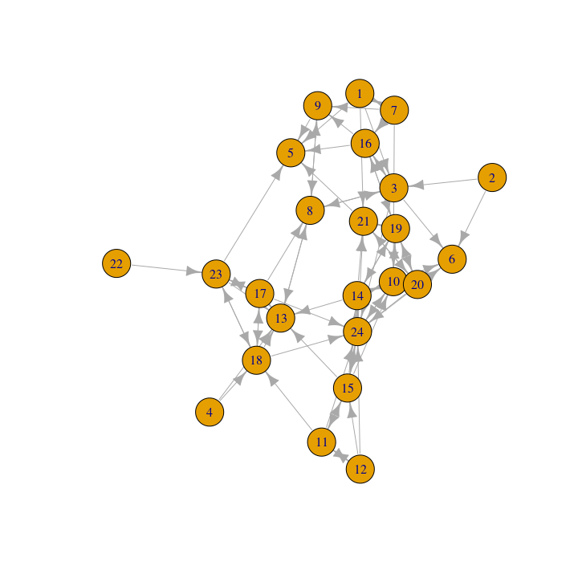<!-- -->

This plot looks okay but could be much improved visually. The plot also
does not tell us anything about gender. Let’s go ahead and color the
nodes in a more meaningful way. We will color the nodes by gender,
making boys navy blue and girls light sky blue. We will first create a
vector denoting the desired color of each node.

``` r
cols=ifelse(class_attributes$gender=="Female", "lightskyblue", "navy") 
```

Note that we are using an ifelse statement to set color: light sky blue
if gender equals Female, navy blue otherwise. Let’s make sure that we
coded this correctly using a simple table command to look at color by
gender.

``` r
table(cols, class_attributes$gender)
```

    ##               
    ## cols           Female Male
    ##   lightskyblue     16    0
    ##   navy              0    8

We now use a V(g)$color command to set the color of each node in the
network (based on the colors defined in cols).

``` r
V(class_net)$color=cols 
```

And now we plot as before.

``` r
plot(class_net, margin=0)
```

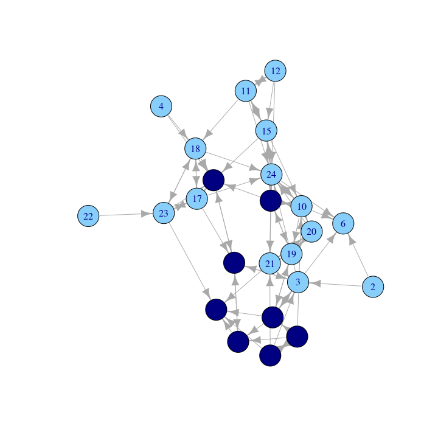<!-- -->

It is also possible to set the colors within the function itself using a
vertex.color option: `plot(class_net, vertex.color=cols)`

Based on this plot we can see that the network does divide along gender
lines, with one small group of boys and then a larger set of girls (who
are divided amongst themselves). We also see that two boys are not part
of the ‘boy group’, and are disproportionally connected to girls. A
researcher may also be interested in which nodes receive the most
nominations. For example, we may want to know if particular girls/boys
are really important in the network. To make this easier to see, let’s
size the nodes by indegree, showing how many ties people send to them.
Let’s first calculate indegree for each node.

``` r
indeg=igraph::degree(class_net, mode="in")
```

Now we plot the network and scale the size of the nodes by indegree,
using a vertex.size argument.

``` r
plot(class_net, vertex.size=indeg, margin=-.10)
```

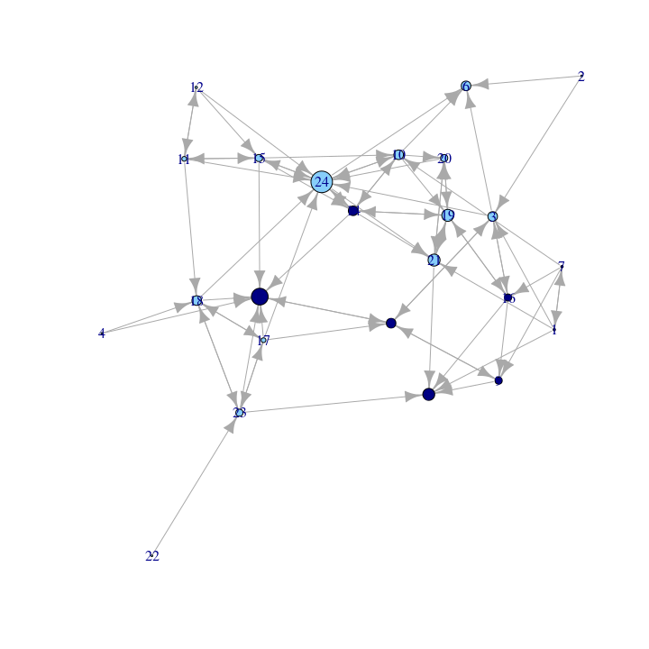<!-- -->

Here, we make all the nodes a little bigger (adding a 3 to indegree) but
the nodes are still sized by indegree. We will also change the color of
the labels to make them a little easier to read.

``` r
plot(class_net, vertex.size=indeg+3, vertex.label.color="red", margin=-.10)
```

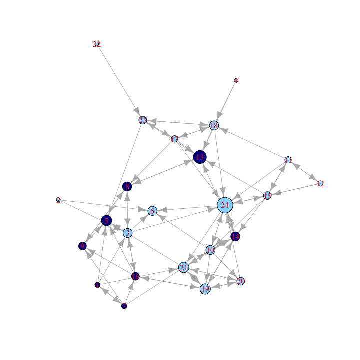<!-- -->

In this plot, nodes who receive a higher number of nominations are
larger. We can see that one boy (id 13) and one girl (id 24) receive a
particularly high number of nominations (perhaps they are high status
nodes in different groups). We can also see that the boys in the ‘boy
group’ tend to have low indegree, as they are only friends with each
other and there are few boys in the network.

Let’s go ahead and clean the plot up a bit to make it more visually
appealing. This is important when producing figures for publications,
websites, etc. We will start by changing the look of the nodes. Let’s
take out those labels using a vertex.label argument and take off the
black edges around the nodes using a vertex.frame argument.

``` r
plot(class_net, vertex.size=indeg+3, vertex.label=NA, vertex.frame.color=NA, margin=-.1)
```

<!-- -->

Here we change the look of the arrows on the edges. Let’s make those
arrows a little smaller using edge.arrow.size and edge.arrow.width
arguments.

``` r
plot(class_net, vertex.size=indeg+3, vertex.label=NA, vertex.frame.color=NA,
     edge.arrow.size=.5, edge.arrow.width=.75, margin=-.10)
```

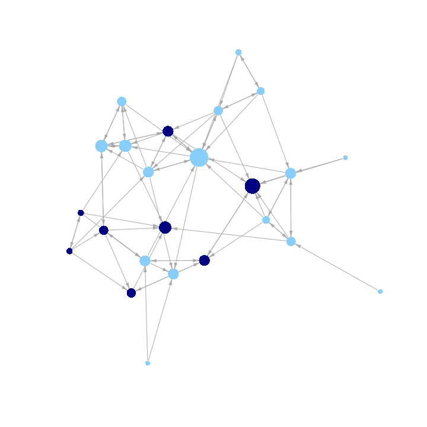<!-- -->

Now we change the look of the edges. Let’s change the color of the lines
to light gray (using edge.color). In general, making the edges a lighter
color can help make network plots easier to interpret, especially when
the network is large and/or dense. In this way, lighter edges help us
avoid an unattractive ‘hair ball’ picture. We also add a bit of curve to
the edges for a nice effect (setting edge.curved to .15).

``` r
plot(class_net, vertex.size=indeg+3, vertex.label=NA, vertex.frame.color=NA, 
     edge.arrow.size=.5, edge.arrow.width=.75, edge.color="light gray",
     edge.curved=.15, margin=-.10)
```

<!-- -->

It is also possible to alter the layout of the plot. The default for
igraph is to choose the ‘best’ layout function given the network, but we
may want more control than that. For example, using an MDS-based layout:

``` r
plot(class_net, vertex.size=indeg+3,vertex.label=NA,vertex.frame.color=NA,
     edge.arrow.size=.5, edge.arrow.width=.75, edge.color="light gray", 
     edge.curved=.15, layout=layout_with_mds, margin=-.10)
```

Or using an Kamada-Kawai layout:

``` r
plot(class_net, vertex.size=indeg+3, vertex.label=NA, vertex.frame.color=NA, 
     edge.arrow.size=.5, edge.arrow.width=.75, edge.color="light gray",
     edge.curved=.15, layout=layout_with_kk, margin=-.10)
```

<!-- -->

There are a number of other options a researcher could explore if they
wanted to continue tweaking their plot. See the following help files for
more options: `?plot.igraph` `?igraph.plotting`

### 1.3. Plotting Network Data in R using Packages based on ggplot

There are a number of other packages in R that we can use to plot our
network. Here we will explore some of the network tools based on ggplot.
ggplot offers a very general way of approaching visualizations in R,
offering a flexible set of visualization options. Here, we will see how
to utilize this general approach to visualization for plotting networks.
We will run through this relatively quickly, as we have already worked
through one network plot in detail above.

ggplot uses network objects based on the network package format, so
let’s go ahead and detach igraph and load network and sna.

``` r
detach(package:igraph)
library(sna)
library(network)
```

Let’s also load ggplot2 and GGally (a package for plotting networks
using ggplot).

``` r
library(ggplot2)
library(GGally)
```

And let’s construct a network object in the network format. Here we can
rely on the intergraph package to transform the igraph object into a
network object. The function is asNetwork.

``` r
library(intergraph)
class_net_sna=asNetwork(class_net)
```

Let’s add our measure of indegree to the network object as a vertex
attribute.

``` r
set.vertex.attribute(class_net_sna, attrname="indeg", value=indeg)
```

#### 1.3.1 GGally package

Here we demonstrate how to plot networks using the function ggnet2 in
the GGally package. The default plot is:

``` r
ggnet2(class_net_sna)
```

<!-- -->

Let’s add some options, including size of nodes (node.size), color of
nodes (node.color), size of edges (edge.size), color of edges
(color.edge), and size of arrows (arrow.size). As before, we size the
nodes by indegree and color the nodes by gender (defined in cols). We
also set the color of the edges to a light grey and include small arrows
in the plot. It is important to note that the input values that work for
one set of functions (i.e., igraph) may not be exactly the same as with
other functions (ggnet2). It often requires a bit of testing to find the
best set of values for the network in question.

``` r
ggnet2(class_net_sna, node.size=indeg, node.color=cols, 
       edge.size=.5, arrow.size=3, arrow.gap=0.02, edge.color="grey80")
```

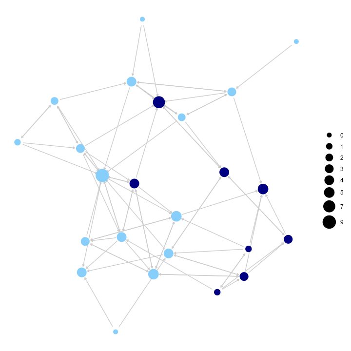<!-- -->

Here we do the same plot but take off the legend on node size. This is
accomplished (using the logic of ggplot) by adding a + option and then a
guides function controlling the legend, here setting it off.

``` r
ggnet2(class_net_sna, node.size=indeg, node.color=cols, 
       edge.size=.5, arrow.size=3, arrow.gap=0.02, edge.color="grey80")+
  guides(size=FALSE)
```

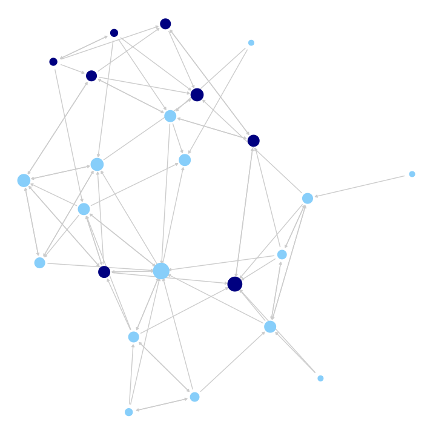<!-- -->

Now we will use a color option to color the nodes based on a vertex
attribute (gender), setting the color in the palette argument (where
male is set to navy and female to light sky blue). This will
automatically create a legend for the node colors.

``` r
ggnet2(class_net_sna, node.size=indeg,  node.color="gender", 
       palette=c("Male"="navy", "Female"="lightskyblue"), edge.size=.5,
       arrow.size=3, arrow.gap=0.02, edge.color="grey80")+
  guides(size=FALSE)
```

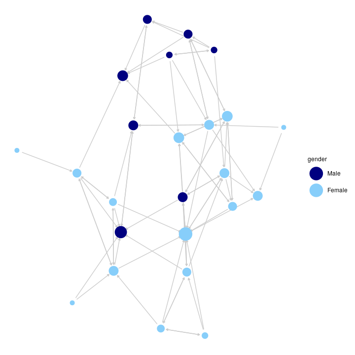<!-- -->

ggnet2 also makes it easy to color the edges in different ways. In this
next plot, we will highlight the between and within gender ties. We will
color all edges going from girls to girls light sky blue and all ties
going from boys to boys navy blue. All girl-boy ties will be grey. This
is accomplished by setting edge.color to c(“color”,“grey80”) with the
first element telling ggnet2 to use the node colors to plot the edges
(if they match) and the second element setting the color of cross-group
ties.

``` r
ggnet2(class_net_sna,  node.size=indeg,  node.color="gender",
       palette=c("Male"="navy", "Female"="lightskyblue"),
       edge.size=.5, arrow.size=3, arrow.gap=0.02, edge.color=c("color", "grey80"))+
  guides(size=FALSE)
```

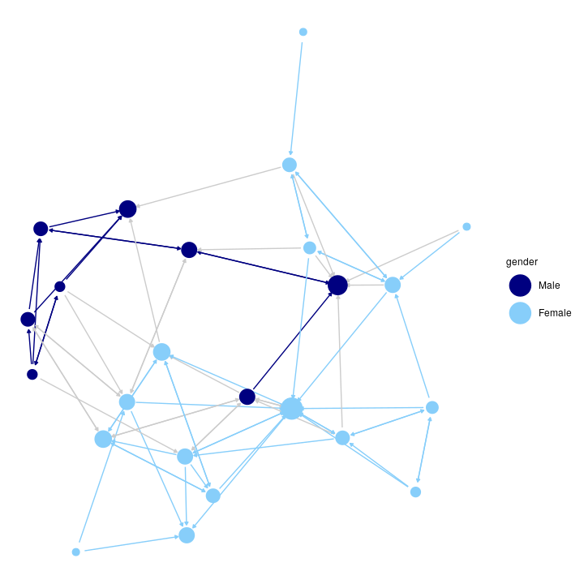<!-- -->

#### 1.3.2 ggnetwork package

Here we offer a very short demonstration using the ggnetwork package.
ggnetwork accomplishes similar tasks as ggnet2, but requires the user to
more directly rely on the ggplot functionality, which is useful for
researchers seeking a large amount of control over the plot.

``` r
library(ggnetwork) 
```

Let’s recreate our network plot using the ggplot function. ggplot works
by adding each desired feature (or layer) to the plot. Beyond the
network itself, we add an aes (aesthetic) function to set the location
of the nodes, a geom\_edges function to set the features of the edges, a
geom\_nodes function to set the features of the nodes and the
theme\_blank function to set the background to blank.

``` r
ggplot(class_net_sna, aes(x=x, y=y, xend=xend, yend=yend)) + 
  geom_edges(color="lightgray") +
  geom_nodes(color=cols, size=indeg+3) +
  theme_blank() 
```

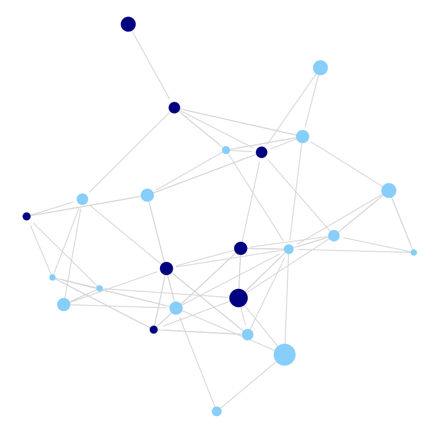<!-- -->

Now, let’s do the same plot but add arrows to it, capturing direction.

``` r
 ggplot(class_net_sna, arrow.gap=.02, aes(x=x, y=y, xend=xend, yend=yend)) + 
  geom_edges(color="lightgray", arrow=arrow(length=unit(5, "pt"), type="closed")) +
  geom_nodes(color=cols, size=indeg+3) +
  theme_blank() 
```

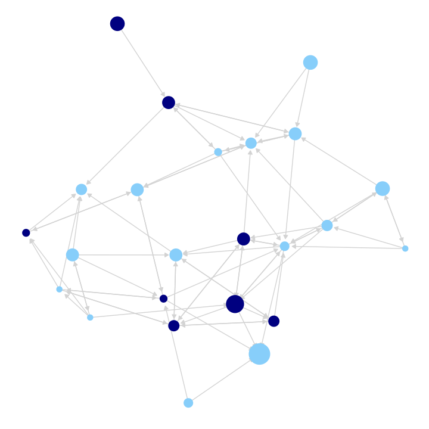<!-- -->

### 1.4 Contour Plots

As another example, we will use ggplot to produce contour plots of our
network. Countour plots offer a topographical representation of the
network, especially useful for very large and very dense networks. We
will use the same basic ggplot function as above to plot the network,
while layering a topography on top which reflects the density of
different regions of the network. This is accomplished by adding a
geom\_density\_2d function to the ggplot call.

``` r
  ggplot(class_net_sna, aes(x=x, y=y, xend=xend, yend=yend)) + 
  geom_edges(color="lightgray", arrow=arrow(length=unit(5, "pt"), type="closed")) +
  geom_nodes(color=cols) +
  theme_blank() + 
  geom_density_2d()
```

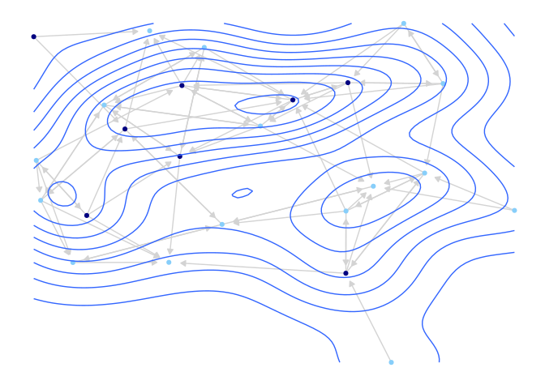<!-- -->

We can see that we have the same kind of network plot as before, but
with a topography layered on top.

### 1.5 Interactive Plots

We end the first part of this tutorial by looking at interactive network
plots. Interactive network plots offer a more ‘hands-on’ experience,
where the user can highlight certain nodes, rotate the graph, change the
layout, etc. directly on the plot. This can be particularly useful when
initially exploring the features of the network. It is also a natural
way of presenting a network on a website.

Here we will make use of the networkD3 package.

``` r
library(networkD3)
```

The networkD3 package indexes the nodes starting from 0 (rather than 1)
so we need to create an edgelist and attribute file that starts the ids
with 0. Here we grab the sender and receiver columns from the original
edgelist and subtract 1 from the ids.

``` r
class_edges_zeroindex=class_edges[,c("sender", "receiver")]-1
```

And let’s also create a new attribute file. We will subtract 1 from the
ids. We will also include gender and indeg, as a means of coloring and
sizing the nodes.

``` r
class_attributes_zeroindex=data.frame(id=class_attributes$id-1, indeg=indeg, 
                                      gender=class_attributes$gender)
```

We are now ready to create a simple interactive plot. The main function
is forceNetwork. There are many possible inputs but we will focus on the
main ones:

  - Links = edgelist of interest
  - Nodes = attribute file
  - Source = name of variable on edgelist denoting sender of tie
  - Target = name of variable on edgelist denoting receiver of tie
  - Group = ‘group’ of each node, either based on an attribute or
    network-based group
  - Nodesize = name of variable on attribute file to size nodes by
  - NodeID = name of variable on attribute file showing id/name of node

Here, we use the edgelist and attribute file constructed above. We use
gender as the grouping variable and set the size of the nodes by
indegree.

``` r
forceNetwork(Links=class_edges_zeroindex, Nodes=class_attributes_zeroindex,
             Source="sender", Target="receiver", Group="gender",
             Nodesize= "indeg", NodeID="id", 
             opacity=0.9, bounded=FALSE, opacityNoHover=.2)
```

    ## PhantomJS not found. You can install it with webshot::install_phantomjs(). If it is installed, please make sure the phantomjs executable can be found via the PATH variable.

<!--html_preserve-->

<div id="htmlwidget-c48389958039ce255e27" class="forceNetwork html-widget" style="width:672px;height:480px;">

</div>

<script type="application/json" data-for="htmlwidget-c48389958039ce255e27">{"x":{"links":{"source":[0,0,0,0,1,1,2,2,2,2,3,3,6,6,6,6,7,7,7,8,8,9,9,9,9,9,10,10,10,10,11,11,11,12,13,13,13,13,13,14,14,14,14,14,15,15,15,15,16,16,16,16,16,17,17,17,17,18,18,18,18,19,19,19,20,20,20,21,22,22,22,22,23,23,23,23,23],"target":[2,4,6,20,2,5,5,7,15,23,12,17,0,8,9,15,2,8,12,4,7,5,13,18,19,23,11,14,17,23,10,14,23,7,9,12,18,20,23,9,10,12,13,23,2,4,8,18,7,12,17,22,23,12,16,22,23,13,15,19,20,18,20,23,4,18,19,22,4,12,16,17,5,9,13,14,20],"colour":["#666","#666","#666","#666","#666","#666","#666","#666","#666","#666","#666","#666","#666","#666","#666","#666","#666","#666","#666","#666","#666","#666","#666","#666","#666","#666","#666","#666","#666","#666","#666","#666","#666","#666","#666","#666","#666","#666","#666","#666","#666","#666","#666","#666","#666","#666","#666","#666","#666","#666","#666","#666","#666","#666","#666","#666","#666","#666","#666","#666","#666","#666","#666","#666","#666","#666","#666","#666","#666","#666","#666","#666","#666","#666","#666","#666","#666"]},"nodes":{"name":[0,1,2,3,4,5,6,7,8,9,10,11,12,13,14,15,16,17,18,19,20,21,22,23],"group":["Male","Female","Female","Female","Male","Female","Male","Male","Male","Female","Female","Female","Male","Male","Female","Male","Female","Female","Female","Female","Female","Female","Female","Female"],"nodesize":[1,0,4,0,5,4,1,4,3,4,2,1,7,4,3,3,2,4,5,3,5,0,3,9]},"options":{"NodeID":"id","Group":"gender","colourScale":"d3.scaleOrdinal(d3.schemeCategory20);","fontSize":7,"fontFamily":"serif","clickTextSize":17.5,"linkDistance":50,"linkWidth":"function(d) { return Math.sqrt(d.value); }","charge":-30,"opacity":0.9,"zoom":false,"legend":false,"arrows":false,"nodesize":true,"radiusCalculation":" Math.sqrt(d.nodesize)+6","bounded":false,"opacityNoHover":0.2,"clickAction":null}},"evals":[],"jsHooks":[]}</script>

<!--/html_preserve-->

This function creates an html file that can be opened by a normal web
browser (like Google chrome or Firefox). Note that you can hover over
desired nodes, change the layout, highlight certain edges, and so on, as
a way of exploring different aspects of the network.

## 2\. Visualizations for Dynamic Network Data

We now shift our attention to visualizing dynamic network data,
specifically the case of continuous-time, streaming data. Here, we are
working with data that is time-stamped (or at least continuously
recorded), capturing the interactions between actors in the setting of
interest. We will work with the same data as in Chapter 3c. The data are
based on recorded task and social interactions between students in a
classroom (e.g., student i talked to student j who then talked to
student k, and so on). Streaming data present a visualization challenge,
as the researcher must decide on the proper range of interest. For
example, if the time band is defined too narrowly, we might end up
plotting an empty graph, with no interactions happening in the range of
interest.

### 2.1 Getting the Data Ready

Let’s go ahead and read in the data. We will read in three files: an
edge spells data frame, a vertex spells data frame and an attribute data
frame. Let’s start with the edge spells data frame.

``` r
edge_spells=read.csv(file="https://sites.google.com/site/jeffreysmithdatafiles/example_edge_spells.csv")
head(edge_spells)
```

    ##   start_time end_time send_col receive_col
    ## 1      0.143    0.143       11           2
    ## 2      0.286    0.286        2          11
    ## 3      0.429    0.429        2           5
    ## 4      0.571    0.571        5           2
    ## 5      0.714    0.714        9           8
    ## 6      0.857    0.857        8           9

The edge spells data frame captures the interactions occurring in the
classroom. There is a column for start\_time (when the interaction
started), end\_time (when the interaction ended), send\_col (who
initiated the interaction), and receive\_col (who was the ‘receiver’ of
the interaction). In this case the start and end time of the interaction
are set to be the same, as interactions were short.

And now we read in the vertex spells data frame:

``` r
vertex_spells=read.csv(file="https://sites.google.com/site/jeffreysmithdatafiles/example_vertex_spells.csv")
head(vertex_spells)
```

    ##   start_time end_time id
    ## 1          0       43  1
    ## 2          0       43  2
    ## 3          0       43  3
    ## 4          0       43  4
    ## 5          0       43  5
    ## 6          0       43  6

The vertex spells data frame captures the movement of nodes in and out
of the network, determined by start\_time and end\_time. In this case
all nodes were in the network for the entire period. Finally, we read in
the attribute file:

``` r
attributes_example2=read.table("https://sites.google.com/site/jeffreysmithdatafiles/class_attributes.txt", 
                      header=T)

head(attributes_example2)
```

    ##   id gnd grd rce
    ## 1  1   2  10   4
    ## 2  2   2  10   3
    ## 3  3   2  10   3
    ## 4  4   2  10   3
    ## 5  5   2  10   3
    ## 6  6   1  10   4

The data frame includes information for gender (gnd), grade (grd) and
race (rce).

We will begin by constructing a networkDynamic object, based on the
vertex spells and edge spells data frames. The networkDynamic object can
then be used to produce plots and network movies.

``` r
library(networkDynamic)

net_dynamic_interactions=networkDynamic(vertex.spells=vertex_spells, edge.spells=edge_spells)
```

### 2.2 Time Flattened Visualizations

The simplest visualization option is to collapse the streaming data into
discrete networks and then use the same basic plotting strategies
discussed above. This has the advantage of creating a simple
visualization, while still capturing some aspects of over time change.
The clear disadvantage is that we flatten, or lose, much of the dynamic
information, which was the unique part of the data in the first place.

We will walk through an example of ‘time flattened’ visualizations
before moving to more dynamic movies below. Let’s create two discrete
networks based on our interaction classroom data. The first network will
capture interactions occurring in the first 20 minutes of class, while
the second network will capture interactions in the last 20 minutes of
class. Thus, an edge exists in the first network if i talked to j at
least once between 0-19.999 minutes. An edge exists in the second
network if i talked to j at least once between 20-39.999 minutes.

We can create these networks using the get.networks function. The main
inputs are the networkDynamic object, as well as the time periods to
extract the network over. We set start to 0 and time.increment to 20,
telling the function to extract networks (starting with period 0) at 20
minute increments.

``` r
extract_nets=get.networks(net_dynamic_interactions, start=0, time.increment=20)
extract_nets
```

    ## [[1]]
    ##  Network attributes:
    ##   vertices = 18 
    ##   directed = TRUE 
    ##   hyper = FALSE 
    ##   loops = FALSE 
    ##   multiple = FALSE 
    ##   bipartite = FALSE 
    ##   total edges= 42 
    ##     missing edges= 0 
    ##     non-missing edges= 42 
    ## 
    ##  Vertex attribute names: 
    ##     vertex.names 
    ## 
    ## No edge attributes
    ## 
    ## [[2]]
    ##  Network attributes:
    ##   vertices = 18 
    ##   directed = TRUE 
    ##   hyper = FALSE 
    ##   loops = FALSE 
    ##   multiple = FALSE 
    ##   bipartite = FALSE 
    ##   total edges= 34 
    ##     missing edges= 0 
    ##     non-missing edges= 34 
    ## 
    ##  Vertex attribute names: 
    ##     vertex.names 
    ## 
    ## No edge attributes

We now have a list, with the first element corresponding to the network
defined over the first 20 minutes (`extract_nets[[1]]`) and the second
element corresponding to the network defined over the last 20 minutes
(`extract_nets[[2]]`). Note that these networks are in the network (not
igraph) format. As above, let’s create a vector of colors to use in the
plot. Again, we will color boys (equal to 1) navy blue and girls (equal
to 2) light blue.

``` r
cols_example2=ifelse(attributes_example2$gnd==2, "lightskyblue","navy")
```

Now we can go ahead and plot the networks. We want them side by side
(accomplished using a par function, setting mfrow to 1 row and 2
columns). Here we will use the default plot function from the network
package. We will set vertex.col (color of nodes) to the vector of colors
defined above, and set vetex.cex (size of nodes) to 2.

``` r
par(mfrow=c(1, 2))

plot(extract_nets[[1]], main="Talk to Network, 0 to 20 Minutes", 
     vertex.col=cols_example2, vertex.cex=2)

plot(extract_nets[[2]], main="Talk to Network, 20 to 40 Minutes", 
     vertex.col=cols_example2, vertex.cex=2)
```

<!-- -->

The plot looks okay but over time comparisons are complicated by the
fact that the nodes are not placed in the same way in the first network
as the second network. We will redo our plot but this time set the
layout so it is the same across the two periods. We first use the
network.layout.fruchtermanreingold function to define the locations of
the nodes. These locations are then used in the subsequent plot
statements (set via coord). We define the locations of the nodes based
on the period 1 network.

``` r
locs=network.layout.fruchtermanreingold(extract_nets[[1]], layout.par=NULL)

par(mfrow=c(1, 2))

plot(extract_nets[[1]], main="Talk to Network, 0 to 20 Minutes", 
     vertex.col=cols, vertex.cex=2, coord=locs)

plot(extract_nets[[2]], main="Talk to Network, 20 to 40 Minutes",
     vertex.col=cols, vertex.cex=2, coord=locs)
```

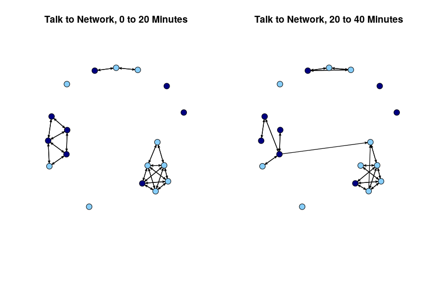<!-- -->

With this new layout, we can see that the first network splits into 3
groups, with no contact between them, while the second network has at
least some (minimal) interaction between the two largest groups.

### 2.3 Dynamic Network Movies

We have so far considered time flattened visualizations of our
continuous-time network data. It is also possible to take the dynamic
network object and construct a movie of the network evolving over time.
In this way, we are able to produce a streaming version of the network,
while being able to control the level of aggregation for changes in
edges and nodes. Here, we will make use of the functions in the ndtv
package. The ndtv package has a very large number of features allowing
the researcher to make detailed, custom-made network movies. We only
cover a small portion of the features of the package.

``` r
library(ndtv)
```

We can cite ndtv as: Skye Bender-deMoll (2019). ndtv: Network Dynamic
Temporal Visualizations. R package version 0.13.0
<https://CRAN.R-project.org/package=ndtv>.

We first need to set up the movie by creating a slice.par list that sets
the basic features of the movie. The main inputs we need to set are:

  - start=time in which to begin layouts for movie
  - end=time to end layouts for movie
  - interval=time between each layout
  - aggregate.dur=duration which network should be aggregated

Here we will run the movie over the entire class period, create a layout
at each minute and do no aggregation (setting aggregate.dur to 0). We
first create a list of these features and then add it to the
networkDynamic object.

``` r
slice.par=list(start=0, end=43, interval=1, aggregate.dur=0, rule="latest")

set.network.attribute(net_dynamic_interactions, 'slice.par', slice.par)
```

We now are in a position to actually create the movie. It is often
useful to save the movie out as an html file. The outputted movie can
then be incorporated into websites or presentations. This is
accomplished using the render.d3movie function. In this case we set
output.mode to “HTML” and set filename to the file we want to save out.
Here we will save a file called classroom\_movie1.html to the working
directory. For convenience, we have also embedded the movie within this
html file.

``` r
render.d3movie(net_dynamic_interactions, displaylabels=FALSE, vertex.cex=1.5, 
               output.mode="HTML", filename="classroom_movie1.html")
```

Looking at the movie, we can see that we get a slice every minute; but
since we did not aggregate at all, we only get instantaneous
interactions, so only those interactions happening at that exact minute.
Given that most interactions do not happen on the minute exactly, much
of this is null and not very interesting. So, let’s go ahead and change
the slice.par list. Here, let’s set aggregate.dur to 1, so all
interactions occurring within the minute are treated as happening in a
given time slice (and thus layout). We will save this out as
classroom\_movie2.html.

``` r
slice.par=list(start=0, end=43, interval=1,  aggregate.dur=1, rule="latest")

set.network.attribute(net_dynamic_interactions, 'slice.par', slice.par)

render.d3movie(net_dynamic_interactions, displaylabels=FALSE, vertex.cex=1.5, 
               output.mode="HTML", filename="classroom_movie2.html")
```

Note that we begin to see a bit more structure emerge, as reciprocity is
now possible and prominent (where i talks to j and j talks to i), while
this was not possible in the previous movie.

Here we will produce the same movie but color the nodes by gender (set
using vertex.cols).

``` r
slice.par=list(start=0, end=43, interval=1,  aggregate.dur=1, rule="latest")

set.network.attribute(net_dynamic_interactions, 'slice.par', slice.par)

render.d3movie(net_dynamic_interactions, displaylabels=FALSE, vertex.cex=1.5, 
               vertex.col=cols, output.mode="HTML", filename="classroom_movie3.html")
```

We can aggregate even further and construct the movie based on a longer
time range. Here we will aggregate over 10 minute time chucks (0-10,
10-20, 20-30, 30-40, 40-end). Thus, for the first slice, an edge exists
between i and j if i talked to j in the first 10 minutes of class. This
aggregation maintains some of the dynamic elements of the data while
still capturing the larger structures that emerge in the network. The
idea is that while we lose some of the dynamic time-stamped data (as
every interaction within the threshold is treated the same, as a tie),
we gain a bit more information on network features like distance and
reachability, which are hard to capture when all interactions happen at
unique time points.

``` r
slice.par=list(start=0, end=43, interval=10, aggregate.dur=10, rule="latest")

set.network.attribute(net_dynamic_interactions, 'slice.par', slice.par)

render.d3movie(net_dynamic_interactions, displaylabels=FALSE, vertex.cex=1.5, 
               vertex.col=cols, output.mode="HTML", filename="classroom_movie4.html")
```

With this longer time period of aggregation, we begin to see groups
emerge which was less possible when the aggregated intervals were only a
minute. Finally, we can continue to use 10 minutes to aggregate the
edges but set the interval to 1. In this case, rather than just doing
0-10, 10-20, 20-30, 30-40, the movie will do 0-10, 1-11, 2-12, etc.
moving the interval up by 1 in each layout.

``` r
slice.par=list(start=0, end=43, interval=1, aggregate.dur=10, rule="latest")

set.network.attribute(net_dynamic_interactions, 'slice.par', slice.par)

render.d3movie(net_dynamic_interactions, displaylabels=FALSE, vertex.cex=1.5, 
               vertex.col=cols, output.mode="HTML", filename="classroom_movie5.html")
```

Overall, this tutorial has offered an introduction to visualizing
networks in R. We will draw on this syntax in nearly every tutorial to
follow, including the next one (Chapter 6) on ego network data.
